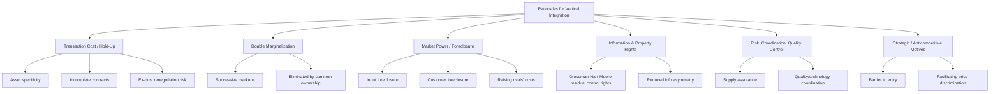

## Rationales for Vertical Integration

### Overview

Vertical integration occurs when a firm expands its ownership and control across successive stages of a production or distribution chain — either upstream toward input suppliers (**backward integration**) or downstream toward distributors and final customers (**forward integration**). The central question addressed by the economics literature is the "make-or-buy" decision: under what conditions does a firm choose to perform an activity internally (integration) rather than purchase it through a market transaction with an independent firm (arm's-length contracting)?

The rationales for vertical integration fall into several broad categories: (1) transaction cost economizing, (2) elimination of double marginalization, (3) resolution of input foreclosure and market power considerations, (4) informational and property rights motives, (5) risk and coordination motives, and (6) strategic/anticompetitive motives. Each is examined below.

---

### 1. Transaction Cost Economics (TCE)

**Key Points**

- Developed primarily by Ronald Coase (1937) and extended by Oliver Williamson (1971, 1975, 1985).
- The foundational question: why do firms exist at all, if markets can coordinate production via the price mechanism?
- Coase's answer: using the market is costly — search costs, negotiation costs, contracting costs, and monitoring costs are collectively **transaction costs**. Firms exist to economize on these costs by substituting administrative fiat for market negotiation.

**Asset Specificity**

Williamson's refinement identifies **asset specificity** as the key driver of vertical integration. An asset is specific when its value in its best alternative use is significantly lower than its value in the current relationship. Types include:

- **Site specificity**: assets located in close proximity to economize on transport/inventory costs (e.g., a power plant built next to a coal mine).
- **Physical asset specificity**: equipment or technology designed for a particular transaction (e.g., a custom-molded component die).
- **Human asset specificity**: firm-specific knowledge or skills acquired through learning-by-doing within a particular relationship.
- **Dedicated asset specificity**: investments made only because of a promised sale to a particular customer, entailing risk if the relationship dissolves.
- **Temporal specificity**: value that depends critically on immediate use (e.g., perishable inputs).

When assets are specific, the transacting parties face a **bilateral monopoly** situation ex post — even if there was competition ex ante among many potential trading partners. This creates the risk of **hold-up**.

**The Hold-Up Problem**

Formally, consider two parties, an upstream supplier (S) and downstream buyer (B). Suppose S must make a relationship-specific investment $I$ prior to production, and the investment increases total surplus but has little value outside the relationship with B.

$$\text{Surplus}(I) = R(I) - I$$

where $R(I)$ is the total revenue generated and $R'(I) > 0$, $R''(I) < 0$. If S and B split the ex-post surplus via bargaining (e.g., Nash bargaining with 50/50 split) *after* the investment is sunk, S anticipates capturing only a fraction of the marginal return:

$$\max_I \left[ \frac{1}{2} R(I) - I \right]$$

This yields underinvestment relative to the socially efficient level $I^*$ that solves $\max_I [R(I) - I]$, because $\frac{1}{2}R'(I) < R'(I)$ at the margin — S does not fully internalize the surplus its investment creates for B. This is the classic **hold-up problem** (Klein, Crawford, and Alchian, 1978; Grossman and Hart, 1986).

- **[Inference]** The degree of underinvestment depends on the specific bargaining protocol and the division of ex-post surplus; different bargaining games (e.g., asymmetric bargaining power) yield different degrees of distortion, though underinvestment persists whenever the investor cannot appropriate the full marginal return.

Vertical integration solves the hold-up problem by placing both assets under common ownership, eliminating the need for ex-post renegotiation over surplus division (since there is no separate residual claimant for the upstream unit).

**Classic Example: Fisher Body and General Motors**

The historical case study of Fisher Body and GM (Klein, Crawford, and Alchian, 1978) is the canonical illustration: GM required specialized, closed metal auto bodies from Fisher Body, requiring Fisher to make relationship-specific investments in dies and stamping equipment. The hold-up hazard (and disputes over pricing under an existing long-term contract) is argued to have motivated GM's eventual acquisition of Fisher Body in 1926.

- **[Unverified]** The Fisher Body/GM narrative has been contested in later empirical work (e.g., Coase 2006; Freeland 2000), which argues the standard hold-up account overstates the asset-specificity problem and understates other contractual and administrative factors. Instructors should treat this case as illustrative of the *theory*, not as an uncontested empirical fact.

---

### 2. Double Marginalization

**Key Points**

- Arises when successive firms in a vertical chain each possess market power and independently set prices with a markup over marginal cost.
- Leads to a final price *higher* than what a single vertically integrated monopolist would charge, and to *lower* joint profits and lower total welfare.

**Formal Model**

Consider an upstream monopolist (manufacturer, M) selling an input to a downstream monopolist (retailer, R), who then sells to final consumers facing demand $Q(P) $, with $ P $ the retail price. Suppose constant marginal cost of production $c$ for the upstream firm and zero downstream marginal cost apart from the wholesale price $w$.

**Sequential (non-integrated) game:**

Downstream firm's problem, taking wholesale price $w$ as given:

$$\max_{P} (P - w) Q(P)$$

This yields a retail price $P^*(w)$ that itself embeds a markup over $w$, effectively treating $w$ as its "marginal cost."

Upstream firm's problem, anticipating the downstream reaction function $Q(P^*(w))$:

$$\max_{w} (w - c) Q(P^*(w))$$

The upstream firm also adds its own markup over $c$ when setting $w$.

**Result**: The final retail price under sequential markups exceeds the price that would be chosen by a single vertically integrated firm maximizing:

$$\max_P (P - c) Q(P)$$

**Illustration with Linear Demand**

Let $Q(P) = a - bP$ and marginal cost $c$. Under vertical integration, the standard monopoly price is:

$$P_M = \frac{a + bc}{2b}$$

Under successive (double) monopoly, working backward: the downstream firm treats $w$ as marginal cost, setting $P(w) = \frac{a+bw}{2b}$, hence facing residual demand $Q = a - bP(w) = \frac{a - bw}{2}$. The upstream firm maximizes $(w-c)\cdot \frac{a-bw}{2}$, yielding $w^* = \frac{a+bc}{2b}$. Substituting back:

$$P_{DM} = \frac{a + bw^*}{2b} = \frac{3a + bc}{4b}$$

Comparing $P_{DM}$ to $P_M$ confirms $P_{DM} > P_M$ whenever $a > bc$ (i.e., whenever there is positive output at the monopoly price), and total quantity sold is correspondingly lower, and *joint* upstream-plus-downstream profit is strictly lower than integrated monopoly profit.

**Resolution via Integration**

Vertical integration eliminates the second markup entirely, since the merged entity internalizes the downstream markup's effect on upstream profit — the merged firm charges final consumers the single monopoly price $P_M$, restoring the profit-maximizing (from the firms' perspective) markup structure and improving welfare relative to the double-markup outcome (though it remains below the competitive/first-best outcome, since $P_M$ is still a monopoly price above marginal cost $c$).

- Non-integration alternatives that also solve double marginalization without full ownership integration include **two-part tariffs**, **quantity-forcing/resale price maintenance**, and other vertical restraints — vertical integration is one solution among several, and the choice between integration and contractual restraints is itself a subject of the "vertical restraints" literature.

---

### 3. Diagrammatic Summary: Sources of Vertical Integration

---

### 4. Property Rights Theory (Grossman-Hart-Moore)

**Key Points**

- Extends TCE by formalizing *why* integration solves hold-up, given that contracts are necessarily **incomplete** (cannot specify every contingency).
- Ownership of an asset confers **residual control rights**: the right to make decisions not explicitly covered by contract.
- Integration reallocates residual control rights (not just cash flow rights) from one party to another, changing each party's incentive to make relationship-specific investments.

**Core Trade-off**

The GHM framework predicts that ownership should be allocated to the party whose investment is *more important* to total surplus — that party should own the assets (become the "residual claimant" via control rights), because ownership strengthens that party's incentive to invest, at the cost of weakening the other party's (now non-owning) investment incentive. Integration is therefore not a free lunch: it *redistributes* — rather than eliminates — the hold-up problem, unless one party's investment is negligible in comparison to the other's.

- **[Inference]** This implies vertical integration is efficient primarily when investments are highly asymmetric in importance; when both parties' investments matter comparably, *non-integration* (or hybrid governance) may dominate, since integration would only shift, not solve, the underinvestment problem.

---

### 5. Market Power, Foreclosure, and Raising Rivals' Costs

**Key Points**

- Vertical integration can be motivated by a desire to extend or protect market power rather than by efficiency.
- **Input foreclosure**: an upstream firm that integrates forward can refuse to supply (or raise the price/degrade the terms of supply to) rival downstream firms, disadvantaging them.
- **Customer foreclosure**: a downstream firm that integrates backward can refuse to purchase from independent upstream rivals, denying them scale and market access.
- **Raising Rivals' Costs (RRC)**: Even without outright refusal to deal, the integrated firm may charge non-integrated downstream rivals a higher input price than its own internal transfer price, raising their costs and softening downstream price competition (Salop and Scheffman, 1983; Ordover, Saloner, and Salop, 1990).

**Conditions for Foreclosure to be Profitable**

Foreclosure-based theories generally require:

1. Market power at the stage undertaking the foreclosure (otherwise rivals can simply source elsewhere at competitive terms).
2. Insufficient countervailing entry or expansion by unintegrated rivals at either stage.
3. The foreclosed segment's competitors cannot easily bypass the bottleneck (e.g., via alternative inputs, self-supply, or new entry).

- **[Unverified]** The theoretical and empirical significance of foreclosure has been a point of active debate; the "Chicago School" critique (e.g., Bork, Posner) argued that foreclosure is rarely profitable absent market power at multiple stages combined with barriers to entry, whereas post-Chicago models (Ordover-Saloner-Salop; Hart-Tirole) identify conditions — particularly involving contracting externalities and the inability to commit to input terms across multiple downstream buyers — under which foreclosure can be a profitable and welfare-reducing strategy. Antitrust treatment of vertical mergers continues to reflect this unresolved tension, and outcomes are highly fact-specific.

---

### 6. Elimination of Externalities and Coordination Failures

Beyond double marginalization, vertical integration can resolve several other externality problems that plague arm's-length vertical relationships:

- **Free-riding on services**: When downstream retailers under-provide pre-sale services (e.g., product demonstrations) because rivals can free-ride on informed consumers, integration (or resale price maintenance as an alternative) can restore efficient service provision.
- **Double-sided moral hazard**: Both upstream and downstream parties may need to exert non-contractible effort (e.g., quality control, marketing effort); integration can realign incentives, though — per property rights theory — only for the party who becomes the residual claimant.
- **Information transmission and monitoring**: Integration can improve the flow of proprietary information (e.g., demand forecasts, technical specifications) that firms are reluctant to share with independent trading partners due to appropriability or holdup concerns over the information itself.
- **Quality and technology coordination**: When production requires close, iterative coordination between upstream design and downstream assembly (common in complex or rapidly evolving technologies), integration can reduce the costs of coordinating tightly coupled decisions.

---

### 7. Diagrammatic Summary: Hold-Up and Underinvestment (svg_diagram)

<svg xmlns="http://www.w3.org/2000/svg" viewBox="0 0 720 380">
<text x="360" y="28" font-family="Georgia, serif" font-size="18" font-weight="bold" text-anchor="middle" fill="#1a1a1a">Hold-Up and Underinvestment (svg_diagram)</text>

<line x1="80" y1="320" x2="660" y2="320" stroke="#333" stroke-width="2" />
<line x1="80" y1="320" x2="80" y2="50" stroke="#333" stroke-width="2" />
<text x="670" y="325" font-family="Arial" font-size="14" fill="#333">Investment, I</text>
<text x="55" y="55" font-family="Arial" font-size="14" fill="#333">Marginal Return</text>

<path d="M 100,80 C 250,120 400,220 620,300" stroke="#2166ac" stroke-width="3" fill="none" />
<text x="420" y="180" font-family="Arial" font-size="13" fill="#2166ac" font-weight="bold">R'(I) — full marginal return</text>

<path d="M 100,200 C 250,230 400,280 620,315" stroke="#b2182b" stroke-width="3" fill="none" stroke-dasharray="6,4" />
<text x="420" y="255" font-family="Arial" font-size="13" fill="#b2182b" font-weight="bold">½R'(I) — investor's share</text>

<line x1="100" y1="310" x2="620" y2="70" stroke="#4d9221" stroke-width="2.5" />
<text x="520" y="95" font-family="Arial" font-size="13" fill="#4d9221" font-weight="bold">Marginal Cost of I</text>

<line x1="330" y1="320" x2="330" y2="150" stroke="#555" stroke-width="1.5" stroke-dasharray="3,3" />
<text x="315" y="340" font-family="Arial" font-size="13" fill="#1a1a1a">I*</text>
<circle cx="330" cy="150" r="5" fill="#2166ac" />

<line x1="205" y1="320" x2="205" y2="215" stroke="#555" stroke-width="1.5" stroke-dasharray="3,3" />
<text x="185" y="340" font-family="Arial" font-size="13" fill="#1a1a1a">I_holdup</text>
<circle cx="205" cy="215" r="5" fill="#b2182b" />

<path d="M 205,220 L 330,155" stroke="#000" stroke-width="1" marker-end="url(#arrow)" />
<text x="220" y="130" font-family="Arial" font-size="12" fill="#000" font-style="italic">Underinvestment gap</text>
</svg>

The diagram shows that because the investing party captures only half (under symmetric bargaining) of the marginal return on relationship-specific investment, the privately optimal investment level $I_{holdup}$ (where $\frac{1}{2}R'(I) = MC(I)$) falls short of the socially efficient level $I^*$ (where $R'(I) = MC(I)$). Integration, by eliminating the need for ex-post bargaining, allows the investing division to be directed to invest at $I^*$.

---

### 8. Empirical and Measurement Considerations

- Empirical tests of TCE predictions (pioneered by Monteverde and Teece, 1982, on automotive component sourcing) generally use proxies for asset specificity (e.g., engineering effort, specialized tooling) and find a positive correlation with the likelihood of integration, though **[Inference]** establishing causality is difficult because integration decisions and investment levels are jointly determined (endogeneity), and much of the empirical literature relies on cross-sectional variation that cannot fully rule out reverse causality or omitted-variable bias.
- Distinguishing between efficiency-based (TCE/double-marginalization) and market-power-based (foreclosure) motives empirically is a persistent challenge in industrial organization and antitrust economics, since both can predict the *same* integration decision while implying opposite welfare consequences.

---

### 9. Summary Table

| Rationale | Mechanism | Welfare Implication |
| --- | --- | --- |
| Transaction cost / hold-up | Eliminates ex-post renegotiation over specific investments | Efficiency-enhancing |
| Double marginalization | Removes successive markups | Efficiency-enhancing (lower price, higher output vs. non-integration) |
| Property rights (GHM) | Reallocates residual control to more important investor | Efficiency-enhancing if asymmetric investments |
| Input/customer foreclosure | Denies rivals access to inputs/customers | Potentially welfare-reducing |
| Raising rivals' costs | Differential input pricing to non-integrated rivals | Potentially welfare-reducing |
| Coordination/information | Improves information flow, reduces free-riding | Generally efficiency-enhancing |

---

**Related Topics**

- Vertical restraints as contractual alternatives to integration (resale price maintenance, exclusive dealing, exclusive territories, tying, two-part tariffs)
- The theory of the firm and boundaries of the firm (Coase, Williamson, Grossman-Hart-Moore in full)
- Vertical mergers in antitrust: foreclosure theories of harm and the Vertical Merger Guidelines
- Successive monopoly and its solutions (two-part tariffs, quantity discounts)
- Incomplete contracts and the hold-up problem in bilateral trade
- Empirical methods for testing transaction cost economics (asset specificity proxies, instrumental variables)
- Franchising as a hybrid governance structure between integration and market contracting