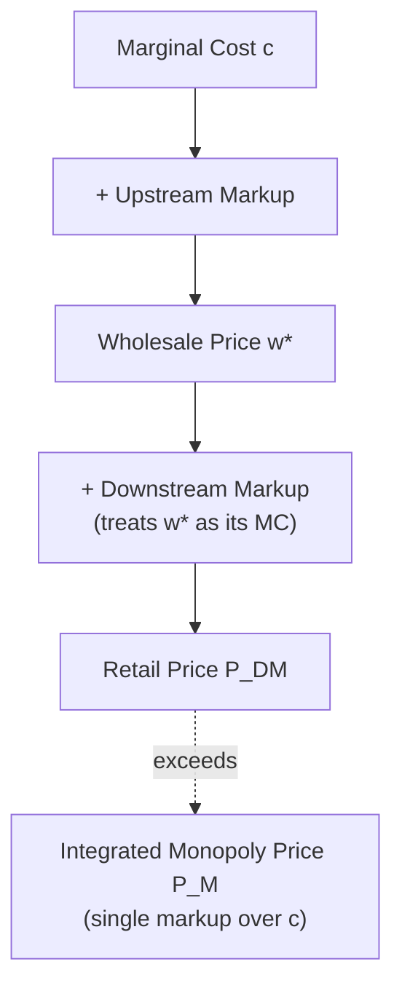

## Double Marginalization in Successive Monopoly

### Overview

Successive monopoly describes a vertical market structure in which a single upstream monopolist sells an input to a single downstream monopolist, who then transforms and resells it to final consumers. Because each firm independently sets a price with a markup over its perceived marginal cost, the chain accumulates **two markups instead of one**. This phenomenon — termed **double marginalization** (also "the double markup problem" or "successive monopoly problem") — was first formalized by Spengler (1950) and remains a foundational result in the economics of vertical relations, explaining why the presence of market power at *multiple* vertical stages can produce outcomes that are worse for both consumers and the firms themselves than market power at a single, integrated stage.

---

### 1. The Basic Setup

**Key Points**

- Two firms: an upstream manufacturer (M) and a downstream retailer (R), each with monopoly power at its own stage.
- M sells an intermediate good to R at wholesale price $w$ per unit.
- R purchases $q$ units from M, converts them one-for-one into the final good (for simplicity), and resells to consumers at retail price $P$.
- Final consumer demand is $Q(P)$, downward-sloping, with $Q'(P) < 0$.
- M's constant marginal cost of production is $c \geq 0$; R's marginal cost of retailing (aside from the wholesale price) is normalized to zero for simplicity, though it can be generalized to $c_R > 0$.

The vertical chain can be depicted as:

---

### 2. Sequential (Non-Integrated) Equilibrium

**Timing**

The standard model assumes a **Stackelberg-type sequential game**:

1. M sets wholesale price $w$.
2. R observes $w$ and sets retail price $P$ (equivalently, chooses quantity $q$).
3. Consumers purchase $Q(P)$.

The game is solved by **backward induction**.

**Stage 2: Downstream Firm's Problem**

Given $w$, R chooses $P$ to maximize its own profit:

$$\pi_R(P \mid w) = (P - w)\, Q(P)$$

The first-order condition is:

$$Q(P) + (P - w)Q'(P) = 0$$

This defines R's best-response (reaction) function $P^*(w)$, which is increasing in $w$: a higher wholesale price is partially passed through to consumers. Critically, R treats $w$ exactly as if it were its own marginal cost — **R does not internalize that its own markup imposes an externality on M's profit** (since a higher retail price reduces the quantity M can sell).

**Stage 1: Upstream Firm's Problem**

M anticipates R's reaction function and chooses $w$ to maximize:

$$\pi_M(w) = (w - c)\, Q(P^*(w))$$

M treats $Q(P^*(w))$ as its own residual demand curve — the **derived demand for the input**, which is itself already "marked down" by R's optimal downstream markup. M then adds *its own* markup on top of $c$ when choosing $w$.

**Result**: two independent, sequential markup decisions are stacked on top of one another, and neither firm's pricing decision internalizes the effect of its own markup on the other firm's profit — a classic **negative pecuniary externality** running from downstream to upstream (via reduced derived demand) and vice versa.

---

### 3. Linear Demand Illustration

Let demand be $Q(P) = a - bP$, with $a, b > 0$, and let M's marginal cost be $c$, R's marginal cost (beyond $w$) be zero.

**Step 1 — Downstream reaction function.**

R solves $\max_P (P-w)(a - bP)$. First-order condition:

$$a - bP - b(P - w) = 0 \;\Rightarrow\; P^*(w) = \frac{a + bw}{2b}$$

Substituting back, the derived (residual) demand facing M is:

$$Q(P^*(w)) = a - bP^*(w) = \frac{a - bw}{2}$$

**Step 2 — Upstream pricing.**

M solves $\max_w (w-c)\cdot \frac{a-bw}{2}$. First-order condition:

$$\frac{a - bw}{2} - \frac{b(w-c)}{2} = 0 \;\Rightarrow\; w^* = \frac{a + bc}{2b}$$

**Step 3 — Final retail price under double marginalization.**

$$P_{DM} = \frac{a + bw^*}{2b} = \frac{a + b\left(\frac{a+bc}{2b}\right)}{2b} = \frac{3a + bc}{4b}$$

**Step 4 — Benchmark: vertically integrated monopoly price.**

A single firm controlling both stages solves $\max_P (P-c)(a-bP)$, yielding the standard monopoly price:

$$P_M = \frac{a + bc}{2b}$$

**Step 5 — Comparison.**

$$P_{DM} - P_M = \frac{3a+bc}{4b} - \frac{a+bc}{2b} = \frac{3a + bc - 2a - 2bc}{4b} = \frac{a - bc}{4b}$$

Since $a > bc$ is required for positive output at the integrated monopoly price (i.e., $Q(P_M) = a - bc > 0$... more precisely $Q(P_M) = \frac{a-bc}{2} > 0$), it follows that:

$$P_{DM} > P_M$$

Quantity sold under double marginalization is correspondingly **lower** than under integration:

$$Q_{DM} = a - bP_{DM} = \frac{a - bc}{4} \quad \text{vs.} \quad Q_M = \frac{a-bc}{2}$$

so $Q_{DM} = \tfrac{1}{2} Q_M$ — output is exactly halved in this linear-demand, symmetric-cost example.

- **[Inference]** The precise numerical relationships ($P_{DM} - P_M = \frac{a-bc}{4b}$; $Q_{DM} = \frac{1}{2}Q_M$) are specific to the linear-demand, zero-downstream-cost specification used here. With different demand curvature (e.g., constant-elasticity demand) or positive downstream marginal costs, the *qualitative* result ($P_{DM} > P_M$, $Q_{DM} < Q_M$) is robust, but the exact magnitudes differ.

---

### 4. Profit and Welfare Comparison

**Key Points**

- **Joint industry profit** is *strictly lower* under double marginalization than under vertical integration. This is the central, often counterintuitive result: even the firms themselves are made worse off collectively by their separateness.
- Formally, since the integrated monopoly price $P_M$ maximizes total channel profit $(P-c)Q(P)$ by construction, and $P_{DM} \neq P_M$, it follows immediately that:

$$\pi_M(w^*) + \pi_R(P_{DM}) < \pi_{Integrated}(P_M)$$

- **Consumer surplus** is *lower* under double marginalization (higher price, lower quantity purchased).
- **Total welfare** (sum of consumer surplus and industry profit) is *lower* under double marginalization than under integration, since the integrated price, though still a monopoly distortion relative to marginal cost pricing, minimizes the *combined* deadweight loss from the two markups.
- This yields the striking conclusion that vertical integration between successive monopolists can be simultaneously **profit-increasing and welfare-improving relative to non-integration** — a rare case where private and social incentives point in the same direction, even though the final outcome (integrated monopoly) is still not first-best (which would require marginal-cost pricing, $P = c$).

**Graphical Intuition**

---

### 5. Deadweight Loss Decomposition (svg_diagram)

<svg xmlns="http://www.w3.org/2000/svg" viewBox="0 0 740 420">
<text x="370" y="28" font-family="Georgia, serif" font-size="18" font-weight="bold" text-anchor="middle" fill="#1a1a1a">Deadweight Loss under Double Marginalization (svg_diagram)</text>

<line x1="90" y1="360" x2="680" y2="360" stroke="#333" stroke-width="2" />
<line x1="90" y1="360" x2="90" y2="50" stroke="#333" stroke-width="2" />
<text x="690" y="365" font-family="Arial" font-size="14" fill="#333">Q</text>
<text x="65" y="55" font-family="Arial" font-size="14" fill="#333">P</text>

<line x1="120" y1="70" x2="640" y2="340" stroke="#000" stroke-width="2.5" />
<text x="645" y="345" font-family="Arial" font-size="13" fill="#000">Demand Q(P)</text>

<line x1="90" y1="330" x2="680" y2="330" stroke="#4d9221" stroke-width="2" stroke-dasharray="5,3" />
<text x="695" y="334" font-family="Arial" font-size="13" fill="#4d9221">c</text>

<line x1="90" y1="220" x2="380" y2="220" stroke="#2166ac" stroke-width="2" stroke-dasharray="4,3" />
<text x="55" y="224" font-family="Arial" font-size="13" fill="#2166ac">P_M</text>
<line x1="380" y1="220" x2="380" y2="360" stroke="#2166ac" stroke-width="1.5" stroke-dasharray="4,3" />
<text x="368" y="378" font-family="Arial" font-size="13" fill="#2166ac">Q_M</text>

<line x1="90" y1="150" x2="270" y2="150" stroke="#b2182b" stroke-width="2" stroke-dasharray="4,3" />
<text x="50" y="154" font-family="Arial" font-size="13" fill="#b2182b">P_DM</text>
<line x1="270" y1="150" x2="270" y2="360" stroke="#b2182b" stroke-width="1.5" stroke-dasharray="4,3" />
<text x="258" y="378" font-family="Arial" font-size="13" fill="#b2182b">Q_DM</text>

<polygon points="380,220 380,330 640,330" fill="#2166ac" fill-opacity="0.15" stroke="none" />

<polygon points="270,150 270,360 380,360 380,220" fill="#b2182b" fill-opacity="0.2" stroke="none" />

<text x="420" y="300" font-family="Arial" font-size="12" fill="`#2166ac`" font-weight="bold">DWL from single</text>

<text x="420" y="315" font-family="Arial" font-size="12" fill="`#2166ac`" font-weight="bold">monopoly markup</text>

<text x="150" y="280" font-family="Arial" font-size="12" fill="`#b2182b`" font-weight="bold">Additional DWL from</text>

<text x="150" y="295" font-family="Arial" font-size="12" fill="`#b2182b`" font-weight="bold">second (downstream) markup</text>

</svg>

The red-shaded region represents the *incremental* deadweight loss attributable specifically to the second, uninternalized markup — the loss that vertical integration would eliminate, over and above the "ordinary" monopoly deadweight loss (blue region) that persists even after integration.

---

### 6. Generalization: n Successive Monopolists

**Key Points**

- The double marginalization result generalizes to a chain of $n$ successive monopolists, each adding an independent markup.
- With constant-elasticity demand $Q(P) = A P^{-\varepsilon}$ (elasticity $\varepsilon > 1$), each firm in the chain sets the standard monopoly markup rule $\frac{P - MC}{P} = \frac{1}{\varepsilon}$, i.e., $P = \frac{\varepsilon}{\varepsilon - 1} MC$, treating the price it pays for its input as its own marginal cost.
- With $n$ successive monopolists and constant marginal cost $c$ at the base of the chain, the final price is:

$$P_n = \left(\frac{\varepsilon}{\varepsilon - 1}\right)^n c$$

- As $n \to \infty$, $P_n \to \infty$ (for any finite $\varepsilon > 1$), meaning consumer prices explode as the multiplicative markups compound — the **"tragedy of the anticommons"** or **Cournot complements problem**, closely related to the classic **Cournot (1838) double-marginalization insight** that predates Spengler's more general treatment.
- **[Inference]** This constant-elasticity generalization is a widely used pedagogical benchmark; the qualitative compounding result (worse outcomes as the number of successive independent markups grows) is robust across demand specifications, though the precise multiplicative formula $P_n = \left(\frac{\varepsilon}{\varepsilon-1}\right)^n c$ is specific to the constant-elasticity case.

---

### 7. Solutions to Double Marginalization

Because double marginalization harms *both* firms' joint profits (not just consumers), firms have a private incentive to resolve it. Mechanisms include:

**(a) Vertical Integration**

Merging M and R into a single firm eliminates the separate residual claim on the wholesale margin; the integrated firm internalizes the full channel demand and sets a single monopoly markup ($P_M$ as derived above).

**(b) Two-Part Tariffs**

M can charge R a per-unit wholesale price *equal to marginal cost* ($w = c$) plus a fixed fee $F$ to extract R's profit:

$$T(q) = c \cdot q + F$$

Under $w = c$, R's marginal cost of the input equals the true marginal cost, so R independently chooses the *same* price and quantity as the integrated monopolist ($P_M$, $Q_M$). M then sets $F$ equal to R's resulting profit at that price (up to R's participation constraint), fully recovering channel profit while achieving the integrated-monopoly price outcome — without any change in ownership structure.

**(c) Resale Price Maintenance (RPM) / Price Ceilings**

M can contractually cap R's resale price at $P_M$ (a **maximum RPM**), directly preventing R from adding an excessive markup, while still charging a wholesale price above $c$ to capture surplus itself, provided the combination replicates or approximates $P_M$.

**(d) Quantity Forcing / Minimum Quantity Requirements**

M can specify a required minimum order quantity equal to $Q_M$, inducing R to price at (or near) $P_M$ to be willing to sell that volume.

**(e) Quantity Discounts / Nonlinear Pricing**

Volume-based discount schedules can approximate the effect of a two-part tariff by making the *marginal* price paid by R approach $c$ at higher volumes.

- **[Inference]** In practice, two-part tariffs and RPM face additional real-world frictions not captured in the simple model above — including downstream demand or cost uncertainty (which complicates setting a single optimal fixed fee $F$ or ceiling price), multiple heterogeneous retailers (raising which $w$ and $F$ to charge each), and legal/regulatory constraints on RPM in many jurisdictions (RPM is treated under a rule-of-reason standard in the U.S. post-*Leegin* (2007), but remains per se illegal or heavily restricted in a number of other jurisdictions). These practical frictions are a central reason firms sometimes choose integration over contractual solutions even though the *simple* textbook model shows the two as equivalent.

---

### 8. Comparative Table

| Structure | Price | Quantity | Joint Profit | Consumer Surplus | Total Welfare |
| --- | --- | --- | --- | --- | --- |
| Successive (double) monopoly | $P_{DM}$ (highest) | $Q_{DM}$ (lowest) | Lowest | Lowest | Lowest |
| Vertical integration | $P_M$ | $Q_M > Q_{DM}$ | Higher (maximized subject to monopoly) | Higher | Higher |
| Two-part tariff ($w=c$) | $P_M$ | $Q_M$ | Same as integration | Same as integration | Same as integration |
| Perfect competition (benchmark) | $P = c$ | $Q^{comp}$ (highest) | Zero economic profit | Highest | Highest (first-best) |

---

### 9. Relationship to Broader Vertical Relations Theory

- Double marginalization is one of the primary **efficiency-based rationales for vertical integration** and for many vertical restraints, distinguishing these practices from purely exclusionary or anticompetitive motives (foreclosure, raising rivals' costs).
- It provides the theoretical foundation for the generally more permissive **rule-of-reason** treatment of many vertical arrangements in modern antitrust analysis, in contrast to the traditionally stricter *per se* treatment of similar-looking horizontal arrangements — since a given vertical restraint (e.g., RPM) can plausibly serve the pro-competitive function of curing double marginalization rather than facilitating collusion.
- The double marginalization logic assumes *both* upstream and downstream firms possess market power; if either stage is instead competitive (e.g., a monopolist upstream selling to competitive retailers, or vice versa), only a single markup arises, and the double-marginalization inefficiency does not appear — highlighting that the number of *independently markup-setting* stages, not the number of vertical stages per se, drives the result.

---

**Related Topics**

- Two-part tariffs and nonlinear pricing as alternatives to integration
- Resale price maintenance: legal treatment and *Leegin Creative Leather Products v. PSKS* (2007)
- Vertical restraints: exclusive territories, exclusive dealing, quantity forcing, tying
- Successive oligopoly and double marginalization with imperfect competition at both stages
- Rationales for vertical integration (hold-up, asset specificity, property rights)
- Cournot's 1838 complementary monopoly problem
- Rule of reason vs. per se analysis in vertical antitrust cases