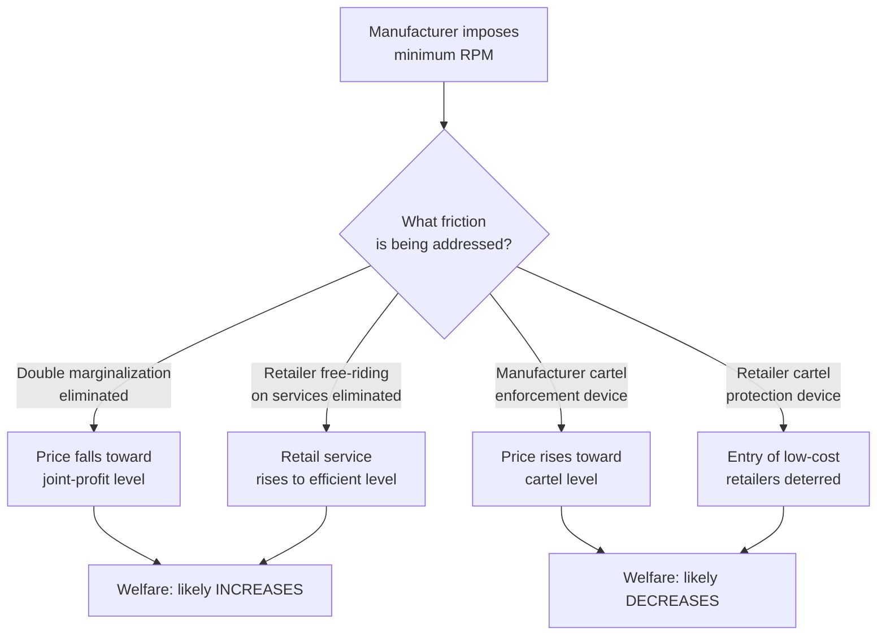

## Resale Price Maintenance and Its Welfare Effects

### Definition and Scope

Resale price maintenance (RPM) is a vertical restraint in which an upstream manufacturer specifies the price (or a price floor/ceiling) at which a downstream retailer may resell its product to final consumers. RPM is one of several instruments manufacturers use to control the conduct of nominally independent downstream firms, alongside exclusive territories, exclusive dealing, quantity forcing, and franchise fees.

Three variants are typically distinguished:

- **Minimum RPM**: manufacturer sets a price floor; retailers cannot sell below it. This is the historically most litigated form.
- **Maximum RPM**: manufacturer sets a price ceiling; retailers cannot sell above it. Generally treated as far less anticompetitive since it works against double marginalization.
- **Fixed RPM**: manufacturer dictates the exact resale price, eliminating retailer pricing discretion entirely.

RPM sits within the broader taxonomy of vertical restraints and is best understood in contrast to purely vertical price coordination achieved through non-price means (e.g., resale territorial exclusivity), since RPM operates directly on the price instrument rather than on quantities or market allocation.

### The Double Marginalization Problem

To understand why a manufacturer would ever want to *raise* the price a retailer charges, start with the baseline distortion in a linear-pricing vertical chain: **double marginalization**.

Consider a manufacturer with constant marginal cost $c$ selling to a monopoly retailer facing final demand $Q(p)$. The manufacturer sets wholesale price $w$; the retailer then chooses retail price $p$ to maximize $(p - w)Q(p)$. The manufacturer, anticipating the retailer's best response $p(w)$, chooses $w$ to maximize $(w - c)Q(p(w))$.

Each firm marks up over its own marginal cost, ignoring the externality its markup imposes on the other:

$$p^{DM} > p^{JOINT}$$

where $p^{JOINT}$ is the price that would maximize total channel profit $(p-c)Q(p)$ if the chain were vertically integrated. The result is that final price is *higher* and channel profit is *lower* than joint-profit maximization would deliver — a classic instance of successive monopoly markups (Spengler's double marginalization).

**Key Points**

- Double marginalization harms both firms in the chain (they leave joint profit on the table) and harms consumers (price is too high, quantity too low) relative to vertical integration.
- Any vertical restraint that lets the manufacturer effectively "recreate" the vertically integrated outcome is, from the standpoint of this problem alone, welfare-improving.
- Minimum RPM is one instrument that can solve double marginalization, but only in its simplest single-retailer, single-manufacturer, no-externality form; richer environments introduce competing rationales, some pro- and some anti-competitive.

### Why Minimum RPM Is Not Simply a Double-Marginalization Fix

If double marginalization were the only friction, the manufacturer could solve it more directly with a **two-part tariff**: wholesale price $w = c$ plus a fixed franchise fee $F$ that extracts the retailer's margin. Under $w=c$, the retailer's incentive to mark up matches the manufacturer's desired joint-profit-maximizing price exactly, and $F$ transfers the surplus upstream. No RPM is needed.

This is why the theoretical literature treats "RPM fixes double marginalization" as necessary but not sufficient as an explanation. If two-part tariffs (or quantity-forcing contracts) are feasible, minimum RPM becomes redundant for that purpose alone. The economically interesting question is: **why would a manufacturer use RPM instead of, or alongside, a two-part tariff?** The answer requires introducing frictions that two-part tariffs cannot address — chiefly retailer free-riding on service and coordination problems among competing retailers.

### Telser's Free-Rider Theory (Pro-Competitive Rationale)

Lester Telser's (1960) explanation remains the canonical efficiency justification for minimum RPM.

**Setup**: Consumers value pre-sale retail services — product demonstrations, showroom display, sales staff expertise, post-sale support — which retailers must provide at a cost, and which are *non-excludable* across retailers once a consumer has "consumed" the information (e.g., a consumer visits a full-service store to get a demonstration, then buys the same item cheaper at a discount store offering no services).

**Mechanism**:

1. Full-service retailers cannot recoup service costs if discount retailers can free-ride on the demand-enhancing information/service and undercut on price.
2. In equilibrium, no retailer has an incentive to provide the service, even though consumers (in aggregate) value it more than its cost.
3. Minimum RPM removes price as a competitive weapon between retailers, so retailers compete on service instead, restoring the service level to (closer to) the level consumers demand.

**Formal intuition**: Let retail margin $m = p - w$ be fixed by the floor. Retailers cannot win customers by cutting price, so the only remaining margin of competition is non-price service $s$, which raises demand $Q(p,s)$. Retailers now find it profitable to supply $s$ up to the point where marginal margin revenue from added service equals marginal service cost, rather than $s=0$ under free-riding.

**Key Points**

- Telser's theory implies RPM can be welfare-*enhancing*: it corrects an externality (free-riding) rather than creating monopoly distortion.
- It rests critically on services being (a) valuable to consumers, (b) costly to retailers, and (c) subject to free-riding (non-excludable, comparison-shoppable).
- It does not apply well to products where no meaningful pre-sale service is relevant (e.g., staple commodity goods), making RPM's welfare effect *product-specific*.

### Certification and Quality-Signaling Rationale

A related pro-competitive theory holds that RPM protects retailer margins sufficiently to fund investments in "certifying" product quality (Marvel and McCafferty, 1984) — e.g., a prestige retailer's willingness to carry and prominently display a good signals quality to consumers, and this certification role requires margin protection from discount free-riders who would not maintain the same standards.

### Manufacturer Interbrand and Intrabrand Competition Effects

**Intrabrand vs. interbrand distinction** is central to RPM welfare analysis:

- **Intrabrand competition**: competition among retailers selling the *same* manufacturer's brand.
- **Interbrand competition**: competition among *different* manufacturers' brands.

RPM suppresses intrabrand price competition by construction. The welfare question is whether this loss is offset by:

1. Enhanced interbrand competition (if RPM lets manufacturers better compete against rival brands via improved retail service/promotion), or
2. Facilitation of anticompetitive coordination (see below), which would harm interbrand competition too.

### Anticompetitive Theories of RPM

**1. Manufacturer cartel facilitation**

If manufacturers in an oligopoly want to collude on final prices, they face the standard cartel problem: monitoring and enforcement. Wholesale prices are private information between each manufacturer and its retailers, making tacit collusion on wholesale terms difficult to monitor. **Retail prices are public.** A manufacturer cartel can use RPM as an enforcement device: each manufacturer imposes a floor on retailers that mirrors the agreed cartel price, and any deviation is instantly observable to rivals via posted retail prices. RPM here is the *facilitating practice* for a manufacturer-level cartel, and welfare effects mirror those of ordinary horizontal price fixing — reduced output, higher prices, deadweight loss.

**2. Retailer cartel facilitation**

Symmetrically, if retailers form a cartel and want to prevent chiseling, they may lobby individual manufacturers to impose RPM on their behalf: retailers propose the floor to manufacturers, who have limited private incentive to refuse if retailers threaten to de-list or under-promote otherwise. This was a major concern behind pre-1975 U.S. "fair trade" laws, where retailer associations actively sought RPM legislation.

**3. Retailer coordination to exclude low-cost entrants**

Minimum RPM can act as an entry deterrent for efficient discount retail formats (e.g., early big-box or online retailers) by legally blocking the price-based business model that would otherwise let them undercut incumbents on the same brand.

**Key Points**

- These theories imply RPM can be output-reducing and welfare-*decreasing*, functionally equivalent to price fixing but executed through a vertical instrument.
- The empirical and legal challenge is that minimum RPM's *observable* form (a manufacturer setting a floor) is identical whether the underlying motive is Telser-efficient or cartel-facilitating; distinguishing intent requires examining market structure (concentration upstream/downstream), the presence of retailer-initiated pressure, and whether all manufacturers in the market adopted RPM simultaneously.

### Welfare Analysis: A Formal Sketch

Let consumer surplus be $CS$, retailer profit $\pi_R$, manufacturer profit $\pi_M$, and total welfare $W = CS + \pi_R + \pi_M$.

**Double-marginalization correction case** (single manufacturer, single retailer, no service dimension):

$$W^{RPM} > W^{DM}, \quad p^{RPM} < p^{DM}$$

RPM (used to implement the joint-profit price) raises welfare because it lowers price and raises quantity toward the efficient level, even though it *redistributes* surplus from retailer to manufacturer.

**Free-rider correction case** (Telser):

$$W^{RPM} = CS(p^{RPM}, s^{RPM}) + \pi_R^{RPM} + \pi_M^{RPM} > W^{no-RPM}$$

because $s^{RPM} > s^{no-RPM} = 0$ and consumers value $s$ above its cost; the comparison is not simply about price level but about the joint price-service bundle.

**Cartel facilitation case**:

$$W^{RPM} < W^{no-RPM}, \quad p^{RPM} > p^{competitive}$$

RPM here reduces welfare through the standard monopoly/cartel deadweight-loss triangle, with the additional feature that the restraint operates through vertical contracts rather than a naked horizontal agreement, which historically made it harder to detect and prosecute.

**[Inference]** In real markets, these effects are rarely separable in the data; empirical work generally examines *changes in output and entry* around RPM adoption/removal as the most reliable of the competing hypotheses (a clean price increase without corresponding service change is more consistent with the cartel-facilitation channel).

### Diagrammatic Summary of the Trade-off

### Legal Treatment: Per Se vs. Rule of Reason

The economic ambiguity of RPM has been directly reflected in its legal history in U.S. antitrust law:

- **Dr. Miles Medical Co. v. John D. Park & Sons Co. (1911)**: established minimum RPM as **per se illegal** under Section 1 of the Sherman Act — condemned automatically regardless of business justification.
- **State Oil Co. v. Khan (1997)**: maximum RPM moved to **rule of reason** (i.e., must be shown to actually harm competition), reflecting the double-marginalization insight that price ceilings are generally pro-competitive or neutral.
- **Leegin Creative Leather Products v. PSKS, Inc. (2007)**: overturned Dr. Miles; minimum RPM moved from per se illegal to **rule of reason** in the U.S., explicitly citing the Chicago School economic literature (Telser, and the double-marginalization/free-rider theories) as grounds that RPM can be efficiency-enhancing and that a blanket per se rule condemns some pro-competitive conduct.

**[Unverified]** Post-*Leegin* enforcement varies significantly by jurisdiction: many U.S. states retain their own laws that treat minimum RPM more strictly than federal rule-of-reason treatment, and the EU continues to treat RPM as a "hardcore restriction" under Article 101 TFEU (Vertical Block Exemption Regulation), generally presumed to restrict competition by object rather than requiring full rule-of-reason analysis — jurisdictional practice should be verified against current regulatory guidance rather than assumed static.

**Key Points**

- The shift from per se to rule of reason is the direct legal analogue of the shift in economic thinking: from "RPM is indistinguishable from price fixing" to "RPM's welfare effect is context-dependent and requires case-by-case analysis of market structure, retailer service characteristics, and manufacturer market power."
- Rule-of-reason analysis typically examines: manufacturer market power (low power reduces cartel-facilitation concern), whether RPM was imposed unilaterally or at retailers' urging (retailer-initiated raises collusion suspicion), and industry-wide adoption patterns (simultaneous adoption across manufacturers suggests horizontal collusion using RPM as the mechanism).

### Empirical Considerations

Testing which theory dominates in a given market typically examines:

1. **Output effects**: RPM associated with rising industry output is more consistent with efficiency theories (Telser, double marginalization); falling output is more consistent with cartel theories.
2. **Service provision**: observable increases in showroom presence, staff training, or point-of-sale support after RPM adoption support the free-rider theory.
3. **Entry patterns**: exclusion of discount/online retail formats following RPM adoption is a red flag for exclusionary intent.
4. **Retailer-initiated vs. manufacturer-initiated**: contract origination evidence (who proposed the restraint) is often examined in rule-of-reason litigation as circumstantial evidence of motive.

**[Inference]** Because clean natural experiments are rare, most empirical RPM studies rely on case studies of specific product categories (e.g., consumer electronics, cosmetics, sporting goods) following changes in legal treatment, and results are heterogeneous across studies — no single universal welfare verdict on RPM is empirically established.

### Comparison Table: Theoretical Channels

| Theory | Mechanism | Predicted Price Effect | Predicted Output/Welfare Effect | Legal Era Association |
| --- | --- | --- | --- | --- |
| Double marginalization correction | Aligns retailer markup with joint-profit price | Price falls (from double-markup level) | Welfare rises | Post-Leegin justification |
| Telser free-rider | Redirects retailer competition to service | Price at floor (higher than discount price) but bundled with service | Welfare rises if service value > cost | Post-Leegin justification |
| Quality certification | Protects margin funding certification role | Price at floor | Welfare rises if certification valuable | Post-Leegin justification |
| Manufacturer cartel facilitation | Enforces horizontal price agreement via public retail prices | Price rises | Welfare falls | Pre-Dr. Miles / per se concern |
| Retailer cartel facilitation | Retailers use manufacturer as enforcement conduit | Price rises | Welfare falls | Pre-Dr. Miles / per se concern |
| Entry deterrence | Blocks low-cost retail format competition | Price rises relative to counterfactual | Welfare falls | Ongoing rule-of-reason concern |

### Illustrative Numerical Example

Suppose a manufacturer has marginal cost $c = 10$, and final demand is $Q(p) = 100 - p$.

**Vertically integrated / joint-profit benchmark**: maximize $(p-10)(100-p)$, first-order condition gives $p^{JOINT} = 55$, $Q = 45$, joint profit $= 2025$.

**Double marginalization (linear wholesale pricing)**: retailer facing wholesale price $w$ maximizes $(p-w)(100-p)$, giving best response $p(w) = \frac{100+w}{2}$. Manufacturer maximizes $(w-10)\left(100 - \frac{100+w}{2}\right)$, yielding $w^{DM} = 55$, then $p^{DM} = 77.5$, $Q^{DM} = 22.5$ — well below the joint-profit quantity of 45, confirming the double-markup distortion.

**Minimum RPM restoring joint-profit price**: manufacturer sets $w$ low (or uses a two-part tariff) and imposes a floor $p^{RPM} = 55$ directly, restoring $Q = 45$. Total channel profit returns to 2025, consumer surplus rises relative to the double-marginalization case because price fell from 77.5 to 55.

**Key Points**

- This numerical case isolates the double-marginalization channel only; it does not model service or collusion effects, and should be read as illustrating mechanism, not as a general welfare prediction for all RPM cases.

### Related Topics

- Two-part tariffs and quantity-forcing as alternative solutions to double marginalization
- Exclusive territories and exclusive dealing as non-price vertical restraints
- Slotting allowances and vertical restraints in retail shelf-space allocation
- Vertical mergers and foreclosure theory
- Chicago School vs. Post-Chicago School perspectives on vertical restraints
- *Leegin* rule-of-reason factors and post-2007 case law developments
- EU Vertical Block Exemption Regulation and "hardcore restrictions" doctrine
- Free-riding and externalities in retail service provision more broadly
- Manufacturer-retailer bargaining models (Nash bargaining in vertical contracts)
- Empirical identification strategies for distinguishing collusive vs. efficient vertical restraints