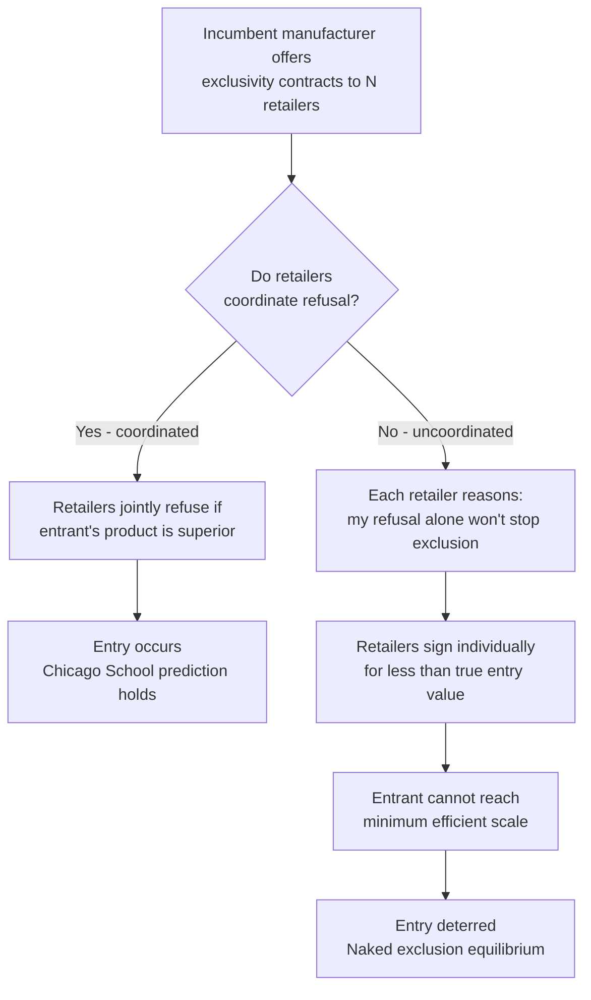

## Exclusive Dealing and Territorial Exclusivity

### Definitions and Scope

**Exclusive dealing** is a vertical restraint in which a manufacturer requires a retailer (or a retailer requires a manufacturer) to deal only with one counterparty on one side of the market — most commonly, a manufacturer prohibits its retailers from carrying competing brands, or a retailer requires a manufacturer to sell only through it in a given area.

**Territorial exclusivity** (exclusive territories) is a vertical restraint in which a manufacturer grants a retailer/distributor the exclusive right to sell its product within a defined geographic area, and commits not to supply other retailers in that same area (and often restricts the retailer from selling outside its assigned territory).

Both are non-price vertical restraints, distinguishing them from resale price maintenance: rather than controlling the price variable directly, they control *who* can transact and *where*. They frequently co-occur with RPM and other restraints (franchise fees, quantity forcing) in real-world distribution contracts, but are analytically separable.

**Key Points**

- Exclusive dealing restricts competition *between manufacturers* at the retail level (interbrand foreclosure channel).
- Exclusive territories restrict competition *between retailers* selling the same manufacturer's brand (intrabrand channel).
- Both can be manufacturer-imposed or retailer-imposed, though manufacturer-imposed versions dominate the literature and case law.

### Exclusive Dealing: Mechanics and Rationale

**Contractual form**: a retailer agrees not to purchase, stock, or sell products from any manufacturer competing with the incumbent manufacturer, typically in exchange for concessions (better wholesale terms, marketing support, exclusivity payments, or minimum purchase guarantees).

**Pro-competitive rationales**:

1. **Relationship-specific investment protection.** If a manufacturer must make retailer-specific investments (training retailer staff, providing display fixtures, co-branded marketing), it faces a hold-up risk: after investing, the retailer could switch to a rival brand and appropriate some of the investment's value. Exclusive dealing protects the return on this investment, encouraging efficient investment levels ex ante. This is a direct application of the property-rights/hold-up literature (Klein, Crawford, and Alchian; Williamson) to distribution contracts.
2. **Free-riding on promotional investment.** Analogous to Telser's RPM rationale: if a manufacturer funds retailer advertising or training, a competing manufacturer could free-ride by getting its product placed on the same shelf, benefiting from foot traffic generated by the first manufacturer's investment without contributing to it.
3. **Reduced monitoring and agency costs.** A retailer selling only one brand has aligned incentives with that manufacturer (no incentive to divert effort or shelf space to a rival), reducing the manufacturer's costs of monitoring retailer effort.

**Anticompetitive rationale — foreclosure**: If an incumbent manufacturer signs exclusive contracts with a large share of retail outlets (or with retailers controlling critical bottleneck access to consumers), rival manufacturers may be unable to achieve minimum efficient scale in distribution, or may be unable to reach consumers at all. This is the **foreclosure** channel, formalized primarily in the Aghion-Bolton (1987) and Rasmusen-Ramseyer-Wiley / Segal-Whinston "naked exclusion" literature.

### The Chicago School Critique of Foreclosure

The traditional (pre-1980s) view held that exclusive dealing straightforwardly harmed competition by locking up distribution. The **Chicago School critique** (notably Bork, Posner) challenged this:

**Core argument**: a retailer will only agree to exclusivity if compensated for the profit it forgoes by not carrying the rival's product. If the incumbent's exclusive contract genuinely forecloses an efficient rival, the retailer is giving up a *more profitable* product line — meaning the incumbent must pay the retailer more than the retailer would earn from the rival to induce exclusivity. But if the rival is efficient and would generate more retailer profit, the incumbent's willingness to overpay for exclusivity across many retailers is limited by its own resulting need to raise wholesale prices, which is self-defeating. In this view, **a rational retailer would not sign an exclusivity agreement that harms it**, so exclusive dealing that survives voluntary bilateral contracting should generally be efficient, not foreclosing.

**[Inference]** This single-retailer/single-manufacturer bilateral logic is often summarized as: "exclusion cannot be profitable unless it is also efficient," a claim that later game-theoretic literature substantially qualified rather than overturned wholesale.

### Post-Chicago Rehabilitation of Foreclosure Theory

**Aghion and Bolton (1987)** and later **Rasmusen, Ramseyer, and Wiley (1991)** / **Segal and Whinston (2000)** showed that the Chicago critique's conclusion depends critically on assuming a *single* retailer or perfect coordination among retailers. With **multiple, uncoordinated retailers**, exclusion can be profitable and inefficient:

**Mechanism (naked exclusion)**: an incumbent manufacturer offers exclusivity contracts to many retailers simultaneously. Each retailer, deciding individually, reasons: "If I don't sign, other retailers might sign anyway, the rival entrant won't achieve minimum efficient scale regardless of my choice, and I'll have foreclosed my own access to the incumbent's (still-necessary) product for nothing." This is a **coordination failure / externality among retailers**: each retailer's decision to reject exclusivity imposes a positive externality on the potential entrant (by preserving distribution access) that the retailer does not internalize.

The incumbent can therefore induce widespread exclusivity while paying **each individual retailer less than that retailer's true value of preserving entry**, because retailers do not coordinate their refusal. This is formally a **discriminatory (divide-and-conquer) contracting** strategy.

**Formal condition**: let $n$ retailers each control a fraction $1/n$ of the market, and suppose the entrant requires a minimum scale $\bar{s}$ of the market to enter profitably. If the incumbent can induce more than $1 - \bar{s}$ of retailers to sign exclusivity contracts, entry is deterred even though, had all retailers coordinated a joint refusal, they and the entrant would have been better off.

**Key Points**

- Naked exclusion theory does not claim exclusive dealing is always anticompetitive — it identifies the specific structural conditions (many uncoordinated buyers, entrant needing scale, incumbent's ability to price-discriminate contract terms across retailers) under which foreclosure becomes a genuine equilibrium risk.
- Contractual remedies exist even within the incumbent's toolkit: if retailers can renegotiate, or if the entrant can offer retailers a way to break exclusivity cheaply (e.g., liquidated damages calibrated appropriately), the exclusion equilibrium can unravel — meaning **contract design details matter substantially** to the welfare outcome, not just the existence of exclusivity per se.

### Legal Treatment of Exclusive Dealing

U.S. antitrust law evaluates exclusive dealing primarily under **Section 1 of the Sherman Act** and **Section 3 of the Clayton Act** (for sale/lease conditioned on not dealing with a competitor), under the **rule of reason**.

**Key factors courts examine** (post *Tampa Electric Co. v. Nashville Coal Co.*, 1961, and refined in modern cases like *United States v. Microsoft Corp.*, 2001, and *ZF Meritor v. Eaton Corp.*, 2012):

1. **Market foreclosure share**: what percentage of the relevant distribution/input market is foreclosed by the exclusive contracts. Courts generally require substantial foreclosure (historically cited thresholds cluster around 30–40%+, though no bright-line rule exists) before finding likely competitive harm.
2. **Duration of contracts**: longer contract terms raise foreclosure concern (harder for rivals to ever reach retailers); short-term or easily terminable contracts raise less concern.
3. **Contestability**: whether contracts are periodically re-bid, allowing rivals to compete for the exclusive position itself (competition "for the market" rather than "in the market").
4. **Business justification**: efficiency rationales (investment protection, free-rider prevention) offered by the defendant are weighed against foreclosure evidence.

**[Unverified]** Specific numeric foreclosure thresholds are not codified in statute and vary by circuit and case; any percentage cited should be treated as illustrative of case-law patterns rather than a binding legal rule.

### Territorial Exclusivity: Mechanics and Rationale

**Contractual form**: a manufacturer assigns retailer $i$ an exclusive territory $T_i$, agreeing not to sell (directly or through other retailers) to customers located in $T_i$, sometimes coupled with a prohibition on the retailer making active or passive sales outside $T_i$.

**Primary economic rationale — solving intrabrand free-riding and service externalities**: this is structurally similar to Telser's RPM logic but operates on space rather than price. Without territorial protection, a retailer investing in local advertising, showroom presence, or customer education for a brand risks losing the sale to a nearby retailer of the *same* brand who free-rides on that investment by offering a lower price without matching the service investment. Territorial exclusivity eliminates this by removing intrabrand competition within the territory, restoring the incentive to invest in local demand-generating services.

**Secondary rationale — double marginalization mitigation at the margin**: while territorial exclusivity does not eliminate the double markup by itself, it can be paired with instruments (two-part tariffs, minimum purchase requirements) to approximate a franchise-style solution where the manufacturer extracts monopoly rent via a fixed fee while retailer marginal incentives are aligned via reduced retail-side competition.

**Anticompetitive rationale**: territorial division can operate as a mechanism for **retailer-level cartel enforcement** — if retailers of the *same brand* would otherwise compete away rents, manufacturer-assigned territories function like a customer/market allocation agreement, which if it were agreed *horizontally among retailers themselves* would be per se illegal price/market allocation. The vertical form (manufacturer imposing it) receives more lenient rule-of-reason treatment, which is itself a point of ongoing legal and economic debate: does the change in *who* imposes the restraint change its competitive effect?

### Continuum of Territorial Restrictions

Territorial exclusivity exists on a spectrum of intrabrand restriction intensity:

| Restriction Type | Description | Restrictiveness |
| --- | --- | --- |
| Location clauses | Retailer must operate from a specified location only | Lowest |
| Airtight/closed territories | Retailer cannot sell to customers outside assigned territory even if they travel or order in (no passive sales allowed) | Highest |
| Open territories | Retailer is assigned a primary area of responsibility but other retailers/direct sales are not entirely excluded | Moderate |
| Profit-pass-over arrangements | Retailer can sell outside territory but must compensate the territory's assigned retailer | Moderate |

### Diagrammatic Summary: Foreclosure Mechanism

### Comparative Welfare Table

| Restraint | Primary Competitive Margin Affected | Efficiency Channel | Foreclosure/Collusion Channel | Typical Legal Treatment |
| --- | --- | --- | --- | --- |
| Exclusive dealing | Interbrand (manufacturer vs. rival manufacturers) | Hold-up protection, free-rider prevention | Entry deterrence via retailer foreclosure | Rule of reason (foreclosure-share test) |
| Territorial exclusivity | Intrabrand (retailer vs. retailer, same brand) | Local service/investment incentive | Retailer cartel-like market division | Rule of reason (generally more lenient than horizontal allocation) |

### Illustrative Numerical Example: Naked Exclusion

Suppose a market has 10 identical retailers, each controlling 10% of final demand. An entrant needs at least 40% of retail access to achieve minimum efficient scale and become viable, earning entrant profit $\pi_E = 50$ if it enters, versus 0 if foreclosed.

If retailers could act as a single coordinated bloc, they would collectively refuse exclusivity whenever the entrant's product offers them, in total, more than the incumbent's exclusivity payment — say collective retailer gain from entry is 80, comfortably justifying refusal against any incumbent offer below 80.

Acting individually, however, each retailer compares its own exclusivity payment $x$ against its own expected share of gains from entry, roughly $80/10 = 8$ per retailer *if enough others also refuse* — but if a retailer believes entry will be blocked regardless of its own choice (because 6 of the other 9 have already signed), its own refusal yields nothing, so it accepts any $x > 0$. The incumbent can therefore foreclose entry by paying **as little as slightly above 0 per retailer to 7 of the 10 retailers**, well below the true aggregate value of preserving entry (80), because retailers never internalize the externality their individual decision imposes on the collective outcome.

**Key Points**

- This example isolates the coordination-failure mechanism; real-world outcomes depend on the entrant's ability to offer retailers exit options, the sequencing of offers, and whether contracts are renegotiable.

### Empirical and Policy Considerations

1. **Distinguishing efficiency from foreclosure empirically** typically examines: whether foreclosure share is high relative to competitive benchmarks, whether contract duration/exclusivity terms lengthened after entry threats emerged (suggesting strategic rather than efficiency motivation), and whether the excluded rival was demonstrably as or more efficient.
2. **Territorial exclusivity empirical work** often studies franchise systems (automobile dealerships, beer distribution, fast food) where territorial protection is near-universal, examining outlet density, price dispersion across territories, and consumer search costs as welfare proxies.
3. **[Speculation]** The rise of e-commerce has plausibly weakened the practical enforceability and welfare case for airtight territorial exclusivity, since online sales complicate the geographic boundaries the restraint depends on; this is an active area of ongoing legal adaptation (e.g., EU treatment of restrictions on passive online sales) rather than a settled empirical conclusion.

### Related Topics

- Resale price maintenance and its welfare effects (intrabrand price-restraint analogue)
- Hold-up problem and relationship-specific investment (Klein-Crawford-Alchian; Williamson transaction cost economics)
- Naked exclusion and divide-and-conquer contracting (Segal-Whinston; Rasmusen-Ramseyer-Wiley)
- Franchise contracts: two-part tariffs, royalty rates, and territory design
- Vertical integration vs. vertical restraints as substitute governance structures
- Foreclosure theory in vertical mergers
- EU treatment of active vs. passive sales restrictions and e-commerce
- Tying and bundling as related exclusionary practices
- Slotting allowances and retail shelf-space competition
- Antitrust rule-of-reason methodology and market definition in vertical cases