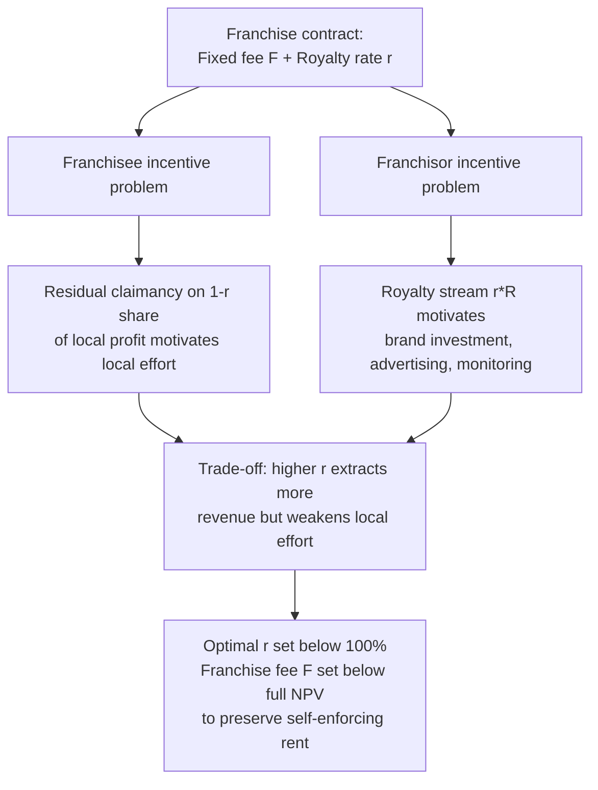

## Franchising as a Vertical Control Mechanism

### Definition and Scope

Franchising is a contractual governance structure in which an upstream party (the **franchisor**, typically the brand/format owner) grants a downstream party (the **franchisee**, a legally independent operator) the right to use its trademark, business format, and operating know-how in exchange for payments and adherence to specified operating standards. Franchising sits at a distinctive point on the **vertical integration spectrum**: it is neither pure market exchange (arm's-length wholesale purchase) nor full vertical integration (company-owned outlets), but a hybrid governance form combining features of both.

**Two principal franchise types**:

- **Product/trade-name franchising**: franchisee primarily distributes the franchisor's product under its brand (e.g., automobile dealerships, gasoline stations, soft-drink bottlers). Historically closer to a distribution/vertical-restraint relationship.
- **Business-format franchising**: franchisor licenses an entire operating system — branding, procedures, supply relationships, marketing, training — not just a product (e.g., fast food, hotels, many retail chains). This is the dominant modern form and the primary focus of the economics literature on franchising as a governance mechanism.

**Key Points**

- Franchising combines instruments already covered as individual vertical restraints — territorial exclusivity, exclusive dealing (franchisee often required to source inputs only from franchisor-approved suppliers), and sometimes RPM-adjacent pricing guidance — into a single integrated contract.
- The central analytical question is *why* firms choose franchising rather than either spot-market wholesaling or full ownership of outlets — this is a **make-or-buy** question at the level of an entire distribution system.

### The Core Economic Puzzle: Plural Forms and Selective Integration

A striking empirical regularity motivating this literature: most large franchise systems operate as **plural forms** — a mix of franchised and company-owned outlets within the *same* chain, rather than uniformly choosing one governance mode. This immediately rules out any single-cause theory implying "franchising is always better than integration" or vice versa; theories must instead explain the *margin* at which a firm chooses one mode over the other for a given outlet.

### Rationale 1: Capital Constraints and Resource Scarcity

The earliest explanation (Oxenfeldt and Kelly, 1969; "resource scarcity" or "ownership redirection" theory) holds that young, growing chains lack sufficient capital to finance outlet expansion through ownership, so they franchise early units to fund growth using franchisee capital, then buy back or convert franchised units to company ownership once internal capital is available.

**[Inference]** This theory has received mixed empirical support: while capital constraints plausibly explain *some* franchising, especially in early chain life-cycles, it does not explain why mature, well-capitalized chains (e.g., McDonald's) continue to franchise the large majority of outlets indefinitely rather than converting to ownership once capital constraints are relaxed.

### Rationale 2: Agency Theory and the Double-Sided Moral Hazard

The dominant modern explanation treats franchising as a solution to an **incentive/monitoring problem** under **double-sided moral hazard** — both parties can take hidden actions that affect joint surplus, and neither's effort is perfectly contractible.

**Franchisee moral hazard**: a company-owned outlet's manager, paid a fixed wage or simple bonus, has weak incentive to exert costly effort (cleanliness, service quality, hours worked) because they capture only a fraction of the resulting profit, and monitoring outlet-level effort is costly for a geographically dispersed chain (this is the classic **residual claimant** argument: making the local operator the residual claimant on local profit via franchise ownership internalizes the effort-profit link).

**Franchisor moral hazard**: symmetrically, the franchisor can under-invest in brand-level public goods that benefit all outlets — national advertising, quality control at other outlets, trademark protection, new product development — because the franchisor may extract royalties without fully bearing the consequence of brand deterioration if punishment mechanisms are weak.

**Contractual response — the two-part tariff structure**: franchise contracts typically combine:

1. An upfront **franchise fee** $F$ (fixed payment, extracting expected surplus)
2. An ongoing **royalty rate** $r$ as a percentage of outlet revenue (not profit — revenue-based royalties are far more common because revenue is more easily verified/audited than profit, which the franchisee could manipulate via reported costs)

$$\text{Franchisor payoff per outlet} = F + r \cdot R - k$$

where $R$ is outlet revenue and $k$ represents ongoing franchisor support costs.

**Key tension**: a higher royalty rate $r$ reduces the franchisee's marginal return on their own effort (since $\partial[(1-r)R - \text{cost}]/\partial(\text{effort})$ falls as $r$ rises), reintroducing exactly the moral-hazard problem franchising was meant to solve. This creates a **fundamental trade-off**:

$$\text{Higher } r \Rightarrow \text{more revenue extracted per outlet, but weaker franchisee effort incentive}$$

Optimal contract design balances extraction against incentive-preservation, generally implying **royalty rates well below 100%** even though a rate of 100% (pure wage-like arrangement funded by fixed fee) would maximize up-front extraction if effort were not a concern.

### Rationale 3: Risk-Sharing

Franchising can also be understood through a **principal-agent risk-sharing lens** (Holmström-style trade-off): if outlet performance depends partly on effort and partly on uncontrollable local demand shocks, and the franchisee is more risk-averse than the (better-diversified, multi-outlet) franchisor, full residual claimancy (100% franchise ownership with no franchisor support) exposes the franchisee to risk they would prefer to shed. The observed contract (partial royalty, not simple wage, not full residual claimancy) reflects a compromise between **incentive intensity** and **risk-bearing efficiency** — this is the standard incentive-intensity/risk trade-off from agency theory applied to distribution.

$$\text{Optimal incentive intensity} \propto \frac{1}{\text{Agent risk aversion} \times \text{Outcome variance}}$$

**[Inference]** This formalizes the intuition that riskier, harder-to-predict local markets should see somewhat lower-powered incentive contracts (lower royalty share of the residual, more franchisor support/insurance), though clean empirical identification of this channel separately from monitoring-cost explanations is difficult.

### Rationale 4: Brand as a Shared Asset and the Free-Rider/Externality Problem Within the Chain

A franchise brand is a **public good within the chain**: each outlet's quality affects consumer beliefs about *all* outlets bearing the same trademark (a customer's bad experience at one outlet reduces expected patronage at other outlets of the same chain). This creates an intra-chain externality structurally similar to Telser's free-rider logic in RPM, but now *within* a single brand across outlets rather than between competing retailers of a brand.

**Consequence**: an individual franchisee, capturing only local profit, has an incentive to under-invest in quality relative to the chain-wide optimum, since much of the benefit of high local quality (positive brand reputation effects) accrues to *other* outlets, not the investing franchisee. Symmetrically, a franchisee has an incentive to shirk on quality and free-ride on the brand reputation built by other outlets ("quality free-riding").

**Contractual responses to the brand externality**:

- **Standardized operating manuals and mandatory procedures** (reduce the scope for local quality-cutting)
- **Franchisor monitoring and inspection rights**, backed by termination threats
- **Minimum quality/investment requirements** written directly into the contract
- **Company-owned "flagship" outlets interspersed with franchised ones** — a leading explanation for the *plural form*: company ownership in strategically visible or hard-to-monitor locations provides a benchmark and a credible quality-monitoring presence that pure franchising alone would not.

### The Termination/Self-Enforcement Mechanism (Klein-Leffler Logic)

Applying the Klein-Leffler (1981) private-enforcement-of-quality framework directly to franchising: because contracts are incomplete and courts cannot verify quality effort directly, the franchisor's threat to terminate a franchisee's contract for quality violations substitutes for formal contract enforcement. For this threat to be credible and effective, the franchisee must earn a **rent stream** from continuing the relationship (an ongoing surplus above the next-best alternative) large enough that the discounted value of that rent exceeds the one-time gain from cutting quality.

**Self-enforcing condition**: let $\delta$ be the franchisee's discount factor, $\Delta\pi$ the one-period gain from quality-shirking, and $V$ the discounted value of continuing the franchise relationship in good standing. Quality is sustained without formal contractual proof of effort as long as:

$$\delta V > \Delta\pi$$

This explains several observed contract features:

- **Franchise fees set below the full capitalized value of the franchise** (leaving a rent stream $V$ intact rather than extracting it entirely upfront) — consistent with the widely noted empirical pattern that franchise fees do not fully capture the NPV of expected outlet profits.
- **Termination-at-will or easy-termination clauses** for quality violations, which are what make the threat in the self-enforcing condition operational.

### Diagrammatic Summary: Franchise Contract as Dual Moral-Hazard Solution

### Vertical Restraints Embedded Within Franchise Contracts

Franchise agreements typically bundle several restraints already analyzed individually in this chapter:

| Embedded Restraint | Function Within Franchise System |
| --- | --- |
| Territorial exclusivity | Protects franchisee's local investment from intrabrand cannibalization by adjacent same-brand outlets |
| Exclusive dealing (input sourcing) | Ensures input quality consistency across outlets; can also be a secondary profit center if franchisor marks up required inputs |
| Minimum quality/operating standards | Substitutes for direct labor-effort contracting; addresses brand externality |
| Advertising fund contributions (often a separate royalty-like fee) | Funds the brand public good, addressing franchisor-side underinvestment risk |
| Termination and non-renewal rights | Operationalizes the Klein-Leffler self-enforcement mechanism |

**Key Points**

- Because franchise contracts bundle multiple restraints, empirical or legal analysis of any single clause (e.g., input-sourcing exclusivity) in isolation risks misidentifying its purpose; the restraint's function is often only fully intelligible in the context of the entire contract's incentive design.
- This bundling has drawn antitrust scrutiny in select cases (e.g., tying claims regarding mandatory input purchases), addressed under rule-of-reason analysis similar to standalone exclusive dealing.

### Illustrative Numerical Example: Royalty Rate Trade-off

Suppose a franchisee's outlet revenue depends on effort $e$ according to $R(e) = 100 + 50e$, with effort cost $c(e) = 25e^2$. The franchisee chooses $e$ to maximize their retained share $(1-r)R(e) - c(e)$.

First-order condition: $(1-r) \cdot 50 - 50e = 0 \Rightarrow e^*(r) = 1-r$.

As royalty rate $r$ rises, optimal effort $e^*(r)$ falls linearly. Franchisor revenue from royalties is $r \cdot R(e^*(r)) = r(100 + 50(1-r)) = 100r + 50r - 50r^2 = 150r - 50r^2$.

Maximizing franchisor royalty revenue alone: $\frac{d}{dr}(150r - 50r^2) = 150 - 100r = 0 \Rightarrow r^* = 1.5$, which exceeds the feasible range $[0,1]$, implying that *within the feasible range*, royalty revenue is increasing in $r$ throughout $[0,1]$ — but this ignores the fixed-fee margin. Since the franchisee's total surplus (and hence their maximum willingness to pay $F$) falls as $r$ rises (their retained effort-driven surplus shrinks), the franchisor's *total* payoff $F(r) + r \cdot R(e^*(r))$ must be optimized jointly, which is why real-world contracts set $r$ well below 100% — the fixed-fee channel disciplines the royalty rate that pure revenue extraction alone would not.

**Key Points**

- This stylized example demonstrates the mechanism, not calibrated real-world parameters; observed royalty rates in practice (commonly cited in the range of roughly 4–12% of revenue across many format franchises) reflect this trade-off resolved under industry- and brand-specific cost/demand parameters.

### Empirical Regularities in the Franchising Literature

1. **Plural form persistence**: most mature chains maintain a stable mix of company-owned and franchised units rather than converging fully to one mode, consistent with monitoring-cost and brand-externality theories rather than pure capital-constraint theories.
2. **Outlet density and monitoring cost correlation**: franchised (vs. company-owned) shares tend to be higher for outlets that are geographically distant from headquarters or otherwise costlier to monitor directly, consistent with agency-cost theory.
3. **Royalty structure prevalence**: revenue-based (not profit-based) royalties dominate empirically, consistent with the verifiability/manipulation argument above.
4. **[Unverified]** Precise cross-industry statistics on franchised vs. company-owned unit ratios and typical fee/royalty structures vary by source, time period, and sector, and should be checked against current industry data (e.g., trade association or franchise disclosure document aggregates) rather than treated as fixed figures.

### Related Topics

- Resale price maintenance and its welfare effects (RPM as an occasional embedded franchise term, especially post-Leegin)
- Exclusive dealing and territorial exclusivity (component restraints within franchise contracts)
- Principal-agent theory and moral hazard (formal incentive-contract foundations)
- Transaction cost economics and the make-or-buy decision (Williamson; asset specificity and the choice between franchising and vertical integration)
- Klein-Leffler self-enforcing agreements and reputation as a governance substitute for court enforcement
- Vertical integration: theories of the firm and boundaries of the firm
- Brand equity and quality signaling in repeated-purchase markets
- Tying arrangements in franchise input-sourcing requirements
- Plural form governance and outlet-mix empirical studies
- Risk-sharing and incentive-intensity trade-offs (Holmström-Milgrom framework)