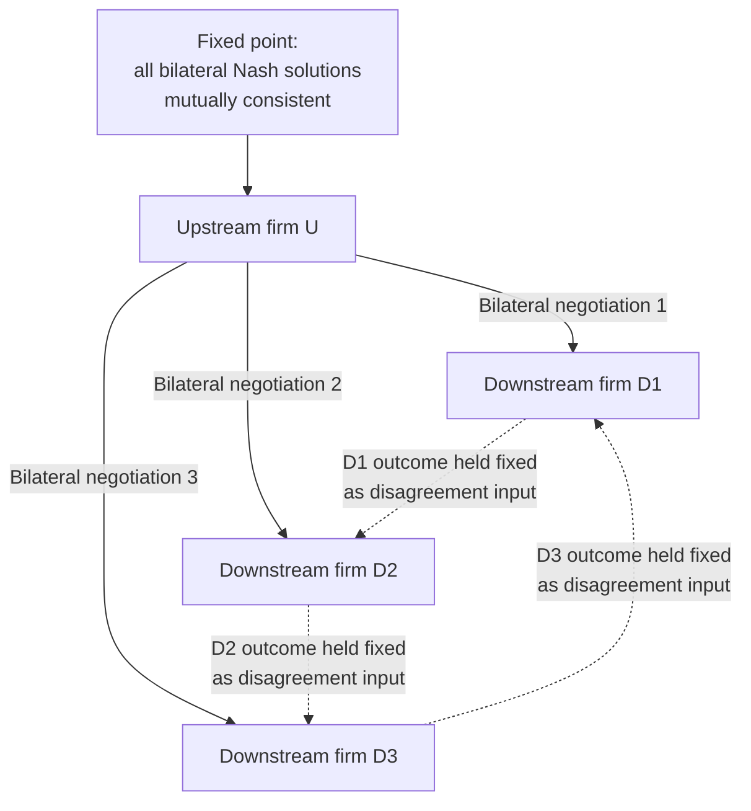

## Bilateral Bargaining Between Upstream and Downstream Firms

### Definition and Scope

Bilateral bargaining models analyze how the terms of trade between an upstream firm (manufacturer/supplier) and a downstream firm (retailer/distributor) are jointly determined when neither side has unilateral price-setting power — in contrast to the standard "manufacturer sets wholesale price, retailer accepts or rejects" (take-it-or-leave-it) framework implicit in much of the vertical restraints literature covered so far. Bargaining models are the natural extension when both parties have meaningful outside options, market power, or the ability to walk away, and when contract terms are negotiated rather than posted.

This topic reframes the vertical relationship questions already covered (double marginalization, RPM, exclusive dealing, franchising) through the lens of **surplus division**: instead of asking "what price does the manufacturer set," bargaining theory asks "how is the jointly created surplus split, given each side's bargaining power and outside options," and derives price/quantity outcomes as a *consequence* of that division rule.

**Key Points**

- Bargaining models are especially relevant when upstream and downstream firms both have market power (bilateral oligopoly), when input suppliers are essential and few (e.g., a dominant content provider negotiating with cable distributors), or when regulatory/institutional settings mandate negotiation (e.g., hospital-insurer contracting).
- The central technical tool is the **Nash bargaining solution**, though non-cooperative alternating-offer bargaining (Rubinstein) and its **Rubinstein-Binmore-Wolinsky implementation** provide the strategic foundations for treating the Nash solution as a reduced-form prediction rather than an ad hoc axiom.

### The Nash Bargaining Solution: Formal Setup

Consider an upstream firm U and downstream firm D negotiating a wholesale contract. Let $\pi_U$ and $\pi_D$ denote each party's profit under agreement, and let $d_U$, $d_D$ denote each party's **disagreement payoff** (profit if negotiation fails — e.g., from an outside option, an alternative trading partner, or zero if no trade occurs).

The **generalized Nash bargaining solution** solves:

$$\max_{\pi_U, \pi_D} (\pi_U - d_U)^{\beta} (\pi_D - d_D)^{1-\beta}$$

subject to $(\pi_U, \pi_D)$ being a feasible division of total surplus, where $\beta \in [0,1]$ is the **bargaining weight** (or bargaining power parameter) of the upstream firm, and $1-\beta$ the downstream firm's weight.

**Solution characterization**: for a fixed total surplus $S = \pi_U + \pi_D$ generated by trade, the Nash solution yields:

$$\pi_U - d_U = \beta(S - d_U - d_D), \quad \pi_D - d_D = (1-\beta)(S - d_U - d_D)$$

That is, each party receives its disagreement payoff *plus* a share (governed by $\beta$) of the **incremental surplus from trade** ($S - d_U - d_D$), often called the "bargaining pie."

**Key Points**

- The disagreement payoffs $d_U, d_D$ are doing substantial economic work: anything that raises a firm's outside option (alternative buyers/suppliers, vertical integration threat, ability to serve the market through a different channel) raises its bargained payoff, even holding $\beta$ fixed.
- $\beta$ is often treated as a reduced-form primitive representing negotiating skill, impatience, or institutional bargaining protocol, but the Rubinstein framework below derives it endogenously from more primitive parameters.

### Non-Cooperative Foundation: Rubinstein Alternating-Offer Bargaining

The Nash solution's axiomatic derivation (symmetry, Pareto efficiency, independence of irrelevant alternatives, invariance to affine transformations) is elegant but leaves $\beta$ unexplained. **Rubinstein (1982)** provides a non-cooperative micro-foundation: two parties alternate making take-it-or-leave-it offers over division of a fixed pie, each period incurring a **discount cost of delay** ($\delta_U$, $\delta_D$ per-period discount factors).

**Key result**: as the time between offers shrinks to zero, the unique subgame-perfect equilibrium division converges to the Nash bargaining solution with:

$$\beta = \frac{1 - \delta_D}{2 - \delta_U - \delta_D} \quad \text{(with equal discounting, } \delta_U = \delta_D = \delta \text{, this converges to } \beta = 1/2\text{)}$$

**Economic interpretation**: **impatience is the source of bargaining weakness**. A party who is more impatient (lower discount factor, higher cost of delay) accepts a worse deal to avoid prolonging negotiation, translating directly into a lower equilibrium share.

**[Inference]** In applied vertical-relations settings, $\beta$ is frequently treated as an exogenous calibration parameter estimated from data (matching observed margins) rather than derived from primitive discount factors, since real-world impatience parameters are rarely directly observable — this is a modeling simplification the literature is generally explicit about rather than a claim that impatience is literally unmeasured in practice.

### Application: Nash-in-Nash Bargaining Over Wholesale Prices

The dominant applied framework in industrial organization for vertical bargaining, especially in merger and vertical foreclosure analysis, is **Nash-in-Nash bargaining** (Horn and Wolinsky, 1988; Collard-Wexler, Gowrisankaran, and Lee, 2019, for a modern formalization).

**Setup**: an upstream firm negotiates simultaneously and *bilaterally* with multiple downstream firms (or vice versa). Each pairwise negotiation is modeled as a separate Nash bargaining problem, but the **disagreement payoff in each bilateral negotiation accounts for the (fixed) outcomes of all other ongoing negotiations** — i.e., if firm U is negotiating with retailer D1, U's disagreement payoff in that negotiation reflects the profit U would still earn from its (unaffected) agreements with D2, D3, etc.

**Key structural assumption**: negotiations are solved *simultaneously* taking other agreements as given (a fixed point), not sequentially — this is what "Nash-in-Nash" refers to (Nash bargaining solutions, nested across a network of pairwise negotiations).

$$w_{U,D_i} = \arg\max_{w} \left[\pi_U(w; w_{-i}) - d_U(w_{-i})\right]^{\beta} \left[\pi_{D_i}(w) - d_{D_i}\right]^{1-\beta}$$

where $w_{-i}$ denotes the wholesale terms with all other downstream partners, held fixed in solving negotiation $i$, then verified for mutual consistency across all pairwise negotiations simultaneously.

**Why this matters for vertical merger analysis**: this framework is the standard tool for evaluating **raising rivals' costs** and **bargaining leverage** theories of harm in vertical mergers — e.g., if an upstream content provider merges with a downstream distributor, the merged firm's disagreement payoff with a *rival* downstream distributor changes (because failing to reach agreement with the rival no longer costs the upstream firm its downstream profit, since it can recapture some of that lost content-viewing through its now-affiliated downstream arm). This shifts $d_U$ upward in negotiations with rivals, worsening their bargained terms — the core mechanism in modern vertical merger foreclosure analysis (e.g., in U.S. DOJ/FTC Vertical Merger Guidelines-style analysis).

### Diagrammatic Summary: Nash-in-Nash Structure

### Bargaining and Double Marginalization Revisited

Bilateral bargaining changes the double-marginalization analysis in an important way. Under simple **linear wholesale pricing with bargaining** (rather than manufacturer-dictated $w$), the wholesale price is:

$$w^{bargained} - c = \beta \cdot [\text{marginal contribution of trade to joint surplus, evaluated appropriately}]$$

**Key insight**: bargaining over a *linear* wholesale price still generically produces a double-marginalization-like inefficiency, because the retailer's downstream pricing decision is made *after* $w$ is fixed, so the retailer still ignores the upstream firm's margin when setting $p$ — **the source of the inefficiency (sequential, uncoordinated price-setting) is unaffected by whether $w$ is set unilaterally or bargained.** Bargaining changes *how surplus is split*, not *whether the total surplus is maximized*, unless the bargained contract also specifies **quantity or a two-part tariff** jointly (in which case bargaining over the *efficient* total quantity/price, followed by a bargained fixed-fee split of the resulting joint profit, restores efficiency — this is the bargaining analogue of the two-part tariff solution to double marginalization).

**Key Points**

- This distinction — bargaining over price alone vs. bargaining over an efficient joint outcome plus a side-payment — is central to when bilateral bargaining resolves or preserves vertical inefficiencies.
- Efficient bargaining (Coasian logic: parties with no transaction costs bargain to the surplus-maximizing outcome and split the gains) requires that all relevant instruments (not just linear price) are on the bargaining table.

### Bargaining Power Determinants

Beyond the pure impatience-based Rubinstein foundation, applied work identifies several structural determinants of $\beta$ in vertical settings:

1. **Concentration and outside options**: fewer alternative trading partners on one side raises that side's disagreement payoff sensitivity and typically strengthens its bargaining position — e.g., a downstream retailer with many alternative suppliers bargains harder against any single upstream firm.
2. **Must-carry / must-have status**: if a downstream firm cannot serve customers profitably without the upstream firm's product (a "must-have" input, common in content-distribution and branded pharmaceutical negotiations), the upstream firm's disagreement payoff loss is small relative to the downstream firm's, raising upstream bargaining power.
3. **Relative size and multi-market contact**: firms negotiating across many simultaneous deals (multi-market contact) may exhibit different effective bargaining power due to reputation effects across the portfolio of negotiations, though this interacts with tacit coordination concerns separately from pure bilateral efficiency analysis.
4. **Information asymmetry**: private information about costs, demand, or valuations can generate bargaining delay/inefficiency (Myerson-Satterthwaite impossibility results) not captured in the complete-information Nash/Rubinstein framework — real negotiations can fail to reach efficient agreement due to private information, a genuine source of transaction-cost-driven inefficiency distinct from the double-marginalization channel.

### Illustrative Numerical Example

Suppose upstream firm U and downstream firm D can jointly generate surplus $S = 200$ through trade. U's disagreement payoff (value of its next-best alternative buyer) is $d_U = 60$; D's disagreement payoff (value of its next-best alternative supplier) is $d_D = 40$. Bargaining weight $\beta = 0.5$ (equal bargaining power, e.g., equal impatience under Rubinstein).

Incremental surplus from trade: $S - d_U - d_D = 200 - 60 - 40 = 100$.

Nash bargaining division:

$$\pi_U = d_U + \beta \times 100 = 60 + 50 = 110$$

$$\pi_D = d_D + (1-\beta) \times 100 = 40 + 50 = 90$$

Check: $\pi_U + \pi_D = 200 = S$. ✓.

**Comparative static**: if U's outside option improves (e.g., $d_U$ rises to 90, from a new alternative buyer), holding $S$ and $d_D$ fixed, U's bargained payoff rises point-for-point in the disagreement payoff *plus* half the resulting change in incremental surplus:

$$\pi_U^{new} = 90 + 0.5 \times (200 - 90 - 40) = 90 + 35 = 125$$

**Key Points**

- This example illustrates why merger analysis and antitrust scrutiny of vertical deals often focus heavily on how a transaction changes *disagreement payoffs* for the merging and rival firms, since this — not just the bargaining weight $\beta$ — is frequently the primary channel through which structural changes affect negotiated outcomes.

### Bargaining vs. Posted-Price Frameworks: Comparison

| Feature | Posted-Price (Manufacturer Stackelberg) | Bilateral Nash Bargaining |
| --- | --- | --- |
| Price-setting protocol | Upstream sets $w$ unilaterally; downstream accepts/rejects or responds | Jointly negotiated; both sides influence outcome |
| Determinant of downstream payoff | Residual after upstream extracts via $w$ | Explicit share of incremental surplus, tied to bargaining power $\beta$ and outside options |
| Double marginalization | Present under linear pricing; requires two-part tariff/RPM to resolve | Present under linear-price bargaining; requires efficient joint-surplus bargaining plus side payment to resolve |
| Relevant market power structure | Upstream market power assumed dominant | Bilateral market power on both sides (bilateral oligopoly) |
| Typical application | Manufacturer-dominated consumer goods distribution | Content-distributor negotiations, hospital-insurer contracting, input supply with few alternatives on both sides |

### Empirical and Policy Applications

1. **Merger simulation**: Nash-in-Nash bargaining models are now standard in **vertical merger simulation** submitted in antitrust proceedings, estimating how a merger changes disagreement payoffs and thus predicted post-merger negotiated terms (e.g., studies of cable/broadcaster retransmission consent negotiations).
2. **Healthcare economics**: hospital-insurer price negotiations are a leading applied domain for bilateral bargaining models, since prices are explicitly negotiated (not posted) and both sides have identifiable outside options (alternative network participants).
3. **[Unverified]** Specific empirical estimates of bargaining weights $\beta$ reported in published studies vary substantially by industry and estimation methodology; any particular numeric estimate should be sourced to the specific study rather than treated as a general parameter value.

### Related Topics

- Double marginalization and two-part tariff solutions
- Nash-in-Nash bargaining and vertical merger simulation methodology
- Raising rivals' costs and vertical foreclosure theories of harm
- Myerson-Satterthwaite impossibility theorem and bargaining under private information
- Rubinstein alternating-offer bargaining and non-cooperative game foundations of cooperative solutions
- Countervailing buyer power in vertical relationships
- Vertical mergers and the U.S. DOJ/FTC Vertical Merger Guidelines
- Retransmission consent negotiations (media/broadcasting case studies)
- Hospital-insurer bargaining models in health economics
- Bilateral oligopoly and market power interaction across vertical levels