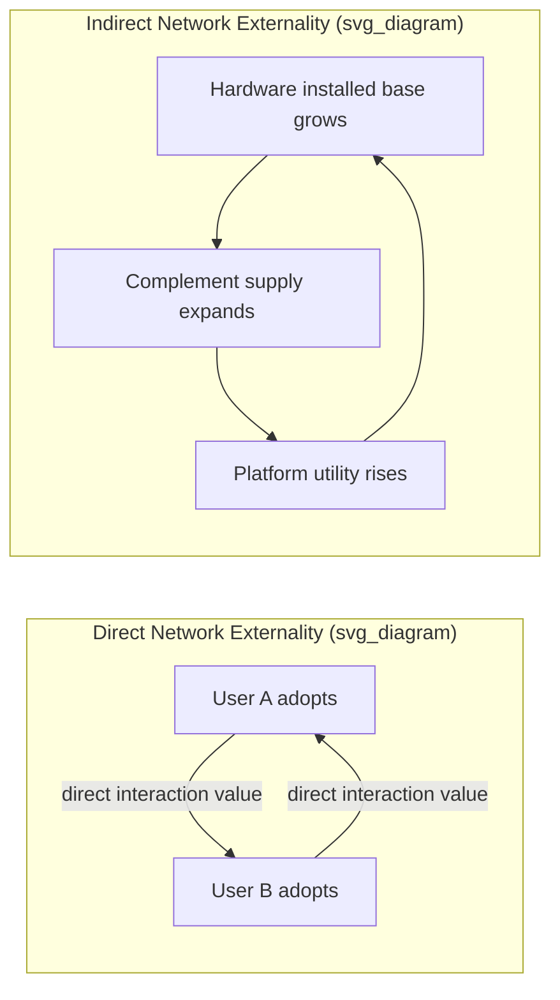

## Direct and Indirect Network Externalities

### Definition and Conceptual Foundation

A network externality (also called a network effect) exists when the utility a consumer derives from a good or service changes with the number of other agents consuming the same or a compatible good. This is distinguished from ordinary demand effects (e.g., bandwagon or snob effects driven by perception) in that network externalities operate through a genuine technical or economic linkage between users, not merely through preference interdependence.

Formally, if $u_i$ is the utility of consumer $i$ from adopting a network good, and $n$ is the number of adopters, a network externality exists when:

$$\frac{\partial u_i}{\partial n} \neq 0$$

Since the effect is typically positive (more users increase value), most treatments focus on positive network externalities, though negative variants (congestion effects) also occur.

The core distinction in the literature — first systematized by Katz and Shapiro (1985) — is between **direct** and **indirect** network externalities.

---

### Direct Network Externalities

**Key Points**

- Arise from direct physical or functional interaction between users of the same product.
- Value increases mechanically with the number of compatible users, independent of any third-party market.
- Classic examples: telephone networks, fax machines, email, messaging apps (WhatsApp, Telegram), social networks (Facebook, LinkedIn), and communication protocols (SMTP, VoIP standards).

**Mechanism**

The utility function under direct network externalities is often modeled following Katz and Shapiro's fulfilled-expectations framework:

$$u_i(n^e) = v_i \cdot f(n^e)$$

where $v_i$ is the consumer's intrinsic (stand-alone) valuation, $n^e$ is the expected number of network participants, and $f(\cdot)$ is an increasing function capturing the network benefit. In the canonical telephone model, if there are $n$ subscribers, the number of possible bilateral connections is:

$$\binom{n}{2} = \frac{n(n-1)}{2}$$

This is **Metcalfe's Law** in its strong form — network value scales roughly with $n^2$ — though empirical work (Briscoe, Odlyzko, and Tilly, 2006) argues this overstates real value, proposing instead $n \log(n)$ scaling since not all connections are equally valuable. [Inference: the exact functional form of value scaling is contested and depends on the specific network's connection-value distribution; treat $n^2$ and $n \log n$ as competing stylized models rather than settled empirical law.]

**Example**

Consider a fax network. If only one firm owns a fax machine, it has zero communication value (only stand-alone value, if any). As more firms adopt fax machines, each existing owner's machine becomes more valuable because there are more potential recipients. The willingness to pay for the $n$-th fax machine depends on the installed base $n-1$.

**Sub-types of Direct Effects**

- **Local network effects**: value depends only on adoption within a relevant subgroup (e.g., your contacts on a messaging app), not the entire user population. This is prominent in modern social network economics (Sundararajan, 2007).
- **Global network effects**: value depends on the total user base regardless of social proximity (e.g., total addressable market for a payment network).

---

### Indirect Network Externalities

**Key Points**

- Arise through a **complementary goods market** rather than direct interaction between users of the same good.
- Increased adoption of a platform/hardware increases the variety or quality of available complements, which in turn raises the value of the platform to users — an effect mediated by market mechanics rather than direct technical linkage.
- Classic examples: hardware/software platforms (game consoles and games, operating systems and applications), razor-and-blades systems (printers and cartridges), credit cards and merchant acceptance.

**Mechanism**

Indirect effects are typically modeled with two interdependent markets: the primary good (hardware, platform) and a complementary good (software, applications, accessories). Let $n_H$ be the number of hardware adopters and $n_S$ be the number/variety of software titles supplied. Software supply responds to expected hardware installed base:

$$n_S = g(n_H^e)$$

And hardware demand responds to available software variety:

$$n_H = h(n_S)$$

Consumer utility from the platform is then indirectly increasing in $n_H$ through the channel $n_H \rightarrow n_S \rightarrow u_i$, even though consumers derive no direct utility from interacting with other hardware owners.

**Example**

The classic case is video game consoles. A consumer's utility from owning a PlayStation does not depend on how many *other people* own a PlayStation in a direct-interaction sense (ignoring multiplayer features). Instead:

1. More console owners → larger addressable market for game developers.
2. Larger addressable market → more third-party studios develop titles for that console.
3. More available titles → higher utility for existing and prospective console owners.

This creates a "chicken-and-egg" (or "chicken-or-egg") problem: platforms need users to attract developers, and need developers/content to attract users — a coordination problem central to platform launch strategy.

---

### Comparative Table

| Dimension | Direct Network Externality | Indirect Network Externality |
| --- | --- | --- |
| Interaction channel | Direct use-linkage between adopters | Mediated via complementary goods market |
| Canonical example | Telephone, fax, messaging apps | Consoles/games, OS/applications |
| Value driver | Number of compatible users | Variety/quality of complements, driven by installed base |
| Market structure | Single market (often) | Two-sided or multi-sided market |
| Typical failure mode | Fragmentation from incompatible standards | Chicken-and-egg coordination failure |

---

### Diagram: Causal Structure

---

### Formal Equilibrium Analysis (Katz–Shapiro Fulfilled Expectations)

Both direct and indirect effects generate the same qualitative equilibrium structure: demand depends on expectations of network size, and expectations must be consistent with realized adoption in equilibrium (rational/fulfilled expectations).

Given inverse demand $p = P(n, n^e)$, where $\partial P/\partial n^e > 0$, a **fulfilled-expectations equilibrium** requires $n^e = n$, so:

$$p = P(n, n)$$

This "fulfilled-expectations demand curve" frequently has an unusual shape: it can be non-monotonic, producing **multiple equilibria** for a given price, including:

- A low-level equilibrium near $n = 0$ (network never gets started; the "critical mass" problem).
- A high-level equilibrium at large $n$ (network flourishes).
- Potentially an unstable interior equilibrium separating the two (the **critical mass** threshold).

[Inference: whether the intermediate equilibrium is unstable rather than stable depends on the specific demand and expectation-formation assumptions used in the model, but instability of the interior tipping point is the standard result in most textbook treatments.]

---

### SVG Illustration: Fulfilled-Expectations Demand Curve with Critical Mass

<svg xmlns="http://www.w3.org/2000/svg" viewBox="0 0 620 420" font-family="Helvetica, Arial, sans-serif">
<text x="310" y="25" text-anchor="middle" font-size="16" font-weight="bold" fill="#1a1a1a">Fulfilled-Expectations Demand and Critical Mass (svg_diagram)</text>

<line x1="70" y1="370" x2="580" y2="370" stroke="#333" stroke-width="2" />
<line x1="70" y1="370" x2="70" y2="50" stroke="#333" stroke-width="2" />
<text x="580" y="392" font-size="13" fill="#333">Network size (n)</text>
<text x="30" y="55" font-size="13" fill="#333">Price</text>

<path d="M 90 90 C 180 140, 220 300, 280 320 C 340 300, 400 160, 460 100 C 500 70, 540 60, 560 55" fill="none" stroke="`#2166ac`" stroke-width="3" />

<line x1="70" y1="220" x2="580" y2="220" stroke="#b2182b" stroke-width="2" stroke-dasharray="6,4" />
<text x="585" y="224" font-size="12" fill="#b2182b">price p*</text>

<circle cx="118" cy="220" r="6" fill="#1a1a1a" />
<text x="100" y="245" font-size="12" fill="#1a1a1a">Low equilibrium</text>
<text x="100" y="260" font-size="12" fill="#1a1a1a">(network fails)</text>
<circle cx="300" cy="220" r="6" fill="#e08214" stroke="#1a1a1a" />
<text x="255" y="200" font-size="12" fill="#e08214">Critical mass</text>
<text x="270" y="185" font-size="12" fill="#e08214">(unstable)</text>
<circle cx="447" cy="220" r="6" fill="#1a1a1a" />
<text x="410" y="245" font-size="12" fill="#1a1a1a">High equilibrium</text>
<text x="410" y="260" font-size="12" fill="#1a1a1a">(network thrives)</text>

<path d="M 118 300 L 118 240" stroke="#4d4d4d" stroke-width="1.5" marker-end="url(#arrow)" />
<path d="M 447 320 L 447 240" stroke="#4d4d4d" stroke-width="1.5" marker-end="url(#arrow)" />
</svg>

---

### Distinguishing Externality from Ordinary Scale Economies

A recurring pedagogical clarification: network externalities are demand-side scale economies, contrasted with **supply-side scale economies** (economies of scale in production, e.g., declining average cost with output). Both can generate increasing-returns dynamics and market tipping, but they operate through different mechanisms:

- Supply-side: unit cost falls as production quantity $q$ rises, due to fixed cost amortization or learning effects.
- Demand-side (network effects): unit *value* rises as adoption $n$ rises, holding production technology fixed.

In practice, digital platforms frequently exhibit **both** simultaneously (e.g., cloud software has near-zero marginal cost *and* strong indirect network effects via third-party integrations), which compounds tipping tendencies and is a central concern in platform antitrust economics.

---

### Interaction with Market Structure: Tipping and Excess Inertia/Momentum

**Key Points**

- **Tipping**: markets with strong network externalities tend toward a single dominant standard/platform because the fulfilled-expectations equilibrium favors whichever network is expected to become larger — a self-reinforcing process.
- **Excess momentum**: consumers may adopt a new, incompatible technology too readily, stranding the installed base of the old technology (bandwagon effects can overshoot efficiency).
- **Excess inertia**: conversely, existing users may be reluctant to switch to a superior new standard because switching alone forfeits current network benefits — a coordination failure that can lock in inferior technology (the QWERTY-typewriter debate, though empirically contested by Liebowitz and Margolis, 1990, is the canonical illustrative example). [Unverified: whether QWERTY itself was actually inefficient relative to alternatives like Dvorak is disputed in the empirical literature; it should be treated as an illustrative, contested case rather than a proven instance of inefficient lock-in.]

**Policy and Strategic Implications**

- Firms competing in network markets often subsidize early adopters (penetration pricing) or one side of an indirect network (e.g., subsidized consoles, free basic app tiers) to overcome the chicken-and-egg problem and reach critical mass faster than rivals.
- Standard-setting organizations and compatibility/interoperability mandates are policy tools to prevent excess inertia or wasteful standards wars.
- Antitrust scrutiny of dominant platforms (e.g., app store policies, interoperability disputes) often centers on whether network-effect-driven dominance is being leveraged anticompetitively into adjacent complementary markets — directly invoking the indirect-externality mechanism.

---

### Worked Numerical Example

Suppose a platform's hardware demand is $n_H = 100 - p + 0.5 n_S$ and software supply responds to hardware base as $n_S = 2 n_H^e$. Under fulfilled expectations ($n_H^e = n_H$):

$$n_H = 100 - p + 0.5(2n_H) = 100 - p + n_H$$

This particular linear specification yields degenerate results (the $n_H$ terms cancel), illustrating why realistic models use nonlinear or bounded functional forms (e.g., logistic software-supply response) to generate well-behaved multiple equilibria rather than linear indeterminacy. A more standard specification uses a saturating function, e.g., $n_S = \bar{S}\left(1 - e^{-\alpha n_H^e}\right)$, which produces the familiar S-shaped fulfilled-expectations demand curve shown in the diagram above.

---

### Related Topics

- Critical mass and the chicken-and-egg problem in platform launch strategy
- Two-sided markets and platform pricing (Rochet–Tirole framework)
- Standards wars and compatibility decisions (Katz and Shapiro, 1985; 1994)
- Switching costs and consumer lock-in
- Tipping, winner-take-all dynamics, and market structure in digital markets
- Metcalfe's Law, Reed's Law, and critiques of network value scaling
- Multi-homing versus single-homing in platform competition
- Antitrust economics of platform dominance and interoperability mandates