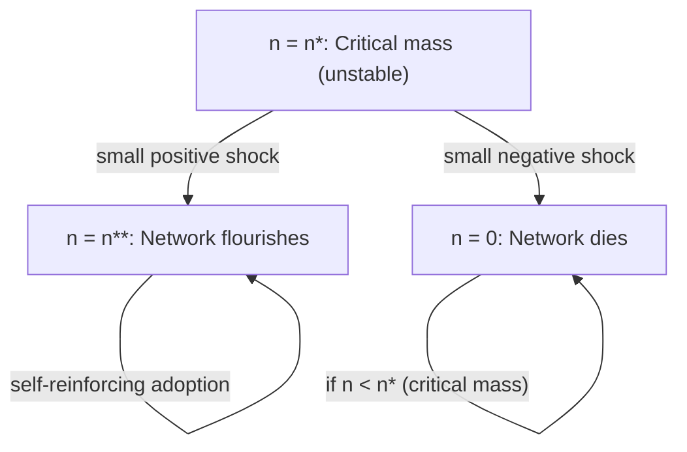

## Critical Mass and Adoption Dynamics

### Definition and Conceptual Foundation

Critical mass refers to the minimum threshold level of adopters a network good must attain before self-sustaining growth becomes more attractive than continued non-adoption or abandonment. Below this threshold, the network tends to unravel toward zero adoption; above it, positive feedback from network externalities pulls adoption toward a high-level (or full-market) equilibrium. The concept originates in sociology (Granovetter, 1978, threshold models of collective behavior) and was formalized for network markets by Rohlfs (1974) and later embedded in the Katz–Shapiro (1985) fulfilled-expectations framework.

**Key Points**

- Critical mass is an **unstable equilibrium point**, not a stable resting state — this is the crucial and often misunderstood feature.
- It arises specifically because network value is *endogenous* to adoption: $u_i(n)$ is increasing in $n$, creating multiple market-clearing points.
- Distinguishing critical mass (a threshold in adoption dynamics) from "market share" or "scale" (static size measures) is essential: critical mass is about the *dynamic trajectory*, not the level itself.

---

### Formal Model: Rohlfs–Katz–Shapiro Framework

Let $n$ denote the fraction (or number) of adopters, and let willingness to pay for the marginal consumer be a decreasing function of their reservation value $v_i$, ranked from highest to lowest. Under fulfilled expectations, the demand price for network size $n$ is:

$$p(n) = v(n) \cdot f(n)$$

where $v(n)$ is the stand-alone valuation of the marginal (n-th) consumer (typically decreasing in $n$, reflecting heterogeneous tastes ranked by willingness to pay) and $f(n)$ is the network-value multiplier (increasing in $n$). The product of a decreasing and an increasing function commonly produces a **non-monotonic price-quantity locus**: rising over some range, then falling.

At a fixed market price $\bar{p}$, the equilibria are the solutions to:

$$\bar{p} = v(n) f(n)$$

Generically, this yields up to three equilibria:

1. $n = 0$: trivial "no adoption" equilibrium (always exists if $f(0)=0$, i.e., no value with zero network).
2. $n = n^*$ (critical mass): interior, **unstable** equilibrium.
3. $n = n^{**} > n^*$: interior or boundary, **stable** high equilibrium.

**Stability condition**: an equilibrium $n$ is locally stable under simple tâtonnement-style adjustment dynamics if the excess-demand response to a small positive perturbation in adopters pushes the system further away from $n$ toward the neighboring stable point:

$$\left.\frac{d[p(n) - \bar p]}{dn}\right|_{n^*} > 0 \implies \text{unstable}$$

$$\left.\frac{d[p(n) - \bar p]}{dn}\right|_{n^{**}} < 0 \implies \text{stable}$$

[Inference: this stability characterization relies on an adjustment-dynamics assumption (adoption grows when perceived value exceeds price) that is standard but not the only possible dynamic specification; alternative dynamic microfoundations could in principle alter which points are locally stable.]

---

### Diagram: Critical Mass as an Unstable Tipping Point

---

### Adoption Dynamics: Diffusion Curve Perspective

Beyond the static multiple-equilibria view, critical mass is also studied through **diffusion of innovations** models (Bass, 1969), which describe the *time path* of adoption rather than just equilibrium levels. The Bass model specifies the rate of adoption as:

$$\frac{dN(t)}{dt} = \left(p + q\frac{N(t)}{m}\right)(m - N(t))$$

where:

- $N(t)$ = cumulative adopters at time $t$
- $m$ = total market potential
- $p$ = coefficient of innovation (external influence, e.g., advertising, independent adoption)
- $q$ = coefficient of imitation (internal influence, e.g., word-of-mouth, network effects)

For network goods, $q$ is typically large relative to $p$, producing a **characteristic S-curve**: slow early adoption (innovators), a rapid inflection phase once imitation/network effects dominate (this inflection region is often loosely equated with "reaching critical mass" in applied/practitioner usage, though it is a distinct concept from the game-theoretic unstable equilibrium above), and eventual saturation as $N(t) \to m$.

**Example**

For a messaging app with $m = 10{,}000{,}000$ potential users, $p = 0.02$, $q = 0.4$: adoption is dominated by imitation/network effects ($q \gg p$), so the diffusion curve exhibits a long, slow early phase followed by explosive growth once a sufficient peer base exists — consistent with observed viral growth patterns in social apps. [Unverified: specific numerical values are illustrative parameters chosen for exposition, not fitted estimates from a real observed launch; actual $p$ and $q$ values are typically estimated econometrically from historical sales/adoption data for a specific product.]

---

### SVG Illustration: Bass Diffusion S-Curve and Inflection Region

<svg xmlns="http://www.w3.org/2000/svg" viewBox="0 0 620 380" font-family="Helvetica, Arial, sans-serif">
<text x="310" y="24" text-anchor="middle" font-size="16" font-weight="bold" fill="#1a1a1a">Bass Diffusion Curve: Adoption Over Time (svg_diagram)</text>
<line x1="70" y1="330" x2="580" y2="330" stroke="#333" stroke-width="2" />
<line x1="70" y1="330" x2="70" y2="50" stroke="#333" stroke-width="2" />
<text x="560" y="352" font-size="13" fill="#333">Time (t)</text>
<text x="30" y="55" font-size="13" fill="#333">N(t)</text>

<path d="M 70 320 C 150 315, 220 300, 280 250 C 340 180, 380 90, 460 65 C 500 58, 540 55, 580 54" fill="none" stroke="`#2166ac`" stroke-width="3" />

<line x1="280" y1="330" x2="280" y2="60" stroke="#b2182b" stroke-width="1.5" stroke-dasharray="5,4" />
<text x="215" y="200" font-size="12" fill="#b2182b">Inflection region</text>
<text x="220" y="215" font-size="12" fill="#b2182b">("critical mass" zone)</text>

<text x="90" y="315" font-size="11" fill="`#4d4d4d`">Innovators</text>

<text x="330" y="150" font-size="11" fill="`#4d4d4d`">Imitators (network-driven)</text>

<text x="480" y="75" font-size="11" fill="`#4d4d4d`">Saturation</text>

<line x1="70" y1="65" x2="580" y2="65" stroke="#888" stroke-width="1" stroke-dasharray="2,3" />
<text x="585" y="69" font-size="11" fill="#888">m (potential)</text>
</svg>

---

### Determinants of the Critical Mass Threshold

**Key Points**

- **Intrinsic (stand-alone) value**: higher stand-alone utility (utility with zero or few other users) lowers the critical mass threshold, since less network reinforcement is needed to sustain adoption. Products with high stand-alone value (e.g., a smartphone that is useful even offline) face an easier bootstrapping problem than pure-network goods (e.g., a fax machine, useful only if others have one).
- **Price**: lower prices reduce the threshold by shifting the demand locus relative to the willingness-to-pay curve; heavy early-stage subsidization is a standard strategic response.
- **Heterogeneity of valuations**: if there is a subgroup of high-value early adopters ("hubs" or lead users), sequential/targeted rollout to this subgroup can establish local critical mass before broader diffusion — this underlies the "bowling pin strategy" in platform launches.
- **Expectations management**: since adoption depends on *expected* network size, credible signals of future scale (funding announcements, high-profile partnerships, pre-launch buzz) can shift consumer beliefs and effectively lower the *perceived* threshold without altering fundamentals.
- **Coordination mechanisms**: focal points, industry standards bodies, and compatibility with existing networks reduce coordination failure risk around which network to join.
- **Multi-homing costs**: if consumers can costlessly join multiple competing networks, the threshold effectively drops because adoption of a new network doesn't require abandoning the old one — this is central to how two-sided platforms (e.g., ride-hailing apps operating in a city with an incumbent) can achieve initial traction.

---

### Strategic Responses to the Critical Mass Problem

**Key Points**

- **Penetration pricing / free tier subsidization**: pricing below marginal cost (or free) for early users to accelerate movement past the unstable threshold, recouping value later via network effects, premium tiers, or the other side of a two-sided market.
- **Seeding / targeted early adopter programs**: giving product away to influential or highly-connected users to accelerate local network formation (e.g., early enterprise pilot programs, campus-by-campus rollout as in Facebook's early history).
- **Pre-announcements and vaporware strategies**: signaling future scale to coordinate expectations (with associated legal/reputational risk if commitments aren't honored).
- **Interconnection and interoperability**: mandatory or voluntary interconnection with rival networks removes the "network size" advantage of incumbents and can be used by entrants to neutralize an incumbent's installed-base advantage (historically significant in telecommunications regulation).
- **Bundling with an existing installed base**: attaching a new network good to an already-successful platform or product (e.g., a new feature bundled into an existing widely-used app) imports critical mass rather than building it from zero.
- **Sequential market segmentation**: the "bowling pin" strategy of dominating a narrow, high-value niche market first, then using that base as a credible signal and springboard into adjacent, broader markets.

---

### Empirical and Measurement Considerations

**Key Points**

- Critical mass is inherently difficult to observe directly since it is a theoretical tipping point in a model, not a directly measurable statistic; empirical work typically infers proximity to critical mass from growth-rate acceleration, cohort retention curves, or estimated Bass-model parameters.
- Practitioners often operationalize "reaching critical mass" as a proxy metric — e.g., a minimum viable liquidity threshold in a marketplace (buyers-per-seller ratio), or a retention/engagement threshold correlated with sustained organic growth — rather than the formal unstable-equilibrium construct. [Inference: this practitioner usage is a looser, applied heuristic and should not be conflated with the precise game-theoretic definition, even though both share the same underlying intuition about self-reinforcing adoption.]
- Behavior may vary substantially across empirical contexts depending on network topology (random graph vs. scale-free/hub-dominated networks), since threshold dynamics in networks with highly connected hubs can differ materially from the homogeneous-mixing assumption underlying the basic Rohlfs model.

---

### Worked Numerical Example

Suppose stand-alone valuation of the marginal consumer is $v(n) = 100 - n$ (in dollars, consumers ranked by willingness to pay, $n$ measured in thousands of users) and the network multiplier is $f(n) = n / (n+20)$ (saturating in $n$). Fulfilled-expectations price is:

$$p(n) = (100-n)\cdot\frac{n}{n+20}$$

At a market price of $\bar p = 30$, solving $p(n) = 30$ numerically yields three roots approximately at $n \approx 0$ (trivial), $n \approx 8$ (unstable critical mass, in thousands of users), and $n \approx 55$ (stable high equilibrium). A firm targeting this market would need to acquire roughly 8,000 users — through subsidies, seeding, or promotions — before organic network-driven growth could be expected to carry adoption toward the ~55,000-user equilibrium. [Unverified: these are illustrative parameter values for pedagogical demonstration, not estimates from an actual market; the qualitative three-root structure is the standard/documented result of this functional form, but exact root locations depend entirely on the specific functions chosen.]

---

### Related Topics

- Direct and indirect network externalities (foundational mechanism generating critical mass)
- Bass diffusion model and technology adoption lifecycle (Rogers' adopter categories: innovators, early adopters, early/late majority, laggards)
- Two-sided market chicken-and-egg problem and platform launch sequencing
- Switching costs, lock-in, and installed-base dynamics
- Standards wars and coordination games (focal points, Schelling points)
- Tipping points in social and economic systems (Granovetter threshold models, Schelling segregation models)
- Penetration pricing and two-sided platform subsidy design (Rochet–Tirole)
- Multi-homing and its effect on competitive dynamics in platform markets