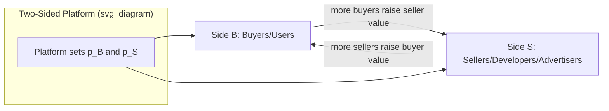

## Two-Sided Market Theory and Cross-Group Pricing

### Definition and Conceptual Foundation

A two-sided market (or two-sided platform) is a market in which a platform enables interactions between two distinct groups of agents, and the volume or value of interactions depends on the participation of both sides — with the platform's pricing structure (not just its level) affecting total transaction volume. This distinguishes two-sided markets from ordinary intermediated markets: what matters is not merely that a platform serves two customer types, but that **cross-group externalities** exist and that the Coase theorem fails to render the price *allocation* between sides irrelevant (Rochet and Tirole, 2003, 2006).

**Key Points**

- Canonical examples: payment cards (cardholders and merchants), operating systems (users and developers), media (readers/viewers and advertisers), matchmaking platforms (buyers and sellers, riders and drivers, job seekers and employers).
- The defining theoretical test (Rochet–Tirole): a market is two-sided if the **total price level held fixed**, a change in the **price structure** (how much each side pays) affects the total volume of transactions. If only the total price matters and its allocation between sides is neutral, the market is effectively one-sided (Coase-neutral) despite having two counterparties.

---

### The Rochet–Tirole Framework

Let there be two sides, buyers ($B$) and sellers ($S$), with respective prices $p_B$ and $p_S$ charged by the platform per transaction or per membership. Total volume of interactions $V$ is a function of both prices:

$$V = V(p_B, p_S)$$

The market is two-sided if:

$$V(p_B + p_S = \bar p, \text{allocation varies}) \neq \text{constant}$$

i.e., holding $\bar p = p_B + p_S$ fixed, varying the split still changes $V$. This occurs precisely when demand on each side depends on participation on the other side (cross-group network externalities), so that a price cut on one side that is exactly offset by a price increase on the other still shifts the equilibrium because the *sides do not internalize the externality they impose on each other* — analogous to a Pigouvian externality problem, except here the platform, not the government, is the mechanism designer choosing the corrective transfer.

**Platform profit maximization** in the simplest membership-based model (Armstrong, 2006):

$$\max_{p_B, p_S} \; \pi = n_B(p_B, n_S) \cdot p_B + n_S(p_S, n_B) \cdot p_S - C(n_B, n_S)$$

where $n_B$ and $n_S$ are participation levels on each side, each depending on the *own-side price* and the *expected participation of the other side* (cross-group externality channel), and $C(\cdot)$ is platform cost.

---

### Diagram: Cross-Group Externality Structure

---

### Optimal Pricing Structure: The Lerner-Style Condition

For a monopoly platform, the standard result (Rochet–Tirole, Armstrong) is that the optimal price on each side reflects a modified Lerner markup that nets out the externality the side generates for the *other* side:

$$p_B = c_B - \frac{n_S}{\eta_B}\cdot\frac{\partial n_S}{\partial n_B}\bigg/ \left(-\frac{\partial n_B}{\partial p_B}\right)^{-1}$$

More intuitively (and more commonly presented in applied treatments), the platform's price on side $i$ is:

$$p_i = c_i - \left(\text{externality that side } i \text{'s participation confers on side } j\right)$$

This yields the central qualitative prediction: **the side that generates a larger positive externality for the other side is charged a lower price (or subsidized), while the side that captures more surplus from the interaction is charged a higher price.** This is why:

- Advertising-supported media charges near-zero or negative effective prices to readers/viewers (who generate audience value for advertisers) and positive prices to advertisers.
- Payment card networks historically charged cardholders very little (or paid them via rewards) while charging merchants substantial interchange fees, because merchant revenue from an additional transaction typically exceeds the marginal value a single additional cardholder consciously assigns to card acceptance.
- Nightclubs commonly charge low or zero cover to attract women (if the model of externality assumes their presence draws more male patrons) and higher cover to men. [Unverified/context-dependent: this specific example is a widely-used illustrative case in the literature (e.g., in Rochet-Tirole-adjacent teaching material), but the direction and magnitude of any real-world asymmetric pricing practice depends on the specific empirical demand elasticities and externality strengths in that market, and such practices may also be subject to legal/discrimination constraints in some jurisdictions.]

---

### Determinants of the Optimal Price Structure

**Key Points**

- **Relative price elasticity of demand** on each side: the side with more elastic demand should generally bear a lower price share, all else equal (standard Ramsey-pricing intuition, modified by the cross-side externality term).
- **Relative externality strength**: the side whose participation generates a *larger* marginal benefit for the other side should be charged less (or subsidized) — this is the single most distinctive two-sided-market-specific term.
- **Single-homing vs. multi-homing**: if one side single-homes (uses only one platform) and the other multi-homes (uses several), the platform gains bargaining leverage over the multi-homing side by controlling exclusive access to the single-homing side, typically enabling it to extract more surplus from the multi-homing side (the "competitive bottleneck" result, Armstrong 2006).
- **Marginal cost differences** across sides (standard one-sided consideration, still relevant but not distinctive to two-sidedness).

---

### Membership vs. Usage Pricing

**Key Points**

- **Membership (access) charges**: fixed fee to join the platform regardless of transaction volume (e.g., a subscription fee, an annual card fee).
- **Usage (per-transaction) charges**: fee charged per interaction or transaction (e.g., a per-swipe interchange fee, a per-ride commission).
- Rochet and Tirole (2006) show that the *same* aggregate cross-subsidization logic applies to both instruments, but they have different implications for the extensive margin (who joins) versus intensive margin (how much they transact) — a platform may charge membership fees to control participation and usage fees to control transaction volume conditional on participation, and optimal design generally uses **both** instruments jointly rather than relying on a single price type when it can price-discriminate along both margins.

---

### Competitive Bottleneck Model (Armstrong, 2006)

**Key Points**

- Arises when one side (say, consumers) single-homes — joining only one platform — while the other side (advertisers/sellers) multi-homes to reach the full consumer base.
- The platform effectively becomes a monopolist "bottleneck" for access to its single-homing consumers, even in a competitive platform market, because advertisers/sellers must join every platform where any of their target consumers reside.
- Result: platforms compete fiercely (often below cost) for the single-homing side to build an installed base, and extract surplus primarily from the multi-homing side, which faces limited platform choice for reaching a given consumer.
- This is a key explanatory framework for why digital advertising platforms subsidize/free-provide consumer-facing services while monetizing intensively on the advertiser side.

---

### SVG Illustration: Membership Pricing Asymmetry Under Competitive Bottleneck

<svg xmlns="http://www.w3.org/2000/svg" viewBox="0 0 620 340" font-family="Helvetica, Arial, sans-serif">
<text x="310" y="24" text-anchor="middle" font-size="16" font-weight="bold" fill="#1a1a1a">Competitive Bottleneck: Asymmetric Pricing (svg_diagram)</text>
<rect x="60" y="70" width="220" height="120" rx="8" fill="#eaf2fb" stroke="#2166ac" stroke-width="2" />
<text x="170" y="110" text-anchor="middle" font-size="13" font-weight="bold" fill="#1a1a1a">Single-homing side</text>
<text x="170" y="130" text-anchor="middle" font-size="12" fill="#1a1a1a">(e.g., consumers)</text>
<text x="170" y="155" text-anchor="middle" font-size="13" fill="#2166ac">Low price / subsidized</text>
<text x="170" y="175" text-anchor="middle" font-size="11" fill="#4d4d4d">Platforms compete hard for this side</text>
<rect x="340" y="70" width="220" height="120" rx="8" fill="#fbeaea" stroke="#b2182b" stroke-width="2" />
<text x="450" y="110" text-anchor="middle" font-size="13" font-weight="bold" fill="#1a1a1a">Multi-homing side</text>
<text x="450" y="130" text-anchor="middle" font-size="12" fill="#1a1a1a">(e.g., advertisers/sellers)</text>
<text x="450" y="155" text-anchor="middle" font-size="13" fill="#b2182b">Higher price / surplus extraction</text>
<text x="450" y="175" text-anchor="middle" font-size="11" fill="#4d4d4d">Must join every relevant platform</text>
<line x1="280" y1="130" x2="340" y2="130" stroke="#333" stroke-width="2" marker-end="url(#arrow2)" />
<text x="310" y="120" text-anchor="middle" font-size="11" fill="#333">bottleneck</text>

<text x="310" y="240" text-anchor="middle" font-size="12" fill="`#4d4d4d`">Platform monetizes the side with fewer outside options</text>

<text x="310" y="258" text-anchor="middle" font-size="12" fill="`#4d4d4d`">for reaching the exclusive/single-homed side</text>

</svg>

---

### Worked Numerical Example

A ride-hailing platform serves riders (side $R$) and drivers (side $D$). Suppose:

- Rider demand: $n_R = 1000 - 20p_R + 0.5 n_D$
- Driver supply: $n_D = 200 + 10p_D + 0.3 n_R$
- Platform marginal cost per matched ride: $c = \$1$

The platform chooses $p_R$ (fare markup) and $p_D$ (commission passed to drivers, could be negative/subsidy) to maximize $\pi = (p_R + p_D - c)\min(n_R, n_D)$, subject to the cross-side feedback loops above. Because rider participation confers a larger externality on drivers (each additional rider directly increases driver earnings opportunity) relative to how much a single additional driver's presence is subjectively valued by any one rider (drivers are more substitutable from a rider's perspective in most markets), the qualitative prediction is that the platform sets a **relatively lower effective price for riders and extracts more margin from drivers** (via commission) — though the exact split depends on the relative magnitudes of the cross-elasticities $0.5$ and $0.3$ in this stylized example. [Inference: the direction of the asymmetric result here follows deductively from the assumed relative externality magnitudes (0.5 vs. 0.3) in this specific numerical example; real-world ride-hailing commission and fare structures are set based on empirically estimated elasticities and are also constrained by competitive dynamics, regulation, and driver-side labor market considerations not captured in this simplified illustration.]

---

### Empirical and Regulatory Considerations

**Key Points**

- Two-sided market theory has been central to major antitrust and regulatory disputes — most notably *Ohio v. American Express* (U.S. Supreme Court, 2018), which addressed whether antitrust analysis of platform pricing must consider both sides of the market jointly rather than evaluating a price increase on one side (merchants) in isolation. [Unverified: legal interpretation and the precise doctrinal implications of this case remain subject to ongoing debate among antitrust economists and legal scholars; treat this as a documented legal event rather than a settled economic conclusion about correct antitrust methodology.]
- Regulation of interchange fees (e.g., EU interchange fee caps on card payments) is a direct real-world application of cross-group pricing theory, aiming to correct perceived merchant-side overcharging relative to the competitive-bottleneck-driven optimal platform price.
- Measuring "which side subsidizes which" empirically requires estimating both own-price elasticities and cross-group network effect magnitudes — a nontrivial empirical exercise, and results can vary meaningfully by market and estimation methodology.

---

### Related Topics

- Direct and indirect network externalities (the underlying mechanism generating two-sidedness)
- Critical mass and chicken-and-egg problems in platform launch
- Multi-homing, single-homing, and the competitive bottleneck model (Armstrong, 2006)
- Platform envelopment and multi-platform competition
- Interchange fee regulation and payment card network economics
- Advertising-supported media economics and audience/advertiser cross-subsidization
- Platform antitrust: market definition challenges in two-sided markets
- Vertical integration and platform self-preferencing in adjacent complementary markets