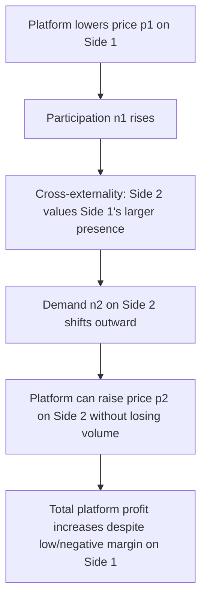

## Platform Pricing Structures and the Pricing Seesaw

### Definition and Conceptual Foundation

The "pricing seesaw" is a descriptive metaphor for the central positive result in two-sided market pricing theory: because a platform's profit depends on total participation across interdependent sides, an optimally-behaving platform treats the price charged to one side and the price charged to the other as **jointly determined instruments on a single fulcrum** — lowering the price to one side (even below marginal cost) can be individually profit-maximizing if it sufficiently raises participation, and thus profit extraction, on the other side. Raising price on one side "pushes down" the profit-maximizing price on the other side, much as one end of a seesaw drops when the other rises. This is distinct from — but closely related to — the Rochet-Tirole "two-sidedness test" and the broader cross-group pricing literature.

**Key Points**

- The seesaw metaphor emphasizes **structure over level**: the question is not "is the total price too high or low" but "how is a given total price optimally allocated between the two sides."
- The seesaw effect is strongest precisely where cross-group externalities are strongest and where one side is meaningfully more price-elastic or generates disproportionately large value for the other side.
- A pure seesaw relationship implies that if a regulator or competitor forces a price change on one side (e.g., a price cap on interchange fees paid by merchants), the platform's profit-maximizing response is generally to raise the price on the other side to partially restore the lost surplus-extraction — a widely cited (and empirically debated) prediction with direct regulatory relevance.

---

### Formal Structure of the Seesaw

Consider platform profit as a function of prices $p_1, p_2$ on sides 1 and 2, with participation levels $n_1(p_1, n_2)$ and $n_2(p_2, n_1)$ each depending on the *other* side's participation (the network-externality channel):

$$\pi(p_1, p_2) = p_1 n_1(p_1, n_2) + p_2 n_2(p_2, n_1) - C(n_1, n_2)$$

At an interior optimum, the first-order conditions are:

$$\frac{\partial \pi}{\partial p_1} = n_1 + p_1\frac{\partial n_1}{\partial p_1} + p_2\frac{\partial n_2}{\partial n_1}\cdot\frac{\partial n_1}{\partial p_1} = 0$$

$$\frac{\partial \pi}{\partial p_2} = n_2 + p_2\frac{\partial n_2}{\partial p_2} + p_1\frac{\partial n_1}{\partial n_2}\cdot\frac{\partial n_2}{\partial p_2} = 0$$

The key structural term in each condition is the **cross-effect**, e.g., $p_2 \cdot \partial n_2/\partial n_1$ — the additional profit earned on side 2 when side 1's participation rises. This term is precisely what is absent from a standard (one-sided) monopoly pricing problem, and it is what mechanically couples $p_1$ and $p_2$: solving the system jointly (rather than side-by-side independently) is what generates seesaw-style comparative statics, where an exogenous shock to one price ripples through to the platform's optimal choice of the other.

Rearranging into modified-Lerner form for side $i$ (with side $j$ the other side):

$$\frac{p_i - c_i}{p_i} = \frac{1}{\eta_i} - \frac{p_j}{p_i}\cdot\frac{\partial n_j}{\partial n_i}\cdot\frac{n_i}{n_j}\cdot\frac{1}{\eta_i}$$

where $\eta_i = -\frac{\partial n_i}{\partial p_i}\cdot\frac{p_i}{n_i}$ is the own-price elasticity of side $i$'s demand. The subtracted term is the seesaw correction: it can push the markup on side $i$ well below the standard one-sided Lerner markup — potentially negative (below marginal cost, or even negative price/subsidy) if the cross-externality term is large enough.

---

### Diagram: The Pricing Seesaw Mechanism

---

### SVG Illustration: The Seesaw Metaphor

<svg xmlns="http://www.w3.org/2000/svg" viewBox="0 0 620 340" font-family="Helvetica, Arial, sans-serif">
<text x="310" y="24" text-anchor="middle" font-size="16" font-weight="bold" fill="#1a1a1a">Platform Pricing Seesaw (svg_diagram)</text>

<polygon points="290,260 330,260 310,220" fill="#555" />
<text x="310" y="285" text-anchor="middle" font-size="11" fill="#4d4d4d">Platform</text>
<text x="310" y="298" text-anchor="middle" font-size="11" fill="#4d4d4d">(joint optimization)</text>

<line x1="130" y1="200" x2="490" y2="150" stroke="#333" stroke-width="6" stroke-linecap="round" />

<circle cx="130" cy="200" r="10" fill="#2166ac" />
<rect x="70" y="205" width="140" height="70" rx="6" fill="#eaf2fb" stroke="#2166ac" stroke-width="2" />
<text x="140" y="228" text-anchor="middle" font-size="12" font-weight="bold" fill="#1a1a1a">Side 1</text>
<text x="140" y="245" text-anchor="middle" font-size="12" fill="#2166ac">Low price / subsidy</text>
<text x="140" y="262" text-anchor="middle" font-size="11" fill="#4d4d4d">high elasticity, strong externality out</text>

<circle cx="490" cy="150" r="10" fill="#b2182b" />
<rect x="420" y="60" width="140" height="70" rx="6" fill="#fbeaea" stroke="#b2182b" stroke-width="2" />
<text x="490" y="83" text-anchor="middle" font-size="12" font-weight="bold" fill="#1a1a1a">Side 2</text>
<text x="490" y="100" text-anchor="middle" font-size="12" fill="#b2182b">Higher price / margin</text>
<text x="490" y="117" text-anchor="middle" font-size="11" fill="#4d4d4d">captures surplus from Side 1's scale</text>
</svg>

---

### Taxonomy of Platform Pricing Structures

**Key Points**

- **Skewed/lopsided pricing**: one side pays substantially more than the other, or one side is subsidized/free while the other is charged (the most visible seesaw manifestation). Examples: free-to-consumer ad-supported media; free basic-tier SaaS with paid enterprise/developer API access.
- **Symmetric pricing**: both sides pay comparable amounts, typically observed when cross-group externalities are roughly balanced and both sides have similar elasticities (e.g., some B2B matching platforms charging both buyer and seller listing fees).
- **Zero pricing on one side**: a corner solution where the optimal price for one side is exactly zero or negative — common when that side's marginal contribution to the other side's value is very high relative to its own direct revenue potential (e.g., end users of search engines, who are given free access while advertisers are charged).
- **Freemium as a seesaw variant**: rather than splitting price across two distinct *groups*, freemium splits price across usage *tiers* within a single user base, but the underlying logic often blends single-sided price discrimination with genuine two-sided seesaw effects when free users still generate externalities (e.g., network growth, data, content generation) that raise paying users' or advertisers' willingness to pay.

---

### When the Seesaw Does *Not* Apply: Limits of the Metaphor

**Key Points**

- The seesaw framing can overstate the generality of the result. Rochet and Tirole (2003) explicitly show that if the platform cannot practically price-discriminate finely between sides, or if there are only weak/no cross-group externalities, the "market is not really two-sided" in their technical sense and standard one-sided pricing logic applies without a meaningful seesaw.
- The seesaw is a **comparative-static prediction under specific assumptions** (typically monopoly or limited competition, full platform control over both prices, homogeneous consumers within each side). In competitive platform settings with multi-homing, the competitive bottleneck result (Armstrong, 2006) produces asymmetric pricing through a *different* mechanism (bargaining leverage over the exclusive side) rather than pure joint-profit-maximization logic — the two mechanisms can point in the same empirical direction but are conceptually distinct, and conflating them is a common analytical error.
- Empirical tests of the seesaw prediction (e.g., after regulatory interchange fee caps) have produced mixed results: some studies find partial pass-through/seesaw adjustment (fees shifted partially back onto the other side or into new fee categories), while others find limited adjustment due to competitive, contractual, or reputational constraints on rapidly repricing the other side. [Unverified: the empirical magnitude and even direction of pass-through following specific regulatory interventions (e.g., EU interchange caps, Australian card surcharge reforms) is disputed across studies and depends heavily on market-specific institutional detail; treat any single empirical pass-through estimate as context-specific rather than a general law.]

---

### Worked Numerical Example: Seesaw Response to a Price Cap

A payment network currently sets merchant fee $p_S = \$0.30$ per transaction and cardholder fee $p_B = -\$0.05$ (net rebate/reward) per transaction, given estimated elasticities $\eta_S = 1.5$, $\eta_B = 3.0$, and a cross-externality parameter such that each additional 1% increase in cardholder participation raises merchant willingness-to-pay by 0.6%.

Suppose a regulator caps $p_S$ at $\$0.15$ (a 50% cut). Under pure seesaw logic, the platform's profit-maximizing response is to shift toward the previously under-monetized side: since merchant participation is now less responsive to the network's own price lever (capped), and cardholder participation still generates the same externality benefit for merchants, the platform has an incentive to raise $p_B$ (e.g., reduce or eliminate cardholder rewards, or introduce a small cardholder fee) to partially recapture lost margin — the magnitude of this pass-through depends on the relative elasticities $\eta_S$ and $\eta_B$ and the strength of the cross-externality term, and in the extreme case of very elastic cardholder demand ($\eta_B$ large), only limited pass-through would be optimal despite the theoretical seesaw direction being correct. [Inference: the qualitative direction of this seesaw response follows from the modified-Lerner condition above given the stated parameter assumptions; the specific magnitude in any real regulatory episode is an empirical question requiring calibrated demand estimation, not something derivable from the qualitative model alone.]

---

### Strategic and Regulatory Implications

**Key Points**

- **Antitrust market definition**: the seesaw logic underlies the argument (central to *Ohio v. American Express*) that regulators and courts evaluating platform pricing should assess the **net effect on both sides jointly**, since a price increase on one side considered in isolation may misleadingly appear anticompetitive if it is offset by even larger consumer-welfare-enhancing effects on the other side.
- **Merger and conduct review**: platforms operating in genuinely two-sided markets complicate standard Herfindahl-based concentration analysis, since price effects cannot be assessed side-by-side independently.
- **Business model design**: startups building multi-sided platforms use seesaw logic explicitly when deciding which side to subsidize during the bootstrapping/critical-mass phase (see the related "chicken-and-egg" and critical mass topics) — the side with lower own-price elasticity of stand-alone value and higher generated externality for the other side is the natural subsidy target.

---

### Related Topics

- Two-sided market theory and cross-group pricing (Rochet–Tirole framework, foundational)
- Direct and indirect network externalities
- Critical mass and adoption dynamics (subsidy strategy during bootstrapping)
- Competitive bottleneck model and multi-homing/single-homing asymmetries
- Freemium business models and price discrimination across usage tiers
- Interchange fee regulation (EU Interchange Fee Regulation, U.S. Durbin Amendment)
- *Ohio v. American Express* and two-sided market antitrust doctrine
- Platform envelopment, bundling, and multi-platform competition