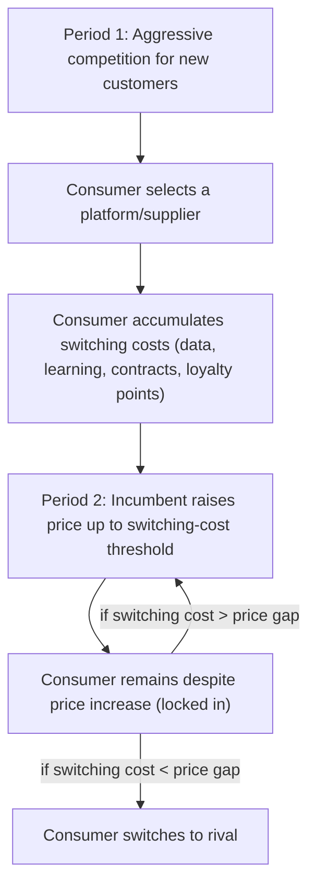

## Switching Costs, Multi-Homing, and Consumer Lock-In

### Definition and Conceptual Foundation

Switching costs are the costs a consumer (or firm) incurs when moving from one supplier, platform, or technology standard to another, beyond any difference in price or quality of the alternative itself. Multi-homing is the practice of a consumer or firm simultaneously affiliating with more than one platform or supplier rather than committing exclusively to one (single-homing). Consumer lock-in is the state in which switching costs are large enough that a consumer continues purchasing from an incumbent supplier even when the incumbent's product is no longer the most efficient or preferred option available, absent those switching costs.

**Key Points**

- These three concepts are tightly linked: high switching costs discourage multi-homing (since maintaining/switching between multiple relationships is itself costly) and are the *mechanism* through which lock-in arises.
- Switching costs are distinct from network externalities, though the two frequently compound each other in platform markets: network effects make an installed base valuable at the *margin of new adoption*, while switching costs make an installed base "sticky" at the *margin of existing customer retention*. A market can exhibit either, both, or neither.
- Klemperer's (1987, 1995) foundational work formalizes switching costs as creating an "artificial" brand loyalty and converts what would otherwise be a homogeneous-goods competitive market into a sequence of localized bilateral monopolies over each consumer's repeat purchases.

---

### Taxonomy of Switching Costs

**Key Points**

- **Transaction/procedural costs**: time and effort of closing one account and opening another (e.g., bank account transfers, changing mobile carriers).
- **Learning costs**: investment in becoming proficient with a specific product's interface or workflow (e.g., software-specific keyboard shortcuts, enterprise ERP system training).
- **Contractual costs**: early termination fees, minimum contract terms, penalty clauses.
- **Compatibility/data-format costs**: cost of converting data, files, or content into a format usable on the new platform (e.g., proprietary file formats, non-portable digital media libraries).
- **Search costs**: cost of identifying and evaluating alternative suppliers.
- **Loyalty/rewards program costs**: forfeited accumulated benefits (frequent flyer miles, loyalty points) upon switching — a deliberately engineered switching cost.
- **Psychological/uncertainty costs**: risk aversion regarding an unfamiliar alternative's quality (Klemperer's "uncertainty about the value of unknown brands" channel).
- **Network-effect-induced costs**: loss of connection to one's existing contact network upon switching platforms (technically a network externality, but it manifests to the individual consumer as a switching cost — this is the conceptual bridge between the two literatures).

---

### Formal Model: Klemperer's Two-Period Switching Cost Framework

Consider two firms competing over two periods. In period 1, firms compete for initial market share as if switching costs did not yet exist (since no consumer has yet incurred them). In period 2, each firm's period-1 customers face a switching cost $s$ to move to the rival, so incumbents can raise price up to the point where the price increase equals the switching cost without losing the locked-in customer:

$$p_2^{incumbent} \leq p_2^{rival} + s$$

This generates the well-known **Klemperer paradox**: switching costs can *intensify* period-1 (pre-lock-in) price competition, because firms compete aggressively for market share knowing that period-2 profits from a locked-in customer base will be higher — sometimes even leading firms to price *below* cost in period 1 ("bargains then rip-offs" or "harvesting" strategies) to build a captive base for period 2 extraction.

$$\pi_{total} = \underbrace{(p_1 - c)q_1}_{\text{often low/negative}} + \underbrace{(p_2 - c)q_1}_{\text{high, exploiting lock-in of period-1 customers}}$$

[Inference: whether period-1 competition is actually intensified versus dampened depends on specific model assumptions (symmetric vs. asymmetric firms, discount rates, consumer foresight about future price increases); the "bargains then rip-offs" result is the canonical qualitative finding in Klemperer's framework but is sensitive to how rational and forward-looking consumers are assumed to be regarding anticipated period-2 price increases.]

---

### Diagram: Switching Cost Lock-In Cycle

---

### Multi-Homing: Definition, Determinants, and Effects

**Key Points**

- **Multi-homing** occurs when the cost of affiliating with an additional platform is low relative to the incremental benefit of doing so — the opposite condition of what sustains lock-in.
- **Determinants of multi-homing propensity**:
  - Low or zero marginal cost of joining an additional platform (e.g., installing a second food-delivery app is nearly costless relative to installing physical POS hardware from a second card network).
  - Absence of exclusivity contracts or DRM-style lock-in mechanisms.
  - Low opportunity cost of switching attention/effort between platforms.
  - Heterogeneous content/offering across platforms that makes each platform individually incomplete (driving users to combine several).
- **Asymmetric multi-homing** is the empirically common case in platform markets: one side multi-homes readily (e.g., merchants accepting multiple payment card networks, advertisers buying inventory across multiple ad platforms) while the other side single-homes (e.g., consumers typically carrying only one or two primary payment cards, users typically defaulting to one primary social network for a given use case). This asymmetry is the structural foundation of the **competitive bottleneck model** (Armstrong, 2006): the multi-homing side has more platform choice and therefore less individual bargaining power vis-à-vis any single platform, while the single-homing side becomes a scarce, exclusively-accessed resource that platforms compete intensely to acquire.

**Example**

Ride-hailing drivers frequently multi-home across Uber, Lyft, and local competitors simultaneously (low switching/joining cost, app-based), while riders in many markets tend toward a primary app due to habit, loyalty rewards, and payment-method integration — asymmetric multi-homing that shapes each platform's pricing strategy (subsidizing rider acquisition/retention more heavily than driver-side incentives, consistent with competitive bottleneck logic). [Unverified: the specific degree of multi-homing on either side varies by geographic market, time period, and competitive intensity; this is illustrative of a general documented pattern rather than a fixed universal statistic.]

---

### SVG Illustration: Single-Homing vs. Multi-Homing Structure

<svg xmlns="http://www.w3.org/2000/svg" viewBox="0 0 620 340" font-family="Helvetica, Arial, sans-serif">
<text x="310" y="24" text-anchor="middle" font-size="16" font-weight="bold" fill="#1a1a1a">Single-Homing vs. Multi-Homing (svg_diagram)</text>
<rect x="40" y="60" width="230" height="90" rx="8" fill="#eaf2fb" stroke="#2166ac" stroke-width="2" />
<text x="155" y="90" text-anchor="middle" font-size="13" font-weight="bold" fill="#1a1a1a">Single-homing consumers</text>
<text x="155" y="112" text-anchor="middle" font-size="12" fill="#1a1a1a">Join only Platform A</text>
<text x="155" y="132" text-anchor="middle" font-size="11" fill="#4d4d4d">High switching cost / habit</text>
<rect x="350" y="60" width="230" height="90" rx="8" fill="#eaf2fb" stroke="#2166ac" stroke-width="2" />
<rect x="360" y="70" width="80" height="30" rx="4" fill="#cfe2f3" />
<rect x="450" y="70" width="80" height="30" rx="4" fill="#cfe2f3" />
<rect x="360" y="110" width="80" height="30" rx="4" fill="#cfe2f3" />
<text x="465" y="150" text-anchor="middle" font-size="13" font-weight="bold" fill="#1a1a1a">Multi-homing sellers</text>
<line x1="155" y1="150" x2="155" y2="200" stroke="#333" stroke-width="2" />
<line x1="465" y1="150" x2="465" y2="200" stroke="#333" stroke-width="2" />
<rect x="80" y="210" width="150" height="70" rx="8" fill="#fbeaea" stroke="#b2182b" stroke-width="2" />
<text x="155" y="235" text-anchor="middle" font-size="12" font-weight="bold" fill="#1a1a1a">Platform A</text>
<text x="155" y="255" text-anchor="middle" font-size="11" fill="#4d4d4d">Bottleneck: exclusive</text>
<text x="155" y="270" text-anchor="middle" font-size="11" fill="#4d4d4d">access to these users</text>
<line x1="230" y1="245" x2="390" y2="245" stroke="#333" stroke-width="1.5" stroke-dasharray="4,3" />
<rect x="390" y="210" width="150" height="70" rx="8" fill="#fbeaea" stroke="#b2182b" stroke-width="2" />
<text x="465" y="235" text-anchor="middle" font-size="12" font-weight="bold" fill="#1a1a1a">Platform B</text>
<text x="465" y="255" text-anchor="middle" font-size="11" fill="#4d4d4d">Sellers reachable via</text>
<text x="465" y="270" text-anchor="middle" font-size="11" fill="#4d4d4d">either platform</text>
</svg>

---

### Measuring Switching Costs and Lock-In

**Key Points**

- **Structural/econometric estimation**: switching costs can be estimated from panel data on consumer choices over time using discrete choice models (e.g., dynamic logit models) where the coefficient on "previous period's chosen brand" captures the switching cost's effect on current utility, net of price and product characteristics.
- **Price dispersion and price rigidity**: markets with high switching costs often exhibit price rigidity for existing customers alongside aggressive promotional pricing for new customers — the empirical signature predicted by Klemperer's framework (e.g., "loyalty penalty" patterns documented by consumer regulators in insurance and telecom markets in various jurisdictions).
- **Churn rate analysis**: lower observed churn, controlling for relative price/quality, is consistent with (though not definitive proof of) higher switching costs.
- Behavior may vary substantially by market: regulatory interventions (mandated number portability in telecoms, open banking data-portability mandates, standardized file export requirements) are specifically designed to *reduce* switching costs and have documented effects on churn and pricing in the markets where they have been studied, though the magnitude of effect is market- and regulation-specific. [Unverified: cross-market generalizations about the magnitude of switching-cost reduction from any specific portability mandate should not be treated as universally transferable; effects documented in one regulatory context (e.g., EU mobile number portability) do not automatically generalize to other sectors or jurisdictions.]

---

### Strategic Use of Switching Costs by Firms

**Key Points**

- **Deliberate lock-in engineering**: proprietary data formats, non-interoperable ecosystems, exclusive loyalty programs, and long-term contracts are strategic tools to raise rivals' cost of winning back a firm's existing customers.
- **Razor-and-blades / platform ecosystem lock-in**: initial hardware or platform purchase creates sunk investment (compatible accessories, purchased content libraries, app ecosystems) that raises the effective cost of switching to a rival platform even absent an explicit contract.
- **Interoperability as a competitive weapon**: entrants sometimes actively promote data portability and interoperability standards to *lower* switching costs and erode an incumbent's locked-in base — the reverse strategic logic, prominent in "open" vs. "closed" ecosystem competition debates.
- **Regulatory countermeasures**: portability mandates (right to data portability under GDPR Article 20, mobile number portability regulations, open banking APIs) are policy responses aimed at correcting the welfare losses associated with excessive lock-in, particularly where switching costs are viewed as artificially/strategically inflated rather than reflecting genuine economic costs.

---

### Welfare Implications

**Key Points**

- Switching costs are not unambiguously harmful: some (e.g., genuine learning investments, integration costs) reflect real resource costs and their presence does not, by itself, indicate market failure.
- Welfare concerns arise specifically when switching costs are **strategically inflated beyond their true resource cost** (e.g., deliberately non-portable data formats with no technical necessity) purely to extract rents from locked-in consumers — this is the standard economic rationale for portability-mandating regulation.
- The Klemperer paradox complicates simple welfare analysis: aggressive up-front competition for market share (encouraged by anticipated switching-cost-based extraction) can transfer significant surplus to consumers in period 1, partially or fully offsetting period-2 extraction, so the *net* welfare effect of switching costs is theoretically ambiguous and depends on relative magnitudes and consumer foresight. [Inference: the direction of net welfare effect is a standard theoretical ambiguity result in this literature, not a settled empirical finding; specific markets require empirical study to determine which effect dominates.]

---

### Related Topics

- Direct and indirect network externalities (compounding mechanism alongside switching costs)
- Two-sided market theory and cross-group pricing
- Competitive bottleneck model (Armstrong, 2006) and asymmetric multi-homing
- Klemperer's switching cost models and "bargains then rip-offs" pricing dynamics
- Data portability regulation (GDPR Article 20, open banking) and interoperability mandates
- Loyalty programs and strategic switching-cost engineering
- Critical mass and adoption dynamics (interaction between switching costs and early-stage platform competition)
- Standards wars, compatibility, and lock-in at the technology-standard level