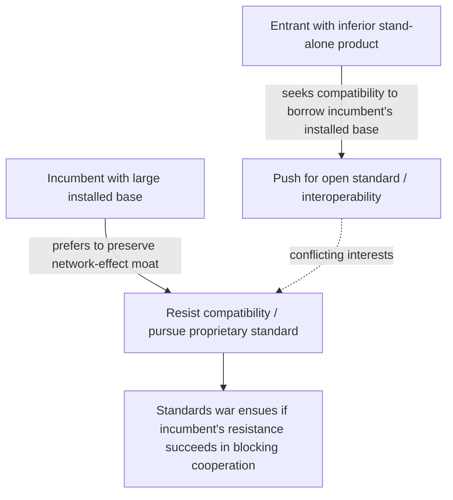

## Standards Wars and Compatibility Decisions

### Definition and Conceptual Foundation

A standards war is a competitive battle between firms sponsoring incompatible technology standards, formats, or platforms, where the outcome is typically decided not purely by product quality but by which standard first achieves a decisive lead in installed base — driven by the same positive-feedback logic that governs network externalities. Compatibility decisions are the strategic choices firms make about whether to make their product interoperable with rivals' products/standards, or to pursue proprietary incompatibility, and these decisions fundamentally shape whether a standards war occurs at all, how it is fought, and how it resolves. This topic (systematized primarily by Katz and Shapiro, 1985, 1986, 1994; Farrell and Saloner, 1985, 1986) sits at the intersection of network externality theory and industrial organization strategy.

**Key Points**

- Standards wars are a *strategic* and *dynamic* manifestation of the static multiple-equilibria and tipping properties of network markets (see critical mass and adoption dynamics).
- Canonical historical cases: VHS vs. Betamax (videotape formats), Blu-ray vs. HD DVD (optical disc formats), Windows vs. Mac OS (though this evolved into durable co-existence rather than a decisive tip), USB vs. FireWire, and 5G/Wi-Fi standard-setting processes as ongoing examples of cooperative (rather than warring) standardization.
- Compatibility can be pursued **unilaterally** (adapters, backward compatibility, licensing one's technology to rivals) or **collectively** (via formal standard-setting organizations, SSOs), and the choice between competing-for-dominance versus cooperating-on-a-common-standard is itself a first-order strategic decision before any war begins.

---

### Taxonomy of Compatibility Strategies

**Key Points**

- **Full compatibility (open standard)**: firms agree on a common technical standard, often through an SSO (e.g., IEEE 802.11 Wi-Fi standards, USB-IF). Competition then occurs on price, quality, and brand rather than on installed base per se.
- **One-way compatibility**: a new entrant's product is compatible with an incumbent's complements (e.g., a generic printer cartridge compatible with a branded printer) but not vice versa — a common entry strategy to free-ride on an incumbent's installed base and complementary goods ecosystem.
- **No compatibility (proprietary standard war)**: firms deliberately design incompatible systems, betting that their own standard will tip the market and be able to extract monopoly rents once it wins (the classic "standards war" scenario).
- **Compatibility via adapters/converters**: third parties (or the firms themselves) offer conversion technology, partially blunting the winner-take-all dynamic without full standardization.

---

### Formal Framework: The Firm's Compatibility Choice

Following Katz and Shapiro (1985), consider two firms, an incumbent (with existing installed base $n_1^0$) and an entrant (with $n_2^0 = 0$). Under network externalities, a consumer's utility from adopting technology $i$ is:

$$u_i = v_i + f(n_i)$$

where $f(\cdot)$ is the network benefit and $n_i$ is the expected size of the compatible network (own product if incompatible, or the *combined* installed base of all compatible producers if compatible).

**The entrant's compatibility incentive**: An entrant with an inferior stand-alone product ($v_2 < v_1$) has a strong incentive to seek compatibility with the incumbent, since compatibility allows it to "borrow" the incumbent's installed base ($n_2^{compatible} = n_1^0 + n_2^0$ rather than just $n_2^0$), largely neutralizing the incumbent's network-effect advantage and shifting competition back toward product quality/price.

**The incumbent's compatibility incentive**: An incumbent with a strong installed-base advantage generally *prefers incompatibility*, since compatibility would dilute its network-effect moat and expose it to quality-based competition on equal footing. This creates a natural asymmetry of interests: the entrant typically pushes for open standards/compatibility, while the incumbent resists — a documented recurring pattern in standards disputes (visible, for example, in disputes over social media data portability and interoperability mandates today).

[Inference: this is the standard qualitative prediction of the Katz-Shapiro asymmetric-incentives model under the assumption that the incumbent's stand-alone product is not dramatically inferior; if an incumbent's underlying technology is sufficiently weak, it could instead prefer compatibility to avoid being displaced outright — the general rule of "incumbents resist, entrants seek compatibility" holds in the most commonly cited parameterizations but is not a universal law independent of relative product quality.]

---

### Diagram: Strategic Compatibility Incentives

---

### Strategies for Winning a Standards War (Shapiro and Varian, 1998 Framework)

**Key Points**

- **Pre-emption**: rushing to market first to accumulate installed base before rivals can establish a foothold, even at the cost of a less mature/polished initial product.
- **Penetration pricing and subsidies**: pricing below cost to rapidly build installed base and expected-network-size perceptions (directly leveraging the critical mass dynamics discussed elsewhere in this chapter).
- **Expectations management**: publicizing pre-orders, partnership announcements, and committed complementors to shift consumer and developer beliefs about which standard will win — since adoption decisions depend on *expected* future network size, credible signals of future dominance can become self-fulfilling.
- **Alliance formation**: recruiting complementors (software developers, accessory makers, content producers) and even rival hardware makers into a coalition supporting one's standard, increasing the perceived breadth and durability of the ecosystem (e.g., DVD Forum, Blu-ray Disc Association).
- **Cutting deals with key complementors and distribution channels**: securing exclusive or preferential agreements with pivotal content providers or retailers, as seen in the Blu-ray/HD DVD war where major studio and retailer exclusivity commitments were widely viewed as decisive to the outcome.
- **Openness/licensing strategy**: choosing whether to license one's standard broadly (encouraging wide adoption but sacrificing some rent extraction, as with VHS licensing) versus keeping it proprietary and tightly controlled (higher potential rents if successful, but a narrower complementor ecosystem, as with early Betamax licensing restrictions). [Unverified: the precise causal weight of licensing openness relative to other factors, such as recording-time differences and adult-content-industry distribution choices, in determining the VHS-Betamax outcome remains debated among historians of the episode; multiple contributing factors are generally cited rather than a single decisive cause.]

---

### Excess Inertia vs. Excess Momentum in Standards Adoption

**Key Points**

- **Excess inertia** (Farrell and Saloner, 1985): even when a new, objectively superior standard becomes available, existing users may fail to coordinate a switch because each individual's incentive to switch depends on expecting *others* to switch simultaneously — a coordination failure that can lock in an inferior installed standard.
- **Excess momentum**: the opposite failure — a new standard can tip too quickly, stranding users of the old (possibly still-adequate) standard, if bandwagon effects and pre-emptive strategic adoption by early movers overshoot what full information would justify.
- Which failure mode dominates depends on the specific structure of switching costs, information asymmetry, and coordination mechanisms available (e.g., sequential vs. simultaneous adoption decisions, presence of a credible standard-setting body).
- The QWERTY keyboard layout is the most commonly cited illustrative (but empirically contested) example of alleged excess inertia; the Liebowitz and Margolis (1990) critique argues the historical evidence for QWERTY's inefficiency relative to alternatives (e.g., Dvorak) is weak, making this a useful case for illustrating the *theoretical mechanism* while requiring caution about treating it as a proven historical instance. [Unverified: as previously noted, the QWERTY-inefficiency narrative is disputed in the empirical/historical literature and should be presented as an illustrative but contested example, not a settled fact.]

---

### SVG Illustration: Standards War Outcome Tree

<svg xmlns="http://www.w3.org/2000/svg" viewBox="0 0 640 380" font-family="Helvetica, Arial, sans-serif">
<text x="320" y="24" text-anchor="middle" font-size="16" font-weight="bold" fill="#1a1a1a">Standards War Decision Tree (svg_diagram)</text>
<rect x="250" y="45" width="140" height="50" rx="6" fill="#eaf2fb" stroke="#2166ac" stroke-width="2" />
<text x="320" y="75" text-anchor="middle" font-size="12" fill="#1a1a1a">Rival standards emerge</text>
<line x1="290" y1="95" x2="150" y2="150" stroke="#333" stroke-width="1.5" />
<line x1="350" y1="95" x2="490" y2="150" stroke="#333" stroke-width="1.5" />
<rect x="70" y="150" width="160" height="50" rx="6" fill="#fbf3e6" stroke="#e08214" stroke-width="2" />
<text x="150" y="180" text-anchor="middle" font-size="12" fill="#1a1a1a">Cooperate: joint SSO standard</text>
<rect x="410" y="150" width="160" height="50" rx="6" fill="#fbeaea" stroke="#b2182b" stroke-width="2" />
<text x="490" y="180" text-anchor="middle" font-size="12" fill="#1a1a1a">Compete: incompatible standards</text>
<line x1="150" y1="200" x2="150" y2="240" stroke="#333" stroke-width="1.5" />
<rect x="60" y="240" width="180" height="50" rx="6" fill="#e6f4ea" stroke="#2d8a3e" stroke-width="2" />
<text x="150" y="270" text-anchor="middle" font-size="12" fill="#1a1a1a">Market grows via shared network</text>
<line x1="490" y1="200" x2="420" y2="240" stroke="#333" stroke-width="1.5" />
<line x1="490" y1="200" x2="560" y2="240" stroke="#333" stroke-width="1.5" />
<rect x="330" y="240" width="180" height="50" rx="6" fill="#e6f4ea" stroke="#2d8a3e" stroke-width="2" />
<text x="420" y="270" text-anchor="middle" font-size="12" fill="#1a1a1a">One standard tips (winner-take-all)</text>
<rect x="480" y="300" width="140" height="50" rx="6" fill="#fbeaea" stroke="#b2182b" stroke-width="2" />
<text x="550" y="330" text-anchor="middle" font-size="11" fill="#1a1a1a">Prolonged war /</text>
<text x="550" y="343" text-anchor="middle" font-size="11" fill="#1a1a1a">stranded adopters</text>
<line x1="560" y1="240" x2="550" y2="300" stroke="#333" stroke-width="1.5" />
</svg>

---

### Welfare Analysis of Standards Wars

**Key Points**

- Standards wars can generate significant **social waste**: duplicated R&D effort across competing standards, consumer uncertainty leading to delayed adoption ("penguin effect" — waiting to see which standard wins), and stranding of complementary investments (e.g., HD DVD players and discs rendered obsolete) once a winner emerges.
- Conversely, a standards war can also generate **static and dynamic efficiency benefits**: competitive pressure between rival standard sponsors to improve quality and reduce prices during the contest period, which cooperative standard-setting (potentially controlled by an incumbent-dominated SSO) might mute.
- The **welfare-optimal outcome is theoretically ambiguous** and depends on the relative magnitudes of (a) wasted duplicate investment and adoption-uncertainty costs versus (b) competitive-pressure benefits and the value of preserving competition/innovation incentives that a premature single-standard mandate might foreclose. [Inference: this ambiguity is the standard theoretical conclusion in the literature; specific welfare rankings require case-by-case empirical assessment of the relevant cost and benefit magnitudes in a given standards contest.]
- Policy responses vary: some jurisdictions favor mandated interoperability or government-endorsed standards to avoid the coordination failures of a war (particularly in safety-critical or infrastructure-adjacent domains, e.g., telecommunications and mobile network standards), while others rely on market-based standards wars, viewing government selection as risking "picking losers" or entrenching an inferior standard through political rather than market mechanisms.

---

### Related Topics

- Direct and indirect network externalities (foundational mechanism generating standards war dynamics)
- Critical mass and adoption dynamics (tipping and installed-base thresholds)
- Switching costs, multi-homing, and consumer lock-in (post-war lock-in effects)
- Two-sided market theory and cross-group pricing (complementor-side incentives in platform standards wars)
- Farrell-Saloner model of excess inertia and excess momentum
- Standard-setting organizations (SSOs) and FRAND (fair, reasonable, and non-discriminatory) licensing commitments
- Intellectual property strategy in platform ecosystems (patent pools, cross-licensing)
- Case studies: VHS vs. Betamax, Blu-ray vs. HD DVD, 5G and Wi-Fi standardization processes