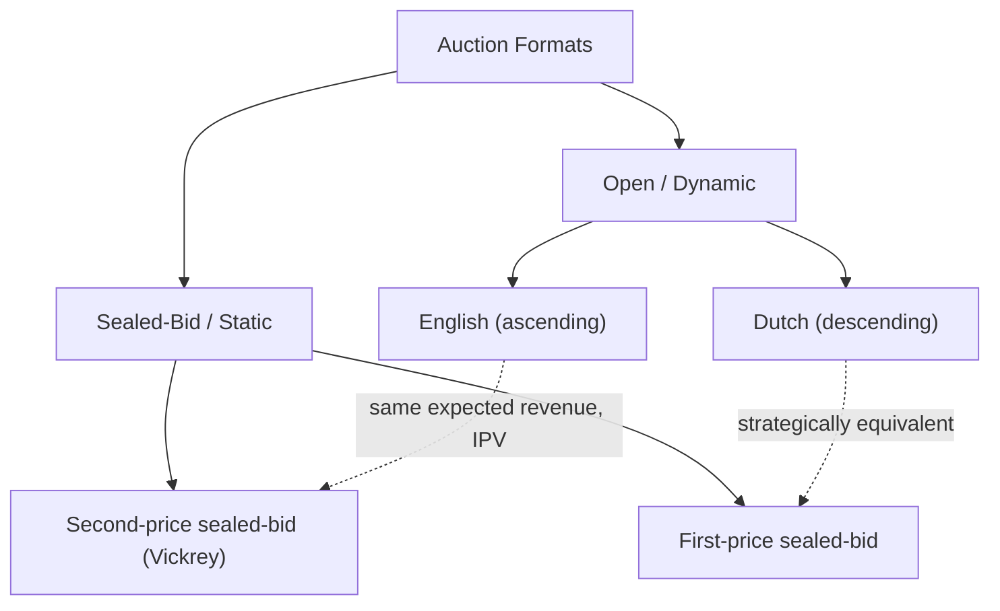

## Auction Formats: English, Dutch, First-Price, and Second-Price

### Definition and Conceptual Foundation

An auction is a market mechanism for allocating a good or service through competitive bidding, where the allocation rule (who wins) and the payment rule (what the winner pays) are specified in advance. The four canonical formats — English, Dutch, first-price sealed-bid, and second-price sealed-bid (Vickrey) — differ along two key structural dimensions: **open (dynamic) vs. sealed-bid (static)** bidding, and the **payment rule** (winner pays own bid vs. winner pays the runner-up's implied value). These four formats form the core taxonomy from which the broader auction theory and mechanism design literature (Vickrey, 1961; Milgrom and Weber, 1982; Krishna, 2009) is built.

**Key Points**

- All four formats are typically analyzed under the **independent private values (IPV)** paradigm as a baseline: each bidder $i$ has a privately known valuation $v_i$, drawn independently from a commonly known distribution $F(v)$.
- The **Revenue Equivalence Theorem** (Vickrey, 1961; Myerson, 1981; Riley and Samuelson, 1981) is the central unifying result: under IPV with risk-neutral bidders and standard regularity conditions, all four formats yield the **same expected revenue to the seller** and the **same expected payment by a bidder with a given valuation** — despite their very different rules. This makes format choice, on the surface, revenue-irrelevant in the canonical benchmark, which is precisely why deviations from the theorem's assumptions (risk aversion, correlated values, asymmetric bidders, budget constraints) are central to applied auction design.

---

### English Auction (Open Ascending-Bid)

**Key Points**

- Auctioneer (or an ascending clock) raises the price continuously (or in discrete increments) starting from a reserve price; bidders drop out as the price exceeds their valuation; the auction ends when only one bidder remains, who wins and pays the price at which the second-to-last bidder dropped out.
- Under IPV, the **weakly dominant strategy** for each bidder is to remain active until the price reaches exactly their own valuation $v_i$, then drop out.
- Winning price equals (approximately, in the continuous-clock idealization) the **second-highest valuation** among all bidders, $v_{(2)}$.
- **Advantages**: information revealed during bidding (competitors dropping out) can help bidders refine estimates of a common/correlated value component, which is valuable in settings with affiliated or common-value elements (Milgrom-Weber linkage principle: more information revelation during the auction process tends to raise expected seller revenue when values are affiliated).
- **Practical variants**: Japanese (clock) auctions where all bidders remain active until they explicitly exit and cannot re-enter; traditional "outcry" English auctions permitting jump bids and re-entry, which can complicate the simple dominant-strategy characterization above.

---

### Dutch Auction (Open Descending-Bid)

**Key Points**

- Auctioneer starts at a high price and lowers it continuously (or via a descending clock) until a bidder calls out ("stops the clock"), winning and paying that price.
- Bidders receive **no information** about rivals' valuations during the process (unlike the English auction) — a bidder must decide, at each price level, whether to accept now or risk a rival accepting first.
- Strategically **equivalent to the first-price sealed-bid auction**: each bidder must commit, in effect, to a single bid amount (the price at which they would stop the clock) without seeing any rivals' actions, since the descending clock provides no new information before a bid is placed. This strategic equivalence is a standard, well-established result, not a matter of empirical uncertainty. [Inference: the equivalence is exact for standard IPV risk-neutral bidder models with no jump-bidding frictions; in some real-world Dutch auction implementations with discrete clock decrements or bidder-specific reaction-time constraints, minor deviations from perfect strategic equivalence can arise, though these are considered second-order relative to the core theoretical result.]
- **Historical/practical usage**: Dutch flower auctions (Aalsmeer), some fish markets, and historically used for Dutch treasury bill issuance; valued for speed in high-volume perishable-goods markets since the auction ends as soon as any bidder accepts.

---

### First-Price Sealed-Bid Auction

**Key Points**

- Each bidder submits a single sealed bid simultaneously; the highest bidder wins and pays their own bid amount.
- Unlike the English and second-price formats, bidding one's true valuation is **not** a dominant strategy — bidders must **bid shade** below their true value to leave positive expected surplus in case of winning, since paying exactly $v_i$ upon winning yields zero surplus.
- **Symmetric IPV equilibrium bid function** (for $n$ risk-neutral bidders with valuations drawn i.i.d. from $F$ on $[0, \bar v]$):

$$b(v) = v - \frac{\int_0^v F(x)^{n-1}\,dx}{F(v)^{n-1}}$$

For the widely used special case of $n$ bidders with valuations uniformly distributed on $[0,1]$, this simplifies to the well-known closed form:

$$b(v) = \frac{n-1}{n}v$$

- **Key comparative statics**: bid shading decreases (bids approach true value) as the number of bidders $n$ increases, since competitive pressure from more rivals reduces the benefit of shading — as $n \to \infty$, $b(v) \to v$.
- **Risk aversion**: if bidders are risk-averse rather than risk-neutral, first-price auctions generate **higher expected revenue** than under risk neutrality, because risk-averse bidders shade less (a more aggressive bid reduces the variance of the "lose entirely" outcome) — this is a canonical, well-documented departure from strict revenue equivalence.

---

### Second-Price Sealed-Bid (Vickrey) Auction

**Key Points**

- Each bidder submits a single sealed bid simultaneously; the highest bidder wins but pays the **second-highest bid**, not their own.
- **Truthful bidding ($b_i = v_i$) is a weakly dominant strategy** — this is the celebrated Vickrey (1961) result. Intuition: since payment is determined by the *other* bidders' bids and is independent of one's own bid conditional on winning, a bidder can never benefit from bidding above or below their true value; bidding above $v_i$ only risks winning at a price exceeding true value (negative surplus), and bidding below $v_i$ only risks losing a profitable opportunity to win at a price below $v_i$.
- **Proof sketch (dominance)**: for any bidder $i$ with value $v_i$ facing the highest rival bid $b_{max,-i}$:
  - If $v_i > b_{max,-i}$: winning at price $b_{max,-i}$ (achieved by bidding $\geq b_{max,-i}$, e.g., truthfully) yields surplus $v_i - b_{max,-i} > 0$; any deviation that causes the bidder to lose instead forfeits this positive surplus.
  - If $v_i < b_{max,-i}$: losing (achieved by truthful bidding) avoids negative surplus; bidding above $b_{max,-i}$ to win would force payment of $b_{max,-i} > v_i$, a loss.
  - Therefore truthful bidding is optimal regardless of rivals' strategies — it is a dominant strategy, not merely a best response to a specific equilibrium conjecture.
- Yields **the same expected revenue and expected winning price distribution as the English auction** under IPV (both, in idealized form, result in the winner paying the second-highest valuation), which is why English and Vickrey auctions are often grouped together as "second-price rule" formats despite one being open and the other sealed.
- **Practical adoption**: rarely used literally in consumer contexts (perceived complexity, trust concerns about auctioneer honesty in revealing the true second-highest bid) but foundational conceptually — **generalized second-price (GSP) and Vickrey-Clarke-Groves (VCG) mechanisms** used in online sponsored-search advertising auctions (e.g., historically Google AdWords/Google Ads) are direct extensions of Vickrey's truthful-mechanism logic to multi-item/multi-slot settings.

---

### Diagram: Format Classification

---

### Comparative Table

| Format | Bidding process | Winner pays | Dominant strategy? | Strategically equivalent to |
| --- | --- | --- | --- | --- |
| English | Open, ascending | Price at 2nd-to-last drop-out (≈ 2nd-highest value) | Drop out at own value (weakly dominant) | Second-price (revenue-equivalent under IPV) |
| Dutch | Open, descending | Price at which first bidder accepts | No dominant strategy; requires equilibrium bid-shading | First-price sealed-bid |
| First-price sealed-bid | Sealed, simultaneous | Own (highest) bid | No dominant strategy; requires bid-shading equilibrium | Dutch |
| Second-price sealed-bid | Sealed, simultaneous | Second-highest bid | Bid truthfully (weakly dominant) | English (revenue-equivalent under IPV) |

---

### SVG Illustration: Bid Shading Comparison

<svg xmlns="http://www.w3.org/2000/svg" viewBox="0 0 620 360" font-family="Helvetica, Arial, sans-serif">
<text x="310" y="24" text-anchor="middle" font-size="16" font-weight="bold" fill="#1a1a1a">Equilibrium Bid vs. True Value (svg_diagram)</text>
<line x1="70" y1="320" x2="560" y2="320" stroke="#333" stroke-width="2" />
<line x1="70" y1="320" x2="70" y2="50" stroke="#333" stroke-width="2" />
<text x="560" y="342" font-size="13" fill="#333">True value v</text>
<text x="30" y="55" font-size="13" fill="#333">Bid b(v)</text>

<line x1="70" y1="320" x2="510" y2="80" stroke="#2d8a3e" stroke-width="2.5" />
<text x="490" y="70" font-size="12" fill="#2d8a3e">Truthful: b(v) = v</text>
<text x="490" y="86" font-size="11" fill="#2d8a3e">(2nd-price / English)</text>

<line x1="70" y1="320" x2="510" y2="160" stroke="#b2182b" stroke-width="2.5" />
<text x="490" y="150" font-size="12" fill="#b2182b">Shaded: b(v) = (n-1)/n · v</text>
<text x="490" y="166" font-size="11" fill="#b2182b">(1st-price / Dutch)</text>

<text x="90" y="335" font-size="11" fill="`#4d4d4d`">0</text>

</svg>

---

### Worked Numerical Example

Three risk-neutral bidders have private values drawn i.i.d. Uniform$[0,100]$, realized as $v_1 = 80$, $v_2 = 60$, $v_3 = 30$.

**Second-price sealed-bid / English auction**: each bidder bids/drops out at own value. Bidder 1 wins, pays $v_2 = 60$ (the second-highest value). Seller revenue: $60$.

**First-price sealed-bid / Dutch auction**: using $b(v) = \frac{n-1}{n}v = \frac{2}{3}v$ for $n=3$:

$$b_1 = \tfrac{2}{3}(80) = 53.3, \quad b_2 = \tfrac{2}{3}(60) = 40, \quad b_3 = \tfrac{2}{3}(30) = 20$$

Bidder 1 wins, pays own bid of $53.3$.

Both formats allocate the item to bidder 1 (the highest-value bidder — both are **efficient** mechanisms under IPV), and in this specific realization the first-price/Dutch payment ($53.3$) happens to fall below the second-price/English payment ($60$); this reflects sampling variation in a single draw, not a general revenue ranking — the **Revenue Equivalence Theorem** guarantees only that *expected* revenue across the full distribution of $(v_1, v_2, v_3)$ realizations is identical across formats, not that realized revenue matches in any specific instance. [Inference: this specific numerical comparison is a single illustrative draw; the equality of expected revenue is the theorem's guarantee, and any individual realization can favor either format's payment level.]

---

### Departures from Revenue Equivalence

**Key Points**

- **Risk aversion**: first-price/Dutch formats yield strictly higher expected revenue than second-price/English when bidders are risk-averse (risk-averse bidders shade less to reduce the probability of losing).
- **Affiliated/correlated values (common value elements)**: the **linkage principle** (Milgrom and Weber, 1982) implies that formats revealing more information during bidding (English) tend to generate higher expected revenue than formats revealing less (sealed-bid formats), because information revelation reduces the winner's curse discount bidders build into their bids.
- **Risk of collusion**: open ascending (English) auctions are generally considered more vulnerable to tacit bidder collusion (signaling and retaliation are easier when bids are observed in real time) than sealed-bid formats, a practical design consideration alongside the pure revenue-theoretic comparison.
- **Asymmetric bidders**: when bidders' value distributions differ (e.g., a strong incumbent bidder vs. weaker entrants), revenue equivalence generally breaks down, and the ranking of formats by expected revenue becomes ambiguous and situation-specific. [Unverified: the direction of revenue ranking under bidder asymmetry depends on the specific structure of the asymmetry and is a subject of ongoing applied auction-theoretic research rather than a single settled general rule.]

---

### Related Topics

- Revenue Equivalence Theorem: formal statement, proof sketch, and boundary conditions
- Winner's curse in common-value auctions
- Optimal reserve price setting (Myerson, 1981)
- Multi-unit and combinatorial auctions; VCG mechanism generalization
- Spectrum auctions and simultaneous ascending auction design (FCC auctions)
- Sponsored search / generalized second-price (GSP) auctions in digital advertising
- Bidder collusion and ring formation in auctions
- Affiliated values and the linkage principle (Milgrom-Weber, 1982)