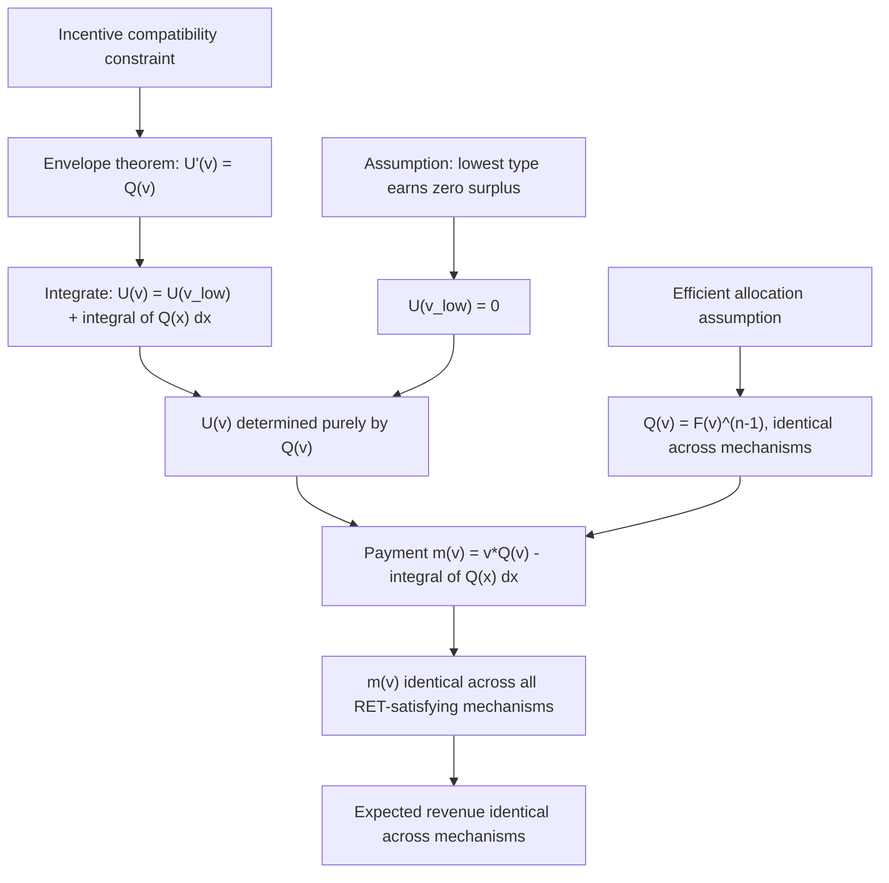

## The Revenue Equivalence Theorem

### Definition and Conceptual Foundation

The Revenue Equivalence Theorem (RET) is the central result of classical auction theory, establishing that under a specific set of assumptions, **any auction mechanism satisfying those assumptions yields the same expected revenue to the seller and the same expected payment for a bidder of any given valuation**, regardless of the specific allocation and payment rules employed. First derived by Vickrey (1961) for the four canonical formats, and generalized by Myerson (1981) and Riley and Samuelson (1981) into a mechanism-design statement covering essentially *any* auction mechanism satisfying the theorem's conditions, RET is the benchmark against which all departures in applied auction design are measured and explained.

**Key Points**

- RET's power lies less in the specific equivalence result itself and more in providing a **decomposition of expected payment** that isolates exactly which structural features of a mechanism *can* affect revenue — everything else being, by the theorem, irrelevant.
- The theorem underlies Myerson's (1981) subsequent characterization of the **revenue-maximizing (optimal) auction**, since any auction satisfying RET's conditions can be evaluated purely through its allocation rule, reducing the seller's design problem to choosing the right allocation rule (which, as Myerson shows, involves setting an optimal reserve price).

---

### Formal Statement

**Assumptions (the "RET package")**:

1. **Independent private values (IPV)**: each bidder $i$'s valuation $v_i$ is drawn independently from a commonly known, strictly increasing, continuous distribution $F(\cdot)$ on $[\underline v, \bar v]$ (bidders may have distinct but commonly known distributions in the general statement, though the symmetric case with identical $F$ is the standard textbook version).
2. **Risk-neutral bidders**.
3. **Symmetric equilibrium**: the mechanism's equilibrium is such that all bidders follow the same increasing, differentiable bid/strategy function.
4. **Efficient allocation**: the bidder with the highest valuation always wins (allocation rule assigns the object with probability 1 to the highest-value bidder in equilibrium).
5. **Any bidder with the lowest possible valuation $\underline v$ obtains zero expected surplus** (a normalization/participation condition, sometimes stated as "the object goes to a bidder with value $\underline{v}$ with probability zero" or equivalently that the lowest type earns zero rent).

**Theorem**: Under assumptions 1–5, any two auction mechanisms yield (a) the same expected payment from a bidder of any given valuation $v$, and (b) the same expected total revenue to the seller.

---

### Proof Sketch: The Envelope Theorem / Payoff Equivalence Approach

Let $Q(v)$ denote the probability that a bidder with value $v$ wins the object in a given mechanism (the **interim allocation probability**), and let $m(v)$ denote that bidder's expected payment. Define expected equilibrium utility (surplus) as:

$$U(v) = v \cdot Q(v) - m(v)$$

The key mechanism-design step is showing that **incentive compatibility** (a bidder with true value $v$ has no incentive to mimic a bidder with value $\hat v$) implies, via the **envelope theorem**, that:

$$U'(v) = Q(v)$$

Integrating from the lowest type $\underline v$:

$$U(v) = U(\underline v) + \int_{\underline v}^{v} Q(x)\, dx$$

Given assumption 5, $U(\underline v) = 0$, so:

$$U(v) = \int_{\underline v}^{v} Q(x)\, dx$$

Substituting back into the definition of $U(v)$ and solving for expected payment:

$$m(v) = v\cdot Q(v) - \int_{\underline v}^{v} Q(x)\, dx$$

**This is the crux of the proof**: expected payment $m(v)$ is fully determined by the **interim allocation probability function $Q(v)$ alone** — it does not depend on any other feature of the mechanism (payment timing, whether bids are sealed or open, how ties are broken, etc.). Since assumption 4 (efficient allocation) pins down $Q(v)$ identically across *any* mechanism satisfying the RET assumptions — $Q(v)$ is simply the probability that a bidder's value $v$ is the highest among $n$ i.i.d. draws, i.e., $Q(v) = F(v)^{n-1}$ — every such mechanism must produce the **same** $m(v)$ function, and therefore the same expected revenue upon integrating over the value distribution.

$$\text{Expected Revenue} = n \int_{\underline v}^{\bar v} m(v)\, f(v)\, dv$$

Since $m(v)$ is identical across mechanisms (given identical $Q(v)$), expected revenue is identical across mechanisms. $\blacksquare$

[Inference: this proof sketch presents the standard mechanism-design derivation found in graduate auction theory texts (e.g., Krishna, 2009); it compresses several technical steps (verifying that $Q(v)$ must be non-decreasing for incentive compatibility, handling boundary/integrability conditions) that a fully rigorous treatment would spell out in more detail, but the logical structure and final result are the standard, well-established textbook derivation.]

---

### Diagram: Logical Structure of the Proof

---

### Verification Across the Four Canonical Formats

**Second-price sealed-bid / English**: expected payment for a bidder with value $v$ (winning probability $Q(v) = F(v)^{n-1}$) equals the expected value of the second-highest of the remaining $n-1$ bids conditional on $v$ being highest — this can be shown to algebraically equal $v \cdot F(v)^{n-1} - \int_0^v F(x)^{n-1}dx$, matching the general RET formula exactly.

**First-price sealed-bid / Dutch**: the equilibrium bid function derived earlier,

$$b(v) = v - \frac{\int_{\underline v}^{v} F(x)^{n-1}\,dx}{F(v)^{n-1}}$$

when multiplied by the winning probability $Q(v) = F(v)^{n-1}$ to get expected payment $m(v) = b(v)\cdot Q(v)$, yields:

$$m(v) = v\cdot F(v)^{n-1} - \int_{\underline v}^{v} F(x)^{n-1}\,dx$$

identical to the general formula and to the second-price result above — confirming revenue equivalence directly by construction rather than merely by the abstract theorem.

---

### Worked Numerical Example

Two bidders, values i.i.d. Uniform$[0,1]$, so $F(v) = v$, $n=2$.

**General RET payment formula**: $Q(v) = F(v)^{n-1} = v$, so:

$$m(v) = v\cdot v - \int_0^v x\,dx = v^2 - \frac{v^2}{2} = \frac{v^2}{2}$$

**Check via second-price**: expected payment equals $v \cdot P(\text{win}) \times E[\text{2nd highest} \mid \text{win}]$. Since the losing bidder's value is uniform on $[0,v]$ conditional on being lower, $E[\text{2nd highest}\mid v_1 = v \text{ wins}] = v/2$, so $m(v) = v \cdot (v/2) = v^2/2$. ✓ Matches.

**Check via first-price**: using $b(v) = \frac{n-1}{n}v = \frac{1}{2}v$, expected payment is $m(v) = b(v)\cdot Q(v) = \frac{1}{2}v \cdot v = \frac{v^2}{2}$. ✓ Matches.

Both formats yield identical expected payment $m(v) = v^2/2$ for every valuation $v$, and therefore identical expected total revenue when integrated over $F$.

---

### Boundary Conditions: When RET Fails

**Key Points**

- **Risk-averse bidders**: violates assumption 2. Risk-averse bidders shade less in first-price/Dutch auctions (to reduce the probability of the "zero surplus" outcome from losing), raising expected revenue relative to second-price/English — a first documented, canonical departure.
- **Correlated/affiliated values**: violates the independence component of assumption 1. Under affiliation, the **linkage principle** (Milgrom and Weber, 1982) implies that auctions revealing more information about rivals' signals during the process (English) generate weakly higher expected revenue than those revealing less (sealed-bid formats), because information revelation mitigates the winner's curse bidders anticipate and price into their bids.
- **Asymmetric bidders** (different $F_i(\cdot)$ across bidders): technically compatible with a generalized statement of RET *if* the allocation remains efficient in equilibrium, but in practice asymmetric-bidder equilibria in first-price auctions often do **not** allocate efficiently (a stronger bidder may shade more aggressively than implied by pure value ranking, or asymmetric equilibria may not even exist in closed form), breaking assumption 4 and thus breaking equivalence. [Inference: the precise conditions under which asymmetric-bidder first-price equilibria preserve efficiency are a subtle, model-specific matter in the literature and are not fully generalizable; specific parametrizations require direct verification.]
- **Budget constraints**: bidders unable to pay their full valuation upon winning violate the implicit assumption that payment can always be extracted up to $v_i$; this is known to break equivalence, generally favoring formats where at-risk payment is lower ex-ante (first-price/Dutch tend to be preferred in some budget-constrained settings, since payment equals own bid rather than a potentially higher rival-determined price).
- **Non-quasilinear utility / non-risk-neutral seller**: the theorem is stated for a risk-neutral seller maximizing expected revenue; a risk-averse seller might prefer a format with lower revenue variance even if expected revenue is identical (e.g., first-price auctions typically have lower revenue variance than second-price/English in symmetric IPV settings, an equivalence-consistent but variance-relevant distinction RET itself is silent on).
- **Collusion**: RET assumes bidders act non-cooperatively; collusive bidding rings can undermine any format's revenue, but open ascending formats are generally considered structurally easier to sustain collusion in (real-time bid observation enables punishment of deviators), an operational consideration outside RET's pure theoretical scope.

---

### Relationship to Optimal Auction Design (Myerson, 1981)

**Key Points**

- RET implies that, absent an optimal reserve price, **all efficient standard auction formats are revenue-equivalent** — but none of them may be **revenue-maximizing**, since efficiency (assumption 4) and revenue maximization are generally distinct objectives for an asymmetric-information seller.
- Myerson's key insight, building directly on the RET payment-decomposition, is that a seller can strictly increase expected revenue above the RET benchmark by introducing a **reserve price** $r^* > \underline v$, sacrificing some allocative efficiency (the object may go unsold, or fail to go to the "true" highest-value bidder if their value is below $r^*$) in exchange for extracting more surplus from bidders who do win.
- The optimal reserve price solves $r^* - \frac{1-F(r^*)}{f(r^*)} = v_0$ (the seller's own valuation of retaining the object, often normalized to zero), a formula derived directly from extending the RET-style payment decomposition to allow $Q(v) < F(v)^{n-1}$ for values below the reserve.
- This reserve-price extension is what makes RET a genuine *foundation* for auction design theory rather than merely a curiosity: it isolates $Q(v)$ as the single lever a mechanism designer needs to manipulate, and reserve prices are the simplest way to do so.

---

### Related Topics

- Auction formats: English, Dutch, first-price, and second-price (the four canonical mechanisms RET unifies)
- Myerson's optimal auction and optimal reserve price setting
- Winner's curse and affiliated/common-value auctions
- The linkage principle (Milgrom-Weber, 1982) and information revelation in auctions
- Mechanism design and incentive compatibility (envelope theorem applications)
- Risk aversion in auction bidding behavior
- Asymmetric bidder auctions and efficiency-revenue tradeoffs
- Budget-constrained bidding and its effect on optimal mechanism choice