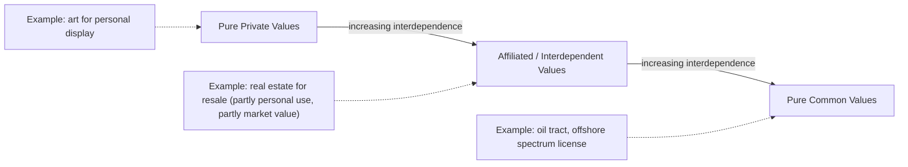
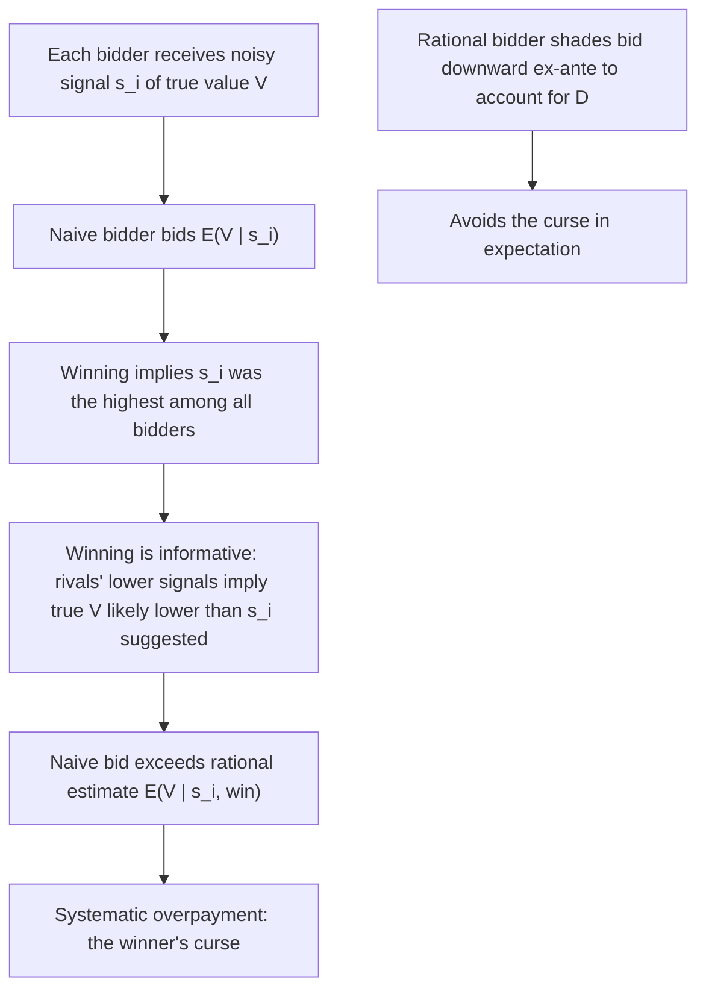

## Private Value versus Common Value Auctions

### Definition and Conceptual Foundation

The distinction between private value and common value auctions concerns the underlying **informational structure of bidders' valuations** — specifically, whether the object being auctioned has a value that differs genuinely across bidders (private values) or has a single true underlying value that is the same for everyone but is unknown and estimated differently by each bidder based on private signals (common values). Most real-world auctions exhibit elements of both and are best modeled along a continuum, formalized as the **affiliated values model** (Milgrom and Weber, 1982), with pure private values and pure common values as the two theoretical polar cases.

**Key Points**

- **Pure private values (PV)**: bidder $i$'s valuation $v_i$ is idiosyncratic — even if bidder $i$ learned every other bidder's valuation, this would not change $i$'s own valuation. Example: an art collector buying a painting purely for personal display and enjoyment; a firm bidding on a used truck for its own operational fleet needs.
- **Pure common values (CV)**: there is a single true value $V$ of the object, identical for all bidders, but each bidder $i$ observes only a noisy private signal $s_i$ correlated with $V$. Example: bidding on an oil-drilling tract where the true value depends on the (unknown, but eventually revealed) quantity of recoverable oil; bidding on a company in an M&A auction where the target's true post-acquisition value is objectively fixed but estimated differently by each bidder's due diligence team.
- **Affiliated/interdependent values (the general case)**: each bidder's *value* may depend partly on their own signal and partly on others' signals (e.g., $v_i = s_i + \alpha \sum_{j \neq i} s_j$), nesting pure PV ($\alpha = 0$) and pure CV ($v_i = V$ for all $i$, with each $s_i$ merely an unbiased noisy estimate of $V$) as special cases.

---

### Formal Structure

**Private values**: bidder valuations $v_1, \ldots, v_n$ are drawn independently (in the IPV benchmark) from a distribution $F(\cdot)$, and $v_i$ is bidder $i$'s **private information**, fully known to them and payoff-relevant only to them.

**Common values**: there exists a true value $V$ (possibly itself a random variable with prior distribution), and each bidder observes a signal:

$$s_i = V + \varepsilon_i$$

where $\varepsilon_i$ is idiosyncratic noise. Bidder $i$'s expected value of the object, conditional on their own signal alone, is $E[V \mid s_i]$ — but a bidder's *optimal bid* must account for **what winning reveals about other bidders' signals**, since in a common value setting winning the auction is itself informative (see winner's curse below).

**Affiliation** (Milgrom-Weber's general condition): signals $s_1, \ldots, s_n$ are said to be affiliated if high realizations of one signal make high realizations of others more likely — a weaker and more general condition than simple positive correlation, and the condition under which their key results (including the linkage principle) are derived.

---

### Diagram: The Value Structure Continuum

---

### The Winner's Curse: Definition and Mechanism

**Key Points**

- The **winner's curse** is the systematic tendency, in common-value auctions, for the winning bid to exceed the object's true value **if bidders naively bid their unconditional expected value** $E[V \mid s_i]$ rather than accounting for the informational content of winning itself.
- **Mechanism**: winning the auction means every other bidder's signal (and therefore their independent estimate of $V$) was lower than the winner's. Since each signal is a noisy estimate of the same true $V$, being the *bidder with the highest signal* is itself informative — it means the winner likely received a positive noise draw ($\varepsilon_i > 0$), so $E[V \mid s_i, \text{win}] < E[V \mid s_i]$.
- **Rational response**: a rational bidder must bid based on $E[V \mid s_i, \text{win}]$ — the value conditional on the signal *and* on the event of winning — which is strictly lower than the naive unconditional estimate $E[V \mid s_i]$. Failing to make this adjustment (bidding naively) produces the winner's curse; bidders who correctly account for it do not experience an *ex-ante* expected loss, though the term "winner's curse" is sometimes loosely used to describe both the naive-bidding error and the mere empirical fact that the winner's estimate was, ex-post, the most optimistic among all bidders.

$$E[V \mid s_i, \text{win}] = E[V \mid s_i, s_j < s_i \;\forall j \neq i] < E[V \mid s_i]$$

- The winner's curse effect **intensifies with the number of bidders** $n$: with more competitors, winning becomes a stronger signal that one's own estimate is an outlier on the high end, requiring more aggressive downward correction in equilibrium bidding.

---

### Diagram: Winner's Curse Logic

---

### Equilibrium Bidding Under Common Values

**Key Points**

- In a symmetric common-value first-price or English auction, the rational equilibrium bid function shades down more aggressively than the private-value equilibrium bid function, precisely to correct for the winner's curse — the required shading is **in addition to** the standard private-value bid-shading motive (retaining positive surplus).
- **Wilson's (1977) and Milgrom's (1979) results** on common-value auctions with many bidders show that, under certain conditions, competitive bidding can still converge to the true value $V$ as $n \to \infty$ (the "no-curse-in-the-limit" or information-aggregation result), though convergence properties depend sensitively on the specifics of the signal structure and are an active area of research rather than a universally guaranteed outcome. [Unverified: whether and how fast price converges to true value as $n$ grows depends on the specific signal-noise structure and auction format; this is a genuinely researched, non-trivial question in the literature rather than a simple settled fact applicable to all common-value settings.]

---

### The Linkage Principle (Milgrom-Weber, 1982)

**Key Points**

- Under affiliated values, the **format that reveals more information about other bidders' signals during the bidding process tends to generate higher expected seller revenue**, because information revelation allows bidders to correct their winner's-curse discount more precisely, leading them to bid closer to their true conditional expected value rather than shading excessively out of uncertainty.
- **Revenue ranking under affiliation** (English ≥ Second-price sealed-bid ≥ First-price sealed-bid ≥ Dutch), reversing the pure-IPV revenue equivalence result — this is one of the most cited applied implications of the private-vs-common-value distinction, since it gives sellers a concrete format-choice recommendation once genuine common-value or affiliated elements are present.
- Practical implication: auctioneers selling assets with meaningful common-value components (natural resource tracts, corporate acquisition targets, art with resale/investment value) often prefer open ascending formats or disclosure of appraisals/signals specifically to mitigate the winner's curse and thereby raise expected revenue — a design recommendation directly derived from this theory. [Inference: this is the standard applied recommendation drawn from the linkage principle; actual seller format choices in practice are also shaped by many other considerations (collusion risk, transaction speed, industry convention) not captured by this single theoretical result alone.]

---

### SVG Illustration: Rational Bid Shading — Private vs. Common Value

<svg xmlns="http://www.w3.org/2000/svg" viewBox="0 0 620 360" font-family="Helvetica, Arial, sans-serif">
<text x="310" y="24" text-anchor="middle" font-size="16" font-weight="bold" fill="#1a1a1a">Bid Shading: Private vs. Common Value (svg_diagram)</text>
<line x1="70" y1="320" x2="560" y2="320" stroke="#333" stroke-width="2" />
<line x1="70" y1="320" x2="70" y2="50" stroke="#333" stroke-width="2" />
<text x="540" y="342" font-size="13" fill="#333">Signal / estimated value</text>
<text x="30" y="55" font-size="13" fill="#333">Bid</text>
<line x1="70" y1="320" x2="510" y2="80" stroke="#888" stroke-width="2" stroke-dasharray="4,3" />
<text x="470" y="70" font-size="11" fill="#888">Naive: bid = signal estimate</text>
<line x1="70" y1="320" x2="510" y2="140" stroke="#2166ac" stroke-width="2.5" />
<text x="470" y="130" font-size="12" fill="#2166ac">Private value equilibrium</text>
<text x="470" y="146" font-size="11" fill="#2166ac">(shades for surplus only)</text>
<line x1="70" y1="320" x2="510" y2="200" stroke="#b2182b" stroke-width="2.5" />
<text x="470" y="190" font-size="12" fill="#b2182b">Common value equilibrium</text>
<text x="470" y="206" font-size="11" fill="#b2182b">(shades for surplus + winner's curse)</text>
</svg>

---

### Empirical Manifestations and Real-World Examples

**Key Points**

- **Offshore oil and gas lease auctions**: the U.S. Outer Continental Shelf lease sales are the classic empirical setting studied for winner's curse effects; Capen, Clapp, and Campbell's (1971) petroleum-industry analysis is frequently cited as an early practitioner-driven articulation of the phenomenon (predating much of the formal academic literature), documenting a pattern consistent with historically disappointing returns to winning bidders in some lease sales. [Unverified: the precise empirical magnitude of winner's-curse-driven overbidding in any specific historical lease sale dataset is a matter of applied empirical research and has been subject to some later re-examination and debate regarding alternative explanations (e.g., rational risk premia, adverse selection in which tracts get auctioned); treat this as a widely cited illustrative case rather than an uncontested empirical certainty.]
- **Corporate acquisition (M&A) auctions**: competitive bidding contests for acquisition targets have a substantial common-value component (post-merger synergies and target intrinsic value are, to a first approximation, common across potential acquirers even if each has a different due-diligence estimate), and the phenomenon of the "winning bidder" in a contested M&A auction paying a premium that subsequent performance fails to justify is frequently discussed in the corporate finance literature using winner's-curse logic, alongside alternative/complementary explanations (agency problems, hubris on the part of acquiring management, as in Roll's 1986 "hubris hypothesis"). [Unverified: attributing any specific M&A overpayment episode to winner's curse specifically, as opposed to agency-cost or hubris-based explanations, requires case-specific analysis; multiple competing explanations coexist in the literature.]
- **Sports free agency and executive compensation**: bidding wars for free agents or executives, where a player/executive's "true" productive value is uncertain and estimated independently by competing teams/firms, are commonly analyzed through a common-value/winner's-curse lens in applied sports and labor economics.
- **Spectrum auctions**: FCC and other national spectrum auctions have both private-value components (firm-specific strategic value of a license) and common-value components (aggregate market demand for wireless services affects the value of a license to any operator), making them a canonical applied setting for affiliated-values auction design.

---

### Design Implications Summary

| Feature | Private Values | Common Values |
| --- | --- | --- |
| Winner's curse present? | No | Yes (if bidding naively) |
| Revenue equivalence across standard formats | Holds (under IPV + standard assumptions) | Breaks down; open formats favored |
| Optimal bidding correction needed | Shade for own-surplus retention only | Shade for surplus retention AND winner's-curse correction |
| Value of information revelation to seller | Limited relevance to revenue | High — driven by the linkage principle |
| Preferred format for seller revenue | Revenue-neutral across formats | English (or other information-revealing open formats) generally preferred |

---

### Related Topics

- The Revenue Equivalence Theorem and its private-value assumptions
- Auction formats: English, Dutch, first-price, and second-price
- The linkage principle and information revelation (Milgrom-Weber, 1982)
- Winner's curse in oil lease auctions, M&A contests, and free agency bidding
- Affiliated values and the general symmetric model of interdependent valuations
- Optimal auction design under interdependent values (Myerson framework extensions)
- Information aggregation and the Wilson/Milgrom large-auction convergence results
- Spectrum auctions and mixed private/common value market design