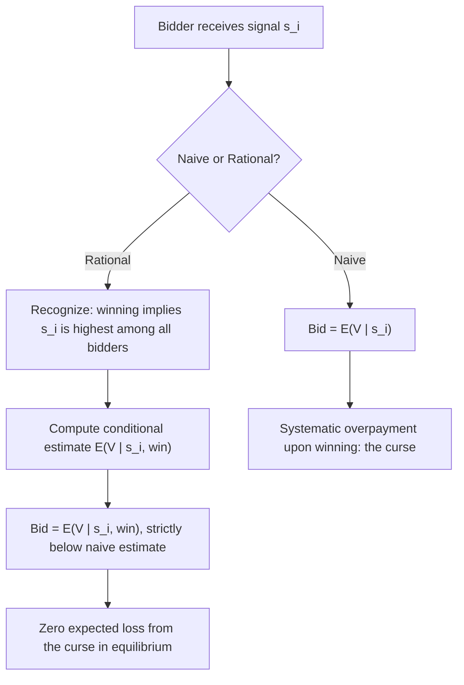

## The Winner's Curse and Bidder Strategy

### Definition and Conceptual Foundation

The winner's curse is the phenomenon, arising specifically in **common-value and affiliated-value auctions**, whereby the winning bidder systematically tends to have the most overoptimistic estimate of the object's true value among all participants — and, if bidders fail to correct for this in their bidding strategy, the winning bid exceeds the object's true value in expectation. This topic builds directly on the private-value/common-value distinction and formalizes the **strategic bidding adjustments** rational bidders must make to avoid falling prey to the curse, alongside the substantial body of empirical and experimental evidence documenting when real bidders do and do not make this correction successfully.

**Key Points**

- The winner's curse is **not** a claim that winning an auction is inherently bad, nor that common-value auctions are unprofitable for winners on average — it is specifically about the *bias introduced by naive (non-Bayesian) bidding* and the necessary strategic correction.
- A rational, fully Bayesian bidder who correctly conditions on the informational content of winning does not suffer an *ex-ante* expected loss from the curse; the term properly refers to the **bias that arises from failing to make this correction**, though it is also loosely used to describe the empirical pattern that winners' signals are, definitionally, the most optimistic among bidders.
- First identified by petroleum industry engineers (Capen, Clapp, and Campbell, 1971) analyzing offshore lease auction outcomes, and subsequently formalized theoretically (Wilson, 1977; Milgrom, 1981; Milgrom and Weber, 1982) and studied extensively in laboratory experiments (Kagel and Levin, 1986, and a large subsequent experimental literature).

---

### Formal Mechanism

Let $V$ be the true (unknown) common value of the object, and let each of $n$ bidders receive a private signal:

$$s_i = V + \varepsilon_i, \qquad \varepsilon_i \sim \text{i.i.d., mean zero}$$

A **naive bidder** submits a bid based on their unconditional expectation:

$$b_i^{naive} = E[V \mid s_i]$$

This is a bidding error because it ignores the fact that winning is itself an event with informational content. The event "bidder $i$ wins" is equivalent to the event "$s_i > s_j$ for all $j \neq i$" — i.e., bidder $i$'s signal was the highest among all $n$ draws. Since each $s_i$ is a noisy estimate of the same $V$, having the highest signal is evidence that bidder $i$ likely received a positive noise realization ($\varepsilon_i > 0$), which means:

$$E[V \mid s_i, \text{win}] = E[V \mid s_i, s_i > s_j \;\forall j] < E[V \mid s_i]$$

The **rational bid** must therefore be based on the conditional expectation given both the signal *and* the winning event, not the signal alone:

$$b_i^{rational} = E[V \mid s_i, \text{win}]$$

Because this conditional expectation is strictly decreasing relative to the naive estimate, and because the gap between $E[V \mid s_i]$ and $E[V \mid s_i, \text{win}]$ widens as $n$ increases (more competitors means winning is a stronger signal of being a positive outlier), **rational bid shading for the winner's curse must increase with the number of bidders** — a distinctive and often counterintuitive result relative to private-value settings, where more bidders simply means less need to shade for surplus-retention reasons.

---

### Diagram: Naive vs. Rational Bidder Decision Process

---

### Strategic Bidding Adjustments: A Practical Framework

**Key Points**

- **Shade more as $n$ increases**: the number of competing bidders should directly inform the magnitude of the downward correction — the same signal warrants a lower bid in a 20-bidder auction than in a 3-bidder auction, since the informational content of "having the highest of 20 signals" is stronger evidence of positive noise than "having the highest of 3."
- **Shade more as signal noise/uncertainty increases**: the higher the variance of $\varepsilon_i$ relative to the true underlying variation in $V$, the larger the required correction, since a noisier signal makes "being the highest" less informative about true $V$ and more informative about having drawn favorable noise.
- **Account for the full distribution of others' likely signals, not just one's own**: correctly computing $E[V \mid s_i, \text{win}]$ in general requires reasoning about the full joint distribution of signals and the equilibrium bid function of all other players — a genuinely challenging inference problem, which is precisely why experimental evidence finds many real bidders fail to fully correct for it (see below).
- **In practice**, professional bidders in common-value settings (e.g., oil companies, M&A advisory teams) often use **rule-of-thumb heuristics** to approximate the correction — such as applying a fixed percentage discount to internal valuation estimates that scales with the expected number of competing bidders — rather than solving the full Bayesian inference problem explicitly. [Inference: this describes a commonly cited practitioner approach to approximating the correction; the specific discount percentages used in any given industry or firm are proprietary/context-specific and not derivable from theory alone.]

---

### Experimental and Empirical Evidence

**Key Points**

- **Laboratory evidence** (Kagel and Levin, 1986, and substantial subsequent replication) consistently finds that inexperienced subjects in common-value auction experiments **do fall prey to the winner's curse**, especially as the number of bidders increases — the opposite of the theoretically rational direction, since naive subjects often fail to increase their shading with $n$, or even shade less as competitive pressure increases.
- **Learning effects**: experienced subjects (either through repeated play within an experiment or professional experience in real markets) tend to shade bids more appropriately, though the literature finds that learning is often **incomplete** — the winner's curse tends to diminish but not fully disappear with experience, and can re-emerge when the game's parameters change (e.g., number of bidders, signal structure) even among experienced subjects. [Unverified: the degree to which experience fully versus partially eliminates the curse varies across experimental studies and parameterizations; this should be read as a general pattern in the literature rather than a precise universal quantification.]
- **Field evidence**: beyond the oft-cited petroleum lease sale analyses, subsequent applied work has examined winner's curse effects in settings including corporate takeover contests, real estate bidding wars, and initial public offering (IPO) underpricing (where underpricing is sometimes explained as compensation to less-informed investors for the adverse-selection/winner's-curse risk of only receiving allocations when better-informed investors decline to participate — the Rock, 1986 model). [Unverified: as with earlier caveats, attributing any single empirical pattern (IPO underpricing, specific lease sale returns) definitively to the winner's curse mechanism rather than competing explanations is disputed in parts of the empirical literature; multiple studies offer alternative or complementary explanations.]

---

### SVG Illustration: Winner's Curse Magnitude as a Function of Bidder Count

<svg xmlns="http://www.w3.org/2000/svg" viewBox="0 0 620 340" font-family="Helvetica, Arial, sans-serif">
<text x="310" y="24" text-anchor="middle" font-size="16" font-weight="bold" fill="#1a1a1a">Required Bid Shading vs. Number of Bidders (svg_diagram)</text>
<line x1="70" y1="290" x2="560" y2="290" stroke="#333" stroke-width="2" />
<line x1="70" y1="290" x2="70" y2="50" stroke="#333" stroke-width="2" />
<text x="500" y="312" font-size="13" fill="#333">Number of bidders (n)</text>
<text x="30" y="55" font-size="13" fill="#333">Required shading</text>

<path d="M 90 260 C 150 220, 250 130, 350 90 C 420 68, 490 58, 550 52" fill="none" stroke="`#b2182b`" stroke-width="3" />

<text x="380" y="80" font-size="12" fill="`#b2182b`">Rational correction</text>

<text x="380" y="96" font-size="11" fill="`#b2182b`">(increases with n)</text>

<line x1="90" y1="260" x2="550" y2="240" stroke="#888" stroke-width="2" stroke-dasharray="4,3" />
<text x="380" y="255" font-size="12" fill="#888">Naive bidder correction (flat/insufficient)</text>
</svg>

---

### The Curse in Multi-Unit and Dynamic Settings

**Key Points**

- The winner's curse logic extends to **multi-unit** and **sequential** auction settings, though with added complexity: in sequential common-value auctions, bidders who lose early rounds gain information about rivals' signals that can be used to update value estimates in later rounds, partially mitigating (but not eliminating) the curse in the final round's decision.
- In **English (open ascending) auctions with common value elements**, the winner's curse is theoretically less severe than in sealed-bid formats precisely because of the **linkage principle**: observing the price at which rivals drop out reveals information about their signals in real time, allowing surviving bidders to update their own valuation estimates *during* the auction — this is one of the most direct practical links between the winner's-curse literature and auction format choice.
- In **takeover contests structured as sequential bidding wars** (as opposed to single-round sealed-bid tenders), each round of competing bids can be modeled as providing information analogous to an English auction's price-clock information revelation, though real-world M&A processes often deviate substantially from the clean theoretical structure (private negotiations, asymmetric information about deal terms, non-price contract features) — a genuine empirical and structural complication for directly mapping theory onto observed takeover battles. [Inference: this extension of English-auction information-revelation logic to real-world bidding wars is a reasonable theoretical analogy frequently drawn in applied corporate finance discussions, but real M&A processes have substantial institutional detail (fiduciary duties, deal-protection provisions, financing contingencies) not captured by the stylized auction-theoretic mapping.]

---

### Debiasing Strategies for Practitioners

**Key Points**

- **Pre-commit to a bidding rule before seeing rivals' behavior**: deciding on a maximum bid based on a rigorous ex-ante Bayesian calculation (rather than adjusting emotionally during a live bidding process) helps avoid escalation dynamics that compound the curse with sunk-cost/commitment biases.
- **Use independent, blinded valuation teams**: having multiple internal teams generate independent value estimates and consciously discounting toward the more conservative estimates helps counteract the natural tendency to select and act upon the most optimistic internal estimate — effectively simulating the "conditioning on winning" correction internally, since the team's most bullish estimate is analogously the one most likely to reflect favorable noise rather than superior true information.
- **Explicitly model the number of expected competitors**: since required shading is directly increasing in $n$, practitioners benefit from making an explicit, documented estimate of likely competitive intensity before finalizing a bid, rather than treating the winner's curse correction as a vague qualitative caution.
- **Distinguish genuine private-value components from common-value components** in a mixed-value setting (e.g., an acquisition with both firm-specific synergies and market-wide target value): only the common-value portion of a bidder's total valuation requires winner's-curse-style correction; the purely private/synergy-specific component does not, so blending the two without decomposition can lead to over- or under-correction.

---

### Related Topics

- Private value versus common value auctions (foundational distinction)
- The linkage principle and information revelation in affiliated-value auctions (Milgrom-Weber, 1982)
- Auction formats: English, Dutch, first-price, and second-price
- The Revenue Equivalence Theorem and its private-value boundary conditions
- Behavioral economics of bidding: overconfidence and the endowment effect in auctions
- IPO underpricing and the Rock (1986) adverse-selection model
- Corporate takeover contests and bidding war dynamics
- Experimental auction economics (Kagel and Levin's laboratory paradigm)