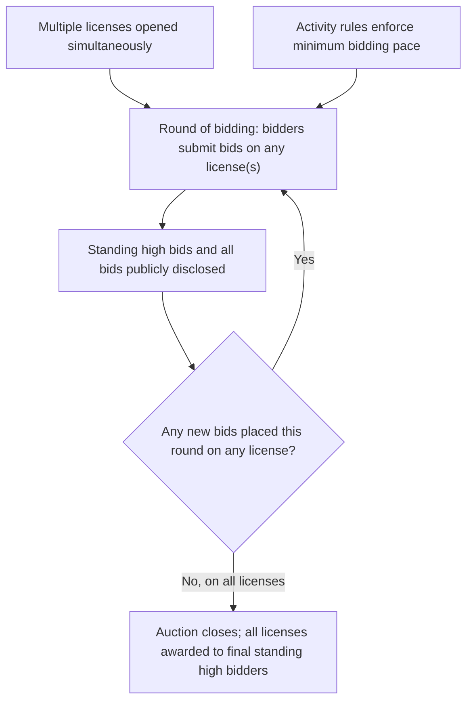

## Spectrum and Procurement Auction Design

### Definition and Conceptual Foundation

Spectrum and procurement auction design refers to the applied field of **market design** — combining auction theory with practical engineering, legal, and institutional constraints — used to allocate radio spectrum licenses (a canonical government sale problem) and to structure competitive procurement (a canonical government/corporate purchasing problem, effectively a "reverse auction" where the lowest qualified bid wins). Both domains extend the classical single-object auction models (English, Dutch, first-price, second-price) into **multi-object, multi-unit, and often combinatorial** settings, requiring substantially more sophisticated mechanism design than the canonical single-item benchmark. This field is one of the most prominent real-world applications of auction theory, most famously associated with the FCC spectrum auctions designed with substantial input from academic auction theorists (Milgrom, Wilson, McAfee, and others) beginning in 1994.

**Key Points**

- Spectrum auctions are a **sale** mechanism (government as seller, telecom firms as bidders); procurement auctions are a **reverse** mechanism (government/firm as buyer, suppliers as bidders competing to offer the lowest price/best terms) — the underlying game-theoretic logic is symmetric (swap "highest bid wins" for "lowest bid wins"), but institutional detail differs substantially.
- Both domains commonly involve **multiple, heterogeneous, and often interdependent items** (e.g., spectrum licenses covering different geographic regions and frequency bands; procurement contracts covering different service lots or delivery timelines), which is why **combinatorial** and **simultaneous multi-round** auction designs dominate this field rather than the single-item formats covered elsewhere in this chapter.

---

### The Simultaneous Multiple Round Auction (SMRA)

**Key Points**

- Designed originally for the U.S. FCC's 1994 PCS spectrum auctions (with academic design input widely credited to Paul Milgrom, Robert Wilson, and Preston McAfee), the SMRA remains the most widely used spectrum auction format internationally.
- **Mechanism**: multiple licenses are auctioned **simultaneously** across a series of discrete bidding rounds. In each round, bidders submit bids on any license(s) of interest; after each round, all bids and the resulting standing high bids on every license are publicly disclosed; the auction continues until no new bids are placed in a round on any license (all licenses simultaneously "close").
- **Rationale for simultaneity**: since licenses can be substitutes or complements (a bidder might value License A highly only if it also wins License B, e.g., adjacent geographic regions enabling a contiguous network), closing licenses sequentially would force bidders to commit to a license without knowing the outcome of related licenses — simultaneous closing lets bidders' aggregate demand and price discovery unfold jointly across all items, improving allocative efficiency relative to sequential single-item sales.
- **Activity rules**: bidders must maintain a minimum level of bidding activity (measured via eligibility points tied to bid amounts) in each round to prevent "bid sniping" or excessive early passivity that could undermine price discovery — a design feature specifically added to address gaming behavior observed or anticipated in early auction design.

---

### Diagram: SMRA Process Flow

---

### Combinatorial (Package) Auctions

**Key Points**

- A **combinatorial auction** allows bidders to submit bids on **packages (bundles) of items** rather than only individual items, directly addressing the exposure problem inherent in item-by-item bidding when items are complements.
- **The exposure problem**: in a non-combinatorial format, a bidder who values License A and License B only as a pair (e.g., $10 million jointly, but only $2 million for either alone) risks winning only License A at a price near $8 million if License B goes to a rival — leaving the bidder "exposed" to a loss relative to their true package valuation. Package bidding eliminates this risk by letting the bidder bid $10 million on the {A,B} package directly, winning only if that exact combination (or a superior combination) is not beaten.
- **The Combinatorial Clock Auction (CCA)**: a widely adopted modern format (used in the UK, Canada, Australia, and other spectrum sales) combining a **clock phase** (simultaneous ascending prices on generic quantities of spectrum, with bidders indicating desired quantities at each price point, continuing until supply equals demand) and a **supplementary/sealed-bid phase** (allowing bidders to submit additional package bids, with a final winner-determination optimization run to maximize total accepted bid value subject to feasibility constraints).
- **Winner determination problem**: with package bidding, determining the revenue/value-maximizing combination of accepted bids is a computationally hard **combinatorial optimization problem** (a variant of the weighted set packing problem, generally NP-hard in the worst case), requiring specialized algorithms (branch-and-bound, integer programming solvers) for auctions with many bidders and packages — a genuine computational engineering challenge layered on top of the economic mechanism design. [Inference: the NP-hardness of the general winner-determination problem is a well-established computational complexity result; in practice, real-world spectrum auctions with a manageable number of bidders and package bids are solved to optimality (or near-optimality with provable bounds) using modern integer programming solvers within feasible time limits, so hardness in the worst-case theoretical sense does not preclude practical solvability in realistic auction instances.]

---

### Pricing Rules in Combinatorial Auctions: VCG and Alternatives

**Key Points**

- The **Vickrey-Clarke-Groves (VCG) mechanism** generalizes the single-item second-price/Vickrey logic to multi-item combinatorial settings: each winner pays the **externality they impose on other bidders** — specifically, the difference between the total value achievable by all *other* bidders if the winner had not participated, and the total value actually achieved by other bidders given the winner's presence.
- **VCG's key theoretical property**: truthful bidding (revealing true package valuations) is a **dominant strategy** for every bidder, directly extending Vickrey's single-item incentive-compatibility result to the combinatorial setting — a highly desirable property since it removes strategic bid-shading considerations.
- **Practical problems with VCG in spectrum auctions**: despite its theoretical elegance, VCG has been **rarely adopted in practice** for large spectrum sales, due to several well-documented issues:
  - **Low/unpredictable revenue**: VCG prices can be substantially lower than what simpler formats generate, and revenue can be highly sensitive to the specific configuration of bids, sometimes counterintuitively (a phenomenon studied under "VCG revenue non-monotonicity").
  - **Vulnerability to collusion and shill bidding**: certain bid configurations allow coalitions of bidders (including a single bidder submitting bids under multiple identities) to manipulate VCG outcomes in ways not possible under simpler formats — a serious practical vulnerability documented in the mechanism design literature (Ausubel and Milgrom, 2006, offer an extended critique).
  - **Complexity and lack of transparency**: computing and explaining VCG payments to bidders and regulators is substantially more complex than transparent ascending-clock pricing, creating political and legal-defensibility concerns for government auctioneers.
  - As a result, most real-world combinatorial spectrum auctions (including the CCA format) use **core-selecting pricing rules** instead — payment rules constrained to lie within the economic "core" of the cooperative game defined by the bids, which sacrifice full dominant-strategy incentive compatibility but substantially mitigate VCG's practical revenue and manipulation problems. [Unverified: the precise quantitative trade-off between core-selecting pricing's incentive-compatibility imperfections versus VCG's practical vulnerabilities is an active area of ongoing mechanism-design research; the shift toward core-selecting rules reflects a documented practitioner and regulator consensus preference, not a proof that core-selecting rules dominate VCG on every theoretical dimension.]

---

### SVG Illustration: Auction Format Selection Logic

<svg xmlns="http://www.w3.org/2000/svg" viewBox="0 0 640 340" font-family="Helvetica, Arial, sans-serif">
<text x="320" y="24" text-anchor="middle" font-size="16" font-weight="bold" fill="#1a1a1a">Spectrum Auction Format Selection (svg_diagram)</text>
<rect x="240" y="45" width="160" height="50" rx="6" fill="#eaf2fb" stroke="#2166ac" stroke-width="2" />
<text x="320" y="75" text-anchor="middle" font-size="12" fill="#1a1a1a">Are items complements?</text>
<line x1="280" y1="95" x2="150" y2="150" stroke="#333" stroke-width="1.5" />
<line x1="360" y1="95" x2="490" y2="150" stroke="#333" stroke-width="1.5" />
<rect x="60" y="150" width="180" height="50" rx="6" fill="#e6f4ea" stroke="#2d8a3e" stroke-width="2" />
<text x="150" y="180" text-anchor="middle" font-size="12" fill="#1a1a1a">No: SMRA (item-by-item)</text>
<rect x="410" y="150" width="180" height="50" rx="6" fill="#fbf3e6" stroke="#e08214" stroke-width="2" />
<text x="500" y="180" text-anchor="middle" font-size="12" fill="#1a1a1a">Yes: Combinatorial (CCA)</text>
<line x1="500" y1="200" x2="500" y2="240" stroke="#333" stroke-width="1.5" />
<rect x="410" y="240" width="180" height="60" rx="6" fill="#fbeaea" stroke="#b2182b" stroke-width="2" />
<text x="500" y="265" text-anchor="middle" font-size="12" fill="#1a1a1a">Pricing rule:</text>
<text x="500" y="282" text-anchor="middle" font-size="11" fill="#1a1a1a">core-selecting (preferred)</text>
<text x="500" y="296" text-anchor="middle" font-size="11" fill="#1a1a1a">vs. VCG (rarely used)</text>
</svg>

---

### Reserve Prices, Set-Asides, and Competition Policy Objectives

**Key Points**

- Spectrum auctions frequently incorporate **reserve prices** (minimum acceptable bids, as in Myerson's optimal auction theory) both for revenue reasons and to prevent licenses from being acquired at prices regulators consider too low relative to public-asset value.
- **Spectrum set-asides / bidding credits**: many spectrum auctions reserve specific license blocks or offer bid discounts for smaller or new entrant carriers, explicitly trading off pure revenue maximization against **competition policy objectives** (preventing excessive concentration among incumbent carriers, encouraging market entry) — a design choice that is not derivable from the pure Myerson revenue-maximization framework alone and reflects an explicit political/regulatory value judgment layered onto the mechanism design problem.
- **Anti-collusion rules**: many jurisdictions restrict communication between competing bidders during the auction and sometimes require anonymous or partially obscured bidder identities specifically to reduce the risk of tacit collusion or retaliatory signaling — a direct practical response to the collusion vulnerabilities of open ascending formats discussed in the standards/auction formats topics of this chapter.

---

### Procurement Auction Design: The Reverse-Auction Perspective

**Key Points**

- In procurement, the auctioneer (buyer) seeks the **lowest** price (or best quality-adjusted offer) from competing suppliers; the theoretical structure mirrors sales auctions with roles reversed (lowest bid wins, analogous to the highest bid winning in a sales auction), and the same format taxonomy applies: **reverse English** (descending-price ascending competition among suppliers), **reverse Dutch**, **first-price sealed-bid procurement** (lowest sealed bid wins, paid own bid), and **second-price sealed-bid procurement** (lowest bid wins, paid the second-lowest bid).
- **Scoring auctions / multi-attribute procurement**: real-world procurement frequently cannot be reduced to price alone — quality, delivery time, and other contract terms matter. **Scoring rule auctions** convert multi-dimensional bids (price plus quality attributes) into a single comparable score via a pre-announced scoring formula, e.g.:

$$\text{Score}_i = w_1 \cdot (\text{price}_i) + w_2 \cdot (\text{quality}_i) + w_3 \cdot (\text{delivery time}_i)$$

with weights $w_j$ disclosed in advance to preserve competitive incentive properties and procedural fairness/legal defensibility (critical in government procurement, which is typically subject to administrative law transparency requirements).

- **Reverse combinatorial auctions**: used extensively in complex procurement (e.g., logistics/trucking route bundles, large government IT contracts with interdependent components) where suppliers' costs for bundles of contracts differ from the sum of costs for individual contracts (economies of scope), directly analogous to the spectrum package-bidding rationale.
- **Split-award and multi-sourcing designs**: procurement auctions frequently deliberately award contracts to **multiple** suppliers (rather than a single winner) to maintain a competitive supplier base for future contracting rounds and reduce single-supplier dependency risk — a design consideration distinct from typical single-winner spectrum auction objectives, reflecting procurement's usually repeated/relational nature versus the largely one-shot character of spectrum license sales.

---

### Empirical Track Record and Design Evolution

**Key Points**

- The FCC's early 1990s spectrum auctions are widely regarded in the academic literature as a substantial applied success of auction theory, generating tens of billions of dollars in revenue over subsequent decades and informing spectrum auction design adopted by dozens of countries. [Unverified: precise cumulative revenue figures across all FCC spectrum auctions to date require current sourcing and are not restated here as a specific number to avoid an unverified quantitative claim; general order-of-magnitude success is widely documented, but exact figures should be checked against current FCC data if precision is required.]
- Notable design failures and controversies have also shaped the field's evolution: certain early auctions in some countries (particularly some European 3G spectrum auctions in the early 2000s) were criticized for design choices that some analysts argue contributed to unsustainably high winning bids relative to subsequent realized value, later informing more conservative reserve-price and format choices in later spectrum sales. [Unverified: attributing specific "overpayment" outcomes in historical 3G auctions definitively to auction design flaws, as opposed to concurrent market/technology-adoption uncertainty and the broader dot-com-era investment climate, remains a matter of some academic debate; multiple contributing factors are generally cited in the literature rather than a single decisive design cause.]
- The field continues to evolve actively, with ongoing research and design refinement around **incentive auctions** (a novel format used in the U.S. 2016-2017 broadcast incentive auction, which combined a reverse auction to buy back spectrum from broadcasters with a simultaneous forward auction to sell that spectrum to wireless carriers) representing a further extension of combined procurement/sale mechanism design into a single integrated market-clearing process.

---

### Related Topics

- Auction formats: English, Dutch, first-price, and second-price (foundational single-item formats)
- The Revenue Equivalence Theorem and its breakdown in multi-item settings
- Private value versus common value auctions (spectrum licenses have mixed private/common value elements)
- The winner's curse and bidder strategy (relevant to spectrum bidding under demand uncertainty)
- VCG mechanism and core-selecting pricing rules in combinatorial auctions
- Winner determination problem and computational mechanism design
- Multi-attribute scoring auctions in public procurement
- The 2016-2017 FCC broadcast incentive auction as an integrated buy-sell mechanism