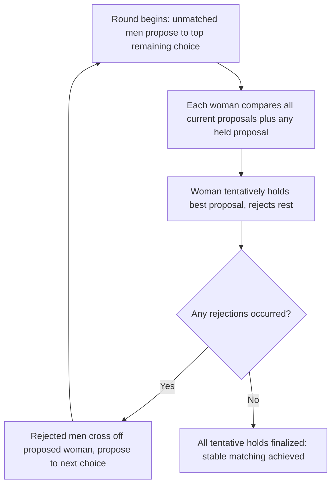

## Matching Markets and Stable Allocation Mechanisms

### Definition and Conceptual Foundation

Matching markets are markets in which goods, positions, or partnerships are allocated **without prices serving as the primary clearing mechanism** — instead, agents on each side express preferences (rankings) over agents/objects on the other side, and an allocation algorithm produces a matching based on those preferences. This distinguishes matching theory from the auction and pricing mechanisms covered elsewhere in this chapter: many important real-world markets (school admissions, medical residency assignment, organ donation, marriage) either cannot or should not use market-clearing prices for legal, ethical, or practical reasons, requiring a fundamentally different mechanism-design toolkit. The foundational contribution is Gale and Shapley's (1962) deferred acceptance algorithm, later extended into a vast applied literature recognized by the 2012 Nobel Memorial Prize in Economic Sciences awarded to Alvin Roth and Lloyd Shapley.

**Key Points**

- **Two-sided matching**: agents on both sides have preferences over being matched to specific agents on the other side (e.g., students and schools, residents and hospitals, men and women in the classic marriage-market formulation).
- **One-sided matching (house allocation)**: agents have preferences over a set of indivisible objects, but the objects themselves have no preferences (e.g., allocating dormitory rooms, kidney exchange chains among incompatible donor-patient pairs).
- **Matching with contracts**: a generalization (Hatfield and Milgrom, 2005) unifying matching theory with certain auction/pricing settings, where "contracts" between agents can specify terms beyond simple pairing (e.g., wage levels in a labor-matching context).
- The central normative criterion throughout this literature is **stability**, not efficiency or revenue — a fundamentally different objective from the auction design covered elsewhere in this chapter.

---

### The Stable Marriage Problem and Deferred Acceptance

**Key Points**

- **Setup**: $n$ men and $n$ women (in the original formulation), each with a strict preference ordering over all members of the opposite side. A **matching** pairs each man with exactly one woman (assuming equal numbers and no unmatched agents, for simplicity).
- **Definition of stability**: a matching is **stable** if there is no "blocking pair" — a man $m$ and woman $w$, not matched to each other, who would both *prefer* to be matched to each other over their current partners. Formally, matching $\mu$ is stable if there exists no pair $(m, w)$ such that $w \succ_m \mu(m)$ and $m \succ_w \mu(w)$.
- **Gale-Shapley Deferred Acceptance Algorithm (man-proposing version)**:
  1. Each unmatched man proposes to his most-preferred woman among those who have not yet rejected him.
  2. Each woman **tentatively holds** the proposal from her most-preferred proposer so far (among current and past proposals) and rejects all others.
  3. Rejected men propose to their next-most-preferred woman.
  4. Repeat until no rejections occur; all tentative holds become final.
- **Theorem (Gale-Shapley, 1962)**: this algorithm always terminates in a stable matching, proving that a stable matching **always exists** for any set of strict preferences — a foundational existence result.

---

### Diagram: Deferred Acceptance Process

---

### Key Theoretical Properties

**Key Points**

- **Optimality for the proposing side**: the man-proposing deferred acceptance algorithm produces the matching that is **simultaneously best for every man** among all stable matchings (the "man-optimal stable matching"), and correspondingly **worst for every woman** among all stable matchings. Reversing the proposing side (woman-proposing) produces the mirror-image result.
- **Multiplicity of stable matchings**: in general, multiple stable matchings can exist for a given preference profile, and the proposing side systematically benefits relative to the receiving side — this asymmetry has direct practical implications for which side should be designated as "proposer" in an applied mechanism (see the National Resident Matching Program discussion below).
- **Strategy-proofness (partial)**: the deferred acceptance algorithm is a **dominant strategy for the proposing side** to report true preferences (Dubins and Freedman, 1981; Roth, 1982) — proposers cannot benefit from strategic misrepresentation. However, it is **not** strategy-proof for the receiving side: a woman can sometimes benefit from misrepresenting her preferences (e.g., ranking someone lower than her true preference to strategically avoid being "used" as a tentative hold by a suitor she would ultimately reject anyway) — this asymmetric incentive property is a well-established, documented result, not merely an empirical tendency. [Inference: the precise conditions under which manipulation by the receiving side is *profitable* (as opposed to merely theoretically possible) depend on the specific preference profile; the general non-strategy-proofness result for the receiving side is a firm theoretical finding, but whether any particular real agent has an actual incentive to misreport depends on the full configuration of others' preferences, which is typically unknown to any single participant in practice.]
- **No mechanism is simultaneously stable and fully strategy-proof for both sides**: this is a fundamental impossibility result (Roth, 1982) — designers must choose which side's incentive compatibility to sacrifice, or accept some degree of manipulability, when stability is a required design constraint.

---

### College Admissions and Many-to-One Matching

**Key Points**

- The **college admissions problem** generalizes the marriage model to **many-to-one matching**: each college has a capacity (multiple seats) and a preference ranking over students, while each student has preferences over colleges. The deferred acceptance algorithm extends naturally: colleges tentatively hold their top-ranked applicants up to capacity, rejecting the rest, with rejected students proposing to their next choice.
- **Responsive preferences assumption**: college preferences over *sets* of students are typically assumed to be "responsive" — a college prefers one set of admitted students to another if it could be reached by swapping a single student for a more preferred one, holding the rest fixed. This assumption ensures the stability and optimality results extend cleanly from the one-to-one marriage case.
- Stability in this context means no student-college pair exists where the student prefers the college to their current assignment *and* the college prefers the student to one of its currently admitted students (or has an open seat) — directly analogous to the blocking pair condition in the marriage model.

---

### Applied Case Study: The National Resident Matching Program (NRMP)

**Key Points**

- The U.S. medical residency matching system, which assigns graduating medical students to hospital residency programs, is one of the most celebrated real-world applications of matching theory. The original NRMP algorithm (in use since 1952) was found by Roth (1984) to be **equivalent to a hospital-proposing deferred acceptance algorithm**, explaining its historical success and stability compared to earlier decentralized matching processes that suffered from unraveling (offers made increasingly early, before adequate information was available) and instability (matches unraveling after the fact as parties found preferable alternatives).
- The system was **redesigned in the 1990s** (with academic input, notably from Alvin Roth) to switch to a **student-proposing** version of deferred acceptance, motivated partly by the theoretical result that the proposing side benefits — this switch aimed to shift the systematic advantage of the algorithm's structural bias toward students/residents rather than hospitals, alongside handling more complex features like couples applying jointly (a significant computational and theoretical extension, since jointly-optimizing couples can violate the standard existence-of-stable-matching guarantees in certain edge cases). [Unverified: the precise policy rationale and full historical sequence of motivations behind the 1990s redesign involved multiple stakeholders and considerations beyond the single theoretical point noted here; this description captures the widely cited core economic rationale but should not be read as an exhaustive account of the actual institutional decision-making process.]
- This case is frequently cited as a landmark example of "market design as engineering" — economists directly redesigning a real institution's matching algorithm based on theoretical properties, rather than merely describing/analyzing existing market outcomes.

---

### Applied Case Study: School Choice

**Key Points**

- Many U.S. school districts (Boston, New York City, and others) have adopted deferred-acceptance-based mechanisms for public school assignment, replacing earlier ad hoc or "immediate acceptance" (Boston mechanism) systems.
- **The Boston mechanism problem**: the previously common "Boston mechanism" (immediate acceptance: students are assigned to their stated first choice if a seat is available, without any deferral) creates a strong incentive for **strategic preference misrepresentation** — a student who is unlikely to get their true first choice due to it being oversubscribed has an incentive to instead list a *less popular but attainable* school as their stated first choice to avoid losing priority, undermining the mechanism's ability to elicit true preferences and complicating welfare analysis of resulting allocations.
- The switch to (student-proposing) deferred acceptance in cities like Boston (adopted in 2005, following academic analysis and advocacy by Abdulkadiroğlu, Pathak, Roth, and Sönmez) directly addressed this strategic vulnerability, since deferred acceptance is strategy-proof for the proposing (student) side.
- **Top Trading Cycles (TTC)** is an alternative mechanism sometimes used or proposed in school choice and other matching contexts, particularly valuable when *some* existing priority/ownership structure exists (e.g., students already assigned to a school who might trade priorities); TTC is both strategy-proof and **Pareto efficient**, though generally not stable in the same sense as deferred acceptance — illustrating a recurring **efficiency-versus-stability tradeoff** in matching mechanism design that does not arise in the same form in classical auction theory.

---

### SVG Illustration: Matching Mechanism Tradeoffs

<svg xmlns="http://www.w3.org/2000/svg" viewBox="0 0 620 320" font-family="Helvetica, Arial, sans-serif">
<text x="310" y="24" text-anchor="middle" font-size="16" font-weight="bold" fill="#1a1a1a">Matching Mechanism Property Comparison (svg_diagram)</text>
<rect x="60" y="60" width="160" height="200" rx="8" fill="#eaf2fb" stroke="#2166ac" stroke-width="2" />
<text x="140" y="90" text-anchor="middle" font-size="13" font-weight="bold" fill="#1a1a1a">Deferred Acceptance</text>
<text x="140" y="120" text-anchor="middle" font-size="11" fill="#1a1a1a">Stable: Yes</text>
<text x="140" y="140" text-anchor="middle" font-size="11" fill="#1a1a1a">Strategy-proof (proposers): Yes</text>
<text x="140" y="160" text-anchor="middle" font-size="11" fill="#1a1a1a">Strategy-proof (receivers): No</text>
<text x="140" y="180" text-anchor="middle" font-size="11" fill="#1a1a1a">Pareto efficient: Not always</text>
<rect x="240" y="60" width="160" height="200" rx="8" fill="#e6f4ea" stroke="#2d8a3e" stroke-width="2" />
<text x="320" y="90" text-anchor="middle" font-size="13" font-weight="bold" fill="#1a1a1a">Top Trading Cycles</text>
<text x="320" y="120" text-anchor="middle" font-size="11" fill="#1a1a1a">Stable: Not generally</text>
<text x="320" y="140" text-anchor="middle" font-size="11" fill="#1a1a1a">Strategy-proof: Yes</text>
<text x="320" y="160" text-anchor="middle" font-size="11" fill="#1a1a1a">Pareto efficient: Yes</text>
<rect x="420" y="60" width="160" height="200" rx="8" fill="#fbeaea" stroke="#b2182b" stroke-width="2" />
<text x="500" y="90" text-anchor="middle" font-size="13" font-weight="bold" fill="#1a1a1a">Boston (Immediate Acceptance)</text>
<text x="500" y="120" text-anchor="middle" font-size="11" fill="#1a1a1a">Stable: No</text>
<text x="500" y="140" text-anchor="middle" font-size="11" fill="#1a1a1a">Strategy-proof: No</text>
<text x="500" y="160" text-anchor="middle" font-size="11" fill="#1a1a1a">Vulnerable to manipulation</text>
</svg>

---

### Applied Case Study: Kidney Exchange

**Key Points**

- Kidney exchange addresses the problem of **incompatible donor-patient pairs**: a patient needing a transplant may have a willing living donor whose organ is medically incompatible (blood type or tissue match), but two or more such incompatible pairs can sometimes be matched crosswise (Patient A receives Donor B's kidney, Patient B receives Donor A's kidney) if compatibility runs the other direction.
- This is modeled as a matching problem on a **directed graph**, where nodes are incompatible pairs and edges represent compatibility, with the algorithmic goal of finding an optimal set of disjoint cycles (or, in extended designs, chains initiated by non-directed altruistic donors) that maximizes the number of feasible transplants — a combinatorial optimization problem related to, but distinct from, the classical stable matching algorithms above, since there is no natural two-sided "preference" structure in the same sense (compatibility is largely a binary medical constraint rather than a ranked preference).
- Roth, Sönmez, and Ünver's work (2004 and subsequent) extended matching-market design principles to found and help design real kidney exchange programs (e.g., the New England Program for Kidney Exchange, and later national-scale U.S. programs), representing another landmark "market design as engineering" success alongside the NRMP.
- This application is particularly significant because it operates in a domain where **monetary compensation for organs is illegal in most jurisdictions** (the National Organ Transplant Act in the U.S. prohibits organ sales), making non-price matching mechanisms not merely a design choice but a legal and ethical necessity — a distinctive feature of this application relative to most other matching-market contexts.

---

### Repugnant Transactions and the Limits of Market Design

**Key Points**

- Roth's (2007) concept of **"repugnant markets"** — transactions that willing participants might wish to make but that society deems unacceptable for the market to mediate via price (organ sales, certain forms of surrogacy, some labor markets) — is a distinctive theoretical contribution of the matching-market literature, explaining *why* non-price matching mechanisms are sometimes the only ethically/legally available design option even when a price-based market might otherwise be more allocatively efficient in a narrow economic sense.
- This raises design questions largely absent from standard auction theory: how to elicit truthful preferences, achieve stability, and maximize welfare **without** the price instrument that classical mechanism design typically relies upon as its primary lever.

---

### Related Topics

- Gale-Shapley deferred acceptance algorithm: formal proofs and extensions
- Top Trading Cycles and Pareto-efficient allocation mechanisms
- The National Resident Matching Program: history and mechanism redesign
- School choice mechanism design (Boston, NYC, and other district case studies)
- Kidney exchange and repugnant transactions (Roth, 2007)
- Matching with contracts (Hatfield-Milgrom, 2005) and its unification with auction theory
- Strategy-proofness and impossibility results in two-sided matching
- Many-to-one and many-to-many matching with responsive preferences