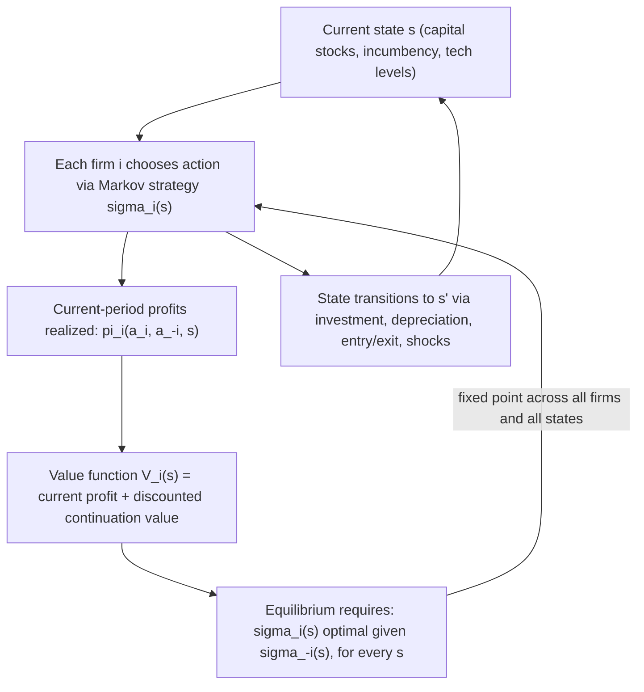

## Markov Perfect Equilibrium in Dynamic Industry Models

### Definition and Conceptual Foundation

A Markov Perfect Equilibrium (MPE) is a refinement of subgame perfect equilibrium for dynamic games in which players' strategies depend only on the current **payoff-relevant state** of the game, rather than on the full history of past play. This restriction to state-dependent (Markovian) strategies is the foundational solution concept used to make dynamic oligopoly models — where firms make repeated decisions about capacity, entry/exit, R&D, or pricing over time in the presence of an evolving industry state — analytically and computationally tractable, at the cost of ruling out certain history-dependent equilibria (such as collusive strategies sustained by trigger punishments) that are not payoff-relevant-state-dependent in the required sense. The concept originates with Maskin and Tirole (1988a, 1988b) and underlies the dominant applied framework for dynamic industry analysis, most notably the Ericson and Pakes (1995) model.

**Key Points**

- **Markovian restriction**: a strategy is Markovian if it depends only on the current state $s_t$ (e.g., current capital stocks, current number of active firms, current technology levels) and not on the specific sequence of past actions or states that led to $s_t$, provided those histories would produce the same current state.
- MPE is a strict subset of the (typically much larger) set of subgame perfect equilibria in an infinitely repeated or dynamic game — many subgame-perfect collusive equilibria sustained by history-dependent trigger strategies (e.g., "punish forever if anyone deviated last period, regardless of current state") are explicitly **excluded** by the Markov restriction, since such punishment triggers depend on history beyond the current payoff-relevant state.
- The appeal of MPE for applied industrial organization is largely **practical**: it dramatically reduces the strategy space to be solved for (a function of the current state only, rather than of entire histories), making numerical computation of equilibria in realistic multi-firm dynamic models feasible, and it is generally viewed as a natural "non-collusive" or "Markov-rational" benchmark against which history-dependent collusive equilibria can be compared.

---

### Formal Definition

Let $s_t \in S$ denote the payoff-relevant state of the industry at time $t$ (e.g., a vector of each firm's capital stock, technology level, or incumbency status), and let $a_{it}$ denote firm $i$'s action (e.g., investment, price, entry/exit decision). A **Markov strategy** for firm $i$ is a function:

$$\sigma_i: S \rightarrow A_i$$

mapping the current state directly to an action, independent of calendar time (in the stationary case) and independent of the history of play beyond what is summarized in $s_t$.

A **Markov Perfect Equilibrium** is a profile of Markov strategies $(\sigma_1^*, \ldots, \sigma_N^*)$ such that, for every firm $i$ and every possible state $s \in S$, $\sigma_i^*$ maximizes firm $i$'s expected discounted payoff given the state $s$ and given that all other firms follow their equilibrium Markov strategies $\sigma_{-i}^*$ — this must hold **for every state**, not merely along the equilibrium path, which is what makes MPE a genuine subgame-perfect (sequentially rational) refinement rather than merely a Nash equilibrium of the reduced-form Markovian game.

Firm $i$'s value function satisfies the **Bellman equation**:

$$V_i(s) = \max_{a_i} \; \pi_i(a_i, \sigma_{-i}^*(s), s) + \beta \, E\big[V_i(s') \mid s, a_i, \sigma_{-i}^*(s)\big]$$

where $\pi_i(\cdot)$ is firm $i$'s current-period profit, $\beta$ is the discount factor, and $s'$ is next period's state, whose distribution depends on the current state and all firms' actions (including the transition dynamics of capital accumulation, depreciation, and random shocks).

---

### Diagram: The Markov Perfect Equilibrium Fixed-Point Structure

---

### The Ericson-Pakes (1995) Framework

**Key Points**

- The Ericson-Pakes model is the canonical applied MPE framework for dynamic oligopoly, incorporating **firm heterogeneity** (each firm has its own state, typically a productivity/efficiency level or capital stock), **stochastic investment outcomes** (investment raises the probability of favorable state transitions but does not deterministically guarantee them), and **endogenous entry and exit** (potential entrants pay a sunk entry cost to draw an initial state; incumbents can exit and recover a scrap value, comparing continuation value to the exit option each period).
- **State variable**: typically the entire vector of all active firms' individual states $s = (\omega_1, \ldots, \omega_N)$, since each firm's optimal action generally depends on the full industry configuration, not merely its own state — this is what makes the "industry state" (rather than a single firm's state alone) the relevant Markov state variable in oligopoly settings, distinguishing dynamic oligopoly MPE from single-agent dynamic programming.
- **Investment and stochastic transition**: a firm's investment $x_i$ typically affects the transition probability of its own state improving next period (e.g., productivity rising with some probability increasing in $x_i$), introducing a genuinely stochastic dynamic element beyond simpler deterministic capacity-accumulation models.
- **Entry and exit as an integral part of equilibrium**: potential entrants form beliefs about post-entry continuation value based on the (equilibrium) value function, and enter only if expected discounted profits exceed the sunk entry cost; incumbents exit when continuation value falls below the scrap value — both margins are determined jointly with the investment/pricing decisions in the full equilibrium.

---

### Computational Approach: Solving for MPE Numerically

**Key Points**

- Because closed-form solutions are rarely available for realistic multi-firm dynamic oligopoly models, MPE is typically computed via **numerical dynamic programming**, iterating on value functions and policy functions until convergence (a fixed point in both the value functions and the implied best-response Markov strategies).
- **Curse of dimensionality**: as the number of firms $N$ grows, the state space $S$ (the joint vector of all firms' individual states) grows exponentially, making direct computation of the full industry-state value function infeasible for realistic $N$ — this is widely recognized as the central practical bottleneck in applying the Ericson-Pakes framework to industries with many firms.
- **Pakes and McGuire (1994) algorithm**: an iterative algorithm for computing MPE numerically in the Ericson-Pakes framework, alternating between updating value functions (given current policy guesses) and updating policy functions (given current value function guesses) until a fixed point is reached — the standard computational workhorse for this literature, though scalability to large state spaces remains an active research challenge.
- **Oblivious equilibrium** (Weintraub, Benkard, and Van Roy, 2008) is a proposed approximation approach specifically developed to address the curse of dimensionality: firms are assumed to respond only to their own state and the (long-run) *industry-wide average* state, rather than the full joint state of every individual rival — reducing the effective state space dramatically and shown to be a good approximation to true MPE behavior under conditions where industries have a "large" number of firms, none individually pivotal to aggregate outcomes. [Inference: the accuracy of the oblivious equilibrium approximation depends on the specific market structure (number of firms, degree of firm heterogeneity, and how concentrated the industry is); it is a well-documented and widely used approximation technique in applied work, but its accuracy is not literally exact outside the limiting large-market conditions under which it was derived.]

---

### MPE versus Collusive/History-Dependent Equilibria

**Key Points**

- Because MPE strategies cannot condition on history beyond the current payoff-relevant state, they **structurally rule out** trigger-strategy-based tacit collusion of the type studied in the folk-theorem literature on repeated games (Green and Porter, 1984; Abreu, Pearce, and Stacchetti, 1986) — a firm cannot credibly threaten "if you deviated last period, I will punish you for the next $T$ periods" within a strict MPE framework, since such a threat depends on the history of *actions*, not merely the current observable industry state.
- This makes MPE a natural theoretical benchmark for **non-collusive dynamic competition**, and applied researchers often use deviations of observed industry behavior from MPE-predicted behavior as one (indirect) diagnostic consistent with tacit collusion, though this inference requires care since observed behavior consistent with MPE does not *prove* absence of collusion, and observed behavior inconsistent with a specific estimated MPE model could also reflect misspecification of the state variables or payoff functions rather than genuine collusion. [Unverified: using MPE deviations as an empirical collusion-detection tool is a documented applied research strategy, but it carries the identification caveats noted here and is not treated as a definitive or uncontested diagnostic in the applied IO literature.]
- Some extensions of the Markov framework — sometimes termed "Markov equilibria with a public randomization device" or state variables explicitly augmented to include recent observed price/quantity history — can support some history-dependent (including collusive) behavior while remaining technically "Markovian" with respect to an *expanded* state definition, illustrating that the sharp MPE-versus-collusion dichotomy depends somewhat on how narrowly or broadly the "payoff-relevant state" is defined in a given application. [Inference: this is a genuine subtlety in how strictly the Markov restriction is interpreted across different papers in the literature; some applied and theoretical work explicitly incorporates recent history into an expanded state vector, which is a valid but distinct modeling choice from the canonical narrow-state Ericson-Pakes-style setup.]

---

### Empirical Applications

**Key Points**

- MPE-based dynamic oligopoly models have been applied to study industry evolution in numerous empirical settings, including the concrete/ready-mix concrete industry, telecommunications infrastructure investment, retail chain entry and exit (e.g., Holmes' 2011 study of Walmart's geographic expansion), and pharmaceutical R&D competition, among others.
- **Estimation approaches**: structural estimation of dynamic oligopoly models typically proceeds via either (a) **nested fixed-point** methods (solving the full dynamic game for candidate parameters, then searching over parameters to match observed data — computationally intensive due to the curse of dimensionality) or (b) **two-step / conditional choice probability (CCP) estimation** methods (Hotz and Miller, 1993; Bajari, Benkard, and Levin, 2007), which avoid fully solving the dynamic game at each trial parameter vector by using observed choice probabilities to proxy for continuation values, substantially reducing computational burden and enabling estimation in richer models than nested fixed-point approaches typically allow.
- Behavior may vary substantially across applications: the specific state variables, transition dynamics, and equilibrium selection (in models with multiple MPE, which is a genuine possibility not ruled out by the equilibrium concept itself) are application-specific modeling choices, and empirical findings in one industry context should not be assumed to generalize mechanically to a different industry's dynamic competitive structure.

---

### SVG Illustration: MPE Computational Loop

<svg xmlns="http://www.w3.org/2000/svg" viewBox="0 0 620 340" font-family="Helvetica, Arial, sans-serif">
<text x="310" y="24" text-anchor="middle" font-size="16" font-weight="bold" fill="#1a1a1a">Pakes-McGuire Iterative Computation (svg_diagram)</text>
<rect x="220" y="50" width="180" height="55" rx="8" fill="#eaf2fb" stroke="#2166ac" stroke-width="2" />
<text x="310" y="72" text-anchor="middle" font-size="12" fill="#1a1a1a">Guess value functions</text>
<text x="310" y="90" text-anchor="middle" font-size="12" fill="#1a1a1a">V_i(s) for all firms, states</text>
<line x1="310" y1="105" x2="310" y2="145" stroke="#333" stroke-width="1.5" />
<rect x="220" y="145" width="180" height="55" rx="8" fill="#fbf3e6" stroke="#e08214" stroke-width="2" />
<text x="310" y="167" text-anchor="middle" font-size="12" fill="#1a1a1a">Compute best-response</text>
<text x="310" y="185" text-anchor="middle" font-size="12" fill="#1a1a1a">policy sigma_i(s) given V_i</text>
<line x1="310" y1="200" x2="310" y2="240" stroke="#333" stroke-width="1.5" />
<rect x="220" y="240" width="180" height="55" rx="8" fill="#e6f4ea" stroke="#2d8a3e" stroke-width="2" />
<text x="310" y="262" text-anchor="middle" font-size="12" fill="#1a1a1a">Update V_i(s) using</text>
<text x="310" y="280" text-anchor="middle" font-size="12" fill="#1a1a1a">Bellman equation and sigma_i</text>
<path d="M 400 267 C 480 267, 480 90, 400 78" fill="none" stroke="#333" stroke-width="1.5" marker-end="url(#arrow3)" />
<text x="470" y="175" font-size="11" fill="#4d4d4d">repeat until</text>
<text x="470" y="190" font-size="11" fill="#4d4d4d">convergence</text>
</svg>

---

### Worked Conceptual Example

Consider a duopoly where each firm's state $\omega_i \in \{1, 2, \ldots, K\}$ represents a discretized productivity/efficiency level. Each period, firms simultaneously choose investment $x_i \geq 0$, which stochastically raises $\omega_i$ next period with a probability increasing in $x_i$ (e.g., $\Pr(\omega_i' = \omega_i + 1) = \frac{x_i}{1+x_i}$, a common functional form in this literature), while a competing firm's higher productivity reduces the investing firm's current profit via more intense product-market competition (e.g., Bertrand or Cournot competition conditional on the realized productivity levels each period). In MPE, each firm's investment policy $x_i^*(\omega_1, \omega_2)$ depends on **both** firms' current productivity levels — a lagging firm may invest aggressively to catch up (if the value of closing the productivity gap is high) or may under-invest and effectively concede the market if catching up is judged too costly relative to the discounted value of continued lagging-firm profits or exit — illustrating how MPE naturally generates rich, state-dependent qualitative predictions (escalation, preemption, or gradual industry concentration) directly from the primitives of the model rather than being imposed exogenously. [Inference: whether lagging firms invest aggressively ("catch-up") or persistently fall further behind ("increasing dominance") in equilibrium is a well-documented qualitative finding that depends on the specific parameterization of the investment-productivity transition function and competition intensity; both patterns are generated as equilibrium outcomes under different parameter regions in this literature, not a fixed universal prediction of the framework itself.]

---

### Related Topics

- Ericson-Pakes (1995) model of firm and industry dynamics
- Oblivious equilibrium and approximation methods for large state spaces (Weintraub, Benkard, Van Roy, 2008)
- Structural estimation of dynamic games: nested fixed point vs. two-step CCP methods
- Repeated games, trigger strategies, and tacit collusion (Green-Porter, Abreu-Pearce-Stacchetti)
- Entry, exit, and sunk cost dynamics in industry evolution
- Learning-by-doing and dynamic capacity investment games
- Folk theorems and the limits of the Markov restriction in supporting cooperation
- Empirical applications: retail chain dynamics, R&D races, and network infrastructure investment