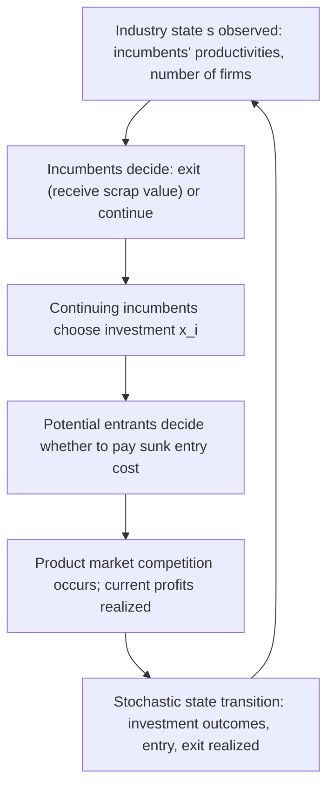

## The Ericson-Pakes Framework of Industry Dynamics

### Definition and Conceptual Foundation

The Ericson-Pakes (1995) framework is the foundational applied model of dynamic industry evolution under uncertainty, providing a unified structure for analyzing firm heterogeneity, stochastic investment, entry, exit, and industry structure evolution as the outcome of a single coherent equilibrium concept — Markov Perfect Equilibrium (MPE). It was developed specifically to formalize and generalize earlier, less tractable models of industry dynamics (such as Jovanovic's 1982 passive-learning model and Gibrat's Law-style empirical regularities) into a fully specified dynamic game amenable to both theoretical analysis and numerical computation, and it remains the workhorse framework underlying the large majority of subsequent applied dynamic oligopoly research.

**Key Points**

- The framework's central achievement is providing a model in which **industry structure is fully endogenous** — the number of active firms, their relative sizes/productivities, and the pattern of entry and exit all emerge from firms' optimizing behavior under uncertainty, rather than being assumed or imposed exogenously as in static oligopoly models.
- The model explicitly incorporates **firm-level heterogeneity** as a core feature (not a complication added later), recognizing that real industries exhibit persistent productivity differences across firms of a similar type — a stylized fact the framework is specifically designed to generate and explain endogenously.
- It sits at the intersection of industrial organization, applied econometrics (as the estimation target for structural dynamic games), and computational economics (given its reliance on numerically solved MPE, as discussed in the broader MPE topic in this chapter).

---

### Model Primitives

**Key Points**

- **Firm state**: each active firm $i$ is characterized by a state variable $\omega_i$, typically interpreted as a productivity or "quality" index, drawn from a discrete or continuous state space.
- **Industry state**: the full payoff-relevant state of the industry is the vector $s = (\omega_1, \ldots, \omega_{N_t}, \chi)$, where $N_t$ is the (endogenous, time-varying) number of active incumbent firms and $\chi$ may include additional aggregate variables (e.g., market size, common demand or cost shocks).
- **Timing within a period**:
  1. Incumbent firms observe the current industry state $s$.
  2. Each incumbent decides whether to **exit** (receiving a scrap value $\phi$, an i.i.d. random draw in the standard formulation) or continue operating.
  3. Continuing incumbents simultaneously choose an **investment level** $x_i \geq 0$.
  4. **Potential entrants** decide whether to pay a sunk entry cost $\kappa_e$ (often modeled as a random draw as well) to enter, drawing an initial state $\omega_e$ if they do.
  5. Product-market competition occurs given the current period's realized states (generating current profits $\pi_i(\omega_i, \omega_{-i})$, typically via an underlying static oligopoly model such as Bertrand or Cournot competition parameterized by the productivity states).
  6. States transition stochastically to next period based on investment outcomes, entry, and exit, and the cycle repeats.

---

### Diagram: The Ericson-Pakes Period Timing

---

### The Investment-Productivity Transition Process

**Key Points**

- Investment $x_i$ does not deterministically improve a firm's state; rather, it raises the **probability** of a favorable transition, capturing the genuine uncertainty inherent in R&D, process improvement, and capacity-building activities in real industries.
- A standard functional form used in the literature specifies the probability of moving up one productivity level as:

$$\Pr(\omega_i' = \omega_i + 1 \mid x_i) = \frac{a x_i}{1 + a x_i}$$

for some parameter $a > 0$ governing the effectiveness of investment, with a complementary probability of remaining at the same state or (in richer specifications) depreciating downward due to industry-wide technological progress that erodes a fixed absolute productivity level's relative standing.

- **Depreciation/decay**: many implementations of the framework incorporate a form of "industry-wide technological frontier advancement," meaning that a firm's *relative* competitive position can erode over time even absent any explicit negative shock, simply because the frontier (or rivals) advances while the firm's absolute state stays fixed — this creates an ongoing competitive pressure to invest merely to maintain relative position, not just to improve it, a feature considered important for generating realistic simulated industry dynamics (avoiding degenerate outcomes where firms invest once and then coast indefinitely). [Inference: the specific inclusion and functional form of this depreciation/decay mechanism vary across different papers using the Ericson-Pakes framework; it is a widely used and standard extension rather than a feature of the single original 1995 specification in every implementation.]

---

### Entry and Exit Dynamics

**Key Points**

- **Exit decision**: an incumbent exits if its continuation value from remaining active, $V_i(s)$, falls below its currently realized scrap value draw $\phi_i$ — since $\phi_i$ is typically modeled as an i.i.d. random draw each period, exit decisions have a probabilistic (rather than deterministic threshold) character at the level of the state alone, but are characterized by a **cutoff rule**: exit if and only if $\phi_i > V_i(s)$, so the *probability* of exit at state $s$ is fully determined by the distribution of $\phi_i$ and the equilibrium value function $V_i(s)$.
- **Entry decision**: potential entrants are typically modeled as an infinite (or large) pool of ex-ante identical firms, each deciding whether to pay a sunk entry cost draw $\kappa_e$ in exchange for the right to enter next period at some initial state $\omega_e$ (often the lowest productivity level, reflecting a "start small" assumption, though richer specifications allow heterogeneous entry states). Entry occurs if and only if the expected discounted value of entering, $\beta E[V_e(s')]$, exceeds the realized entry cost draw.
- **Free entry condition**: in the standard equilibrium characterization, entry continues (in an ex-ante probabilistic sense) until the expected value of entry is driven down to the point where the marginal potential entrant is indifferent — analogous to the zero-profit free-entry condition in static long-run competitive/monopolistic-competition models, but here operating dynamically and stochastically through the entry-cost-draw mechanism rather than a deterministic zero-profit condition.
- This joint entry-exit-investment structure is what allows the model to generate a **stochastically evolving, endogenous number of firms** $N_t$ over time, rather than treating industry structure as fixed or exogenously imposed — a substantial methodological advance relative to earlier static oligopoly models.

---

### Equilibrium Concept and Existence

**Key Points**

- The equilibrium concept is precisely the **Markov Perfect Equilibrium** described in the companion topic: each active firm's investment and exit policy, and each potential entrant's entry policy, must be a best response to all other firms' equilibrium (Markov) policies, at every possible industry state.
- **Existence**: Doraszelski and Satterthwaite (2010) later identified and resolved technical existence problems in the original Ericson-Pakes formulation (specifically regarding the treatment of investment as a deterministic, non-stochastic choice in the original model, which could generate discontinuities undermining standard fixed-point existence proofs), showing that introducing the random scrap-value and entry-cost draws described above (and, in some treatments, a stochastic component to investment effectiveness itself) restores the continuity properties needed to guarantee equilibrium existence via standard fixed-point theorems. [Unverified: the precise technical conditions required for existence in every variant of the model are a matter of ongoing refinement in the theoretical computational-economics literature; the general point that stochastic perturbations to otherwise-deterministic choices resolve certain existence problems is a well-documented finding from Doraszelski and Satterthwaite's work, but should not be read as implying that every conceivable specification of the framework is guaranteed to have a computationally tractable or unique equilibrium.]
- **Non-uniqueness**: as with MPE generally, the Ericson-Pakes framework does not guarantee a **unique** equilibrium for a given set of parameters — multiple equilibria are a genuine theoretical possibility, which complicates both computation (algorithms may converge to different equilibria depending on starting values) and counterfactual policy analysis (different equilibria can imply different comparative statics).

---

### SVG Illustration: State Space and Transition Structure

<svg xmlns="http://www.w3.org/2000/svg" viewBox="0 0 640 340" font-family="Helvetica, Arial, sans-serif">
<text x="320" y="24" text-anchor="middle" font-size="16" font-weight="bold" fill="#1a1a1a">Firm Productivity State Transitions (svg_diagram)</text>
<circle cx="100" cy="180" r="35" fill="#eaf2fb" stroke="#2166ac" stroke-width="2" />
<text x="100" y="185" text-anchor="middle" font-size="13" fill="#1a1a1a">ω = 1</text>
<circle cx="240" cy="180" r="35" fill="#eaf2fb" stroke="#2166ac" stroke-width="2" />
<text x="240" y="185" text-anchor="middle" font-size="13" fill="#1a1a1a">ω = 2</text>
<circle cx="380" cy="180" r="35" fill="#eaf2fb" stroke="#2166ac" stroke-width="2" />
<text x="380" y="185" text-anchor="middle" font-size="13" fill="#1a1a1a">ω = 3</text>
<circle cx="520" cy="180" r="35" fill="#eaf2fb" stroke="#2166ac" stroke-width="2" />
<text x="520" y="185" text-anchor="middle" font-size="13" fill="#1a1a1a">ω = 4</text>
<path d="M 135 170 C 165 150, 205 150, 235 170" fill="none" stroke="#2d8a3e" stroke-width="2" marker-end="url(#arrow4)" />
<text x="185" y="140" text-anchor="middle" font-size="10" fill="#2d8a3e">Pr up ~ f(x_i)</text>
<path d="M 275 170 C 305 150, 345 150, 375 170" fill="none" stroke="#2d8a3e" stroke-width="2" marker-end="url(#arrow4)" />
<path d="M 415 170 C 445 150, 485 150, 515 170" fill="none" stroke="#2d8a3e" stroke-width="2" marker-end="url(#arrow4)" />
<path d="M 240 215 C 200 240, 140 240, 105 215" fill="none" stroke="#b2182b" stroke-width="2" stroke-dasharray="4,3" marker-end="url(#arrow4)" />
<text x="175" y="260" text-anchor="middle" font-size="10" fill="#b2182b">Depreciation (frontier advance)</text>
<rect x="60" y="290" width="80" height="30" rx="5" fill="#fbeaea" stroke="#b2182b" stroke-width="1.5" />
<text x="100" y="309" text-anchor="middle" font-size="10" fill="#1a1a1a">Exit</text>
<line x1="100" y1="215" x2="100" y2="290" stroke="#b2182b" stroke-width="1.5" stroke-dasharray="3,3" />
</svg>

---

### Generated Industry Dynamics: Qualitative Predictions

**Key Points**

- **Increasing dominance vs. leapfrogging**: depending on parameter values (particularly the curvature of the investment cost function and the strength of competitive interaction effects), the model can generate either "increasing dominance" dynamics (leading firms invest more, pulling further ahead over time, consistent with some concentrated high-tech industries) or "leapfrogging/action-reaction" dynamics (lagging firms invest more aggressively to catch up, since the marginal value of investment is higher when further behind, consistent with industries exhibiting more turnover in rank order) — both are legitimate equilibrium outcomes of the same underlying framework under different parameterizations, a key qualitative flexibility that has made the model attractive for matching diverse empirical industry patterns.
- **Selection and industry productivity growth**: the entry-exit margin generates an endogenous **selection effect** — low-productivity incumbents are more likely to exit, and surviving/entering firms are disproportionately drawn from higher-productivity realizations — producing aggregate industry productivity growth over time purely through compositional change, independent of any individual firm's own productivity improvement, a mechanism widely studied in the related empirical "firm selection and reallocation" literature (Hopenhayn, 1992, a closely related single-agent-state model without individual firm heterogeneity beyond entry-shock realization, is often cited alongside Ericson-Pakes as a foundational companion model).
- **Long-run stationary industry structure**: under appropriate parameter conditions, the stochastic process governing the industry state (number of firms, distribution of productivities) can converge to a **stationary distribution** — not a fixed point in levels, but a stable long-run *distribution* over industry configurations, reflecting the perpetual, ongoing entry, exit, and productivity evolution characteristic of real industries even in "mature" markets.

---

### Computational Implementation: The Pakes-McGuire Algorithm

**Key Points**

- Solving for MPE in the Ericson-Pakes framework numerically follows the **Pakes and McGuire (1994)** iterative algorithm: starting from an initial guess of value functions across the full (typically discretized) industry state space, the algorithm alternates between (a) computing each firm's optimal investment/exit policy given current value function guesses, and (b) updating value functions via the Bellman equation given these policies, iterating until convergence to a fixed point.
- **Discretization and truncation**: because the theoretical state space is unbounded (productivity levels, number of firms), practical implementation requires **truncating** the state space at some maximum productivity level and maximum number of firms, introducing an approximation whose accuracy must be checked against sensitivity to the chosen truncation bounds.
- **The curse of dimensionality remains the primary practical constraint**: as discussed in the companion MPE topic, the joint state space grows exponentially in the number of firms, meaning direct application of the Pakes-McGuire algorithm to industries with more than a handful of firms becomes computationally prohibitive without further approximation (e.g., the oblivious equilibrium approach of Weintraub, Benkard, and Van Roy, 2008, developed specifically to extend tractability to larger-$N$ industries).

---

### Empirical and Extended Applications

**Key Points**

- The framework has served as the direct theoretical basis for numerous applied structural estimation papers studying industry evolution, including studies of the ready-mix concrete industry (Collard-Wexler, 2013, examining demand uncertainty and industry structure), telecommunications infrastructure and technology adoption, and various manufacturing sector productivity dynamics studies.
- **Extensions incorporating additional realism** include models with multiple products per firm, geographically differentiated markets (relevant for retail chain expansion studies), collusive behavior nested within the Markov framework via expanded state definitions, and models incorporating learning-by-doing as an alternative or complementary mechanism to explicit R&D-style investment.
- Behavior and specific quantitative predictions (rates of turnover, degree of concentration, responsiveness to demand shocks) are highly sensitive to the specific parameterization and functional form assumptions chosen in any given empirical application — the framework provides a flexible **structure** for generating and testing hypotheses about industry evolution, but does not by itself deliver universal quantitative predictions independent of calibration/estimation to a specific industry's data. [Inference: this caveat reflects the general nature of structural dynamic models — their qualitative flexibility is a documented strength, but it also means that specific numerical predictions require industry-specific estimation rather than being derivable from the model's general structure alone.]

---

### Related Topics

- Markov Perfect Equilibrium in dynamic industry models (the equilibrium concept underlying this framework)
- Doraszelski-Satterthwaite (2010) existence results and model refinements
- Oblivious equilibrium and computational approximation for large-$N$ industries (Weintraub, Benkard, Van Roy, 2008)
- Hopenhayn (1992) model of firm entry, exit, and industry equilibrium
- Structural estimation of dynamic games (nested fixed point and two-step CCP methods)
- Selection effects and aggregate productivity growth from firm heterogeneity
- Applied case studies: ready-mix concrete, retail chain expansion, and R&D-intensive industries
- Learning-by-doing models as an alternative dynamic capability-accumulation mechanism