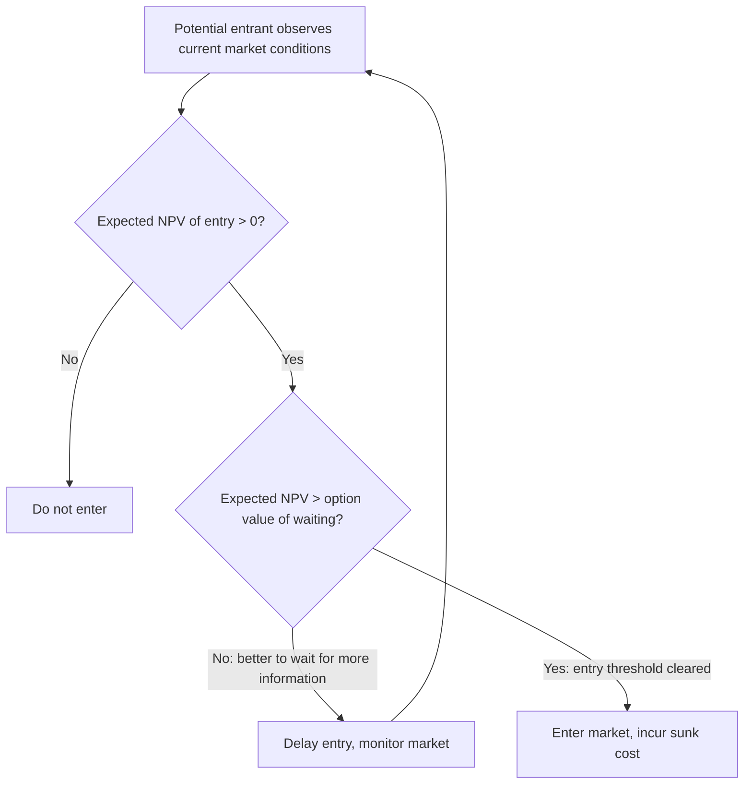
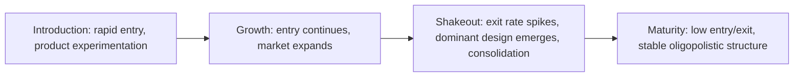

## Firm Entry, Investment, and Exit Over Time

### Definition and Conceptual Foundation

Firm entry, investment, and exit over time refers to the applied study of the three fundamental margins through which industry structure evolves dynamically: **entry** (new firms joining a market), **investment** (incumbent firms accumulating capital, productivity, or capacity), and **exit** (firms permanently leaving a market). While these margins are formalized jointly within equilibrium frameworks such as Ericson-Pakes, this topic addresses the broader theoretical and empirical literature on each margin individually — the economic forces governing entry and exit decisions, the dynamics of investment under uncertainty and irreversibility, and the empirical regularities these processes generate — providing the conceptual building blocks that dynamic oligopoly models formalize into a unified equilibrium structure.

**Key Points**

- These three margins are the primary channels through which **industry structure is not static but continuously evolving**, even in industries that appear "mature" in aggregate — turnover, entry, and exit occur continuously beneath a stable aggregate industry size or concentration measure, a well-documented empirical regularity often referred to as "churning" in the applied IO and labor/firm dynamics literature.
- The theoretical treatment of each margin has a distinct lineage: entry/exit dynamics draw heavily on **real options theory** (irreversibility and timing under uncertainty), investment dynamics draw on **adjustment cost and Tobin's Q theory** as well as **learning curve/learning-by-doing models**, and the two are unified in modern applied work through dynamic stochastic games (see the Ericson-Pakes and Markov Perfect Equilibrium topics).

---

### Entry Dynamics

**Key Points**

- **Static entry condition (textbook benchmark)**: a firm enters if and only if expected post-entry profit exceeds the entry cost, $E[\pi] > \kappa$. This static condition, while pedagogically useful, misses the essential dynamic feature of most real entry decisions: **sunk costs combined with uncertainty create an option value of waiting**.
- **Real options approach to entry** (Dixit, 1989; Dixit and Pindyck, 1994): when entry costs are even partially **sunk** (irrecoverable upon exit) and future market conditions are uncertain, the correct entry threshold is **not** simply "enter when expected NPV is positive," but rather "enter when expected NPV exceeds the value of the option to wait for more information" — this generates entry thresholds strictly above the naive zero-NPV condition and explains empirically observed patterns of firms delaying entry into apparently profitable markets while awaiting resolution of demand or cost uncertainty.
- **Types of entry barriers relevant to the entry margin**: sunk costs (irreversible investments required before operating, e.g., specialized capital, brand-building, regulatory approval costs), absolute cost advantages of incumbents (patents, learning-curve advantages, access to scarce inputs), and strategic entry deterrence (incumbent capacity investment or limit pricing specifically designed to reduce the profitability of entry, discussed further in strategic investment topics of this chapter).
- **Entry as an ongoing stochastic process**: in dynamic industry models (Ericson-Pakes), entry is modeled as governed by a pool of ex-ante identical potential entrants who continuously evaluate a stochastic entry-cost draw against the equilibrium expected value of entering — generating entry as a probabilistic *flow* over time rather than a one-time decision, consistent with the empirically observed pattern of continuous, ongoing entry even in industries with stable long-run firm counts.

---

### Diagram: Entry Decision Under Uncertainty (Real Options Logic)

---

### Investment Dynamics Under Uncertainty and Irreversibility

**Key Points**

- **Tobin's Q theory of investment**: in frictionless neoclassical investment models, a firm invests up to the point where the marginal cost of capital equals its marginal value, summarized by "Q" (the ratio of the market value of installed capital to its replacement cost); investment should occur whenever $Q > 1$. This benchmark, while foundational, is widely recognized as producing counterfactually smooth, continuous investment predictions relative to the observed lumpy, episodic investment behavior of real firms.
- **Adjustment costs**: introducing convex adjustment costs (costs of installing capital that rise more than proportionally with the rate of investment) smooths optimal investment paths and helps explain why firms do not instantaneously jump to a new desired capital stock following a shock — a standard and well-established extension to the frictionless benchmark.
- **Irreversibility and the option value of waiting to invest**: analogous to the entry decision, when investment is even partially irreversible (cannot be costlessly reversed/resold if conditions worsen) and the environment is uncertain, firms rationally **delay investment** beyond the point a naive positive-NPV rule would suggest, since committing capital forecloses the option to wait for better information — this is the same underlying real-options logic as the entry decision, applied to the investment margin, and is a major explanation in the literature for observed aggregate investment volatility and its sensitivity to uncertainty shocks. [Inference: the magnitude of option-value-driven investment delay is sensitive to the specific degree of irreversibility and volatility assumed in a given model calibration; the qualitative direction of the effect (uncertainty depresses investment when investment is irreversible) is a well-established theoretical result, but precise quantitative magnitudes are application-specific.]
- **Lumpy investment and (S,s)-type policies**: empirical investment data at the plant level (Doms and Dunne, 1998, and related studies) show that investment is highly episodic — many periods of little or no investment punctuated by occasional large investment "spikes" — a pattern consistent with fixed (non-convex) adjustment costs generating optimal **(S,s)-type policies**: firms accumulate a gap between actual and desired capital stock and only adjust in discrete, infrequent episodes once the gap crosses a threshold, rather than continuously fine-tuning capital stock as smooth adjustment-cost models would predict.

---

### Exit Dynamics

**Key Points**

- **Exit as the mirror-image real-options problem**: exit decisions are also governed by option-value logic, but in the opposite direction from entry — a firm with negative current operating profit may nonetheless rationally **continue operating** rather than exit immediately, since exit is typically irreversible (re-entry, if even possible, requires re-incurring sunk costs) and current losses may reverse with a future improvement in market conditions. This generates a **band of inaction**: firms exit only when losses are severe enough, and persist long enough, to exceed the option value of maintaining the ability to benefit from a potential future recovery.
- **Sunk cost hysteresis**: the combination of sunk entry costs and irreversible exit decisions creates a "hysteresis" band in which a firm that entered under one set of market conditions may continue operating even after conditions deteriorate substantially below what would have justified entry in the first place — since the sunk cost is, definitionally, no longer recoverable and therefore irrelevant to the forward-looking exit decision, while the (typically smaller) ongoing operating losses may still be less costly than exiting and forfeiting the option to benefit from a recovery.
- **Selection on productivity**: in models with firm heterogeneity (Hopenhayn, 1992; Ericson-Pakes), exit is not random but systematically concentrated among **lower-productivity firms**, since continuation value is increasing in productivity — this generates an important **compositional/selection channel** for aggregate industry productivity growth, distinct from and additive to within-firm productivity improvement.
- **Scrap value and exit timing**: models typically incorporate a scrap value (liquidation value of exiting, potentially stochastic) that a firm compares against its continuation value; the exit decision becomes a simple cutoff rule (exit if scrap value draw exceeds continuation value) once the dynamic optimization problem is properly formulated, as discussed in the Ericson-Pakes framework topic.

---

### SVG Illustration: The Entry-Exit Hysteresis Band

<svg xmlns="http://www.w3.org/2000/svg" viewBox="0 0 620 340" font-family="Helvetica, Arial, sans-serif">
<text x="310" y="24" text-anchor="middle" font-size="16" font-weight="bold" fill="#1a1a1a">Entry-Exit Hysteresis Under Sunk Costs (svg_diagram)</text>
<line x1="70" y1="300" x2="560" y2="300" stroke="#333" stroke-width="2" />
<text x="560" y="322" font-size="13" fill="#333">Market profitability</text>
<line x1="420" y1="270" x2="420" y2="330" stroke="#2166ac" stroke-width="2.5" />
<text x="420" y="255" text-anchor="middle" font-size="12" fill="#2166ac">Entry threshold</text>
<text x="420" y="240" text-anchor="middle" font-size="11" fill="#2166ac">(NPV + option value cleared)</text>
<line x1="220" y1="270" x2="220" y2="330" stroke="#b2182b" stroke-width="2.5" />
<text x="220" y="255" text-anchor="middle" font-size="12" fill="#b2182b">Exit threshold</text>
<text x="220" y="240" text-anchor="middle" font-size="11" fill="#b2182b">(continuation value below scrap)</text>
<rect x="220" y="290" width="200" height="20" fill="#e6f4ea" opacity="0.6" />
<text x="320" y="335" text-anchor="middle" font-size="12" fill="#2d8a3e">Band of inaction: neither enter nor exit</text>

<text x="130" y="310" text-anchor="middle" font-size="11" fill="`#4d4d4d`">Low profitability</text>

<text x="500" y="310" text-anchor="middle" font-size="11" fill="`#4d4d4d`">High profitability</text>

</svg>

---

### Empirical Regularities: Firm Turnover and Industry Life Cycles

**Key Points**

- **Simultaneous entry and exit ("churning")**: empirical studies of establishment-level data (Dunne, Roberts, and Samuelson, 1988, foundational early work; Davis, Haltiwanger, and Schuh, 1996, on job creation/destruction) consistently document that gross entry and exit rates substantially exceed the *net* change in the number of firms — industries with stable or even declining total firm counts still exhibit substantial simultaneous entry and exit, a pattern any credible dynamic model must be able to generate.
- **Post-entry growth and survival patterns**: entering firms are typically smaller than incumbents on average, and exhibit a strong empirical regularity of **conditional convergence** — surviving entrants tend to grow faster than incumbents (converging toward the industry's typical efficient scale), while the sizable fraction of entrants that fail tend to do so within the first several years, a pattern often described as an industry-life-cycle or "up or out" dynamic.
- **The industry life cycle (Klepper, 1996, and related work)**: many industries, particularly following the introduction of a major product innovation, exhibit a characteristic historical pattern of an initial surge of entry (many firms, often experimenting with varied product designs), followed eventually by a **shakeout** phase (a sharp increase in exit rates and industry consolidation, often coinciding with the emergence of a dominant product design), and finally a mature phase with relatively low entry and exit rates and a stable, often oligopolistic, firm count. [Unverified: while the qualitative shakeout pattern is well-documented across numerous historical industry case studies (e.g., early automobile and television manufacturing), the precise underlying causal mechanism (dominant design emergence versus economies of scale versus demand saturation) remains a subject of ongoing debate and likely varies across specific industries; this should be read as a widely observed empirical pattern with multiple candidate theoretical explanations rather than a single settled causal account.]

---

### Diagram: Stylized Industry Life Cycle

---

### Strategic Interactions Between Investment and Entry Deterrence

**Key Points**

- Incumbent investment decisions are not made in isolation from the entry margin — a rich strategic-investment literature (Dixit, 1980; Spence, 1977, on capacity as a commitment device, discussed more fully in dedicated strategic entry deterrence topics) shows that incumbents may deliberately **over-invest in capacity** beyond their own short-run profit-maximizing level specifically to credibly signal to potential entrants that post-entry competition would be unprofitable, thereby deterring entry altogether.
- This creates a direct link between the three margins covered in this topic: incumbent investment choices causally affect the entry margin (by altering potential entrants' expected post-entry profits), and the resulting equilibrium industry structure feeds back into future investment and exit incentives for all active firms — the fully dynamic, simultaneous-determination logic that the Ericson-Pakes / MPE framework is designed to capture formally.

---

### Related Topics

- Markov Perfect Equilibrium in dynamic industry models (formal equilibrium unifying these three margins)
- The Ericson-Pakes framework of industry dynamics
- Real options theory and irreversible investment under uncertainty (Dixit-Pindyck)
- Tobin's Q, adjustment costs, and lumpy investment ((S,s) policies)
- Hopenhayn (1992) model of firm entry, exit, and industry equilibrium
- Sunk costs, hysteresis, and strategic entry deterrence (Dixit, Spence capacity models)
- Industry life cycle and shakeout dynamics (Klepper, 1996)
- Job creation and destruction, and establishment-level turnover data (Davis-Haltiwanger-Schuh)