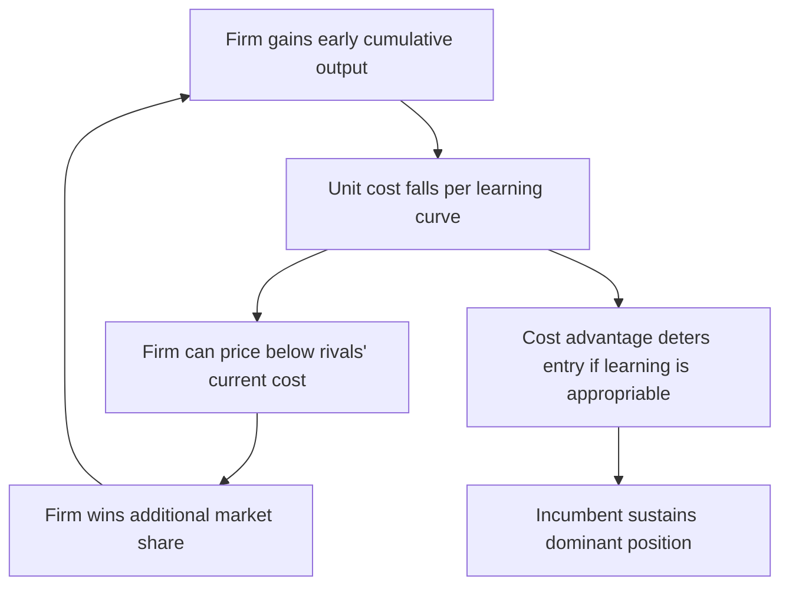

## Learning Curves and Dynamic Cost Advantages

### Definition and Conceptual Foundation

A learning curve (also called an experience curve) describes the empirical regularity that unit production costs decline as a firm accumulates cumulative production experience, holding the technology and input prices otherwise fixed. This is distinct from static economies of scale, which relate cost to the *rate* of output at a point in time. Learning curves relate cost to the *cumulative volume* produced over the firm's history.

The mechanism is dynamic: workers and managers improve efficiency through repetition, engineers refine production processes, defect rates fall, and organizational routines become more efficient. Because these improvements accumulate with cumulative output rather than with calendar time, a firm that produces faster today moves down the curve faster and reaches lower costs sooner than a slower-moving rival, even if both eventually produce the same total volume.

### The Learning Curve Equation

The canonical formulation is a power function relating unit cost to cumulative output:

$$C(Q) = C_1 \cdot Q^{-\alpha}$$

Where:

- $C(Q)$ is the unit cost of producing the $Q$-th unit
- $C_1$ is the cost of producing the first unit
- $Q$ is cumulative output produced to date
- $\alpha$ is the learning elasticity, $\alpha > 0$

The learning rate is typically expressed as a "progress ratio." A common convention: an $x\%$ learning curve means unit cost falls to $x\%$ of its previous level every time cumulative output doubles. The relationship between the progress ratio $\phi$ and the elasticity $\alpha$ is:

$$\phi = 2^{-\alpha} \quad \Longleftrightarrow \quad \alpha = -\frac{\ln \phi}{\ln 2}$$

For example, an 80% learning curve ($\phi = 0.8$) implies that doubling cumulative output reduces unit cost to 80% of its prior level. Solving for $\alpha$:

$$\alpha = -\frac{\ln(0.8)}{\ln(2)} \approx 0.322$$

**Example**

Suppose $C_1 = \$100$ and the firm operates on an 80% learning curve.

| Cumulative Output ($Q$) | Unit Cost |
| --- | --- |
| 1 | $100.00 |
| 2 | $80.00 |
| 4 | $64.00 |
| 8 | $51.20 |
| 16 | $40.96 |

Each doubling of cumulative output (1→2, 2→4, 4→8, 8→16) multiplies unit cost by 0.8, consistent with the progress ratio definition.

### Distinguishing Learning Economies from Scale Economies

This distinction is central to industrial organization analysis of dynamic competition:

| Dimension | Economies of Scale | Learning Curve Economies |
| --- | --- | --- |
| Driver | Rate of output (flow) | Cumulative output (stock) |
| Time dependence | Static — cost falls at higher output rate regardless of history | Dynamic — cost falls with accumulated experience over time |
| Reversibility | Reversible — cost rises again if output rate falls | Largely irreversible — cost reduction persists even if current output falls |
| Strategic implication | Favors large-scale entry | Favors early/aggressive entry to accumulate experience first |

[Inference] In practice, empirical cost declines observed in an industry often reflect a blend of both effects, and separating them econometrically requires panel data with independent variation in output rate and cumulative volume — a well-known identification problem in empirical IO.

### Sources of Learning Effects

- **Labor learning**: Direct labor becomes faster and more accurate through repetition (the original context in which learning curves were documented, in aircraft manufacturing during World War II).
- **Process engineering**: Incremental refinements to tooling, layout, and workflow sequencing.
- **Product redesign**: Feedback from production reveals design simplifications that reduce assembly complexity.
- **Managerial and organizational learning**: Improved scheduling, quality control, and supply chain coordination.
- **Supplier learning**: Input suppliers also move down their own learning curves, which can pass through as lower input prices.

### Strategic Implications for Dynamic Oligopoly

#### Learning as a Barrier to Entry and Source of First-Mover Advantage

If learning effects are firm-specific (not industry-wide spillovers) and are not fully appropriable by rivals or new entrants, an incumbent with a head start in cumulative output enjoys a persistent unit-cost advantage. This changes the nature of competition:

- A firm may find it optimal to price below current marginal cost early in the product life cycle — not as predation, but as **rational forward-looking investment** in moving down the learning curve faster, anticipating that today's cumulative output lowers tomorrow's costs.
- This creates a rationale for **aggressive early-stage pricing** that can appear anti-competitive but has a legitimate efficiency-based explanation, which is a recurring issue in antitrust analysis of learning-curve industries (e.g., semiconductors).
- Because the cost advantage compounds, being second-to-scale can be a persistent disadvantage even for an equally efficient rival, potentially deterring entry altogether.

#### The Learning Curve as a Commitment Device

Because early production commits a firm to a lower future cost position, learning curves function similarly to a capacity commitment in Spence-style entry deterrence models: aggressive current output is a credible signal/commitment that lowers the firm's future marginal cost, making post-entry price competition less attractive to a potential rival.

#### Appropriability and Spillovers

The strategic value of learning depends critically on **appropriability**:

- **Firm-specific learning** (tacit knowledge, proprietary process improvements) is excludable and generates a durable competitive advantage.
- **Industry-wide learning spillovers** (via labor mobility, reverse engineering, supplier diffusion, or published engineering knowledge) diffuse the cost reduction across all firms, weakening any single firm's strategic advantage from being first.

[Inference] The degree of appropriability is often industry-specific and difficult to measure directly; empirical work typically infers it indirectly from patterns of market share persistence or price behavior rather than observing "spillover rate" as a directly measured parameter.

### Formal Illustration: Two-Period Dynamic Pricing Model

Consider a simplified two-period model. A firm's period-2 marginal cost depends on period-1 cumulative output $q_1$:

$$c_2(q_1) = c_0 - \gamma q_1$$

Where $c_0$ is the baseline marginal cost and $\gamma > 0$ captures the learning intensity (cost reduction per unit of prior experience).

The firm's total discounted profit over both periods is:

$$\Pi = [p_1 - c_0]q_1 + \delta \left[p_2 - (c_0 - \gamma q_1)\right] q_2$$

Where $\delta$ is the discount factor. Differentiating with respect to $q_1$, the firm's optimal period-1 output condition becomes:

$$p_1 - c_0 + \delta \gamma q_2 = 0 \quad \Rightarrow \quad p_1 = c_0 - \delta \gamma q_2$$

This shows the firm rationally sets period-1 price **below current marginal cost** $c_0$ whenever $\delta \gamma q_2 > 0$ — the discount reflects the shadow value of future cost savings from accumulated learning. The steeper the learning curve (higher $\gamma$) or the more patient the firm (higher $\delta$), the more aggressive the period-1 pricing.

### Diagram: Learning Curve vs. Cumulative Output (svg_diagram)

<svg xmlns="http://www.w3.org/2000/svg" viewBox="0 0 640 420">
<text x="320" y="30" text-anchor="middle" font-size="18" font-weight="bold" fill="#1a1a1a">Unit Cost vs. Cumulative Output (svg_diagram)</text>

<line x1="80" y1="360" x2="600" y2="360" stroke="#333" stroke-width="2" />
<line x1="80" y1="360" x2="80" y2="60" stroke="#333" stroke-width="2" />

<text x="340" y="400" text-anchor="middle" font-size="14" fill="#333">Cumulative Output (Q)</text>

<text x="30" y="210" text-anchor="middle" font-size="14" fill="#333" transform="rotate(-90 30 210)">Unit Cost</text>

<path d="M 100 80 C 180 200, 260 280, 340 320 C 420 340, 500 350, 580 355" fill="none" stroke="`#c0392b`" stroke-width="3" />

<text x="420" y="300" font-size="13" fill="`#c0392b`" font-weight="bold">80% Learning Curve</text>

<path d="M 100 100 C 220 180, 340 220, 460 250 C 500 260, 550 265, 580 268" fill="none" stroke="`#2980b9`" stroke-width="3" stroke-dasharray="6,4" />

<text x="420" y="240" font-size="13" fill="`#2980b9`" font-weight="bold">95% Curve (weak learning)</text>

<circle cx="180" cy="200" r="4" fill="#1a1a1a" />
<circle cx="260" cy="280" r="4" fill="#1a1a1a" />
<circle cx="340" cy="320" r="4" fill="#1a1a1a" />

<text x="80" y="70" font-size="12" fill="#666">C1</text>

<text x="580" y="375" font-size="12" fill="#666">Q</text>

</svg>

### Mermaid Diagram: Strategic Feedback Loop from Early Volume

### Empirical and Historical Evidence

Learning curve effects were first systematically documented in aircraft manufacturing in the 1930s–1940s, where direct labor hours per airframe fell predictably with cumulative units produced. The Boston Consulting Group later generalized this into the "experience curve" concept applied broadly across manufacturing sectors in the 1960s–1970s, extending the concept beyond labor cost to *total* unit cost (including capital and overhead).

[Unverified] Specific progress ratios cited in classic BCG studies (e.g., ~70–90% ranges across various industries) are historical estimates from proprietary consulting data and should be treated as illustrative rather than universally applicable constants, since progress ratios vary substantially by industry, technology maturity, and measurement methodology.

### Policy and Antitrust Considerations

- **Predatory pricing doctrine tension**: Pricing below current marginal cost is sometimes used as evidence of predatory intent in antitrust cases. Learning-curve dynamics complicate this inference, because below-cost pricing can be a rational, welfare-consistent response to dynamic cost structure rather than an attempt to exclude rivals and later recoup losses through monopoly pricing.
- **Industrial policy rationale**: Governments have historically used learning-curve logic to justify infant-industry protection or subsidies (e.g., semiconductors, solar photovoltaics, aircraft manufacturing), on the argument that domestic firms need a protected period to accumulate cumulative output and reach cost parity with more experienced foreign competitors.
- [Speculation] Whether such policies generate net welfare gains depends on assumptions about appropriability and whether protected firms would have reached competitive cost levels absent intervention — this remains a genuinely contested empirical and normative question in trade and industrial policy literature.

### Limitations and Critiques

- Learning curves eventually flatten; there is a practical floor below which further experience yields negligible cost reduction (the curve is not indefinitely exploitable).
- Aggregating multiple cost components (labor, materials, overhead) into a single experience curve can mask heterogeneous underlying mechanisms with different decay rates.
- Distinguishing learning-by-doing from simple economies of scale requires careful econometric identification; cross-sectional cost comparisons alone are often insufficient. [Inference] This is one reason learning-curve claims in specific industry case studies should be evaluated against the underlying data source and methodology rather than taken as a settled parameter estimate.

**Related Topics**

- Economies of scale vs. economies of scope in dynamic competition
- Predatory pricing and antitrust standards (Areeda-Turner cost tests)
- First-mover advantage and preemption models (Spence capacity commitment)
- Network effects and switching costs as alternative dynamic advantages
- Patent races and R&D competition in dynamic oligopoly
- Diffusion of innovation and technology spillovers
- Industry life-cycle models (Klepper's shakeout dynamics)