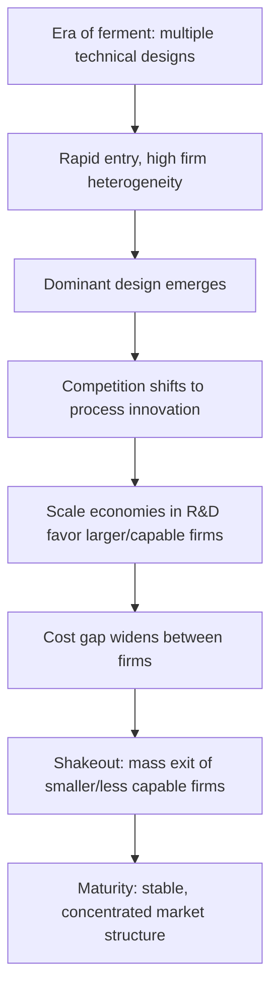

## Industry Life Cycles and Shakeout Patterns

### Definition and Conceptual Foundation

The industry life cycle describes the systematic evolution of market structure, firm entry/exit, and competitive dynamics as an industry matures from its founding through growth, shakeout, and maturity. A **shakeout** refers to the specific empirical phenomenon observed across many manufacturing industries in which the number of active producers rises sharply during an early growth phase, then declines sharply — often by 50% or more — even as industry output continues to grow, before stabilizing at a much lower firm count during maturity.

This pattern is one of the most robust stylized facts in empirical industrial organization, documented across dozens of product industries including automobiles, tires, televisions, penicillin, and semiconductors.

### The Canonical Life Cycle Stages

#### Stage 1: Introduction / Era of Ferment

- Product design is not yet standardized; multiple competing technical approaches ("dominant design" not yet established) coexist.
- Entry barriers are low: capital requirements are modest, and technical knowledge is not yet codified into scale-dependent production processes.
- Firm entry accelerates rapidly as the market's commercial viability becomes apparent and imitation is relatively easy.
- Demand grows but the customer base is limited to early adopters; product variety is high.

#### Stage 2: Growth and Peak Firm Count

- Industry output expands rapidly, drawing in continued entry.
- The number of firms reaches its historical maximum.
- Competition is largely non-price, based on product differentiation and technical experimentation.

#### Stage 3: Shakeout

- A **dominant design** emerges — a de facto standard product architecture that captures majority market acceptance (e.g., the DC-3 in aircraft, the QWERTY keyboard layout, the standard automobile layout with an internal combustion engine under a front hood).
- Competition shifts from product innovation to **process innovation** — because the product architecture is now fixed, competitive advantage shifts to who can manufacture it most cheaply and reliably.
- This shift favors firms that can achieve scale economies and move quickly down the learning curve (see: learning curves and dynamic cost advantages).
- Firms unable to achieve minimum efficient scale, or that bet on a losing technical design, exit or are acquired.
- The exit rate during shakeout substantially exceeds the entry rate, and the net firm count falls sharply over a relatively compressed period.

#### Stage 4: Maturity

- Firm count stabilizes at a much lower level than the growth-stage peak.
- Surviving firms are typically larger, more capital-intensive, and compete increasingly on cost and incremental process efficiency rather than radical product differentiation.
- Market concentration (e.g., $C_4$ or Herfindahl-Hirschman Index) rises substantially relative to the growth stage and then stabilizes.

### Diagram: Stylized Shakeout Pattern

<svg xmlns="http://www.w3.org/2000/svg" viewBox="0 0 640 420">
<text x="320" y="30" text-anchor="middle" font-size="18" font-weight="bold" fill="#1a1a1a">Number of Firms Over the Industry Life Cycle (svg_diagram)</text>

<line x1="80" y1="360" x2="600" y2="360" stroke="#333" stroke-width="2" />
<line x1="80" y1="360" x2="80" y2="60" stroke="#333" stroke-width="2" />

<text x="340" y="400" text-anchor="middle" font-size="14" fill="#333">Time</text>

<text x="30" y="210" text-anchor="middle" font-size="14" fill="#333" transform="rotate(-90 30 210)">Number of Active Firms</text>

<path d="M 100 340 C 150 300, 190 150, 230 100 C 260 80, 290 75, 320 80 C 360 90, 400 180, 440 260 C 470 300, 520 320, 580 322" fill="none" stroke="`#c0392b`" stroke-width="3" />

<line x1="230" y1="360" x2="230" y2="90" stroke="#999" stroke-dasharray="4,3" />
<line x1="320" y1="360" x2="320" y2="80" stroke="#999" stroke-dasharray="4,3" />
<line x1="440" y1="360" x2="440" y2="260" stroke="#999" stroke-dasharray="4,3" />

<text x="130" y="375" font-size="12" fill="#333">Introduction</text>

<text x="250" y="375" font-size="12" fill="#333">Growth</text>

<text x="345" y="375" font-size="12" fill="#333">Shakeout</text>

<text x="490" y="375" font-size="12" fill="#333">Maturity</text>

<circle cx="320" cy="80" r="4" fill="#1a1a1a" />
<text x="330" y="65" font-size="12" fill="#1a1a1a">Peak firm count</text>
<circle cx="440" cy="260" r="4" fill="#1a1a1a" />
<text x="450" y="250" font-size="12" fill="#1a1a1a">Dominant design emerges</text>
</svg>

### The Klepper Model of Shakeout

Steven Klepper's model provides the leading formal explanation for the shakeout pattern, integrating firm heterogeneity, innovation incentives, and scale economies:

- Firms differ in **innate capability** — their ability to generate valuable product and process innovations, often linked to pre-entry experience (e.g., founders' prior employment in the industry or in closely related industries).
- Early in the industry, product innovation dominates and rewards diverse experimentation, so many heterogeneous firms can profitably coexist.
- As the market grows, larger, more capable firms with more R&D can spread the fixed cost of innovation over greater output, giving them declining unit costs of process improvement. This is a scale-driven "increasing returns to R&D" effect: a firm producing more units earns a higher return per unit of R&D spending on process improvement.
- Because the return to process R&D scales with the firm's own output level, larger incumbents pull further ahead in cost efficiency, and smaller/later entrants find it decreasingly attractive to remain, triggering exit.
- [Inference] Klepper's framework predicts firm exit is concentrated among firms with lower pre-entry capability/experience and smaller scale — an empirically testable implication that has been supported in several of Klepper's own historical case studies (e.g., automobiles, tires), though the degree to which this generalizes to every industry is an ongoing empirical question rather than a universal law.

### Formal Sketch: Scale-Driven Selection Mechanism

Let firm $i$'s unit cost reduction from process R&D be increasing in own output $q_i$, reflecting economies of scale in innovation:

$$c_i(t+1) = c_i(t) - \beta \cdot f(q_i(t))$$

Where $f(\cdot)$ is increasing and $\beta$ captures the innovation-to-cost-reduction technology, common across firms. Because $q_i$ differs across firms (with more capable/earlier firms typically larger), the cost-reduction term compounds unevenly: firms with larger initial $q_i$ reduce costs faster, widening the cost gap over time. When a rival's cost $c_j(t)$ exceeds the market-clearing price, that firm exits. This generates an **endogenous, cost-driven exit wave** rather than exit driven by exogenous demand shocks — the defining feature of a "shakeout" as opposed to ordinary business-cycle-driven exit.

### Dominant Design and Technological Standardization

The concept of a **dominant design** (Utterback and Abernathy) is closely linked to shakeout timing:

- Prior to a dominant design, competition is primarily on product attributes, and R&D is diffuse across many technical approaches.
- Once a dominant design emerges — often driven by network effects, regulatory standard-setting, or a de facto market tipping point — the direction of innovation shifts decisively toward process efficiency for the now-fixed architecture.
- This shift disadvantages firms that had specialized in alternative (now-obsolete) technical approaches, contributing directly to the shakeout.
- [Unverified] The precise causal timing — whether dominant design emergence *triggers* the shakeout or merely *coincides* with it as both are driven by a common underlying maturation process — is debated in the technology management literature, and empirical disentanglement is difficult because both variables tend to move together in historical data.

### Mermaid Diagram: Causal Mechanism Linking Life-Cycle Stages

### Empirical Regularities Across Industries

Cross-industry studies (notably Gort and Klepper's original 1982 analysis and Klepper's subsequent work) document the following recurring patterns:

- The ratio of peak firm count to mature-stage firm count is often substantial (commonly cited historical examples show peak counts several times the eventual stable count).
- Firm exit during shakeout is concentrated in a relatively short window (years, not decades) relative to the industry's overall lifespan.
- Survivors tend disproportionately to be firms that entered relatively early and/or whose founders had prior experience in the industry or a closely related one.
- Price typically declines substantially over the life cycle even as output rises, consistent with combined learning-curve and scale-economy cost reductions being passed through to consumers as competition and standardization proceed.

[Unverified] Specific numerical magnitudes (e.g., "the U.S. auto industry had over 200 manufacturers at peak, falling to a handful") are widely cited stylized facts from historical industry studies; exact figures vary by source and definitional boundaries of "the industry," and should be verified against the primary historical dataset if precision is required.

### Exceptions and Boundary Conditions

Not all industries exhibit the classic shakeout pattern. Relevant conditions that weaken or eliminate it include:

- **Low scale economies in production or R&D**: If unit cost does not fall meaningfully with firm size, larger firms gain no structural advantage, and the industry can sustain many small firms indefinitely (e.g., many service industries).
- **Persistent product differentiation**: If consumer demand supports many stable niches (monopolistic competition with durable variety preferences), a dominant design may never fully emerge, and firm count remains relatively stable.
- **Continual re-innovation**: Industries with successive waves of radical (rather than incremental) innovation can experience repeated "mini life cycles," resetting the process-innovation dynamic before a full shakeout occurs.
- [Speculation] Digital and software-based industries with near-zero marginal cost and strong network effects may exhibit compressed or structurally different shakeout dynamics than the classic manufacturing-based Klepper model, since the underlying mechanism (scale economies in physical process R&D) does not map cleanly onto software; this is an area of ongoing scholarly debate rather than settled theory.

### Strategic Implications for Firms

- **Timing of entry**: Entering during the era of ferment carries higher technological risk (may back a losing design) but potential first-mover learning advantages; entering post-shakeout requires overcoming an established cost/scale gap.
- **R&D strategy shift**: Firms should anticipate the strategic pivot from product to process innovation as a dominant design consolidates, and reallocate R&D investment accordingly ahead of the shakeout rather than during it.
- **M&A as an exit mechanism**: Not all "exit" during shakeout is failure — a significant share occurs via acquisition by more efficient incumbents, consistent with the cost-based selection mechanism rather than pure business failure.

### Relationship to Learning Curves and Dynamic Cost Advantages

The shakeout mechanism and learning-curve dynamics are complementary parts of the same broader phenomenon of **dynamic cost-based competition**: firms that accumulate cumulative output and R&D experience earliest gain compounding cost advantages via both learning-by-doing (see prior topic) and scale economies in process R&D (Klepper mechanism), and this combined advantage is what ultimately drives less efficient rivals out of the market during the shakeout phase.

**Related Topics**

- Learning curves and dynamic cost advantages
- Dominant design theory (Utterback-Abernathy model)
- Firm heterogeneity and selection (Jovanovic's noisy selection model)
- Market concentration measures (HHI, concentration ratios) over time
- Creative destruction and Schumpeterian competition
- Entry deterrence and preemption in growing markets
- Network effects and standards wars