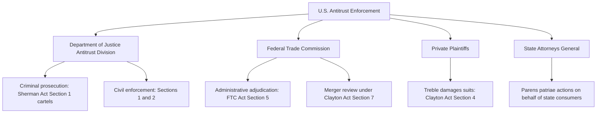

## Historical Origins and Goals of Antitrust Policy

### Definition and Conceptual Foundation

Antitrust policy (called "competition law" outside the United States) refers to the body of statutes, case law, and enforcement institutions designed to prevent and remedy anticompetitive conduct — monopolization, collusion, and mergers that substantially harm competition. The term "antitrust" derives literally from the original legal target: the "trust," a legal device used in the late 19th century United States to consolidate control over entire industries under a single governing board while nominally preserving separate corporate ownership.

### Historical Origins: The Trust Problem

#### The Trust Device

In the 1870s–1880s, industrialists faced a legal constraint: corporations chartered in one U.S. state generally could not own stock in corporations chartered in another state, which limited direct horizontal consolidation across state lines. The **trust** device circumvented this: shareholders of competing firms transferred their voting shares to a small board of trustees in exchange for trust certificates, and the trustees then centrally directed pricing and output decisions across all nominally independent firms.

- **Standard Oil Trust (1882)**, organized by John D. Rockefeller, is the archetypal example: it consolidated the great majority of U.S. oil refining capacity under unified control, enabling coordinated pricing and aggressive tactics against remaining independent refiners.
- Similar trusts formed in sugar, whiskey, tobacco, and other industries during this period, prompting broad public concern about concentrated economic power independent of any single legal case.

#### Populist and Political Context

The trust movement coincided with, and substantially fueled, the broader Populist political movement of the 1880s–1890s, which drew support primarily from farmers and small business owners who perceived themselves as economically squeezed between concentrated railroad, banking, and manufacturing interests. This political pressure, rather than academic economic theory alone, was the immediate proximate driver of federal antitrust legislation. [Inference] The relative weight of economic-efficiency concerns versus political/distributional concerns (protecting small producers from large rivals) in motivating the original statute is a matter of ongoing historical and legal-scholarly interpretation rather than a settled single narrative — this ambiguity persists directly into modern debates about antitrust's proper goals (see below).

### The Sherman Act (1890)

The Sherman Antitrust Act, the foundational U.S. federal antitrust statute, contains two central substantive provisions:

- **Section 1**: Prohibits "every contract, combination..., or conspiracy, in restraint of trade or commerce among the several States." This is the core provision addressing collusion (price-fixing, market allocation, bid-rigging) between otherwise independent firms.
- **Section 2**: Prohibits monopolization, attempted monopolization, and conspiracy to monopolize by a single firm or group acting unilaterally.

The statutory language is famously broad and vague ("restraint of trade" is undefined), which by design delegated substantial interpretive authority to federal courts. This has meant that the *substantive content* of U.S. antitrust law has evolved almost entirely through case law and prosecutorial/enforcement practice rather than through subsequent statutory amendment of the core prohibitions.

### The Clayton Act and FTC Act (1914)

Enacted amid concerns that the Sherman Act, as interpreted, was insufficiently precise to prevent anticompetitive conduct before it matured into full monopoly, Congress passed two complementary statutes in 1914:

- **Clayton Act**: Addresses specific practices with the *potential* to lessen competition, including price discrimination (Section 2, later strengthened by the Robinson-Patman Act of 1936), exclusive dealing and tying arrangements (Section 3), and mergers and acquisitions that may substantially lessen competition (Section 7). Critically, Clayton Act standards permit intervention based on probable future competitive harm, rather than requiring proof of a completed restraint of trade.
- **Federal Trade Commission Act**: Created the FTC as a specialized administrative agency with investigative and enforcement authority, and established the broad prohibition on "unfair methods of competition" (Section 5), which grants the FTC somewhat more flexible enforcement authority than the categorical language of the Sherman Act.

### Institutional Structure of U.S. Antitrust Enforcement

Both the DOJ and FTC share overlapping jurisdiction for civil enforcement and merger review, with case allocation determined through an informal interagency clearance process. This dual-agency structure is somewhat unusual internationally; most jurisdictions consolidate competition enforcement in a single administrative authority (e.g., the European Commission's Directorate-General for Competition).

### The Central Debate: What Are Antitrust's Goals?

This is the most consequential open question in antitrust policy, and different answers produce materially different enforcement outcomes for identical conduct.

#### Consumer Welfare Standard

Since roughly the late 1970s, U.S. antitrust enforcement and judicial doctrine have been dominated by the **consumer welfare standard**, associated with the Chicago School of economic analysis (notably Robert Bork's influential 1978 work). Under this view:

- The sole legitimate goal of antitrust is to prevent conduct that raises prices, restricts output, or reduces quality/innovation to the detriment of consumers.
- Conduct that increases efficiency — even if it harms competitors or increases market concentration — is not itself antitrust-relevant unless it also harms *consumers*.
- This standard is typically operationalized through a **total welfare** or **consumer surplus** framework, often assessed using the tools of price theory: market definition, market power measurement, and effects-based analysis of specific conduct.

#### Alternative and Historical Goals

Prior to the Chicago School's ascendance, and in ongoing contemporary "neo-Brandeisian" or "New Brandeis" critique (associated with scholars such as Lina Khan, who later chaired the FTC), antitrust has been argued to serve — or historically did serve — a broader set of goals:

- **Protection of the competitive process itself**, independent of measured consumer price effects, on the view that concentrated economic power is a threat to a functioning competitive market structure regardless of short-run price outcomes.
- **Protection of small businesses and producers** from being outcompeted or coercively disadvantaged by large firms, reflecting the original Populist-era political impulse behind the Sherman Act.
- **Distribution of economic and political power**, on the theory (associated with Louis Brandeis, "the curse of bigness") that excessive corporate concentration threatens democratic self-governance independent of any efficiency calculation.
- **Producer welfare / total welfare** approaches, distinct from pure consumer welfare, which would in principle allow efficiency gains that harm consumers but sufficiently benefit producers to be evaluated differently (a distinction of some technical importance in welfare economics, though it has had limited direct doctrinal adoption in U.S. case law).

[Inference] Which of these goals should govern courts' interpretation of the deliberately broad and undefined statutory language ("restraint of trade," "unfair methods of competition") cannot be resolved by textual analysis of the statutes alone, since Congress did not specify a single welfare standard; the choice has consistently been made through evolving judicial and enforcement doctrine rather than legislative amendment, which is precisely why the consumer-welfare-versus-Brandeisian debate remains legally live today rather than settled.

### The Rule of Reason vs. Per Se Illegality

A parallel and closely related doctrinal question is *how* conduct should be evaluated once a goal is chosen:

- **Per se illegality**: Certain categories of conduct (notably naked horizontal price-fixing and market-allocation agreements) are conclusively presumed anticompetitive without case-specific economic analysis, on the premise that such conduct has no plausible efficiency justification.
- **Rule of reason**: Most other conduct is evaluated through a fact-specific balancing of procompetitive justifications against anticompetitive effects, typically requiring formal market definition and market power analysis.

The scope of per se treatment has narrowed considerably over recent decades as courts have increasingly required rule-of-reason analysis even for conduct once treated categorically, reflecting the broader shift toward economically grounded, effects-based analysis associated with the consumer welfare standard.

### International Comparison: EU Competition Law

The European Union's competition law framework, while addressing substantively similar conduct, differs in stated goals and structure:

| Dimension | U.S. Antitrust | EU Competition Law |
| --- | --- | --- |
| Primary stated goal | Consumer welfare (dominant modern standard) | Consumer welfare **and** market integration / protection of competitive structure |
| Core legal basis | Sherman Act §§1–2, Clayton Act | Treaty on the Functioning of the EU, Articles 101 (collusion) and 102 (abuse of dominance) |
| Dominant firm conduct | Requires proof of monopolization conduct, not mere dominance | "Abuse of dominance" standard explicitly regulates unilateral conduct by dominant firms, including some conduct not clearly prohibited under U.S. Section 2 doctrine |
| Enforcement structure | Dual DOJ/FTC plus private treble-damages suits | Centralized European Commission enforcement, historically less reliant on private damages actions |

[Unverified] The degree of practical convergence versus continued divergence between U.S. and EU standards is an actively contested and evolving comparative-law question, particularly regarding digital platform regulation, and specific claims about current alignment should be checked against recent enforcement actions rather than assumed static.

### Contemporary Relevance: Digital Markets Debate

The neo-Brandeisian critique has gained particular prominence in the context of large digital platforms, where critics argue the consumer welfare standard — heavily reliant on price effects — is poorly suited to evaluate harms in markets with zero-price products (e.g., search, social media) or where competitive harm manifests through reduced innovation, data extraction, or elimination of potential future competitors via acquisition (so-called "killer acquisitions"). [Speculation] Whether this represents a genuine analytical gap in consumer-welfare methodology or is better addressed by refining consumer-welfare tools (e.g., incorporating innovation and quality-adjusted effects) rather than replacing the standard itself is a live and unresolved debate among antitrust economists and legal scholars, not a settled conclusion.

### Related Analytical Framework in This Course

The historical origin and goals discussed here provide the doctrinal foundation for the market power, merger review, and conduct-specific analysis (predatory pricing, tying, vertical restraints) covered in subsequent chapter topics — the choice of underlying goal (consumer welfare vs. broader structural/political goals) directly determines which analytical framework is applied to conduct such as the learning-curve-driven below-cost pricing or shakeout-driven concentration discussed in the prior chapter.

**Related Topics**

- Sherman Act Section 2 and monopolization standards
- Merger review and the Horizontal Merger Guidelines
- Predatory pricing and the Areeda-Turner cost-based test
- Market definition and the SSNIP test
- Per se illegality vs. rule of reason in horizontal restraints
- Neo-Brandeisian antitrust and "killer acquisition" theory
- Comparative competition law: EU Article 101/102 enforcement