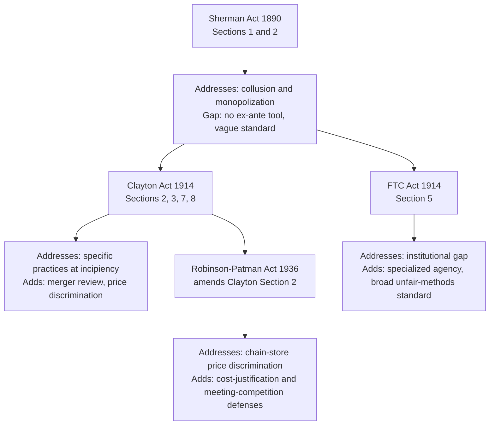

## The US Statutory Framework of Sherman, Clayton, and FTC Acts

### Definition and Conceptual Foundation

The core of U.S. federal antitrust law rests on three foundational statutes enacted between 1890 and 1936, supplemented by later amendments. These statutes are not redundant; each was enacted specifically to address gaps left by its predecessor, and together they form a layered enforcement architecture addressing collusion, unilateral monopolization, and specific exclusionary or discriminatory practices, respectively.

### The Sherman Act (1890): 15 U.S.C. §§ 1–7

#### Section 1: Restraint of Trade

> "Every contract, combination in the form of trust or otherwise, or conspiracy, in restraint of trade or commerce among the several States... is declared to be illegal."

Section 1 requires **concerted action** — an agreement between two or more independent economic actors. A single firm acting unilaterally, no matter how anticompetitive its conduct, cannot violate Section 1; this is the doctrinal boundary that necessitated Section 2.

- **Horizontal agreements** (between competitors): price-fixing, output restriction, market/customer allocation, and bid-rigging are treated as **per se illegal** — courts do not require proof of actual anticompetitive effect or market power, since such agreements are presumed to have no plausible efficiency justification.
- **Vertical agreements** (between firms at different levels of the supply chain, e.g., manufacturer-distributor): generally evaluated under the **rule of reason**, following the Supreme Court's shift away from per se treatment of most vertical restraints (e.g., resale price maintenance, addressed in *Leegin* (2007), which overturned the prior per se rule from *Dr. Miles* (1911)).

#### Section 2: Monopolization

> "Every person who shall monopolize, or attempt to monopolize, or combine or conspire with any other person or persons, to monopolize any part of the trade or commerce among the several States... shall be deemed guilty of a felony."

Section 2 addresses **unilateral conduct** and requires two elements, established in *United States v. Grinnell Corp.* (1966):

$$\text{Monopolization} = \text{Monopoly Power} + \text{Willful Acquisition or Maintenance (exclusionary conduct)}$$

- **Monopoly power**: The power to control prices or exclude competition in a relevant market, typically inferred from a very high market share (courts have generally required somewhing on the order of 65–70%+ as a threshold for a plausible inference, though no fixed numerical rule exists in the statute itself) combined with significant barriers to entry.
- **Exclusionary conduct**: Conduct that harms competition through means other than "superior product, business acumen, or historic accident" (the famous formulation from *United States v. Alcoa* (1945)). Mere possession of monopoly power achieved through superior efficiency or innovation is **not** itself illegal — Section 2 targets the *means* of acquiring or maintaining dominance, not dominance itself.

[Inference] The precise line between legitimate competitive conduct and exclusionary conduct under the second element is one of the most litigated and doctrinally unsettled areas of antitrust law, since courts apply varying fact-specific tests (e.g., the "no economic sense" test, the "profit sacrifice" test, and the "equally efficient competitor" test) rather than a single unified standard — the choice of test can be outcome-determinative in close cases.

**Criminal vs. Civil Enforcement**: Sherman Act violations can be prosecuted criminally (a felony, with corporate fines and potential individual imprisonment) — in practice, criminal enforcement is reserved almost exclusively for hardcore horizontal cartel conduct (price-fixing, bid-rigging) — or pursued civilly by the DOJ, FTC (via Section 5, see below), or private plaintiffs.

### The Clayton Act (1914): 15 U.S.C. §§ 12–27

Enacted to address specific practices that could lead to monopoly power *before* a Sherman Act violation could be proven, using an "incipiency" standard — intervention based on probable future harm rather than completed injury.

#### Key Substantive Provisions

| Section | Subject | Standard |
| --- | --- | --- |
| §2 (as amended by Robinson-Patman Act, 1936) | Price discrimination | Prohibits price discrimination between purchasers of commodities of like grade/quality where the effect "may be substantially to lessen competition" |
| §3 | Exclusive dealing and tying arrangements | Prohibits sales/leases conditioned on the buyer not dealing with a competitor, where the effect may substantially lessen competition |
| §7 | Mergers and acquisitions | Prohibits stock or asset acquisitions where the effect "may be substantially to lessen competition, or to tend to create a monopoly" |
| §8 | Interlocking directorates | Prohibits the same person from serving as a director of two competing corporations above certain size thresholds |

#### Section 7 and Merger Review

Section 7 is the primary statutory basis for modern merger control and is enforced principally through **pre-merger notification** under the **Hart-Scott-Rodino Act (1976)**, which requires parties to transactions above statutory size thresholds to notify the DOJ and FTC and observe a waiting period before closing, allowing for review (and potential "second request" investigation) prior to consummation. This ex-ante review process is a critical practical complement to the underlying substantive Section 7 standard, since it allows problematic mergers to be blocked or restructured before the anticompetitive harm has occurred, rather than requiring costly after-the-fact divestiture.

Modern Section 7 analysis is guided by the **Horizontal Merger Guidelines** (jointly issued by DOJ and FTC, most recently revised in 2023), which structure market definition, concentration measurement (using the Herfindahl-Hirschman Index), and competitive effects analysis, though the Guidelines themselves are enforcement policy rather than binding law.

### The Robinson-Patman Act (1936): Amending Clayton Act §2

Enacted during the Great Depression amid concerns about large chain retailers using buying power to extract discriminatory pricing concessions from suppliers, disadvantaging small independent retailers. The Act prohibits price discrimination that harms competition, subject to statutory defenses including:

- **Cost justification defense**: Price differences that reflect genuine differences in the cost of manufacture, sale, or delivery.
- **Meeting competition defense**: A good-faith response to match a competitor's lower price to a specific customer.

[Unverified] Robinson-Patman has been subject to markedly inconsistent enforcement intensity over recent decades — treated by many economists and much of the antitrust bar as economically incoherent because it can protect inefficient small competitors at consumer expense — and its current enforcement posture should be checked against recent FTC/DOJ practice rather than assumed constant, since enforcement priorities in this specific area have fluctuated more than for the core Sherman Act provisions.

### The Federal Trade Commission Act (1914): 15 U.S.C. § 45

#### Institutional Innovation

The FTC Act's primary innovation was **institutional**, not merely substantive: it created the Federal Trade Commission as an independent administrative agency with its own investigative, rule-making, and adjudicative authority, distinct from the DOJ's Article III court-based enforcement model.

#### Section 5: Unfair Methods of Competition

> "Unfair methods of competition in or affecting commerce... are hereby declared unlawful."

Section 5 is deliberately broader than the Sherman and Clayton Acts. It is understood to reach:

- All conduct that would violate the Sherman or Clayton Acts (a substantive floor), **plus**
- Conduct that falls short of a completed Sherman/Clayton violation but is nonetheless found to have the tendency to harm competition (the "incipiency" doctrine extended even further than Clayton Act §7).

The scope of "unfair methods of competition" independent of Sherman/Clayton violations has been a recurring source of doctrinal and political contestation — the FTC's authority to define this standard through rulemaking or case-by-case adjudication expanded and contracted across different Commission leaderships. [Inference] The degree to which Section 5 can be used to reach conduct that would clearly *not* violate the Sherman Act is genuinely unsettled as a matter of case law, since relatively few Section 5-only cases have been fully litigated to final judicial resolution — most such matters settle via consent order, leaving limited appellate precedent defining the outer boundary.

### Institutional Relationship Diagram

### Enforcement Architecture Compared

| Statute | Primary Enforcer(s) | Private Right of Action | Criminal Liability | Standard |
| --- | --- | --- | --- | --- |
| Sherman Act §1 | DOJ, FTC (via §5), private plaintiffs | Yes (Clayton Act §4, treble damages) | Yes (felony) | Per se or rule of reason |
| Sherman Act §2 | DOJ, private plaintiffs | Yes | Yes (felony) | Monopoly power + exclusionary conduct |
| Clayton Act §7 | DOJ, FTC | Limited (mainly injunctive) | No | "May substantially lessen competition" |
| Clayton Act §2 (Robinson-Patman) | FTC primarily, private plaintiffs | Yes | No | Price discrimination + competitive effect |
| FTC Act §5 | FTC exclusively | No private right of action | No | "Unfair methods of competition" |

A structurally important point: **only the FTC can bring Section 5 claims** — there is no private right of action under the FTC Act — whereas Sherman and Clayton Act violations can be privately enforced, and Clayton Act §4 entitles successful private plaintiffs to **treble damages** (three times actual damages) plus attorney's fees, a significant deterrence-enhancing feature that has made private antitrust litigation a substantial enforcement channel independent of government action.

### Illustrative Application: How the Three Statutes Interact

Consider a hypothetical dominant firm that (1) agrees with a rival to divide territories, (2) subsequently acquires a smaller potential entrant, and (3) offers below-cost pricing only to customers of a remaining competitor:

- The territorial division agreement is a **per se Sherman Act §1** violation (horizontal market allocation).
- The acquisition of a potential entrant is analyzed under **Clayton Act §7** (or as evidence of exclusionary conduct contributing to a **Sherman Act §2** monopolization claim if monopoly power is independently established).
- The discriminatory below-cost pricing could implicate **Robinson-Patman** (price discrimination) and/or **Sherman Act §2** (if it constitutes predatory pricing meeting the Areeda-Turner cost-based test) and/or **FTC Act §5** if it falls short of either standard but is found to have an anticompetitive tendency.

This layering illustrates why modern antitrust complaints frequently plead multiple statutory theories in parallel for the same underlying conduct.

### Connection to Course Framework

This statutory architecture is the legal infrastructure through which the economic goals discussed in the prior topic (consumer welfare vs. broader structural concerns) are operationalized: the *choice* of which standard governs (per se vs. rule of reason, incipiency vs. completed harm) is precisely where courts' interpretation of antitrust's underlying goals becomes doctrinally consequential, since the same economic conduct can be evaluated very differently depending on which statutory provision and evidentiary standard applies.

**Related Topics**

- Rule of reason vs. per se illegality analysis
- Horizontal Merger Guidelines and HHI-based concentration screens
- Hart-Scott-Rodino pre-merger notification process
- Predatory pricing and the Areeda-Turner test
- Tying and exclusive dealing analysis under Clayton Act §3
- Private antitrust litigation and treble damages
- Comparative statutory frameworks: EU Articles 101/102