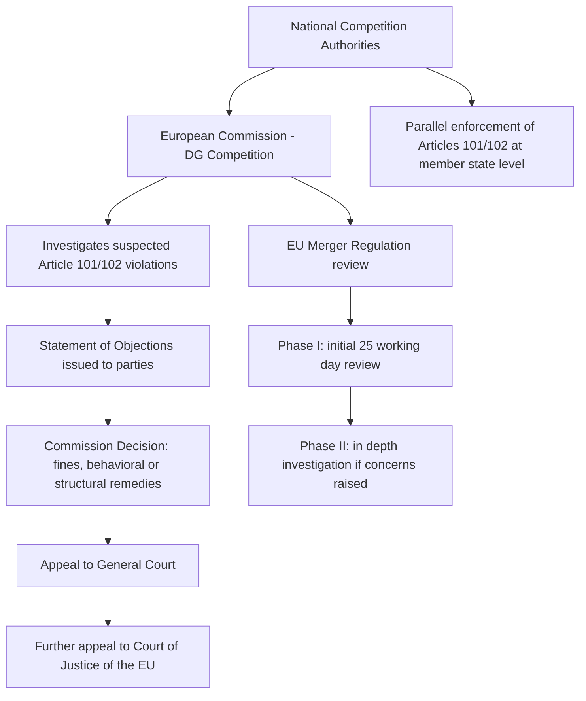

## The EU Competition Law Framework and Articles 101 and 102

### Definition and Conceptual Foundation

European Union competition law is codified primarily in the **Treaty on the Functioning of the European Union (TFEU)**, with Articles 101 and 102 forming the substantive core — structurally analogous to Sherman Act Sections 1 and 2, respectively, but embedded within a distinct institutional architecture and pursuing an explicitly broader set of policy goals than the U.S. consumer welfare standard alone. EU competition law also encompasses the **EU Merger Regulation** and **state aid rules**, which have no direct U.S. federal antitrust analogue.

### Institutional and Historical Origins

EU competition law originated in the 1957 **Treaty of Rome**, which established the European Economic Community. Unlike the U.S. statutes, which emerged from a domestic political reaction to industrial trusts, the EU framework was designed from inception with an additional, distinctly European objective: **market integration** — preventing private anticompetitive conduct (or member-state protectionism) from re-fragmenting the common market that treaty-based trade liberalization was designed to create. This dual mandate — protecting competition *and* protecting market integration — is a persistent structural difference from the U.S. framework and explains several doctrinal divergences discussed below.

The current numbering (Articles 101 and 102) dates from the **Lisbon Treaty (2009)**; the same provisions were previously numbered Articles 81 and 82 (under the Amsterdam Treaty renumbering) and, originally, Articles 85 and 86 (Treaty of Rome). This renumbering is a frequent source of confusion when reading older case law and commentary.

### Article 101: Anticompetitive Agreements

> "The following shall be prohibited as incompatible with the internal market: all agreements between undertakings, decisions by associations of undertakings and concerted practices which may affect trade between Member States and which have as their object or effect the prevention, restriction or distortion of competition within the internal market..."

#### Structural Elements

Article 101 analysis proceeds through a distinctive two-part structure not directly mirrored in U.S. law:

$$\text{Article 101(1)}: \text{Prohibition} \quad \Rightarrow \quad \text{Article 101(3)}: \text{Exemption}$$

- **Article 101(1)**: Establishes the prohibition itself, covering agreements, decisions by trade associations, and "concerted practices" (a category broader than a formal agreement, capturing coordinated conduct inferred from parallel behavior plus contact between parties, without requiring proof of an explicit contract).
- **Article 101(3)**: Provides an affirmative exemption for agreements that, despite restricting competition, generate efficiencies (improved production/distribution, technical/economic progress) that are shared with consumers, are indispensable to achieving those efficiencies, and do not eliminate competition in a substantial part of the relevant products.

This means EU analysis formally separates the finding of a restriction (101(1)) from the balancing of procompetitive justifications (101(3)), whereas U.S. rule-of-reason analysis typically conducts this balancing within a single integrated inquiry. [Inference] Whether this structural difference produces materially different outcomes in practice, versus being primarily an analytical framing distinction that converges on similar results, is debated among comparative competition law scholars; the burden of proof for the 101(3) exemption falls on the party invoking it, which does create at least a procedural (if not always substantive) divergence from U.S. practice.

#### "By Object" vs. "By Effect" Restrictions

Analogous to the U.S. per se/rule-of-reason distinction:

- **Restrictions by object**: Certain categories of agreements (price-fixing, market-sharing, output limitation, bid-rigging — the "hardcore" cartel categories) are presumed restrictive of competition without requiring proof of actual market effects, similar to U.S. per se treatment.
- **Restrictions by effect**: Other agreements require actual demonstration of anticompetitive effect on the relevant market, considering the legal and economic context.

### Article 102: Abuse of a Dominant Position

> "Any abuse by one or more undertakings of a dominant position within the internal market or in a substantial part of it shall be prohibited... insofar as it may affect trade between Member States."

#### Key Structural Divergence from U.S. Section 2

This is the single most significant doctrinal difference between the U.S. and EU frameworks. Article 102 does not require proof of anticompetitive *conduct that created or maintained* dominance (as Sherman Act §2 requires); it prohibits the **abuse** of a dominant position that already exists, regardless of how that dominance was lawfully acquired.

$$\text{Article 102 violation} = \text{Dominant Position} + \text{Abuse}$$

- **Dominant position**: Assessed via market share (EU guidance and case law have historically treated market shares above roughly 50% as raising a presumption of dominance, though this is a rebuttable evidentiary starting point rather than a fixed legal threshold) combined with barriers to entry, countervailing buyer power, and other structural factors.
- **Abuse**: A non-exhaustive list of conduct types is specified in the Treaty text itself, including unfair pricing, limiting production/markets/technical development to consumers' prejudice, discriminatory conditions, and tying. EU case law has developed additional abuse categories including margin squeeze, refusal to supply/license, and certain loyalty rebate schemes.

[Unverified] The precise degree to which EU case law requires an "as-efficient competitor" test (evaluating whether the conduct would exclude an equally efficient rival) versus a more form-based approach that can capture conduct regardless of efficiency effects has evolved across successive judgments (notably the European Commission's 2009 Guidance Paper and subsequent Court of Justice case law), and the current doctrinal balance should be checked against the most recent judgments rather than treated as settled, since this has been an area of continuous refinement.

### Comparative Structure: Article 102 vs. Sherman Act Section 2

| Dimension | Sherman Act §2 | Article 102 TFEU |
| --- | --- | --- |
| Trigger | Monopoly power + exclusionary conduct in acquiring/maintaining it | Dominant position (however lawfully acquired) + abuse |
| Legitimacy of dominance itself | Lawful if achieved by "superior product, business acumen, or historic accident" | Not itself unlawful, but dominant firms bear a "special responsibility" not to further impair competition |
| Threshold market share commonly referenced | Often ~65–70%+ inferred from case law, no fixed rule | Often ~50%+ raises presumption, no fixed rule |
| Predatory pricing standard | Areeda-Turner cost-based test generally required, plus recoupment | Cost-based tests used (e.g., AKZO case: pricing below average variable cost presumed abusive; between AVC and average total cost may be abusive with intent evidence) — **no independent recoupment requirement** historically imposed by EU courts |
| Refusal to deal | Very limited liability (Trinko), narrow "essential facilities"-adjacent exceptions | Broader liability under "essential facilities doctrine" in defined circumstances (e.g., Bronner, Microsoft) |

The absence of a strict **recoupment requirement** in EU predatory pricing doctrine is a frequently cited substantive divergence: U.S. law (per *Brooke Group*, 1993) generally requires the plaintiff to show the predator has a realistic prospect of recouping losses through subsequent supra-competitive pricing, on the theory that predation without recoupment is irrational and self-correcting; EU doctrine has not consistently imposed this requirement, reflecting the different underlying goal (protecting the competitive process/market structure, not solely consumer prices).

### Institutional Enforcement Architecture

Unlike the dual DOJ/FTC structure in the U.S., EU competition enforcement is centralized in the **European Commission's Directorate-General for Competition (DG COMP)**, which combines investigative and decision-making authority (subject to judicial review by the General Court and Court of Justice of the EU) — an administrative-law model distinct from the U.S. reliance on Article III federal courts for Sherman Act adjudication. National Competition Authorities of member states also have concurrent enforcement power over Articles 101/102 under **Regulation 1/2003**, operating within a coordinated "European Competition Network."

### The EU Merger Regulation

Mergers with an EU dimension (meeting specified turnover thresholds) are reviewed under the **EU Merger Regulation (EUMR)**, which — unlike the U.S. Clayton Act §7, enforced primarily through litigation — establishes a mandatory, suspensory, ex-ante notification regime with statutory review deadlines:

- **Phase I**: An initial 25-working-day review; the large majority of notified mergers are cleared at this stage without further investigation.
- **Phase II**: A more extensive investigation (typically an additional 90 working days, extendable) for transactions raising "serious doubts" about compatibility with the internal market.

The substantive test is whether the merger would "significantly impede effective competition," with particular reference to the creation or strengthening of a dominant position — conceptually similar to, but textually distinct from, the U.S. "substantially lessen competition" standard.

### Private Enforcement Differences

A structurally important divergence from the U.S. framework: EU competition law historically relied far more heavily on **public enforcement** by the Commission than private litigation, in contrast to the U.S. system's substantial private treble-damages litigation channel. The EU's **Antitrust Damages Directive (2014)** was specifically enacted to facilitate private follow-on damages actions after a Commission infringement decision, but EU private enforcement does not include treble damages — recovery is generally limited to actual (compensatory) damages, reflecting the different underlying philosophy (compensation rather than the additional deterrence-multiplier function that treble damages serve in U.S. law).

### Reflecting the Underlying Goal Divergence

The doctrinal differences catalogued above are not arbitrary — they trace directly back to the different foundational goals discussed in the prior topic. Because EU competition law explicitly incorporates market integration and protection of the competitive *process* (not solely consumer price effects) as legitimate objectives, it is structurally more receptive to intervening against dominant-firm conduct that harms rivals' ability to compete, even where a strict U.S.-style consumer welfare/price-effects analysis might not establish clear consumer harm. This is precisely the kind of goal-driven doctrinal divergence anticipated by the broader "what should antitrust protect?" debate.

### Contemporary Development: The Digital Markets Act

[Unverified — recent/evolving] The EU has substantially supplemented traditional Article 102 enforcement in digital markets with the **Digital Markets Act (DMA)**, a distinct *ex-ante* regulatory regime (rather than case-by-case competition-law enforcement) imposing specific behavioral obligations on designated "gatekeeper" platforms. Because this represents a relatively recent and still-evolving regulatory architecture, specific compliance obligations, designated gatekeepers, and enforcement outcomes should be verified against current European Commission guidance rather than treated as static, since this area has continued to develop after most standard antitrust textbook treatments were written.

**Related Topics**

- Sherman Act Sections 1 and 2 (comparative baseline)
- Predatory pricing standards: Areeda-Turner vs. AKZO tests
- Essential facilities doctrine and refusal to deal
- EU Merger Regulation Phase I/II process
- Digital Markets Act and ex-ante platform regulation
- State aid rules and their relationship to competition policy
- Comparative law: convergence and divergence in global antitrust enforcement