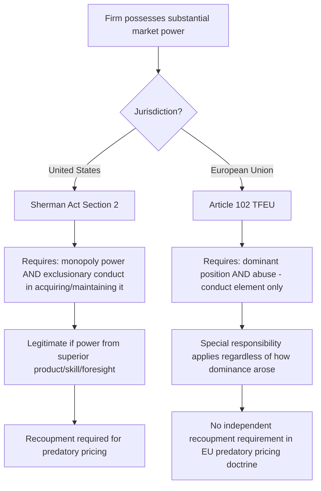

## Monopolization and Abuse of Dominance Standards

### Definition and Conceptual Foundation

Monopolization and abuse of dominance doctrines govern **unilateral conduct** by a single firm possessing substantial market power, as distinct from the multilateral-agreement doctrines under Sherman Act §1 or TFEU Article 101. This body of law addresses the core tension at the heart of competition policy: firms are supposed to compete vigorously to win market share, and legitimately winning a dominant position through superior efficiency is not merely tolerated but is precisely the outcome competition is meant to reward. The doctrinal challenge is distinguishing that legitimate competitive success from conduct that entrenches or extends dominance through means that harm the competitive process itself.

### The Two-Element U.S. Framework

Established in *United States v. Grinnell Corp.* (1966), Sherman Act §2 monopolization requires:

$$\text{Monopolization} = \text{Monopoly Power} + \text{Willful Acquisition or Maintenance of that Power}$$

Both elements must be independently established; possession of monopoly power alone is never sufficient.

#### Element 1: Monopoly Power

Monopoly power is defined as the power to control prices or exclude competition in a relevant market. It is typically established through a two-step process:

1. **Relevant market definition**: Both a relevant product market (using demand and supply substitutability, often informally guided by the same conceptual logic as the SSNIP/hypothetical monopolist test used in merger analysis) and a relevant geographic market must be defined.
2. **Market share within that market**, combined with structural factors (barriers to entry, evidence of actual price/output control) that make the share durable rather than fleeting.

Courts have not established a fixed numerical threshold, but as a rough doctrinal guide drawn from case law: shares below 50% are rarely found sufficient standing alone; shares in the 50–70% range require significant supporting evidence of durability and entry barriers; shares above roughly 70% more readily support an inference of monopoly power, particularly when sustained over time. [Inference] These are informal thresholds distilled from the pattern of case outcomes rather than a codified legal rule, and courts have found monopoly power lacking even at high share levels where entry barriers were low or the market was rapidly contestable — share is evidence of power, not a legal presumption with fixed cutoffs.

#### Element 2: Exclusionary Conduct

The conduct element requires the monopolist's dominance to result from **improper means** rather than legitimate competition. The foundational articulation comes from *United States v. Alcoa* (1945, Judge Learned Hand): a monopolist is not liable merely for possessing power gained through **"superior skill, foresight, and industry"** — but the same court held that a firm which deliberately expands capacity ahead of demand specifically to forestall entrants can still be found to have engaged in exclusionary conduct, illustrating how fact-specific this inquiry can be.

Courts have applied several competing tests to distinguish exclusionary from competitive conduct, and no single test commands universal adoption:

| Test | Core Question | Typical Application |
| --- | --- | --- |
| No Economic Sense test | Would the conduct make business sense but for its tendency to eliminate competition? | Predatory pricing, strategic underinvestment |
| Profit Sacrifice test | Did the firm sacrifice short-run profit specifically to achieve exclusionary long-run gain? | Refusal to deal, exclusive dealing |
| Equally Efficient Competitor test | Would the conduct exclude a rival that is as efficient as the monopolist itself? | Predatory pricing, margin squeeze, loyalty rebates |
| Consumer Harm balancing | Do the anticompetitive effects outweigh any procompetitive justification? | General rule-of-reason-style catch-all applied across most Section 2 conduct categories |

[Inference] Because different circuits and cases have emphasized different tests, and the Supreme Court has not definitively selected a single controlling framework for all Section 2 conduct, the applicable standard can vary meaningfully depending on jurisdiction and the specific type of conduct alleged — this is a genuine area of doctrinal fragmentation rather than a settled unified test.

### Recognized Categories of Exclusionary Conduct

#### Predatory Pricing

Governed by the **Areeda-Turner framework** and subsequently the Supreme Court's *Brooke Group* (1993) standard, requiring:

1. Pricing below an appropriate measure of cost (courts have used average variable cost as the classic Areeda-Turner benchmark, with some circuits considering average avoidable cost as a refinement).
2. A **dangerous probability of recoupment** — a realistic prospect that the firm can recover predatory losses through subsequent supra-competitive pricing once rivals are eliminated.

The recoupment requirement reflects an economic-theory-driven skepticism: if a firm cannot plausibly recoup losses, the predatory pricing strategy is not rational, and observed low prices more likely reflect legitimate competition or efficiency (such as pricing down a learning curve, discussed in the "Dynamic Oligopoly" chapter) than predatory intent.

#### Refusal to Deal

U.S. law imposes very limited liability for unilateral refusals to deal with rivals, reflecting the general principle (from *Colgate*, 1919) that a firm generally has the right to choose its business partners. *Verizon v. Trinko* (2004) substantially narrowed the scope for liability, emphasizing that compelling a monopolist to share resources with rivals can undermine the incentive to invest in those resources in the first place, and that antitrust courts are poorly positioned to act as regulatory rate-setters for mandated access.

A narrow **essential facilities doctrine** exception exists (though its independent vitality post-*Trinko* is debated) for cases where a monopolist controls a facility that competitors cannot practically duplicate and access is denied without legitimate business justification.

#### Tying and Bundling

Conditioning the sale of one product (the tying product) on the purchase of another (the tied product). Historically treated with elements of per se illegality when the seller has market power in the tying product, though modern doctrine (post *Illinois Tool Works v. Independent Ink*, 2006, which eliminated the presumption of market power from patent-tied products) has moved toward more rule-of-reason-style analysis requiring actual proof of market power and anticompetitive effect.

#### Exclusive Dealing

Arrangements requiring a buyer or distributor to deal exclusively with the monopolist, potentially foreclosing rivals from accessing necessary distribution or input channels. Evaluated under a rule-of-reason framework assessing the degree of market foreclosure, the duration of exclusivity, and whether rivals have practical alternative channels.

### Formal Illustration: The Recoupment Logic

A simplified two-period predatory pricing model illustrates why recoupment is analytically central:

$$\Pi_{predation} = -L_1 + \delta \cdot \pi_2^{monopoly}$$

Where $L_1$ is the loss incurred in period 1 from below-cost pricing, $\delta$ is the discount factor, and $\pi_2^{monopoly}$ is the supra-competitive profit obtainable in period 2 once the rival exits. Predation is only rational if:

$$\delta \cdot \pi_2^{monopoly} > L_1$$

This requires that entry barriers in period 2 be sufficient to prevent a new entrant (or the same exited rival) from re-entering and competing away the supra-competitive profit before it can be captured — which is precisely the "dangerous probability of recoupment" the *Brooke Group* standard requires courts to assess. If entry is easy in period 2, the inequality cannot hold for any rational monopolist, and the low period-1 pricing is more plausibly explained by legitimate competitive or dynamic-cost reasons (compare to the learning-curve pricing rationale covered earlier in this course, where below-cost pricing reflects genuine future cost reduction rather than anticipated market power).

### EU Abuse of Dominance: A Structurally Different Starting Point

As covered in the prior topic, Article 102 TFEU does not require proof that dominance was *acquired* through improper conduct — only that an already-dominant firm's conduct constitutes an "abuse." This reflects the EU's "special responsibility" doctrine: a dominant firm bears an affirmative obligation not to further distort competition, regardless of the lawful origin of its dominance.

### Recognized Categories of Abuse Under Article 102

EU case law has developed several abuse categories with less restrictive standards than their U.S. counterparts:

- **Exploitative abuses**: Unfair pricing or trading conditions directly harming customers — a category with limited direct U.S. Section 2 analogue, since U.S. law generally does not treat high prices by a lawfully-dominant firm alone as unlawful (per *Trinko*'s reasoning that charging monopoly prices is precisely what induces the risk-taking that produces innovation in the first place).
- **Exclusionary abuses**: Conduct excluding competitors, including predatory pricing (AKZO test), margin squeeze, tying, and certain loyalty/fidelity rebate structures — the last of these has faced substantially more EU scrutiny than under comparable U.S. doctrine.
- **Refusal to supply/license**: A broader essential-facilities-style doctrine than the narrow post-*Trinko* U.S. approach, illustrated in cases such as *Microsoft* (interoperability information) and *Bronner* (newspaper distribution network access), though EU courts have still required a showing that access is indispensable and that refusal eliminates all competition in a downstream market.

### Comparative Table: Standard-Setting Philosophy

| Consideration | U.S. Approach | EU Approach |
| --- | --- | --- |
| View of dominance itself | A reward for competitive success; not suspect | Triggers "special responsibility"; not unlawful but closely scrutinized |
| Risk tolerance for false positives (chilling legitimate competition) | Prioritizes avoiding false positives (Type I error aversion, post-Chicago School influence) | More willing to accept some risk of false positives to protect market structure and rivals' ability to compete |
| Role of recoupment in predatory pricing | Required as a screen for economic rationality | Not independently required |
| Treatment of "as efficient competitor" | Central to most modern tests | Increasingly influential but historically less uniformly required than in U.S. doctrine |

[Speculation] Whether this reflects a durable difference in underlying economic philosophy or is better understood as EU doctrine gradually converging toward more economically-grounded (effects-based) analysis over time — a stated ambition of the Commission's own 2009 Guidance Paper on Article 102 enforcement priorities — remains a matter of ongoing scholarly and practitioner debate rather than a settled characterization.

### Connection to Dynamic Competition Concepts

The monopolization standards discussed here directly intersect with the dynamic oligopoly concepts from the prior chapter: courts assessing whether below-cost pricing is predatory (Sherman Act §2) or abusive (Article 102) must distinguish it from the economically legitimate below-cost pricing that can arise from rational learning-curve investment (moving down the experience curve to capture future cost advantages) — the same observed price behavior can have starkly different legal characterizations depending on whether it reflects genuine dynamic efficiency or a deliberate strategy to eliminate rivals and later exploit market power.

**Related Topics**

- Predatory pricing tests: Areeda-Turner, Brooke Group, and AKZO compared
- Essential facilities doctrine: Trinko vs. Bronner and Microsoft
- Market definition and the SSNIP/hypothetical monopolist test
- Tying, bundling, and exclusive dealing analysis
- Learning curves and dynamic cost advantages (predatory pricing overlap)
- Loyalty rebates and conditional discount structures
- Merger review standards under Clayton Act §7 and EUMR