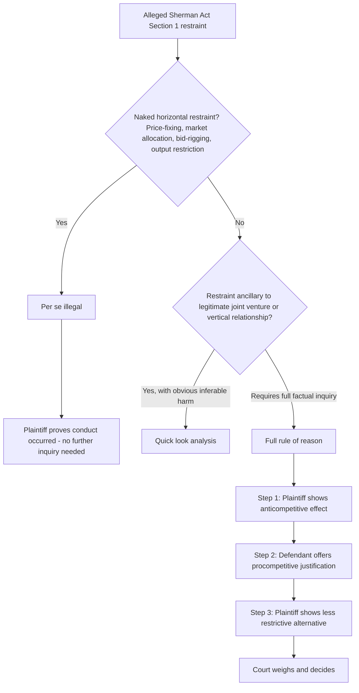

## Per Se Illegality Versus the Rule of Reason

### Definition and Conceptual Foundation

Per se illegality and the rule of reason are the two principal analytical frameworks U.S. courts apply to evaluate whether conduct violates Sherman Act §1 (agreements in restraint of trade). They represent opposite ends of an evidentiary-burden spectrum: per se treatment conclusively presumes conduct illegal without inquiry into actual competitive effects, while the rule of reason requires a full fact-specific balancing of procompetitive justifications against anticompetitive effects. The choice between them is frequently outcome-determinative, since few horizontal agreements survive per se scrutiny while a substantial share of agreements survive rule-of-reason review.

### Per Se Illegality

#### Doctrinal Basis

Per se treatment applies to categories of agreements that courts have concluded, based on accumulated economic experience and judicial precedent, have such a **"pernicious effect on competition"** and **"lack... any redeeming virtue"** (language from *Northern Pacific Railway v. United States*, 1958) that case-by-case inquiry into actual market effects would waste judicial resources without changing outcomes. The categorization is itself a judicially-created economic judgment, not a distinction drawn from the statutory text of Sherman Act §1, which uses only the undefined phrase "restraint of trade."

$$\text{Per Se Illegal} \Rightarrow \text{No inquiry into: market power, procompetitive justification, actual effects, or reasonableness}$$

Once a court characterizes conduct as falling within a per se category, the plaintiff need only prove the conduct occurred — not that it caused actual harm, not that the defendants possessed market power, and not that no efficiency justification exists.

#### Categories Subject to Per Se Treatment

The core, largely undisputed per se categories are **"naked" horizontal restraints** among competitors — restraints not ancillary to any legitimate joint economic venture:

- **Horizontal price-fixing**: Agreements among competitors to set, raise, lower, or stabilize prices, including agreements on price components, formulas, or discount policies short of the exact final price (*Socony-Vacuum Oil*, 1940, established that even a *tendency* to affect price, not just successful price-setting, is sufficient).
- **Horizontal market/customer allocation**: Agreements dividing territories or customers among competitors, which are treated as economically equivalent to price-fixing since eliminating geographic or customer-based competition has parallel effects on price.
- **Horizontal output restriction**: Agreements to limit production, functionally equivalent to price-fixing through the standard supply-and-demand relationship between quantity and price.
- **Bid-rigging**: Coordinated submission of bids in competitive tendering processes (e.g., agreeing in advance who will submit the winning bid, or submitting deliberately non-competitive complementary bids).
- **Group boycotts** (in narrow circumstances): Certain concerted refusals to deal, though this category has narrowed considerably as courts have increasingly required rule-of-reason analysis except for the most clearly naked cases.

[Inference] The boundary of what counts as sufficiently "naked" to warrant per se treatment, versus sufficiently ancillary to a legitimate joint venture to warrant rule-of-reason review, is not always self-evident from the conduct alone and has been a recurring point of litigation — courts examine whether the restraint is reasonably necessary to achieve a plausible efficiency-enhancing joint venture, which requires at least some threshold factual inquiry even before "full" rule-of-reason analysis would apply.

### The Rule of Reason

#### Doctrinal Basis and Structure

Established in *Standard Oil Co. of New Jersey v. United States* (1911) and elaborated across subsequent case law, the rule of reason requires courts to weigh the restraint's actual or likely competitive effects in the context of the specific market, considering:

1. **Market definition and market power**: Does the defendant possess sufficient market power for the restraint to plausibly cause competitive harm at all?
2. **Anticompetitive effects**: Actual or likely effects on price, output, quality, or innovation.
3. **Procompetitive justifications**: Legitimate business rationales — efficiency gains, quality assurance, risk-sharing in joint ventures, or facilitating output that would not otherwise occur.
4. **Less restrictive alternatives**: Whether the defendant's legitimate objectives could be achieved through a materially less restrictive means.

The modern **burden-shifting framework**, refined in cases such as *California Dental Association v. FTC* (1999) and *NCAA v. Alston* (2021), generally proceeds as:

$$\text{Plaintiff: prima facie anticompetitive effect} \rightarrow \text{Defendant: procompetitive justification} \rightarrow \text{Plaintiff: less restrictive alternative exists}$$

If the plaintiff cannot establish a plausible anticompetitive effect, the inquiry ends without proceeding further; if the defendant cannot articulate a legitimate justification, the restraint is condemned; if a justification is offered, the plaintiff may still prevail by showing a substantially less restrictive means was available to achieve the same legitimate objective.

#### The "Quick Look" Intermediate Standard

Between full per se and full rule-of-reason lies an intermediate approach sometimes termed **"quick look"** analysis, applied to restraints that are not obviously naked price-fixing but whose likely anticompetitive effect can be inferred from economic logic and observation without the full evidentiary process of formal market definition (e.g., certain professional association advertising restrictions in *FTC v. Indiana Federation of Dentists*, 1986). [Unverified] The continued independent vitality of "quick look" as a distinct third category — as opposed to simply being an abbreviated application of standard rule-of-reason analysis where the anticompetitive inference is unusually obvious — has been questioned in subsequent case law and is not treated as a fully settled, independently defined doctrinal tier.

### The Historical Trend: Narrowing of Per Se Categories

A defining feature of the past several decades of Sherman Act §1 jurisprudence has been the **steady contraction** of per se treatment in favor of rule-of-reason analysis, reflecting the broader influence of the Chicago School's economically grounded approach to antitrust (discussed in the historical origins topic):

| Case | Year | Doctrinal Shift |
| --- | --- | --- |
| *Continental T.V. v. GTE Sylvania* | 1977 | Overturned per se treatment of non-price vertical territorial restrictions, moving them to rule of reason |
| *State Oil Co. v. Khan* | 1997 | Eliminated per se illegality for vertical **maximum** resale price maintenance |
| *Leegin Creative Leather Products v. PSKS* | 2007 | Overturned the century-old *Dr. Miles* (1911) per se rule for vertical **minimum** resale price maintenance, moving it to rule of reason |
| *NCAA v. Alston* | 2021 | Reaffirmed application of (a more searching version of) rule-of-reason analysis even to restraints within a joint venture context historically given considerable deference |

[Inference] This trend reflects an underlying economic judgment — increasingly accepted by courts — that most vertical restraints (between firms at different levels of the supply chain) have plausible efficiency justifications (e.g., preventing free-riding on retailer promotional investment, ensuring service quality) that horizontal restraints among direct competitors typically lack, which is why per se treatment has contracted primarily for *vertical* restraints while remaining largely intact for genuinely naked *horizontal* price-fixing, market allocation, and bid-rigging.

### Formal Illustration: Why the Distinction Matters Economically

The economic rationale for per se treatment rests on an assessment of the **likelihood of Type I versus Type II error** in judicial administration:

$$\text{Expected error cost} = P(\text{anticompetitive} \mid \text{category}) \times \text{Cost of under-deterrence} + P(\text{procompetitive} \mid \text{category}) \times \text{Cost of over-deterrence (chilling legitimate conduct)}$$

For naked horizontal price-fixing, courts and economists have concluded $P(\text{anticompetitive} \mid \text{category})$ is sufficiently close to 1, and the administrative cost of requiring full market-power and effects proof in every case is high relative to the vanishingly small risk of condemning a genuinely efficiency-enhancing naked price-fixing agreement — hence per se treatment is efficient. For most other restraints, this probability is not close enough to 1 to justify skipping the case-specific inquiry, since plausible efficiency stories are common enough that automatic condemnation would risk substantial over-deterrence of legitimate procompetitive conduct.

### Diagram: Decision Framework

### EU Parallel: "By Object" vs. "By Effect" Under Article 101

As covered in the EU framework topic, Article 101 TFEU draws a structurally analogous distinction between restrictions **"by object"** (hardcore restraints presumed restrictive without proof of effects, roughly paralleling U.S. per se categories) and restrictions **"by effect"** (requiring actual demonstration of anticompetitive impact, roughly paralleling rule-of-reason analysis). [Inference] While the underlying economic logic is similar — administrative efficiency for categories with near-certain anticompetitive character — the EU and U.S. frameworks have not always drawn the exact same conduct into their respective "automatic condemnation" categories, and practitioners should not assume perfect doctrinal overlap between "by object" and "per se" classifications for any specific type of agreement without checking the applicable case law in each jurisdiction.

### Illustrative Application

Consider three hypothetical agreements among competing manufacturers:

1. **Explicit agreement to raise prices by 10%**: Per se illegal — naked horizontal price-fixing, no plausible efficiency defense available regardless of circumstances.
2. **Joint research and development venture with an ancillary agreement not to sell each other's proprietary process improvements to third parties for five years**: Rule of reason — the restriction is ancillary to a plausibly legitimate collaborative venture (protecting the joint investment), requiring analysis of whether the restriction is reasonably necessary and not broader than needed.
3. **Manufacturer sets minimum resale prices for independent retailers (vertical minimum RPM)**: Rule of reason (post-*Leegin*) — requires proof of actual anticompetitive effect in the specific market, considering the manufacturer's possible legitimate interest in preventing retailer free-riding on service investments.

### Connection to Course Framework

This framework operationalizes the underlying goals debate from the historical origins topic: the contraction of per se categories over recent decades reflects the ascendance of the consumer welfare standard and its associated skepticism of categorical rules that risk condemning efficient conduct, while continued per se treatment of naked horizontal cartels reflects near-universal agreement — even among competing schools of antitrust thought — that such conduct serves no purpose other than wealth transfer from consumers with no offsetting efficiency benefit.

**Related Topics**

- Horizontal price-fixing and cartel enforcement (criminal Sherman Act §1)
- Vertical restraints: resale price maintenance and exclusive territories
- Joint ventures and ancillary restraints analysis
- Article 101(1) vs. 101(3) exemption framework (EU comparison)
- NCAA v. Alston and the modern rule-of-reason burden-shifting test
- Monopolization and abuse of dominance standards
- Economic error-cost framework in antitrust rule design