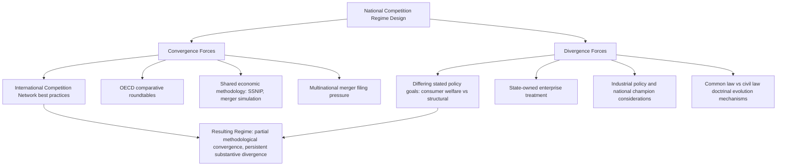

## Comparative Competition Policy Across Jurisdictions

### Definition and Conceptual Foundation

Comparative competition policy examines how different jurisdictions design and enforce antitrust/competition law regimes, analyzing convergence and divergence in substantive standards, institutional architecture, procedural mechanisms, and underlying policy goals. While the U.S. and EU frameworks (covered in prior topics) anchor most comparative analysis due to their historical influence and enforcement scale, a genuinely global comparative view requires examining a broader set of jurisdictions whose approaches reflect distinct economic development priorities, legal traditions, and political-economic contexts.

### Dimensions of Comparative Analysis

Cross-jurisdictional comparison is typically organized along several analytical dimensions:

$$\text{Competition Regime} = f(\text{Substantive Standards}, \text{Institutional Design}, \text{Enforcement Intensity}, \text{Underlying Policy Goals})$$

- **Substantive standards**: What conduct is prohibited, and under what evidentiary tests (per se vs. rule of reason; abuse-of-dominance vs. monopolization; merger review thresholds).
- **Institutional design**: Single administrative authority vs. dual-agency structure; court-based adjudication vs. administrative decision subject to judicial review; centralized vs. federated enforcement across sub-national units.
- **Enforcement intensity and priorities**: Resource allocation, case selection, and the relative emphasis on cartel prosecution vs. merger review vs. unilateral-conduct cases.
- **Underlying policy goals**: Pure consumer welfare vs. broader structural, distributional, or industrial-policy objectives (directly connecting to the goals debate covered in the historical origins topic).

### Comparative Table: Major Jurisdictions

| Jurisdiction | Primary Statute(s) | Enforcement Body | Institutional Model | Distinctive Feature |
| --- | --- | --- | --- | --- |
| United States | Sherman Act, Clayton Act, FTC Act | DOJ Antitrust Division + FTC | Dual agency; court-based (DOJ) and administrative (FTC) | Extensive private treble-damages litigation; criminal cartel enforcement |
| European Union | TFEU Articles 101/102, EU Merger Regulation | European Commission (DG COMP) | Centralized administrative authority with judicial review | Market-integration goal embedded in substantive law; ex-ante gatekeeper regulation (DMA) |
| United Kingdom (post-Brexit) | Competition Act 1998, Enterprise Act 2002 | Competition and Markets Authority (CMA) | Single independent authority | Operates independently of EU regime since Brexit; retained substantively similar Chapter I/II prohibitions modeled on Articles 101/102 |
| China | Anti-Monopoly Law (2008, amended 2022) | State Administration for Market Regulation (SAMR) | Centralized state authority | Explicit statutory reference to protecting "socialist market economy"; state-owned enterprise treatment raises distinct questions |
| Japan | Antimonopoly Act (1947) | Japan Fair Trade Commission (JFTC) | Independent administrative commission | Enacted during postwar Allied occupation, directly modeled on U.S. antitrust law; historically less aggressive enforcement against keiretsu-style vertical coordination than the statute's U.S.-derived text might suggest |
| South Korea | Monopoly Regulation and Fair Trade Act | Korea Fair Trade Commission (KFTC) | Independent administrative commission | Particular statutory focus on regulating chaebol (large conglomerate) internal transactions and market concentration |
| India | Competition Act (2002) | Competition Commission of India (CCI) | Independent regulatory commission | Relatively young enforcement regime; increasing focus on digital platform conduct |
| Brazil | Brazilian Competition Law (Law 12.529/2011) | Administrative Council for Economic Defense (CADE) | Independent administrative tribunal | Notable convergence toward U.S./EU analytical methodology despite distinct legal tradition |

[Unverified] Enforcement intensity, budget allocation, and case-selection priorities vary considerably across these authorities and shift with domestic political administrations; specific claims about which jurisdiction is currently "more aggressive" in a given sector should be verified against recent enforcement statistics rather than assumed static, since this is one of the most time-sensitive dimensions of comparative analysis.

### Convergence Forces

Several factors have driven substantial methodological convergence across jurisdictions over recent decades, despite persistent doctrinal differences:

- **International Competition Network (ICN)**: A voluntary, informal network of competition authorities established in 2001 that develops non-binding "best practice" recommendations on merger notification procedures, cartel enforcement, and unilateral conduct analysis, functioning as a soft-law convergence mechanism without treaty-based binding authority.
- **OECD Competition Committee**: Produces comparative policy roundtables and recommendations that influence domestic legislative reform, particularly in newer competition regimes seeking to align with established international practice.
- **Economics-based analytical convergence**: The global spread of price-theory-based merger simulation, market definition methodology (variants of the SSNIP/hypothetical monopolist test), and econometric damages estimation has produced substantial methodological convergence in *how* competition is analyzed, even where substantive legal standards and stated goals diverge.
- **Multinational merger filings**: Because large cross-border mergers frequently require simultaneous notification in multiple jurisdictions, merging parties and their economic experts have incentives to develop analyses that satisfy multiple regimes' evidentiary expectations simultaneously, indirectly pushing methodological alignment.

### Divergence Forces

Countervailing forces sustain persistent substantive divergence:

- **Differing underlying goals**: As established in the historical origins and EU framework topics, the U.S. consumer welfare standard and the EU's market-integration-plus-competitive-structure goals produce genuinely different outcomes for identical conduct, not merely different procedural paths to the same result.
- **State-owned enterprise treatment**: Jurisdictions with significant state ownership in commercial sectors (China being the most prominent example) face distinct analytical and political challenges in applying competition law symmetrically to state and private actors, a tension without a close U.S./EU analogue.
- **Industrial policy considerations**: Some jurisdictions explicitly weigh national champion or infant-industry considerations in merger review or enforcement discretion (connecting to the industrial-policy rationale for tolerating concentration discussed in the learning-curves topic), which sits in tension with a pure competition-based analytical framework.
- **Legal tradition differences**: Common-law jurisdictions (U.S., UK, India) rely more heavily on case-by-case judicial precedent development; civil-law jurisdictions (EU member states, Japan, Korea, Brazil) rely more heavily on codified statutory text interpreted through administrative guidelines, producing different rates and mechanisms of doctrinal evolution.

### Diagram: Forces Shaping Cross-Jurisdictional Doctrine

### Case Study Pattern: Merger Review Divergence

A useful illustration of both convergence and divergence: the **Herfindahl-Hirschman Index (HHI)** as a concentration screen has been adopted in some form by the large majority of major competition regimes globally — a clear case of methodological convergence — yet the specific **thresholds** and **substantive standards applied after the screening stage** differ meaningfully:

$$\text{HHI} = \sum_{i=1}^{n} s_i^2 \times 10{,}000$$

Where $s_i$ is firm $i$'s market share (as a decimal). While the mathematical formula is essentially universal, U.S. Horizontal Merger Guidelines classify markets above 2,500 HHI (or with an HHI increase above 200 points in already-concentrated markets) as warranting close scrutiny, while EU guidance uses broadly comparable but not numerically identical thresholds, and the ultimate substantive standard ("substantially lessen competition" in the U.S. vs. "significantly impede effective competition" under the EUMR) differs in legal formulation even where the underlying economic screening tool is shared. [Inference] Whether these formulation differences produce systematically different merger clearance outcomes for comparable transactions, versus converging in practice through similar underlying economic analysis, is an empirical question that has been studied on a case-by-case comparative basis rather than resolved as a general proposition.

### Developing Economy Considerations

Competition regimes in developing economies face additional design tensions not always salient in mature U.S./EU-style debates:

- **Capacity constraints**: Newer competition authorities often operate with substantially smaller budgets and staff economics expertise relative to caseload, affecting the sophistication of effects-based analysis that can practically be conducted.
- **Balancing competition policy against development goals**: Some scholars and policymakers argue that a degree of tolerated concentration or coordination may be appropriate during early industrialization to allow domestic firms to achieve minimum efficient scale before facing full international competition — directly echoing the infant-industry/learning-curve rationale discussed in the dynamic oligopoly chapter, but applied at the level of national competition policy design rather than firm strategy.
- **Sequencing of institutional development**: [Speculation] There is an active but unresolved debate among development economists and competition policy scholars regarding whether competition law institutions are more effective when introduced early in a country's market-liberalization process or after a threshold level of market development has been reached, since evidence is drawn from a relatively small number of heterogeneous historical cases rather than controlled comparison.

### Digital Markets: A Contemporary Divergence Point

Regulation of large digital platforms has become perhaps the most actively diverging area of contemporary comparative competition policy:

- The **EU's Digital Markets Act** establishes ex-ante behavioral obligations for designated "gatekeeper" platforms, representing a regulatory (not case-by-case enforcement) model.
- The **U.S.** has relied primarily on traditional Sherman Act §2 case-by-case litigation against specific platforms (with periodic, thus-far largely unsuccessful legislative proposals for EU-DMA-style ex-ante rules).
- The **UK's CMA** has established a distinct "Strategic Market Status" regime under the Digital Markets, Competition and Consumers Act (2024), combining elements of both case-by-case and ex-ante regulatory approaches.
- [Unverified — recent/evolving] Given the pace of legislative and enforcement activity in this specific area across multiple jurisdictions simultaneously, any characterization of "current" digital-market competition policy should be checked against the most recent regulatory and judicial developments in each named jurisdiction, since this is among the most actively changing areas of competition policy globally.

### Synthesis: Why Comparative Analysis Matters for This Course

Comparative competition policy analysis serves two purposes within the broader antitrust foundations covered in this chapter: first, it reveals that the doctrinal choices examined in isolation (per se vs. rule of reason, monopolization vs. abuse of dominance) are not natural or inevitable legal categories but reflect specific, contestable policy choices about the proper goals of competition law — precisely the goals debate introduced at the start of this chapter. Second, it equips analysis of multinational firm conduct and cross-border mergers, which increasingly must satisfy multiple, imperfectly aligned regulatory standards simultaneously — a practical reality of contemporary competition law practice that pure single-jurisdiction doctrinal study does not fully capture.

**Related Topics**

- Historical origins and goals of antitrust policy
- The EU competition law framework and Articles 101/102
- Merger review standards and the Horizontal Merger Guidelines
- Digital Markets Act and platform-specific ex-ante regulation
- State-owned enterprises and competitive neutrality
- International Competition Network best-practice frameworks
- Industrial policy and infant-industry protection rationales