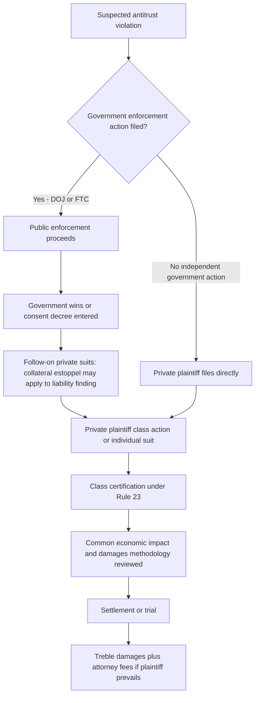

## Private Enforcement and Treble Damages

### Definition and Conceptual Foundation

Private enforcement refers to antitrust litigation brought by injured private parties — competitors, customers, or consumers — rather than by government enforcement agencies. In the United States, private enforcement is not merely a supplementary channel but a structurally central pillar of the overall antitrust enforcement system, quantitatively exceeding government enforcement in case volume. This stands in notable contrast to most other jurisdictions, where public enforcement predominates and private mechanisms remain comparatively underdeveloped, as discussed in the comparative competition policy topic.

### Statutory Basis: Clayton Act Section 4

The core statutory authorization for U.S. private antitrust enforcement is Clayton Act §4 (15 U.S.C. § 15):

> "Any person who shall be injured in his business or property by reason of anything forbidden in the antitrust laws... shall recover threefold the damages by him sustained, and the cost of suit, including a reasonable attorney's fee."

This provision does three things simultaneously that together explain why private enforcement plays such an outsized role in the U.S. system:

$$\text{Recovery} = 3 \times \text{Actual Damages} + \text{Costs} + \text{Reasonable Attorney's Fees}$$

1. **Creates a private right of action** for any person injured by conduct violating the Sherman or Clayton Acts (notably, the FTC Act's Section 5 has no equivalent private right of action — only the FTC itself may enforce it).
2. **Trebles actual damages**, awarding three times the plaintiff's proven compensatory loss.
3. **Shifts attorney's fees** to the losing defendant when the plaintiff prevails, departing from the ordinary "American Rule" under which each party normally bears its own litigation costs regardless of outcome.

### The Economic Rationale for Treble Damages

Treble damages serve two distinct, analytically separable economic functions, and understanding both is essential to evaluating the provision's design:

#### Function 1: Deterrence

Because antitrust violations — particularly covert cartel conduct — are not always detected, a damages multiplier compensates for imperfect detection probability. If violators only faced liability for single (actual) damages, and detection probability is meaningfully below 1, the expected cost of violating would be below the actual harm caused, understating the deterrent effect below the socially optimal level:

$$\text{Expected Liability} = p \times (\text{Damages Multiplier} \times \text{Harm})$$

Where $p$ is the probability of detection and successful prosecution. Setting the multiplier at $1/p$ would in principle restore expected liability to equal actual harm, achieving optimal deterrence. [Inference] The specific choice of a *treble* (3x) multiplier in the original 1890 Sherman Act (carried forward into the Clayton Act's private right of action) does not appear to derive from a precise contemporaneous calculation of average cartel detection probability; it is better understood as a legislatively chosen round-number enhancement reflecting a general policy judgment that antitrust violations warranted punitive-level deterrence, rather than the output of an economic optimization exercise — though modern economic scholarship has since used the detection-probability framework to *justify* multiple-damages remedies generally.

#### Function 2: Enabling Private Enforcement as a Complement to Public Enforcement

Antitrust litigation is expensive, technically complex, and often pursued against well-resourced defendants. Single (uncompensated-cost) damages, especially for individually small-value claims spread across many purchasers, would frequently make private litigation economically irrational to pursue — the expected recovery would not justify the litigation cost. Treble damages plus fee-shifting substantially improve the expected value calculation for plaintiffs and their contingency-fee counsel, which is what makes private enforcement of dispersed, diffuse harms (such as a price-fixing cartel affecting millions of small consumer purchases) practically viable at all.

### The Class Action Mechanism

Private antitrust enforcement for dispersed consumer harm relies heavily on the **Federal Rule of Civil Procedure 23** class action mechanism, which aggregates numerous individually small claims into a single litigation:

- **Rule 23(a)** requires numerosity, commonality, typicality, and adequacy of representation.
- **Rule 23(b)(3)** — the most common basis for antitrust class certification — requires that common questions predominate over individual questions and that a class action is the superior method of adjudication.
- **Class certification in antitrust cases** typically turns heavily on whether **common impact** (that the alleged conduct affected all class members in a common manner, even if damage magnitudes differ) can be shown through common economic evidence, often requiring expert economic testimony on market-wide overcharge effects at the certification stage itself (following *Comcast v. Behrend*, 2013, which tightened the required linkage between the proposed damages methodology and the specific liability theory).

Without class aggregation, the treble-damages/fee-shifting mechanism alone would often be insufficient to make pursuing individually small claims (e.g., a modest per-purchase price-fixing overcharge) economically rational, since litigation costs for even a single plaintiff can still exceed the trebled value of an individually small claim.

### Diagram: Private Enforcement Litigation Pathway

### Follow-On Litigation and Collateral Estoppel

A structurally important feature connecting public and private enforcement: under **15 U.S.C. § 16(a)**, a final judgment or decree in a government antitrust case (DOJ civil or criminal) can serve as **prima facie evidence** against the same defendant in subsequent private litigation regarding the same conduct — though this provision explicitly does not apply to consent judgments entered before any testimony has been taken, which is why many government settlements are structured to avoid triggering this evidentiary effect for defendants seeking to limit follow-on private exposure. This creates a common enforcement sequence: government investigation and prosecution (particularly of hardcore cartels) is frequently followed by a wave of private "follow-on" damages litigation from purchasers who benefit from the reduced evidentiary burden of building on an already-established liability finding.

### Standing Limitations: Antitrust Injury and Indirect Purchasers

Not every party financially affected by anticompetitive conduct has standing to sue. Two significant doctrinal limitations narrow the pool of eligible private plaintiffs:

#### Antitrust Injury Requirement

Established in *Brunswick Corp. v. Pueblo Bowl-O-Mat* (1977), a plaintiff must show **"antitrust injury"** — harm that flows from the anticompetitive aspect of the defendant's conduct, not merely harm caused by the defendant's conduct generally. This prevents, for example, a competitor from recovering damages for being outcompeted through *lawful* aggressive competition (such as legitimately lower prices) even where a merger or challenged conduct is separately found unlawful on other grounds — the injury must stem specifically from the *reduction in competition*, not from vigorous competition itself.

#### The Indirect Purchaser Rule

Established in *Illinois Brick Co. v. Illinois* (1977), only **direct purchasers** from an antitrust violator generally have standing to sue for damages under federal law, even though the economic overcharge from a cartel is frequently passed through the distribution chain to indirect purchasers (e.g., retail consumers who bought from a retailer who bought from a price-fixing manufacturer).

$$\text{Overcharge} \xrightarrow{\text{pass-through}} \text{Direct Purchaser} \xrightarrow{\text{pass-through}} \text{Indirect Purchaser (typically barred from federal suit)}$$

The Illinois Brick rule reflects a policy judgment favoring litigation simplicity (avoiding complex, potentially duplicative pass-through-rate litigation and the risk of both over- and under-compensation across multiple levels of the distribution chain) over precisely tracing where in the chain the economic harm ultimately landed. [Inference] This rule has been significantly qualified in practice: a substantial majority of U.S. states have enacted **"Illinois Brick repealer" statutes** that restore indirect purchaser standing under state antitrust law, meaning the practical availability of indirect purchaser recovery depends heavily on which state law applies to the claim — this is a genuinely fragmented area of law that should be assessed jurisdiction-by-jurisdiction rather than treated as a uniform federal bar.

### Comparative Perspective: Why the U.S. Model Is Distinctive

As introduced in the comparative competition policy topic, the scale of U.S. private antitrust enforcement is a notable international outlier, driven by the confluence of several distinctly American procedural features working together:

| Feature | United States | Most Other Jurisdictions (e.g., EU) |
| --- | --- | --- |
| Damages multiplier | Treble (3x) damages | Actual/compensatory damages only |
| Fee-shifting for prevailing plaintiff | Yes (mandatory under Clayton Act §4) | Generally follows local "loser pays" rules, less plaintiff-favorable |
| Contingency fee arrangements | Widely available and commonly used | More restricted or culturally less prevalent in many jurisdictions |
| Class/collective action mechanism | Well-established opt-out class actions (Rule 23) | Historically limited; EU Antitrust Damages Directive (2014) and national collective redress mechanisms are comparatively newer and generally more restrictive |
| Discovery scope | Broad pre-trial discovery available to plaintiffs | Generally narrower discovery obligations under most civil-law systems |

[Unverified] The relative deterrence contribution of private versus public enforcement in the U.S. system — i.e., what fraction of total antitrust deterrence is attributable to the *prospect* of private treble-damages liability as opposed to public enforcement risk — has been the subject of empirical economic research, but precise quantitative allocation remains difficult to establish with confidence and estimates vary across studies and methodologies.

### Criticisms and Policy Debates

- **Overdeterrence concern**: Critics (largely associated with the Chicago School tradition discussed in the historical origins topic) argue treble damages combined with expansive discovery and class-action aggregation can encourage strategic or opportunistic litigation, potentially chilling legitimate aggressive competition out of fear of costly litigation exposure even absent a strong underlying merits case.
- **Underdeterrence concern (opposing view)**: Others argue that even with trebling, detection probability for sophisticated cartel conduct remains low enough that expected liability still falls short of optimal deterrence, and further argue that narrowing doctrines like *Illinois Brick* and heightened class-certification standards (*Comcast*) have reduced private enforcement's practical deterrent bite over time.
- **Settlement dynamics**: [Speculation] Whether the treble-damages/fee-shifting combination systematically produces settlement outcomes that closely approximate the underlying merits (efficient settlement) or instead produces settlement pressure disconnected from case merits (given the asymmetric cost and risk exposure defendants face) is a genuinely contested empirical question in the law-and-economics literature, without clear scholarly consensus.

### Connection to Course Framework

Private enforcement mechanisms operationalize the deterrence function of the substantive standards covered elsewhere in this chapter (Sherman/Clayton Act provisions, monopolization and abuse-of-dominance standards, per se vs. rule-of-reason analysis) — the *practical* deterrent effect of any given antitrust standard depends not only on its substantive stringency but on the realistic likelihood and financial consequence of a violation actually being detected, litigated, and remedied, which private treble-damages litigation substantially shapes independent of public enforcement agency resource constraints and priorities.

**Related Topics**

- Illinois Brick and indirect purchaser standing (state repealer statutes)
- Rule 23 class certification standards in antitrust cases
- Follow-on litigation and collateral estoppel under 15 U.S.C. § 16
- Antitrust injury doctrine (Brunswick Corp. v. Pueblo Bowl-O-Mat)
- Comparative competition policy across jurisdictions
- Cartel detection and optimal deterrence theory
- EU Antitrust Damages Directive and collective redress mechanisms