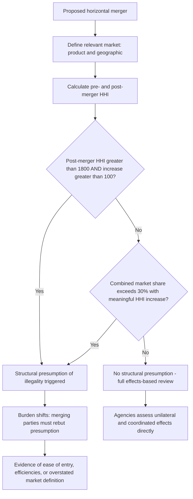

## Horizontal Merger Guidelines and Market Share Screens

### Definition and Conceptual Foundation

Horizontal merger guidelines are non-binding enforcement policy documents jointly issued by the U.S. Department of Justice Antitrust Division and Federal Trade Commission, articulating the analytical framework and quantitative screens the agencies use to evaluate whether a proposed merger between competitors would violate Clayton Act §7's prohibition on transactions that "may be substantially to lessen competition, or to tend to create a monopoly." While not themselves binding law — courts are not obligated to adopt agency-defined thresholds — the Guidelines have historically exerted substantial influence on both agency enforcement decisions and judicial reasoning, and they structure the practical due-diligence process merging parties undertake in anticipating regulatory scrutiny.

### Historical Evolution of the Guidelines

| Version | Year | Key Characteristics |
| --- | --- | --- |
| Original Merger Guidelines | 1968 | Primarily structural, heavy reliance on market share screens |
| Revised Merger Guidelines | 1982, 1984 | Introduced the Herfindahl-Hirschman Index (HHI) as the primary concentration metric, replacing older four-firm concentration ratio approaches |
| Horizontal Merger Guidelines | 1992 (revised 1997) | Refined the five-step analytical framework still substantially recognizable in later versions |
| Horizontal Merger Guidelines | 2010 | Moved concentration thresholds higher (less interventionist), placed greater emphasis on direct evidence of competitive effects (unilateral effects, diversion ratios) rather than relying primarily on structural presumptions |
| Merger Guidelines | 2023 | Jointly replaced the 2010 Horizontal Merger Guidelines and the short-lived 2020 Vertical Merger Guidelines; substantially lowered concentration thresholds, reintroduced explicit market-share-based presumptions, and added new theories addressing platform markets, labor markets, serial acquisitions, and minority investments |

### The HHI Concentration Metric

The Herfindahl-Hirschman Index remains the foundational quantitative screen across all versions of the Guidelines:

$$\text{HHI} = \sum_{i=1}^{n} s_i^2 \times 10{,}000$$

Where $s_i$ is firm $i$'s market share expressed as a decimal (e.g., a 20% share contributes $0.20^2 \times 10{,}000 = 400$ to the index). HHI ranges from near 0 (many equally small firms, perfect competition) to 10,000 (pure monopoly). The index is sensitive to both the number of firms and the degree of asymmetry in their shares — it weights larger firms disproportionately more heavily than a simple concentration ratio (e.g., $CR_4$, the four-firm concentration ratio) because shares are squared before summing.

**Example**

Consider a market with five firms holding shares of 35%, 25%, 20%, 15%, and 5%:

$$\text{HHI} = 35^2 + 25^2 + 20^2 + 15^2 + 5^2 = 1{,}225 + 625 + 400 + 225 + 25 = 2{,}500$$

If the two smallest firms (15% and 5%) merge into a single 20% firm:

$$\text{HHI}_{post} = 35^2 + 25^2 + 20^2 + 20^2 = 1{,}225 + 625 + 400 + 400 = 2{,}650$$

$$\Delta\text{HHI} = 2{,}650 - 2{,}500 = 150$$

Note the useful algebraic shortcut: for a merger between two firms with shares $s_i$ and $s_j$, the HHI change can be computed directly as $\Delta\text{HHI} = 2 s_i s_j \times 10{,}000$ without recalculating every firm's contribution, since all non-merging firms' individual contributions are unchanged: $2 \times 15 \times 5 = 150$, matching the result above.

### 2023 Merger Guidelines: Concentration Thresholds

The 2023 Merger Guidelines materially lowered the concentration thresholds that trigger a structural presumption of illegality, reverting to levels closer to the 1992 Guidelines rather than the more permissive 2010 thresholds. The 2010 Horizontal Merger Guidelines indicated that a structural presumption would be triggered by mergers resulting in a Herfindahl-Hirschman Index exceeding 2,500 with an HHI increase of more than 200, while the 2023 Guidelines lowered those levels to a post-merger HHI exceeding 1,800 with an HHI increase of more than 100. [Congress.gov](https://www.congress.gov/crs_external_products/LSB/HTML/LSB11138.web.html)

| Market Classification | HHI Range |
| --- | --- |
| Unconcentrated | Below 1,000 |
| Moderately concentrated | 1,000–1,800 |
| Highly concentrated | Above 1,800 |

The 2023 Guidelines lower the HHI threshold for a "highly concentrated" market from 2,500 to 1,800, and lower the post-merger change in HHI that creates a presumptively unlawful merger from 200 to 100. [Law Firm](https://hallrender.com/2023/12/27/ftc-and-doj-release-finalized-merger-guidelines/)

#### The New Market Share Presumption

A structurally significant addition in the 2023 Guidelines is an independent market-share-based presumption, distinct from and additional to the HHI-based test: an acquisition resulting in a combined 30% market share would be presumptively unlawful, as would "6-to-5" mergers reflecting post-merger HHI concentration over 1,800 under certain conditions. This 30% figure is not a novel invention — it derives from the Supreme Court's 1963 decision in United States v. Philadelphia National Bank, which grounded a presumption of illegality in a combination of a 30% market share threshold and a "significant" increase in market concentration, though the Court did not specify a minimum numerical value for what counts as a "significant" increase. [Crowell & Moring](https://www.crowell.com/en/insights/client-alerts/doj-and-ftc-issue-final-2023-merger-guidelines-with-significant-changes-and-updates)[Congress.gov](https://www.congress.gov/crs_external_products/LSB/PDF/LSB11138/LSB11138.1.pdf)

[Inference] The gap between the roughly 600-point HHI increase present in the underlying *Philadelphia National Bank* case and the much lower 100-point trigger the 2023 Guidelines adopt has drawn commentary questioning whether the Guidelines' approach is well-anchored in the originating precedent, since the 2023 threshold is considerably more sensitive than the fact pattern that established the doctrine — this is a genuine point of legal debate rather than a settled interpretive matter, and it remains uncertain how consistently reviewing courts will defer to the agencies' chosen threshold.

### Diagram: The Structural Presumption Framework

### Rebuttable Nature of the Presumption

Despite the lowered thresholds, the structural presumption remains formally **rebuttable**, not conclusive. The final version of the 2023 Guidelines softened some presumptive language relative to earlier drafts and explicitly emphasized that the presumptions are rebuttable. Merging parties can attempt to rebut the presumption through evidence that: [Crowell & Moring](https://www.crowell.com/en/insights/client-alerts/doj-and-ftc-issue-final-2023-merger-guidelines-with-significant-changes-and-updates)

- The relevant market as defined overstates true competitive constraints (e.g., omits a significant competitive source not captured by the formal market definition).
- Entry into the market is sufficiently timely, likely, and sufficient in magnitude to counteract any anticompetitive price increase (the classic "ease of entry" defense).
- Merger-specific efficiencies would offset the competitive harm and could not be achieved through a less anticompetitive alternative transaction structure.
- The specific competitive dynamics of the market (e.g., bidding markets, differentiated products with low actual diversion between the merging parties) make the structural inference unreliable in this particular case.

### Beyond Structural Screens: The Broader 2023 Framework

A significant methodological shift in the 2023 Guidelines relative to the 2010 version is reduced reliance on structural presumptions as the sole analytical pathway, paired with articulation of multiple independent theories of harm that can support a challenge even without triggering the numerical concentration thresholds: the guidelines organize eleven distinct analytical frameworks the agencies use to identify whether a merger raises prima facie concerns, with several addressing head-to-head competition and others addressing mergers in related markets. Notably, a merger can violate the law by eliminating substantial competition between firms that are close competitors even where the resulting market shares are relatively low — meaning the concentration screens function as one pathway among several, not an exhaustive gatekeeping test. [Stinson LLP](https://www.stinson.com/newsroom-publications-ftc-and-doj-announce-final-merger-guidelines)[Stinson LLP](https://www.stinson.com/newsroom-publications-ftc-and-doj-announce-final-merger-guidelines)

The 2023 Guidelines also extended and modernized theories of harm to reach conduct patterns not centrally addressed in earlier versions: the Guidelines address platform markets, labor markets, serial acquisitions, and minority investments, with the latter two issues often associated with private equity roll-up strategies. [Crowell & Moring](https://www.crowell.com/en/insights/client-alerts/doj-and-ftc-issue-final-2023-merger-guidelines-with-significant-changes-and-updates)

### Vertical Merger Treatment

Although this topic centers on horizontal mergers, the 2023 Guidelines consolidated horizontal and vertical merger analysis into a single unified document, in contrast to the standalone 2020 Vertical Merger Guidelines (which the FTC had withdrawn in 2021). The final Guidelines maintained a similar analytical framework for vertical mergers but moved the presumption of illegality for transactions that could foreclose a competitor's access to more than 50% of the market for an input from the main body of text into a footnote. The final Guidelines also do not establish a formal market-share presumption specifically for vertical mergers, though the agencies note they will infer a firm has or is approaching monopoly power at a 50%-or-greater share, and that even a lower share may raise concerns when the relevant product is important to the firm's trading partners. [Skadden](https://www.skadden.com/insights/publications/2023/12/doj-and-ftc-release-final-2023-merger-guidelines)[Crowell & Moring](https://www.crowell.com/en/insights/client-alerts/doj-and-ftc-issue-final-2023-merger-guidelines-with-significant-changes-and-updates)

### Practical and Legal Uncertainty Following the 2023 Revision

Because the Guidelines are agency policy rather than binding statute or regulation, their practical force depends on judicial reception, which remains an evolving question. The Supreme Court has not issued a merits opinion in a merger case since 1975, and while some lower courts have interpreted the Clayton Act as focusing primarily on economic welfare, it remains to be seen whether courts will follow the DOJ and FTC in treating market structure as having independent normative significance beyond its evidentiary relevance to consumer welfare effects. [Unverified] Given that the lowered thresholds and expanded theories of harm are relatively recent (December 2023) and their application depends heavily on case-by-case litigation outcomes still developing, the actual rate at which courts adopt or resist the 2023 framework's presumptions should be checked against subsequent case law rather than assumed, since this is an area still actively being tested in litigation. [Congress.gov](https://www.congress.gov/crs_external_products/LSB/HTML/LSB11138.web.html)

### Relationship to Broader Merger Review Process

The concentration screens discussed here function as the substantive analytical core applied *after* a transaction has been identified for scrutiny — in practice, most transactions are first triaged through the **Hart-Scott-Rodino Act** pre-merger notification process (covered in the U.S. statutory framework topic), which determines which transactions receive Phase I/"second request" agency review before the substantive HHI and market-share analysis described here is applied in earnest.

### Connection to Course Framework

The market-share and concentration-screen methodology discussed here is the primary empirical tool through which the theoretical dynamic-oligopoly concepts from earlier chapters (industry shakeouts producing durably concentrated market structures, learning-curve-driven cost advantages entrenching dominant positions) become operationally relevant to merger enforcement: a market that has already undergone a shakeout and stabilized at high concentration is precisely the kind of "highly concentrated" market (HHI above 1,800) in which the 2023 Guidelines' lowered thresholds are most likely to trigger a structural presumption against any further horizontal consolidation.

**Related Topics**

- Relevant market definition and the SSNIP/hypothetical monopolist test
- Unilateral effects analysis and diversion ratios
- Coordinated effects theories in merger review
- Hart-Scott-Rodino pre-merger notification process
- Vertical merger foreclosure theories
- Efficiencies defenses in merger litigation
- Comparative merger review: EU Merger Regulation thresholds