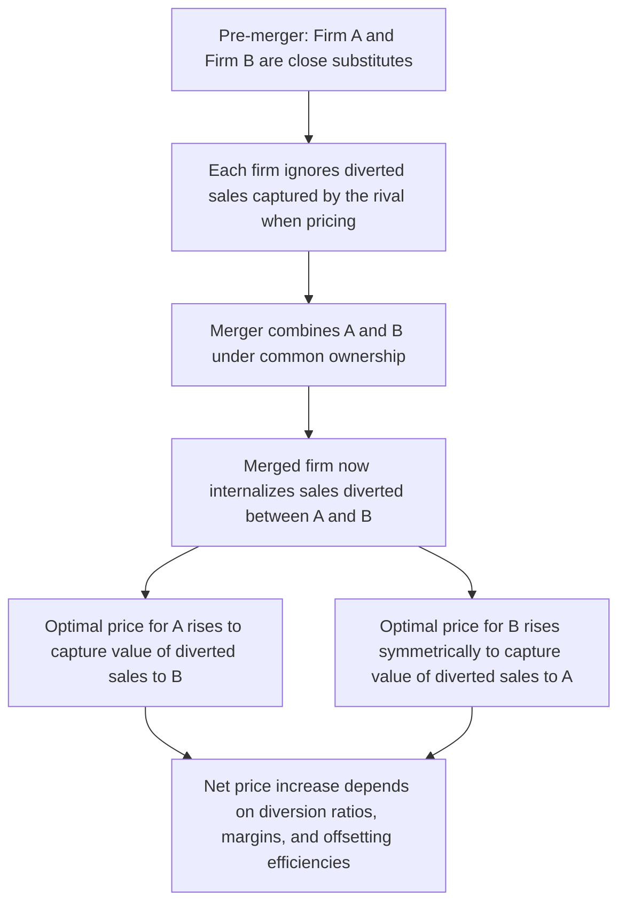

## Unilateral Effects in Differentiated Product Mergers

### Definition and Conceptual Foundation

Unilateral effects analysis evaluates whether a merger between competitors can enable the merged firm to profitably raise prices (or reduce quality, variety, or innovation) **on its own**, without relying on post-merger coordination or collusion with remaining rivals. This is analytically distinct from **coordinated effects** analysis, which examines whether a merger makes tacit or explicit collusion among the remaining market participants more likely or more effective. Unilateral effects theory has become the dominant framework for evaluating mergers among firms selling differentiated products, since it does not require proof of any post-merger coordination — the harm flows directly and mechanically from the elimination of head-to-head competition between the merging parties themselves.

### The Core Economic Mechanism

In a market with differentiated products, each firm's optimal pricing reflects a tradeoff: raising price loses some sales to substitute products, but captures higher margin on remaining sales. Critically, when a firm considers raising its price, part of the sales it loses are diverted to products that, **after the merger, are owned by the same firm**. This changes the profit-maximizing calculus, because the merged firm now internalizes those diverted sales as a gain rather than treating them as a pure loss to a rival.

Formally, for a single-product firm A prior to merger, the profit-maximizing price satisfies the standard markup condition reflecting only A's own demand elasticity. Post-merger, if firm A also owns firm B (a close substitute), the first-order condition for A's price incorporates an additional term capturing the profit the merged entity now recaptures on units diverted to B:

$$\frac{\partial \Pi_{AB}}{\partial p_A} = \underbrace{(p_A - c_A)\frac{\partial q_A}{\partial p_A} + q_A}_{\text{standard single-product term}} + \underbrace{(p_B - c_B)\frac{\partial q_B}{\partial p_A}}_{\text{recaptured diversion to B}} = 0$$

The second term is strictly positive when A and B are substitutes (raising $p_A$ increases $q_B$), meaning the merged firm's optimal price for A is unambiguously higher than the pre-merger profit-maximizing price, holding B's price and marginal costs fixed. This is the core unilateral effects mechanism: no coordination assumption is needed, since this is simply the single merged entity maximizing its own joint profit.

### The Diversion Ratio

The central empirical input to unilateral effects analysis is the **diversion ratio** — the fraction of unit sales lost by product A (due to a price increase) that are captured by product B rather than lost to outside options or unrelated competitors:

$$D_{A \to B} = \frac{\partial q_B / \partial p_A}{-\partial q_A / \partial p_A}$$

A diversion ratio of $D_{A \to B} = 0.4$ means that for every 100 units firm A loses from a price increase, 40 units flow specifically to firm B. Diversion ratios are typically estimated empirically using:

- **Consumer survey data** (e.g., "second choice" surveys asking customers who purchased product A what they would have purchased if A were unavailable).
- **Natural experiments or historical price variation**, when available, using econometric demand estimation.
- **Bidding data** in markets with discrete competitive bidding processes (e.g., some business-to-business procurement contexts), where the frequency with which A and B are each other's runner-up bid provides a direct empirical proxy for diversion.

[Inference] The reliability of survey-based diversion ratio estimates depends heavily on survey design and can be sensitive to how "second choice" questions are framed; this is a recurring point of expert economic dispute in merger litigation rather than a matter of settled measurement methodology, since different reasonable survey designs can produce meaningfully different diversion estimates for the same underlying market.

### The GUPPI: Gross Upward Pricing Pressure Index

The **Gross Upward Pricing Pressure Index (GUPPI)** is the standard quantitative screening tool the U.S. antitrust agencies use to translate diversion ratios and margin data into a predicted measure of unilateral pricing pressure, without requiring a full structural merger simulation model:

$$\text{GUPPI}_A = D_{A \to B} \times \frac{p_B - c_B}{p_A}$$

Where $D_{A \to B}$ is the diversion ratio from A to B, $p_B - c_B$ is firm B's margin (price minus marginal cost), and $p_A$ is firm A's price. The GUPPI represents the value of sales diverted to B, expressed as a percentage of A's revenue — an approximation of the upward pricing pressure on product A's price arising purely from internalizing the diverted sales, before accounting for any offsetting merger efficiencies (marginal cost reductions) or the further "second-round" effect of firm B's price also potentially rising.

**Example**

Suppose products A and B are close substitutes with $D_{A \to B} = 0.35$, firm B's price is $50 with marginal cost $30 (a $20 margin), and firm A's price is $40:

$$\text{GUPPI}_A = 0.35 \times \frac{50 - 30}{40} = 0.35 \times 0.5 = 0.175$$

This indicates upward pricing pressure on product A equivalent to roughly 17.5% of A's price, absent any offsetting efficiencies — a magnitude the agencies would typically regard as warranting close scrutiny, though GUPPI is explicitly a **screening tool**, not a prediction of the actual equilibrium price increase (which requires a full merger simulation incorporating both firms' pricing responses and any efficiency offsets).

### Diagram: Unilateral Effects Mechanism

### Merger Simulation Models

Beyond the simplified GUPPI screen, formal **merger simulation** models predict post-merger equilibrium prices by specifying a demand system (commonly logit, nested logit, or Almost Ideal Demand System specifications) and solving for the new Bertrand-Nash price equilibrium under joint ownership:

$$p^{post}_A, p^{post}_B = \arg\max_{p_A, p_B} \left[ (p_A - c_A)q_A(p_A, p_B) + (p_B - c_B)q_B(p_A, p_B) \right]$$

This requires substantially more data and structural assumptions than the GUPPI screen (a fully specified demand system, cross-price elasticities for all product pairs, not merely the merging parties) but produces an actual predicted equilibrium price change rather than a directional pressure indicator. [Inference] Merger simulation results are sensitive to the specific functional form assumed for the demand system, and reasonable alternative demand specifications calibrated to the same underlying data can produce materially different predicted price effects — this sensitivity is a well-recognized limitation acknowledged in the economic literature and is a frequent point of contention between opposing experts in litigated merger challenges, rather than a settled, model-independent prediction exercise.

### Why Unilateral Effects Analysis Does Not Require High Market Share

A key analytical feature distinguishing unilateral effects from purely structural (HHI-based) screens: unilateral effects harm can arise even when the merging parties' combined market share is modest, **provided the two merging products are unusually close substitutes for each other relative to other products in the market**. This is why the 2023 Merger Guidelines explicitly recognize that a merger can violate the law by eliminating substantial head-to-head competition between the parties even where resulting market shares are relatively low, provided the parties are shown to be particularly close competitors (high mutual diversion) rather than merely two of many similarly-positioned competitors in a broader relevant market.

This has an important practical corollary: relevant market definition, while still performed, is less determinative for unilateral effects theories than for the structural HHI screens discussed in the horizontal merger guidelines topic — a plaintiff can potentially establish unilateral effects harm through direct diversion-ratio and margin evidence without needing to first win a contested formal market-definition dispute, since the diversion ratio is a direct measure of competitive closeness that does not depend on drawing precise product-market boundaries.

### Offsetting Considerations: Efficiencies and Repositioning

Two countervailing forces can offset the upward pricing pressure identified by GUPPI or simulation analysis:

- **Merger-specific efficiencies**: If the merger enables genuine marginal cost reductions (e.g., through eliminated duplicate distribution, economies of scale, or the kind of dynamic learning-curve cost advantages discussed in the dynamic oligopoly chapter), lower marginal costs partially or fully offset the upward pricing pressure from internalized diversion. The Merger Guidelines require efficiencies to be **merger-specific** (not achievable through less anticompetitive alternative means) and verifiable, placing the burden of proof on the merging parties.
- **Repositioning by rival firms**: If non-merging competitors can reposition their products (in price, quality, or characteristic space) in response to the merged firm's price increase, this can partially constrain the predicted price effect — though agencies and courts typically require concrete evidence that repositioning is likely and timely, rather than accepting it as a generic theoretical possibility.

### Illustrative Case Pattern

Consider a hypothetical merger between two premium athletic shoe brands in a market that also includes several budget and mid-tier competitors. A pure HHI/structural analysis might understate the competitive concern if the two premium brands hold a modest combined share of the overall footwear market. However, if consumer survey data shows that a large share of customers who would switch away from Brand A due to a price increase name Brand B as their most likely alternative (a high diversion ratio specifically between A and B, low diversion to the budget or mid-tier competitors), unilateral effects analysis would identify substantial upward pricing pressure despite the modest overall market share — precisely the scenario the 2023 Guidelines' "substantial competition between the parties" theory is designed to capture independent of the structural HHI thresholds.

### Distinguishing Unilateral from Coordinated Effects

| Dimension | Unilateral Effects | Coordinated Effects |
| --- | --- | --- |
| Mechanism | Merged firm's own profit-maximizing incentive changes | Merger makes tacit or explicit collusion among remaining firms easier or more stable |
| Requires collusion among non-merging firms? | No | Yes — the theory of harm is specifically about post-merger market dynamics among the (now fewer) remaining competitors |
| Key evidence | Diversion ratios, margins, GUPPI, merger simulation | Market transparency, product homogeneity, history of coordination, symmetry among remaining firms |
| Most relevant market structure | Differentiated products, close substitutes | Homogeneous or semi-homogeneous products, few remaining symmetric competitors post-merger |

### Connection to Course Framework

Unilateral effects analysis represents the primary modern refinement beyond the purely structural HHI-based screens covered in the horizontal merger guidelines topic: rather than inferring competitive harm indirectly from market concentration alone, it directly measures the specific mechanism by which a merger changes pricing incentives, reflecting the broader post-Chicago School shift (discussed in the historical origins and monopolization topics) toward economically grounded, effects-based analysis rather than purely structural presumption. It is also the framework most directly applicable to mergers in markets exhibiting the industry-life-cycle dynamics discussed earlier in the course — differentiated-product competition is characteristic of the pre-shakeout, pre-dominant-design phase of an industry, making unilateral effects theory particularly relevant to merger review timed prior to full market standardization.

**Related Topics**

- Horizontal merger guidelines and market share screens
- Coordinated effects and tacit collusion facilitation
- Relevant market definition and the SSNIP test
- Efficiencies defenses in merger review
- Bertrand-Nash pricing in differentiated product oligopoly
- Merger simulation modeling techniques (logit, AIDS demand systems)
- Entry and repositioning as merger defenses