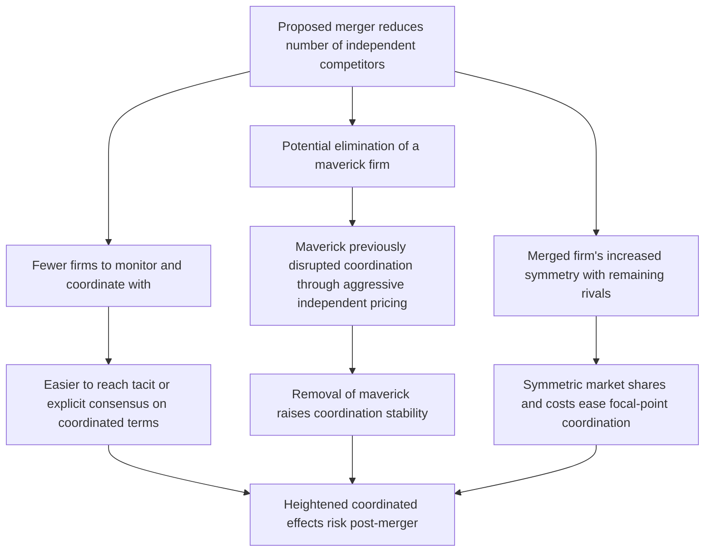

## Coordinated Effects and Heightened Collusion Risk

### Definition and Conceptual Foundation

Coordinated effects analysis evaluates whether a merger increases the likelihood, effectiveness, or stability of tacit or explicit collusion among the firms remaining in a market after the transaction — as distinct from unilateral effects, which examine whether the merged firm alone can profitably raise prices without any cooperation from rivals. Coordinated effects theories of harm rest on the proposition that a merger, by reducing the number of independent competitors and altering market structure, can make sustained supra-competitive pricing easier for the industry as a whole to achieve and maintain, even absent any explicit agreement among the firms that would itself independently violate Sherman Act §1.

### Theoretical Foundation: Repeated Games and Tacit Collusion

The economic logic of coordinated effects draws on **repeated game theory**, specifically the folk theorem's insight that cooperative (collusive) outcomes can be sustained as a non-cooperative equilibrium in an infinitely (or indefinitely) repeated game, provided firms are sufficiently patient and can credibly threaten to punish deviation.

Consider $n$ symmetric firms repeatedly setting prices. A firm considering whether to maintain a collusive (supra-competitive) price compares:

$$\underbrace{\frac{\pi^{collusive}}{1 - \delta}}_{\text{value of sustained cooperation}} \quad \text{vs.} \quad \underbrace{\pi^{deviate} + \delta \cdot \frac{\pi^{competitive}}{1 - \delta}}_{\text{value of deviating, then facing punishment}}$$

Where $\delta$ is the discount factor, $\pi^{collusive}$ is each firm's profit under sustained coordination, $\pi^{deviate}$ is the one-period profit from undercutting rivals while they still charge the collusive price, and $\pi^{competitive}$ is the profit under the post-deviation punishment (typically reversion to competitive pricing). Collusion is sustainable when:

$$\delta \geq \frac{\pi^{deviate} - \pi^{collusive}}{\pi^{deviate} - \pi^{competitive}}$$

The critical discount factor threshold on the right-hand side is lower — meaning collusion is easier to sustain — when deviation is easier to detect (shortening the effective delay before punishment), when punishment is more severe, and when the one-period gain from deviating ($\pi^{deviate} - \pi^{collusive}$) is smaller relative to the loss from punishment. **A merger's relevance to coordinated effects operates precisely through changing the parameters of this inequality** — primarily by reducing $n$ (fewer firms whose behavior must be monitored and coordinated) and by potentially altering detection speed, symmetry, and punishment credibility.

### Structural Factors That Facilitate Coordination

The Merger Guidelines and accompanying economic literature identify several market characteristics that make coordinated conduct more likely to be sustainable, and that a merger can worsen:

- **Market transparency**: The ease with which firms can observe rivals' prices, output, or other competitively relevant terms. High transparency shortens the detection lag for deviation, making the credible-punishment condition easier to satisfy.
- **Product homogeneity**: Coordination is generally easier to sustain and monitor for homogeneous products (where a single dimension — price — captures the terms of competition) than for highly differentiated products (where coordinating across multiple quality/variety dimensions is more complex).
- **Symmetry among competitors**: Firms with similar costs, capacity, and market shares find it easier to agree on and sustain a common focal coordination point than firms with highly asymmetric positions, since asymmetric firms often have differing preferences over the coordinated outcome (a low-cost firm may prefer a lower collusive price than a high-cost firm).
- **Frequency of interaction and small-numbers markets**: More frequent transactions and fewer competing firms shorten the effective "punishment lag" and reduce the coordination and monitoring burden.
- **Barriers to entry**: If entry is difficult, a supra-competitive price is not eroded by new competitive supply, making sustained coordination more durable and profitable.
- **History of prior coordination or facilitating practices**: Evidence that firms have previously coordinated (even if not successfully prosecuted) or use practices that facilitate tacit coordination (e.g., advance price announcements, most-favored-nation clauses, standardized product specifications) is treated as probative of heightened coordination risk.

### How a Merger Changes These Structural Factors

### The "Maverick Firm" Concept

A particularly important and frequently litigated coordinated effects theory involves the **maverick firm** — a competitor whose independent pricing behavior (due to distinct incentives, lower costs, excess capacity, or a strategic preference for volume over margin) has historically disrupted or prevented successful coordination among the remaining firms in the market. If the merger eliminates a maverick (either by acquiring it directly or by acquiring a firm whose competitive pressure had constrained the maverick's rivals), coordination among the remaining firms becomes more likely to succeed even if the maverick's own market share was relatively modest.

[Inference] Identifying a maverick firm and establishing that its removal would meaningfully change post-merger coordination dynamics is a fact-intensive inquiry that typically requires internal company documents, customer testimony, and pricing pattern evidence rather than being inferable from market share data alone — this is one of the more evidence-heavy and case-specific theories of harm in merger litigation, and reasonable analysts can disagree about whether a given firm's historical conduct actually constitutes "maverick" behavior in the relevant antitrust sense versus simply reflecting ordinary competitive variation.

### Facilitating Practices and Information Exchange

Coordinated effects concerns are heightened by conduct or market institutions that reduce the practical difficulty of reaching and monitoring a coordinated outcome, even short of an explicit per se illegal agreement:

- **Price signaling**: Public announcements of future price increases, particularly when made well in advance of implementation and without an independent business rationale, can function as a coordination mechanism by allowing firms to communicate intended pricing without direct communication.
- **Benchmark and index pricing**: Contractual terms tying price to a shared published index can reduce the need for firms to independently verify rivals' actual prices, easing monitoring.
- **Trade association data exchange**: Sharing of detailed, current, and firm-specific (rather than aggregated/historical) pricing, output, or cost data through industry associations has been scrutinized as a facilitating practice, since it can substitute for the kind of information firms would otherwise need direct communication to obtain.
- **Most-favored-nation (MFN) clauses**: Contractual provisions guaranteeing a buyer the best price offered to any other customer can, in some circumstances, reduce firms' incentive to deviate from a coordinated price by making discounting to any one customer costly across the firm's entire customer base.

### Coordinated Effects Under the 2023 Merger Guidelines

The 2023 Merger Guidelines integrate coordinated effects analysis as one of several enumerated frameworks (distinct from, but complementary to, the unilateral effects and structural HHI-based presumption frameworks covered in prior topics) for establishing that a merger may substantially lessen competition. The Guidelines articulate that the structural presumption triggered by post-merger HHI exceeding 1,800 with an increase over 100 (or a combined share exceeding 30%) is explicitly tied to the theory that such mergers "may be to eliminate substantial competition between the merging parties and may be to increase coordination among the remaining competitors after the merger" — directly linking the numerical structural screens to the underlying coordinated-effects economic theory, rather than treating concentration as an end in itself independent of any articulated mechanism of harm.

### Distinguishing Coordinated Effects from a Standalone Sherman Act §1 Violation

A critical doctrinal distinction: coordinated effects merger analysis under Clayton Act §7 evaluates the **probability that coordination becomes more likely or effective** as a forward-looking structural inference — it does **not** require proof that the remaining firms will actually enter an unlawful agreement, nor does establishing coordinated effects risk in a merger case itself constitute or prove a violation of Sherman Act §1 by the remaining firms. This is conceptually important: a merger can be blocked or restructured based on coordinated effects concerns even though no subsequent Sherman Act §1 case against the remaining industry participants for actual coordination has been or could be brought, since Clayton Act §7's "may substantially lessen competition" standard operates prospectively and probabilistically, in contrast to Sherman Act §1's requirement of an actual agreement.

### Illustrative Case Pattern

Consider a market with four firms of roughly symmetric size and largely homogeneous products (e.g., a basic industrial input), where pricing has historically tracked closely across all four firms with limited independent price movement — itself potentially suggestive of pre-existing tacit coordination. If two of the four firms propose to merge, reducing the market to three symmetric competitors, a coordinated effects analysis would examine whether the reduction from four to three firms meaningfully eases the coordination problem (fewer firms to align, easier detection of any deviation), even if neither merging firm individually holds a share sufficient to raise significant unilateral effects concerns on its own. This pattern — homogeneous product, historically parallel pricing, transparent market, reduction in firm count — is the classic fact pattern coordinated effects theory is designed to address.

### Empirical and Practical Challenges

Coordinated effects theories face a distinctive practical challenge relative to unilateral effects analysis: because the harm is a **probabilistic, forward-looking prediction about post-merger industry dynamics** rather than a directly measurable mechanical consequence of internalized diversion (as in unilateral effects), coordinated effects cases often rely more heavily on qualitative structural factors and historical industry conduct patterns than on the kind of quantifiable pre-merger data (diversion ratios, margins) that supports GUPPI and merger simulation analysis. [Unverified] The relative success rate of coordinated effects theories versus unilateral effects theories in contested merger litigation has been the subject of some empirical review by antitrust practitioners and scholars, but the applicable body of litigated cases is relatively small and outcome-specific, making broad generalizations about relative litigation success difficult to state with confidence without examining the specific case sample and time period under review.

### Connection to Course Framework

Coordinated effects analysis connects directly to the **dynamic oligopoly** concepts from earlier in the course: the repeated-game sustainability condition described above is the same underlying theoretical apparatus used to analyze tacit collusion stability in oligopoly generally, and the structural factors that facilitate coordination (few firms, symmetry, transparency, entry barriers) are the same factors that determine whether a mature, post-shakeout industry (see: industry life cycles and shakeout patterns) settles into a stable coordinated equilibrium or remains genuinely competitive despite high concentration — merger review's coordinated effects framework is, in effect, an ex-ante application of standard oligopoly theory to predict how a specific transaction would shift an industry along that spectrum.

**Related Topics**

- Unilateral effects in differentiated product mergers
- Horizontal merger guidelines and market share screens
- Repeated games and the folk theorem in oligopoly
- Facilitating practices and information exchange liability
- Maverick firm identification in merger litigation
- Sherman Act Section 1 versus Clayton Act Section 7 standards
- Industry life cycles and shakeout patterns