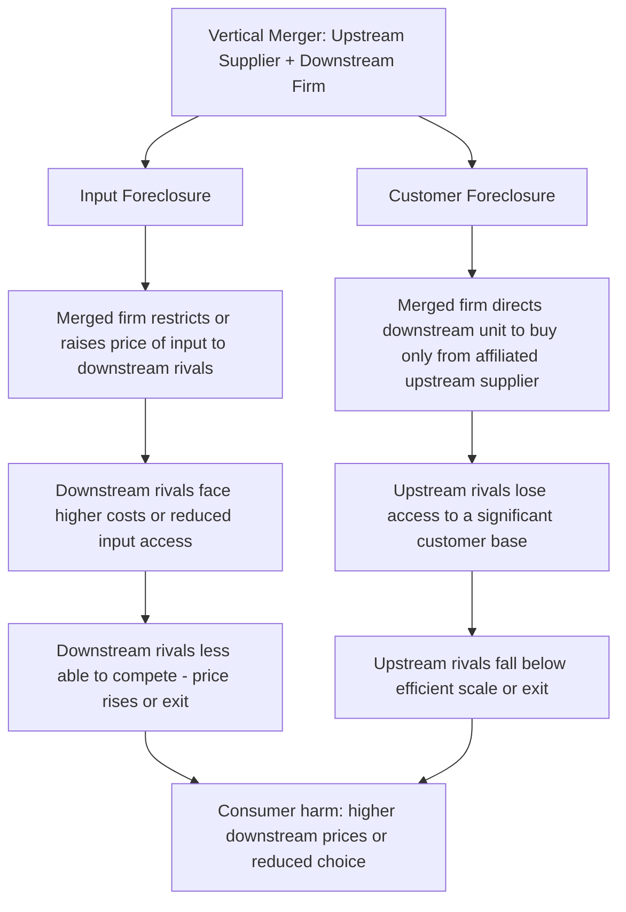

## Vertical Merger Theories of Harm and Foreclosure

### Definition and Conceptual Foundation

Vertical mergers combine firms operating at different stages of the same supply chain — for example, a manufacturer acquiring a key input supplier (backward integration) or a distributor (forward integration) — as distinct from horizontal mergers between direct competitors. Because vertically related firms do not compete with each other pre-merger, vertical mergers do not eliminate any head-to-head competition between the merging parties themselves, which historically made antitrust enforcers and courts more permissive toward vertical transactions than horizontal ones. Vertical merger theories of harm instead center on **foreclosure**: the concern that the merged firm can use its control over an upstream input or downstream distribution channel to disadvantage rivals at the other level of the supply chain, ultimately harming competition and consumers.

### Why Vertical Mergers Are Analytically Distinct from Horizontal Mergers

$$\text{Horizontal Merger} \Rightarrow \text{Direct elimination of competition between the merging parties}$$

$$\text{Vertical Merger} \Rightarrow \text{No direct competitive overlap; harm (if any) operates through foreclosure of rivals at another level}$$

This distinction has significant doctrinal consequences: courts have historically declined to apply a structural presumption to vertical mergers analogous to the HHI-based presumption for horizontal mergers, since simple market share and concentration data at either level of the supply chain does not, by itself, establish that foreclosure will occur or that it would harm competition rather than merely disadvantage particular rivals. A federal appellate court has indicated there is no structural presumption in challenges to vertical mergers, and the DOJ itself stipulated to this proposition in litigation, with a subsequent district court reaching a similar conclusion.

### Input Foreclosure

**Input foreclosure** (also called upstream foreclosure) occurs when a downstream firm acquires an upstream input supplier and then restricts, raises the price of, or entirely denies rival downstream firms' access to that input, disadvantaging those downstream competitors and potentially degrading their ability to compete effectively.

The economic logic of when input foreclosure is profitable for the merged firm depends critically on:

$$\text{Foreclosure is profitable when: } \underbrace{\text{Gain in downstream margin from disadvantaged rivals}}_{\text{via raised rivals' costs}} > \underbrace{\text{Lost upstream profit from reduced sales to rivals}}_{\text{opportunity cost of the input supplier's foregone sales}}$$

This tradeoff means foreclosure incentives are strongest when the upstream input represents a small share of the merged firm's overall profit relative to the downstream gain from weakening rivals, and when the foreclosed input is sufficiently important to rivals' downstream costs that raising its price or restricting access meaningfully impairs their competitiveness.

#### The 2023 Guidelines' Input Foreclosure Threshold

The Merger Guidelines historically referenced specific market-share-based inputs into the foreclosure analysis: prior guidance had located a presumption of illegality for vertical mergers where the merged firm could foreclose a competitor's access to over 50% of the market for a given input, though the finalized 2023 Guidelines relocated this presumption from the main body of text into a footnote, reflecting a somewhat softened formal presumptive posture even while the underlying analytical concern remains part of the framework. The agencies have also indicated they will infer that a firm has, or is approaching, monopoly power when it holds a market share of 50% or greater, and that even a firm with a lower share may raise foreclosure concerns when the relevant input is particularly important to its downstream trading partners' ability to compete.

### Customer (Output) Foreclosure

**Customer foreclosure** (also called downstream or output foreclosure) is the mirror-image concern: when an upstream firm acquires a downstream customer or distribution channel, and then directs that downstream unit to purchase exclusively or predominantly from the newly-affiliated upstream supplier, denying upstream rivals access to a customer base they previously could compete for.

This can harm competition by reducing the scale available to remaining upstream rivals, potentially pushing them below minimum efficient scale (connecting directly to the economies-of-scale and learning-curve concepts from the dynamic oligopoly chapter — a rival denied sufficient volume may be unable to achieve the same cost position, entrenching the merged firm's advantage over time) or by reducing the number of viable outlets through which rivals can reach end customers at all.

### Diagram: Vertical Foreclosure Mechanisms

### Raising Rivals' Costs Framework

Both input and customer foreclosure theories are formal applications of the broader **raising rivals' costs (RRC)** framework in industrial organization: rather than competing directly on price or quality, a firm can achieve a competitive advantage by using vertical control to increase the costs (or reduce the effective scale/revenue) faced by its horizontal rivals at another level of the supply chain, thereby weakening their competitive constraint without directly lowering the merged firm's own costs or improving its own product.

$$\text{Post-merger rival cost} = \text{Pre-merger rival cost} + \Delta(\text{foreclosure-induced cost increase})$$

The RRC framework's key economic insight is that this strategy can be profitable for the merged firm even if it involves some sacrifice of upstream (or downstream) profit in the short run, provided the resulting competitive advantage in the other market segment is sufficiently large and durable — a dynamic-strategic tradeoff structurally analogous to the predatory pricing recoupment logic discussed in the monopolization topic, though operating through cost-raising rather than direct price-cutting.

### Elimination of Double Marginalization: The Principal Efficiency Defense

Vertical mergers are frequently defended on the ground that they eliminate **double marginalization** — the inefficiency that arises when two firms at successive stages of a supply chain, each possessing some market power, independently add a markup over marginal cost, resulting in a final price higher (and combined profit lower) than a single vertically integrated firm would set.

Consider an upstream monopolist selling an input at price $w$ to a downstream monopolist, who then sets final price $p$. Each firm's independent markup compounds:

$$p_{separate} > p_{integrated} \quad \text{and} \quad \Pi_{separate} < \Pi_{integrated}$$

A vertically integrated firm internalizes both markups into a single pricing decision, generally resulting in a **lower** final consumer price and **higher** combined profit than under separate ownership — meaning vertical integration can be procompetitive and consumer-welfare-enhancing even while combining upstream and downstream market power under one roof. This is why vertical mergers historically received more permissive treatment: the double marginalization elimination is a merger-specific, generally verifiable efficiency inherent to the vertical relationship itself, in contrast to horizontal merger efficiency claims which often require more case-specific substantiation.

[Inference] Because double marginalization elimination is a structural, quantifiable feature of most vertical mergers involving firms with some pre-existing market power at each level, it is often treated as a presumptively significant offsetting consideration in vertical merger review — but whether the *net* effect of a specific vertical merger is procompetitive (elimination of double marginalization dominating) or anticompetitive (foreclosure effects dominating) is an empirical question that must be assessed transaction-by-transaction, rather than a general presumption favoring vertical mergers as a category.

### Comparative Table: Vertical vs. Horizontal Merger Analysis

| Dimension | Horizontal Merger | Vertical Merger |
| --- | --- | --- |
| Direct competitive overlap between parties | Yes — parties are competitors | No — parties operate at different supply chain levels |
| Structural (HHI) presumption | Yes, per 2023 Guidelines thresholds | No formal structural presumption; foreclosure share thresholds relegated to guidance/footnote |
| Primary theory of harm | Unilateral effects (internalized diversion) or coordinated effects | Input or customer foreclosure; raising rivals' costs |
| Principal efficiency defense | Cost synergies, economies of scale | Elimination of double marginalization |
| Historical enforcement posture | Consistently significant scrutiny | Historically more permissive; scrutiny has increased somewhat under the 2023 Guidelines' unified framework |

### Additional Vertical Theories of Harm

Beyond classic foreclosure, the modern analytical framework recognizes related concerns:

- **Access to competitively sensitive information**: A vertical merger can give the upstream (or downstream) merged party access to a rival's sensitive competitive information (pricing, volumes, product roadmaps) obtained through the ordinary commercial relationship at the other level of the supply chain, potentially facilitating either unilateral strategic advantage or coordinated effects among remaining horizontal competitors.
- **Elimination of a disruptive vertical entrant or potential competitor**: If the acquired firm was a nascent or potential competitor at the acquiring firm's own level (rather than purely a vertical trading partner), the transaction can raise horizontal, not merely vertical, concerns — a boundary case requiring careful characterization of what the target firm's competitive significance actually was.
- **Platform and self-preferencing concerns**: In digital markets, a vertically integrated platform that also competes with firms selling through that platform raises foreclosure-adjacent concerns about self-preferencing — directing the platform's own recommendation, ranking, or access rules to favor its own downstream offerings over independent rivals using the platform as an input (connecting to the digital markets discussion in the comparative competition policy topic).

### Illustrative Case Pattern

Consider a hypothetical merger between a dominant cable television distributor and a major content producer whose programming rival distributors also need to license in order to offer competitive channel packages. An input foreclosure analysis would examine whether the merged firm has the incentive and ability to withhold or raise the licensing price of that content to rival distributors, degrading their ability to compete for subscribers — while a customer foreclosure analysis (less likely to be the primary concern in this specific fact pattern, but illustrating the mirror-image theory) would ask whether the distributor might refuse to carry rival, unaffiliated content producers' programming, denying them a customer base. The double marginalization defense would examine whether, absent foreclosure, the vertical integration produces a lower bundled price to consumers than the pre-merger separate-pricing arrangement, since eliminating the previously independent licensing markup could genuinely lower final subscriber prices even while combining upstream content and downstream distribution market power under common ownership.

### Connection to Course Framework

Vertical merger foreclosure theories connect the merger-review chapter directly back to core dynamic oligopoly concepts: foreclosure that denies rivals sufficient scale to remain on a competitive learning curve or to achieve minimum efficient scale (see: learning curves and dynamic cost advantages; industry life cycles and shakeout patterns) can produce durable competitive disadvantage well beyond the immediate transaction, illustrating why vertical merger review — despite the absence of a formal structural presumption — requires forward-looking analysis of dynamic competitive effects rather than a static snapshot comparison of pre- and post-merger market shares.

**Related Topics**

- Horizontal merger guidelines and market share screens
- Unilateral effects in differentiated product mergers
- Raising rivals' costs theory
- Essential facilities doctrine and refusal to deal
- Double marginalization and vertical integration efficiency
- Self-preferencing and platform competition concerns
- Learning curves and dynamic cost advantages