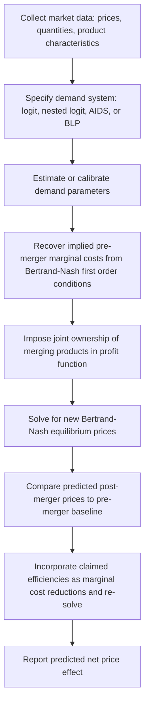

## Merger Simulation and Upward Pricing Pressure Tests

### Definition and Conceptual Foundation

Merger simulation and upward pricing pressure (UPP) tests are quantitative economic methodologies used to predict or screen for the price effects of a proposed merger, operationalizing the unilateral effects theory introduced in the prior topic. These tools sit on a spectrum of increasing data requirements and structural complexity: simple screening indices (GUPPI, UPP) require relatively limited data and produce a directional signal of pricing pressure, while full merger simulation models require a completely specified demand system and produce a quantitative predicted equilibrium price change. Understanding where each tool sits on this spectrum, and the assumptions embedded in each, is essential to interpreting their outputs and their appropriate evidentiary weight in merger review.

### The Analytical Spectrum

$$\text{Market Share/HHI Screens} \rightarrow \text{GUPPI/UPP Screens} \rightarrow \text{Full Merger Simulation}$$

Each step rightward adds data requirements and structural assumptions in exchange for a more precise, mechanism-specific prediction:

| Tool | Data Required | Output | Key Assumption |
| --- | --- | --- | --- |
| HHI/Market Share | Market shares in defined relevant market | Structural presumption trigger (yes/no) | Concentration is a reasonable proxy for competitive effects |
| GUPPI | Diversion ratio, margins, prices for merging parties only | Directional pricing pressure index | No competitive response from rivals; no efficiencies netted in |
| UPP Test | Diversion ratio, margins, plus an efficiency offset (cost reduction) | Net pricing pressure after efficiencies | Approximates first-order price effect without full demand system |
| Merger Simulation | Full demand system (all cross-elasticities), marginal costs, functional form | Predicted equilibrium price change for all products | Correct demand specification and Bertrand-Nash (or other) conduct assumption |

### The Upward Pricing Pressure (UPP) Test

The UPP test, developed principally by economists Joseph Farrell and Carl Shapiro, extends the basic GUPPI concept (covered in the prior topic) by explicitly incorporating a merger-specific marginal cost efficiency offset, producing a more complete first-order approximation of net pricing pressure:

$$\text{UPP}_A = D_{A \to B} \times (p_B - c_B) - E \times c_A$$

Where $D_{A \to B}$ is the diversion ratio from product A to product B, $(p_B - c_B)$ is firm B's margin, $c_A$ is firm A's pre-merger marginal cost, and $E$ is the proportional efficiency (cost reduction) claimed for product A as a result of the merger. The first term is the same upward pricing pressure captured by GUPPI (the value of sales diverted to the now-affiliated product B); the second term is the downward pricing pressure from a genuine, merger-specific marginal cost reduction.

$$\text{UPP}_A > 0 \Rightarrow \text{Net upward pricing pressure predicted, even after accounting for claimed efficiencies}$$

$$\text{UPP}_A \leq 0 \Rightarrow \text{Claimed efficiencies are sufficient to offset the diversion-driven pricing pressure}$$

The UPP framework was influential in shaping the 2010 Horizontal Merger Guidelines' explicit recognition that diversion ratios and margins, rather than market share and HHI alone, are directly probative of unilateral competitive effects — a first-order approximation derived formally from the same profit-maximization condition described in the unilateral effects topic, rather than an ad hoc heuristic.

### First-Order Approximation: Theoretical Derivation

The UPP test is not an arbitrary formula; it derives from a first-order Taylor approximation of the change in a merged firm's optimal price around the pre-merger price, using the same profit function introduced in the unilateral effects discussion:

$$\Pi_{AB} = (p_A - c_A) q_A(p_A, p_B) + (p_B - c_B) q_B(p_A, p_B)$$

Taking the first-order condition with respect to $p_A$ and evaluating the resulting expression at the pre-merger prices provides an approximation of the *pressure* to change price, without needing to solve for the full new equilibrium (which would require complete demand-system information for how rivals, not merely the merging parties, would also respond). [Inference] Because this is explicitly a first-order local approximation evaluated at pre-merger prices, its accuracy as a predictor of the actual magnitude of the eventual equilibrium price change degrades as the true predicted change becomes large, or when demand curvature or third-party competitive responses are substantial — economists using UPP as a screening tool generally treat it as most reliable for identifying the *direction and rough relative magnitude* of pricing pressure across candidate transactions, rather than as a precise quantitative prediction of the actual dollar or percentage price increase that would occur.

### Full Merger Simulation Models

When the merging parties' unilateral effects concern is significant enough (or litigation stakes high enough) to warrant more rigorous quantification, economists construct full **merger simulation models**, which require specifying a complete demand system across all (or a substantial subset of) products in the relevant market, not merely the two merging products.

#### Common Demand System Specifications

- **Logit and nested logit models**: Assume consumer utility for each product has a deterministic component (based on product characteristics and price) plus a random idiosyncratic term following an extreme value distribution. Nested logit relaxes the restrictive "independence of irrelevant alternatives" property of simple logit by grouping products into nests (e.g., grouping by brand or product category) within which substitution patterns are stronger.
- **Almost Ideal Demand System (AIDS)**: A flexible functional form for aggregate demand shares as a function of prices and expenditure, commonly used when detailed micro-level consumer choice data is unavailable and only aggregate market-level share and price data can be used for estimation.
- **Random coefficients logit (BLP-style models)**: Following Berry, Levinsohn, and Pakes (1995), these models allow consumer preferences for product characteristics to vary across the population, producing more flexible and realistic substitution patterns (avoiding the restrictive proportional substitution implied by simple logit) at the cost of substantially greater estimation complexity and data requirements.

#### Simulation Mechanics

Once a demand system is estimated (or calibrated using diversion ratios and margins as targets, in a "calibration" approach that avoids full econometric estimation when sufficient transaction-level data is unavailable), the simulation solves for the new Bertrand-Nash price equilibrium under joint ownership of the merging products:

$$p^{post} = \arg\max_{p} \sum_{k \in \{A,B\}} (p_k - c_k) q_k(p)$$

Solved jointly with the first-order conditions of all non-merging rivals independently maximizing their own profit given the merged firm's new prices, iterated to a fixed-point equilibrium.

### Diagram: Merger Simulation Workflow

### Marginal Cost Recovery: The Standard Calibration Approach

A distinctive and important feature of most merger simulation implementations: rather than requiring independently observed marginal cost data (which firms rarely disclose reliably), economists typically **recover implied marginal costs** from the pre-merger data by inverting the Bertrand-Nash first-order conditions, assuming firms were already pricing optimally pre-merger given the estimated demand system:

$$c_k = p_k - \frac{q_k}{-\partial q_k/\partial p_k \text{ (own-price effect from estimated demand)}}$$

This "calibration" approach has the practical advantage of not requiring separately verified cost data, but it also means the simulation's cost estimates — and therefore its price predictions — are entirely dependent on the accuracy of the estimated demand system and the maintained assumption that pre-merger prices reflect Bertrand-Nash competitive equilibrium (rather than, for instance, some pre-existing tacit coordination, which would bias the recovered "cost" estimates).

### Strengths and Limitations of Merger Simulation

**Strengths:**

- Produces a specific, quantifiable predicted price effect rather than a directional signal, useful for damages estimation and for weighing against specific efficiency claims.
- Explicitly incorporates competitive responses from non-merging rivals, addressing a key limitation of the simpler GUPPI/UPP screens.
- Can incorporate merger-specific efficiencies directly as a marginal cost parameter and observe the net predicted effect on final equilibrium prices.

**Limitations:**

- [Inference] Results are sensitive to the chosen demand system functional form; simple logit models impose restrictive proportional substitution patterns that may not reflect actual market substitution, while more flexible models (nested logit, BLP) require additional data and assumptions about nesting structure or characteristic space that are themselves subject to reasonable dispute between opposing experts.
- The maintained assumption of Bertrand-Nash (price) competition may not match the actual mode of competition in markets characterized by capacity constraints (where Cournot-style competition may be more appropriate), long-term contracting, or bidding processes.
- Marginal cost recovery via calibration inherits any misspecification in the demand system directly into the cost estimates, compounding potential error.
- [Unverified] The empirical track record of merger simulation predictions against actual observed post-merger price outcomes (in the relatively small number of cases where robust ex-post studies have been conducted) shows mixed accuracy across different studies and industries, and specific claims about the general reliability of merger simulation as a predictive tool should be assessed against the relevant ex-post empirical literature rather than assumed uniformly accurate, since this remains an actively studied methodological question.

### Ex-Post Merger Studies as a Complementary Validation Approach

A distinct but related body of empirical work — **ex-post merger retrospectives** — examines actual price and output changes following consummated mergers, using difference-in-differences or synthetic control methods comparing markets affected by the merger to unaffected comparison markets. These studies serve both as scholarly validation of the accuracy of pre-merger simulation predictions and as an independent input into ongoing debates about appropriate agency enforcement thresholds. [Unverified] Existing ex-post merger retrospective studies span a range of industries and methodologies with correspondingly varied conclusions about typical post-merger price effects; because publication and study-selection patterns in this literature have themselves been a subject of methodological discussion, any specific quantitative claim about "the average price effect of consummated mergers" should be sourced to a specific study and industry context rather than treated as a single settled empirical constant.

### Practical Role in Litigated Merger Cases

In contested merger litigation, both government and defense economic experts frequently present competing merger simulation models calibrated to the same underlying transaction, often reaching different predicted price effects due to differing demand system specifications, market definition assumptions, or treatment of claimed efficiencies. Courts evaluating such dueling expert testimony must assess the relative credibility and robustness of competing modeling choices — a task that has proven genuinely challenging given the technical complexity involved, and which has led to ongoing debate among practitioners and scholars about the appropriate judicial standard for weighing econometric merger simulation evidence relative to more direct qualitative evidence of competitive effects.

### Connection to Course Framework

Merger simulation and UPP tests represent the most technically rigorous implementation of the unilateral effects theory introduced in the prior topic, translating the qualitative internalized-diversion mechanism into quantitative predictions that can be directly compared against the structural HHI-based screens from the horizontal merger guidelines topic. The efficiency-offset component of the UPP test and merger simulation models also directly connects to the dynamic cost-advantage concepts from earlier in the course (learning curves, economies of scale) — a merger's claimed marginal cost reduction functions analytically the same way whether it arises from combined production learning, eliminated duplicate distribution, or any other efficiency source, and its magnitude relative to the diversion-driven pricing pressure term is what ultimately determines whether the simulation predicts net upward or downward pricing effects.

**Related Topics**

- Unilateral effects in differentiated product mergers
- Horizontal merger guidelines and market share screens
- Efficiencies defenses in merger litigation
- Bertrand-Nash versus Cournot competition models
- Random coefficients logit (BLP) demand estimation
- Ex-post merger retrospective methodology
- Learning curves and dynamic cost advantages