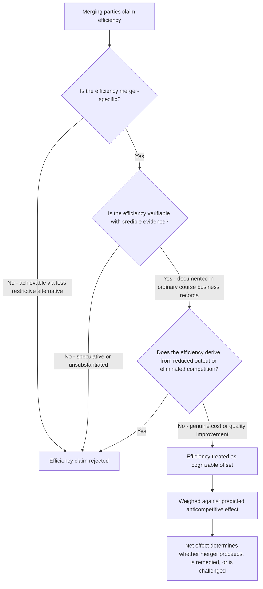

## Efficiency Defenses and Structural Remedies

### Definition and Conceptual Foundation

Efficiency defenses and structural remedies represent the two principal mechanisms through which merger review accommodates the reality that a transaction raising competitive concerns may nonetheless generate genuine economic benefits, or can be permitted to proceed in modified form rather than blocked outright. **Efficiency defenses** allow merging parties to argue that merger-specific cost savings, quality improvements, or innovation benefits offset an otherwise-established competitive harm. **Structural remedies** (chiefly divestitures) allow enforcement agencies to permit a transaction to close while requiring the parties to sell off assets sufficient to preserve competition in the specific markets where the merger would otherwise cause harm. Both mechanisms reflect the underlying recognition that Clayton Act §7's "may substantially lessen competition" standard calls for a net assessment of competitive effects, not an automatic prohibition of any transaction exhibiting some indicator of concentration risk.

### The Efficiency Defense Framework

#### Doctrinal Requirements

For the U.S. antitrust agencies to credit an efficiency claim in merger review, the claimed efficiency must generally satisfy three cumulative requirements, articulated across successive versions of the Merger Guidelines:

$$\text{Cognizable Efficiency} = \text{Merger-Specific} + \text{Verifiable} + \text{Not Derived from Anticompetitive Reductions in Output}$$

1. **Merger-specificity**: The efficiency must be achievable only through the proposed merger, not through some less anticompetitive alternative transaction structure (e.g., a joint venture, licensing arrangement, or internal expansion) that would achieve comparable benefits without combining the parties' competing assets.
2. **Verifiability**: The claimed efficiency must be substantiated with reliable evidence — typically requiring detailed, credible internal analysis prepared in the ordinary course of business (rather than post-hoc litigation-driven estimates) demonstrating both the magnitude of the claimed savings and a credible mechanism by which the merger would produce them.
3. **Not the product of anticompetitive output reduction**: Cost savings achieved merely by reducing output or eliminating competition (e.g., "efficiencies" from simply raising prices and reducing quantity produced) are not cognizable, since these are the very anticompetitive effects the merger review process is designed to prevent, not an offsetting benefit.

#### Categories of Claimed Efficiencies

- **Production and scale efficiencies**: Lower per-unit manufacturing costs from combined production volume, connecting directly to the economies-of-scale and learning-curve concepts covered earlier in the course — a merger enabling faster movement down a shared learning curve, or achieving minimum efficient scale that neither firm could reach independently, represents a genuine dynamic efficiency claim.
- **Elimination of duplicate fixed costs**: Combining redundant administrative functions, distribution networks, or research facilities.
- **Elimination of double marginalization** (for vertical mergers, as discussed in the prior topic): A structurally verifiable efficiency specific to vertical integration.
- **Innovation and dynamic efficiencies**: Claims that the combined firm will conduct more effective or better-funded research and development than the separate firms could have achieved independently — historically treated with greater skepticism by enforcement agencies than static cost-reduction claims, given the greater difficulty of verifying speculative future innovation benefits with the same rigor as near-term cost data.

### The Efficiencies-Versus-Harm Balancing Framework

Conceptually, the efficiency defense operates as a counterweight within the same total welfare or consumer welfare balancing framework introduced in the historical origins topic:

$$\text{Net Competitive Effect} = \text{Predicted Anticompetitive Price Effect (GUPPI, merger simulation)} - \text{Verified Merger-Specific Efficiency Offset}$$

This is precisely the same tradeoff structure formalized in the UPP test covered in the prior topic — the efficiency term there ($E \times c_A$) is the marginal-cost-reduction analogue of the efficiency defense applied more broadly across the full range of possible efficiency types (not solely marginal cost reductions) and the full range of possible merger review contexts (not solely the initial screening stage).

[Inference] In practice, U.S. enforcement agencies have historically applied a demanding evidentiary standard to efficiency claims — requiring the kind of detailed, contemporaneous, verifiable substantiation described above — which means efficiency defenses succeed in preventing enforcement action in a meaningfully smaller share of cases than the theoretical balancing framework alone might suggest, reflecting agency skepticism about the reliability of efficiency claims generated primarily in anticipation of, or in response to, antitrust scrutiny rather than independently documented business planning.

### Diagram: Efficiency Defense Evidentiary Pathway

### Structural Remedies: Divestitures

When a proposed merger raises competitive concerns limited to specific, identifiable markets or product lines (rather than the transaction as a whole), enforcement agencies frequently permit the merger to close subject to a **consent decree** requiring divestiture of specific assets sufficient to preserve competition in the affected markets, rather than blocking the entire transaction.

#### Divestiture Package Design

The core challenge in designing an effective divestiture is ensuring the divested assets constitute a **standalone viable competitor** capable of replicating the competitive constraint that would otherwise be lost, rather than a collection of assets that, once separated from the seller's broader organization, cannot function as an effective independent competitor. Key considerations include:

- **Completeness**: The divestiture package must include all assets (physical facilities, intellectual property, key personnel, customer relationships, supply agreements) necessary for the divested business to operate independently and competitively, not merely the narrowest set of assets nominally addressing the identified overlap.
- **Buyer identity and suitability**: Agencies typically require (or reserve approval rights over) the identity of the divestiture buyer, assessing whether the buyer has the financial resources, industry experience, and incentive to operate the divested assets as an effective competitor rather than passively holding them.
- **Timing structure**: Divestitures can be structured as **"fix-it-first"** (completed before the underlying merger closes, eliminating agency uncertainty about remedy adequacy) or **"consent-decree" divestitures** (completed after closing, subject to a specified timeline and often an agency-approved trustee overseeing the divestiture process if the parties fail to complete it independently within the specified window).

#### Behavioral vs. Structural Remedies

| Dimension | Structural Remedies (Divestiture) | Behavioral Remedies (Conduct Restrictions) |
| --- | --- | --- |
| Mechanism | Physically separates competing assets to a new independent owner | Merged firm retains combined assets but is subject to ongoing conduct restrictions (e.g., non-discrimination, firewall, or licensing obligations) |
| Monitoring burden | Limited — competitive structure is restored directly, requiring little ongoing oversight | Substantial — requires ongoing agency monitoring and enforcement of compliance over an extended period |
| Enforcement agency preference | Generally strongly preferred, particularly by U.S. agencies | Generally disfavored for horizontal mergers; more commonly used (with continued skepticism) for vertical mergers where no clean asset separation addresses the specific foreclosure concern |
| Risk of remedy failure | Risk concentrated in divestiture design/buyer selection at the outset | Ongoing risk of circumvention, incomplete compliance, or the restriction becoming outdated as market conditions evolve |

[Inference] U.S. enforcement agencies have expressed a persistent preference for structural over behavioral remedies specifically because structural remedies do not require sustained regulatory oversight and are less susceptible to gradual erosion or circumvention over time — this stated preference reflects agency experience and policy judgment rather than a formal legal requirement, and behavioral remedies remain available and have been used in specific cases, particularly for vertical mergers where the underlying concern is a conduct-based access or foreclosure issue rather than a market-structure overlap that a physical divestiture would directly resolve.

### Merger-Specific Efficiencies as an Alternative to Remedies

A subtle but important interaction: even when a merger raises structural or unilateral effects concerns sufficient to warrant a divestiture remedy, well-documented merger-specific efficiencies can inform the *scope* of the required remedy — a smaller divestiture package might be deemed sufficient to preserve adequate competition if genuine efficiencies from the retained portions of the transaction are expected to benefit consumers, whereas an unsubstantiated or purely speculative efficiency claim is unlikely to affect the agencies' assessment of the necessary remedy scope.

### Illustrative Case Pattern

Consider a horizontal merger between two national manufacturers whose product lines overlap significantly in most regional markets but where genuine production efficiencies (from combining manufacturing facilities and moving down a shared learning curve, per the dynamic-cost-advantage concepts from earlier chapters) are credibly documented. If the overlap and associated unilateral effects concern is concentrated in a small number of specific regional markets — while the claimed production efficiencies are national in scope and well-substantiated through pre-merger internal planning documents — a plausible outcome is a structural remedy requiring divestiture of specific regional manufacturing facilities or brands sufficient to preserve competition in the affected regional markets, while allowing the broader national transaction (and its associated verified efficiencies) to proceed. This illustrates how efficiency defenses and structural remedies function as complementary, rather than mutually exclusive, tools: efficiencies can support permitting the bulk of a transaction to proceed, even as remedies address the specific residual markets where competitive harm is not offset.

### International Comparison: EU Treatment

As noted in the comparative competition policy topic, EU merger review under the EU Merger Regulation similarly permits both efficiency arguments and structural remedy commitments, though EU practice has historically placed somewhat greater emphasis on structural (asset divestiture) commitments relative to behavioral remedies, broadly paralleling the U.S. agencies' stated preference — though the precise doctrinal weight given to efficiency claims and the specific procedural mechanisms for negotiating and approving remedy packages differ in institutional detail between the European Commission's administrative process and the U.S. consent decree/court-approval process.

### Connection to Course Framework

Efficiency defenses and structural remedies represent the practical resolution mechanism for the tension embedded throughout this merger analysis chapter: the unilateral effects, coordinated effects, and vertical foreclosure theories of harm covered in prior topics establish *why* a transaction might be anticompetitive, while efficiency defenses and remedies determine the *actual regulatory outcome* — whether the transaction is blocked, permitted as proposed, or permitted subject to modification. This connects back to the foundational goals debate from the historical origins topic: a legal regime weighted more heavily toward pure consumer welfare will generally credit well-verified efficiency claims more readily (since the ultimate question is net consumer effect), while a regime more concerned with preserving competitive market structure independent of near-term price effects may discount efficiency claims more heavily in favor of structural remedies that directly preserve the pre-merger competitive landscape.

**Related Topics**

- Horizontal merger guidelines and market share screens
- Unilateral effects in differentiated product mergers
- Merger simulation and upward pricing pressure tests
- Vertical merger theories of harm and foreclosure
- Consent decrees and Hart-Scott-Rodino remedy negotiation
- Learning curves and dynamic cost advantages
- Comparative competition policy across jurisdictions