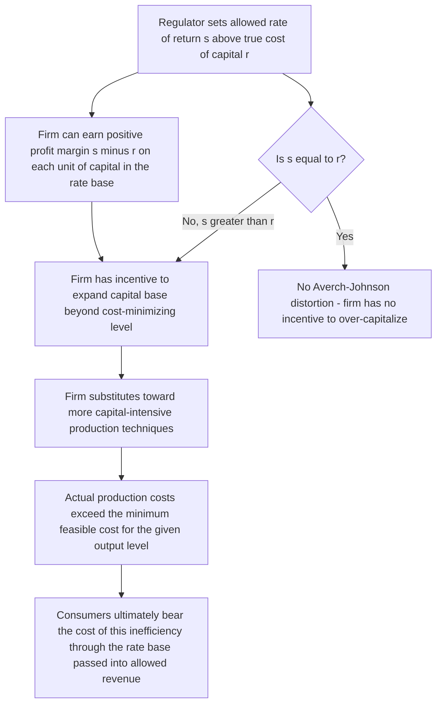

## Rate-of-Return Regulation and the Averch-Johnson Effect

### Definition and Conceptual Foundation

Rate-of-return regulation is the traditional regulatory mechanism applied to natural monopolies — industries such as electric utilities, water systems, and (historically) telecommunications, where a single firm can serve the entire market at lower cost than multiple competing firms due to substantial economies of scale relative to market size. Because unregulated natural monopolies would otherwise set prices well above marginal cost, exploiting their market power, rate-of-return regulation constrains the regulated firm's allowed prices such that its total revenue covers operating costs plus a specified, regulator-approved rate of return on its invested capital base. The **Averch-Johnson effect** (named for Harvey Averch and Leland Johnson, who formalized the result in a 1962 paper) is the seminal theoretical finding that this regulatory mechanism, despite its intuitive appeal, creates a systematic distortion: regulated firms have an incentive to over-invest in capital relative to the cost-minimizing input mix, a phenomenon also called "gold-plating."

### The Rate-of-Return Regulatory Formula

The core regulatory constraint sets allowed total revenue equal to:

$$R = O + sK$$

Where $R$ is total allowed revenue, $O$ is operating expenses (labor, fuel, materials — all non-capital costs), $K$ is the firm's regulator-approved "rate base" (the value of invested capital, typically plant and equipment), and $s$ is the allowed rate of return on that capital base, set by the regulator to approximate the firm's cost of capital.

The regulator's intent is straightforward: allow the firm to recover its legitimate costs, including a fair return to investors sufficient to attract capital, while preventing the firm from earning monopoly rents by capping the rate of return $s$ at a level judged "reasonable" — typically benchmarked to the firm's estimated weighted average cost of capital, incorporating both debt and equity financing costs.

### The Averch-Johnson Distortion

#### The Firm's Optimization Problem

Consider a regulated firm producing output using capital $K$ and labor/other inputs $L$, subject to the regulatory constraint that total revenue not exceed $O + sK$. The firm's problem is to choose $K$ and $L$ to maximize profit subject to this revenue constraint:

$$\max_{K,L} \quad pQ(K,L) - wL - rK \quad \text{subject to} \quad pQ(K,L) - wL \leq sK$$

Where $p$ is output price, $Q(K,L)$ is the production function, $w$ is the wage rate, and $r$ is the firm's true (market) cost of capital. The critical insight of the Averch-Johnson result is that **if the allowed rate of return $s$ exceeds the firm's true cost of capital $r$** (i.e., $s > r$), the regulatory constraint is not merely a passive cap but actively distorts the firm's input choice: the firm has an incentive to expand its capital base beyond the level that would minimize the cost of producing any given output level, because doing so allows it to capture the profitable spread $(s - r)$ on each additional unit of capital employed, up to the point where the regulatory revenue constraint binds.

$$\text{Averch-Johnson bias: } \frac{K^{regulated}}{L^{regulated}} > \frac{K^{cost-minimizing}}{L^{cost-minimizing}}$$

This means the regulated firm's chosen input ratio is systematically more capital-intensive than the ratio that would minimize the actual cost of producing its output level, given the true relative prices of capital and labor — a form of productive inefficiency imposed directly by the regulatory mechanism itself, rather than by any exogenous market or technological factor.

### Diagram: The Averch-Johnson Mechanism

### Graphical Intuition: Isoquant Distortion

In standard cost-minimization analysis, a firm chooses the input combination on the isoquant for its target output level that is tangent to the lowest possible isocost line, where the isocost slope reflects the true relative price of capital to labor ($w/r$). The Averch-Johnson result shows that under binding rate-of-return regulation with $s > r$, the firm's effective relevant "price" of capital is distorted below its true opportunity cost of $r$ (because the regulatory formula allows recovery of the $s$ return regardless of whether $K$ is actually needed to produce the output efficiently), causing the firm to choose a point on the isoquant with a higher $K/L$ ratio than true relative prices would justify — a straightforward geometric illustration of why the distortion moves systematically in the capital-intensive direction rather than in some ambiguous or output-level-dependent direction.

### Consequences and Manifestations of the Distortion

- **"Gold-plating"**: Regulated utilities historically faced documented incentives to over-build generation, transmission, or distribution capacity relative to genuine reliability or demand-growth needs, since a larger rate base directly increases allowed total revenue under the $R = O + sK$ formula.
- **Inefficient technology choice**: The firm may adopt more capital-intensive production technologies than would minimize actual production costs, even where a more labor- or materials-intensive alternative would serve customers at lower total cost.
- **Potential for cross-subsidization and misallocation across service categories**: If a multi-product regulated firm (e.g., an electric utility serving both residential and industrial customers) can allocate rate-base investment across cost categories with some discretion, incentives to over-invest may manifest unevenly across different parts of the business, complicating simple aggregate predictions about where the distortion will be most visible.

[Inference] While the theoretical Averch-Johnson result is a well-established and mathematically rigorous prediction under the stated model assumptions, the empirical magnitude of over-capitalization actually observed in real-world rate-of-return regulated utilities has been debated in the empirical regulatory economics literature, since actual regulatory practice includes various institutional features (prudency reviews, used-and-useful tests, periodic rate case scrutiny of specific capital additions) that were not present in the original stylized Averch-Johnson model and that may partially, though not necessarily fully, offset the theoretical incentive to over-invest.

### Conditions Under Which the Effect Does Not Arise

The Averch-Johnson distortion specifically requires $s > r$ — the allowed rate of return must exceed the firm's true cost of capital for the capital-expansion incentive to exist. If regulators set $s = r$ precisely, the firm has no financial incentive to expand its capital base beyond the genuinely cost-minimizing level, since it earns no marginal profit spread from doing so. [Inference] In practice, regulators face genuine uncertainty in estimating a firm's true cost of capital (particularly the cost of equity, which unlike the cost of debt is not directly observable from contractual interest rates and must instead be estimated using models such as the Capital Asset Pricing Model or dividend discount approaches), meaning that even well-intentioned regulatory rate-setting is unlikely to achieve $s = r$ with precision — this estimation uncertainty is likely why the theoretical Averch-Johnson distortion has remained a persistent practical concern in regulatory economics rather than a purely academic curiosity resolved by simply "setting the rate correctly."

### Regulatory Responses and Alternatives

Awareness of the Averch-Johnson effect and related rate-of-return regulation weaknesses (including limited incentive for genuine cost-minimization more broadly, since higher realized costs can often be substantially passed through to the allowed rate base and revenue requirement) has motivated the development of alternative regulatory mechanisms discussed elsewhere in this chapter:

- **Price cap regulation**: Sets a maximum allowed price (often indexed to inflation minus an expected productivity offset) independent of the firm's realized cost or capital base, giving the firm a direct incentive to minimize costs (including capital costs) since it retains any cost savings achieved below the price cap, rather than having those savings automatically passed through to reduce allowed revenue.
- **Incentive regulation and performance-based ratemaking**: Mechanisms that tie some portion of allowed revenue to specific performance metrics (reliability, service quality, achieved cost reductions) rather than purely to a rate-of-return-on-capital formula.
- **Yardstick competition**: Regulators compare a firm's costs against similarly situated firms in other jurisdictions to set allowed revenues, reducing (though not eliminating) the firm's ability to pass through inefficient capital or operating decisions into its own rate base, since the yardstick benchmark is set by peer firms' realized costs rather than the firm's own reported costs.

[Speculation] Whether these alternative mechanisms fully eliminate distortions analogous to Averch-Johnson, or instead substitute a different set of incentive problems (e.g., price cap regulation's potential incentive to under-invest in maintenance or reliability, if such under-investment is not adequately captured by the regulator's performance metrics), remains a genuinely debated question in regulatory economics rather than a settled conclusion favoring one mechanism as unambiguously superior across all natural monopoly contexts.

### Illustrative Numerical Example

Suppose a utility's true cost of capital is $r = 6\%$, but the regulator, using a somewhat generous estimation methodology, sets the allowed rate of return at $s = 9\%$. For every additional $1 million of capital investment the firm adds to its rate base — regardless of whether that investment was strictly necessary to meet service obligations — the firm can include an additional $9\% \times \$1\text{ million} = \$90{,}000$ in allowed revenue, while its true opportunity cost of that capital is only $6\% \times \$1\text{ million} = \$60{,}000$. The firm captures the $\$30{,}000$ spread as additional profit, creating a direct and continuous financial incentive to expand the rate base for its own sake, independent of whether the incremental capacity serves any genuine operational need.

### Connection to Course Framework

The Averch-Johnson effect illustrates a distinctive category of inefficiency relevant across this course's broader treatment of market power and regulation: unlike the antitrust conduct examined in prior chapters (predatory pricing, foreclosure, coordinated pricing), the inefficiency here is not the product of intentional anticompetitive strategy but rather an unintended consequence of a well-meaning regulatory mechanism interacting with the firm's ordinary profit-maximizing behavior — directly paralleling the broader insight from mechanism design and regulatory economics that any incentive structure (whether imposed by market competition, contract, or regulation) shapes firm behavior according to its own specific structure, and that a regulator's chosen mechanism can introduce distortions not present in either a genuinely competitive market or in a hypothetical costlessly-informed, perfectly-calibrated regulatory ideal.

**Related Topics**

- Natural monopoly and the subadditivity of cost functions
- Price cap regulation and RPI-X mechanisms
- Cost of capital estimation: CAPM and dividend discount models
- Incentive regulation and performance-based ratemaking
- Yardstick competition in regulated utility benchmarking
- Regulatory capture and information asymmetry
- Learning curves and dynamic cost advantages (capital investment incentive parallels)