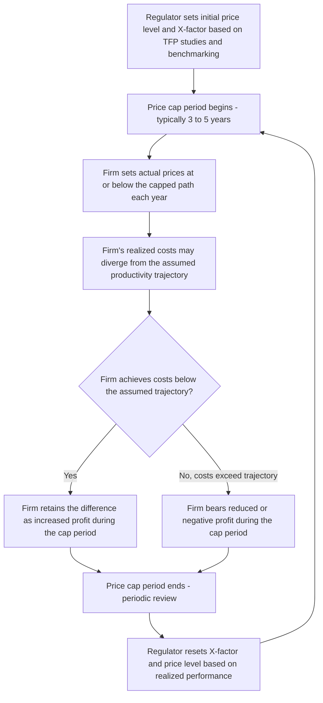

## Price Cap and Incentive Regulation Schemes

### Definition and Conceptual Foundation

Price cap regulation and the broader family of incentive regulation mechanisms represent an alternative regulatory philosophy to the rate-of-return approach covered in the prior topic. Rather than tying a regulated firm's allowed revenue mechanically to its realized costs and capital base — which, as the Averch-Johnson analysis showed, blunts the firm's incentive to minimize costs and can distort input choices toward excessive capital intensity — incentive regulation schemes deliberately **decouple** allowed prices or revenues from the firm's own realized costs, at least over some defined regulatory period, so that the firm captures (or bears) the financial consequences of its own efficiency performance.

### The Core Philosophical Shift

$$\text{Rate-of-Return: } R = O + sK \quad \text{(revenue mechanically tied to realized cost)}$$

$$\text{Price Cap: } p_t \leq p_{t-1} \times (1 + \text{Inflation} - X) \quad \text{(price path set independent of realized cost)}$$

Under rate-of-return regulation, if a firm reduces its operating costs or capital expenditure, its allowed revenue falls correspondingly at the next rate case, largely eliminating the firm's financial reward for achieving genuine efficiency gains — a structural weakness sometimes termed the "regulatory lag problem" from the firm's perspective, though the *existence* of regulatory lag between rate cases is precisely what gives even rate-of-return regulation some limited cost-minimization incentive during the interval between reviews. Price cap regulation formalizes and extends this lag-driven incentive by design: the firm's allowed price path is fixed in advance for a specified multi-year period, so that any cost savings the firm achieves during that period translate directly into higher realized profit, not into an automatic reduction in allowed revenue.

### The RPI-X (CPI-X) Price Cap Formula

The canonical price cap formula, originally developed in the UK context (RPI referring to the Retail Price Index) and widely adopted internationally in some variant (often as "CPI-X" using the Consumer Price Index in other jurisdictions), sets the maximum allowable price increase as:

$$\Delta p_t \leq \text{RPI}_t - X$$

Where $\text{RPI}_t$ is the realized general inflation rate over the period, and $X$ is a regulator-determined productivity offset factor, representing the rate at which the firm is expected to reduce its real (inflation-adjusted) costs relative to the general economy, reflecting expected ongoing productivity improvements specific to the regulated industry.

**Example**

If economy-wide inflation (RPI) is 3% in a given year and the regulator has set $X = 1.5\%$ (reflecting an expectation that the utility's costs should fall 1.5 percentage points faster than general inflation due to expected productivity gains), the firm's maximum allowed price increase for that year is:

$$\Delta p = 3\% - 1.5\% = 1.5\%$$

If the firm achieves actual productivity improvements exceeding the assumed 1.5% offset — for instance, achieving a genuine 2.5% real cost reduction — it retains the additional 1 percentage point of cost savings as increased profit for the remainder of the price cap period, providing the direct efficiency incentive that rate-of-return regulation structurally lacks.

### Setting the X-Factor

The central practical and analytically contested challenge in price cap design is determining the appropriate value of $X$. Regulators typically draw on:

- **Total factor productivity (TFP) studies**: Historical analysis of the industry's (or comparable industries') realized productivity growth relative to the broader economy, used to project a defensible expected productivity trend for the regulatory period.
- **Benchmarking against comparable firms or jurisdictions**: Similar in spirit to the yardstick competition approach mentioned in the prior topic, using peer-firm cost performance to inform a reasonable productivity expectation independent of the specific firm's own reported (and potentially strategically manipulated) cost data.
- **Consumer benefit-sharing considerations**: A component of $X$ may be set deliberately to pass a portion of expected efficiency gains through to consumers via lower real prices over time, rather than allowing the firm to retain 100% of expected productivity gains as profit indefinitely.

[Inference] Setting $X$ too low (understating genuinely achievable productivity growth) allows the firm to earn unintended excess profits without corresponding consumer benefit, while setting $X$ too high risks financial distress for the firm or under-investment in service quality and reliability if the firm cannot realistically achieve the assumed productivity trajectory while maintaining adequate service — this calibration challenge is structurally analogous to the difficulty of setting the correct allowed rate of return $s$ under rate-of-return regulation (discussed in the prior topic's Averch-Johnson analysis), illustrating that incentive regulation does not eliminate the fundamental information asymmetry problem regulators face, but rather relocates where in the regulatory formula that uncertainty has its primary distorting effect.

### Diagram: Price Cap Regulatory Cycle

### The Ratchet Effect and Regulatory Lag Tension

A structural tension inherent to price cap regulation: because the regulator resets the price cap (and the underlying $X$-factor and price level) at the end of each regulatory period based partly on the firm's realized performance during the prior period, a firm that achieves substantial cost reductions in one period faces the prospect that the regulator will "ratchet down" the allowed price level in the next period to reflect the demonstrated lower cost achievable — reducing the firm's expected future profit from any given level of realized efficiency. This **ratchet effect** can, in principle, partially undermine the intended efficiency incentive if firms anticipate that demonstrating strong cost performance in one period will be "punished" via a tighter cap in the subsequent period, creating an incentive to understate achievable efficiency or to defer cost-reduction efforts strategically across the regulatory cycle. [Inference] The empirical magnitude of ratchet-effect-driven strategic behavior by regulated firms under real-world price cap regimes is difficult to measure directly (since it requires inferring counterfactual effort levels the firm did not actually undertake), and the practical severity of this concern relative to its theoretical significance in the regulatory economics literature remains a matter of some debate rather than a precisely quantified, settled empirical finding.

### Revenue Cap Regulation: A Related Variant

A closely related mechanism, **revenue cap regulation**, caps the firm's total allowed revenue rather than its per-unit price, which can be preferable in industries where output volume is subject to substantial exogenous variation (e.g., electricity demand fluctuating with weather) that is unrelated to the firm's own efficiency performance. Revenue caps insulate the firm's allowed revenue from demand fluctuations that a pure price cap would translate directly into revenue variability, though this insulation comes at the cost of somewhat blunting the firm's incentive to encourage additional sales volume (since additional volume does not increase allowed total revenue under a strict revenue cap), a consideration of particular relevance for utilities pursuing demand-side energy efficiency programs where encouraging reduced customer consumption is a policy goal that a pure per-unit price cap could otherwise financially discourage.

### Broader Incentive Regulation Mechanisms

Price cap regulation is the most prominent, but not the only, member of the broader incentive regulation family:

- **Performance-based ratemaking (PBR)**: Ties a portion of the firm's allowed revenue or profit directly to specific, quantifiable performance metrics — service reliability indices, customer satisfaction scores, achieved emissions reductions, or specific infrastructure investment milestones — rather than relying solely on an aggregate price or revenue formula to indirectly incentivize desired behavior.
- **Sliding-scale (partial cost pass-through) mechanisms**: A hybrid approach between pure rate-of-return and pure price cap regulation, where realized costs above or below a benchmark are shared between the firm and consumers according to a specified sharing ratio (e.g., 50/50), providing a partial, moderated version of the cost-minimization incentive found in pure price cap regulation while also moderating the firm's full exposure to unexpected cost shocks outside its control.
- **Menu of contracts / regulatory mechanism design approaches**: Drawing on the broader mechanism design and asymmetric information literature (e.g., Laffont and Tirole's foundational work on regulatory contracting), regulators can offer firms a menu of price-cap/cost-sharing combinations designed so that firms with different private information about their true achievable efficiency will self-select into the contract appropriate to their actual cost type, partially addressing the information asymmetry problem that plagues both pure rate-of-return and pure price cap mechanisms.

### Comparative Table: Rate-of-Return vs. Price Cap Regulation

| Dimension | Rate-of-Return Regulation | Price Cap Regulation |
| --- | --- | --- |
| Basis for allowed revenue | Realized operating costs plus return on rate base | Predetermined price path independent of realized costs |
| Cost-minimization incentive | Weak — cost savings largely passed through to reduce future allowed revenue | Strong — firm retains cost savings as profit during the cap period |
| Capital investment distortion | Averch-Johnson bias toward excessive capital intensity if $s > r$ | No structurally equivalent capital-bias mechanism, though under-investment in maintenance/quality is a distinct potential concern if not addressed by complementary quality metrics |
| Firm's exposure to cost/demand risk | Low — costs largely passed through at each rate case | Higher — firm bears the risk (and reward) of cost and, under pure price cap, demand variation during the cap period |
| Regulatory information burden | High — requires detailed ongoing review of costs and rate base composition | High at initial X-factor setting; lower during the cap period itself, shifting the informational burden toward the periodic reset process |

### Illustrative Application in Telecommunications and Energy

[Unverified] Price cap and incentive regulation mechanisms have been widely adopted internationally across telecommunications and energy utility sectors since the 1980s–1990s, following the UK's early adoption in privatized utility sectors, though the specific mechanism design (X-factor methodology, revenue vs. price cap choice, degree of performance-metric integration) varies considerably by jurisdiction, sector, and time period; current specific regulatory mechanisms in any given jurisdiction should be verified against that jurisdiction's current regulatory filings rather than assumed to follow a single uniform international template, since utility regulation design has continued to evolve and diversify across jurisdictions since its initial adoption.

### Connection to Course Framework

Price cap and incentive regulation mechanisms directly address the core distortion identified in the rate-of-return/Averch-Johnson analysis from the prior topic: by severing the mechanical link between realized capital investment and allowed revenue, they eliminate the specific financial incentive for capital over-investment that the Averch-Johnson model identifies, while introducing a distinct and analytically separate set of incentive challenges (the ratchet effect, potential quality/maintenance under-investment, and the enduring information asymmetry problem in setting the initial X-factor) — illustrating a recurring theme in regulatory economics that no single mechanism eliminates the underlying information and incentive problem inherent in regulating a firm whose true cost structure and effort level the regulator cannot directly and costlessly observe.

**Related Topics**

- Rate-of-return regulation and the Averch-Johnson effect
- Regulatory mechanism design and Laffont-Tirole contracting theory
- Yardstick competition in regulated utility benchmarking
- Performance-based ratemaking and quality-of-service metrics
- Total factor productivity measurement in regulated industries
- Natural monopoly and the subadditivity of cost functions
- Learning curves and dynamic cost advantages