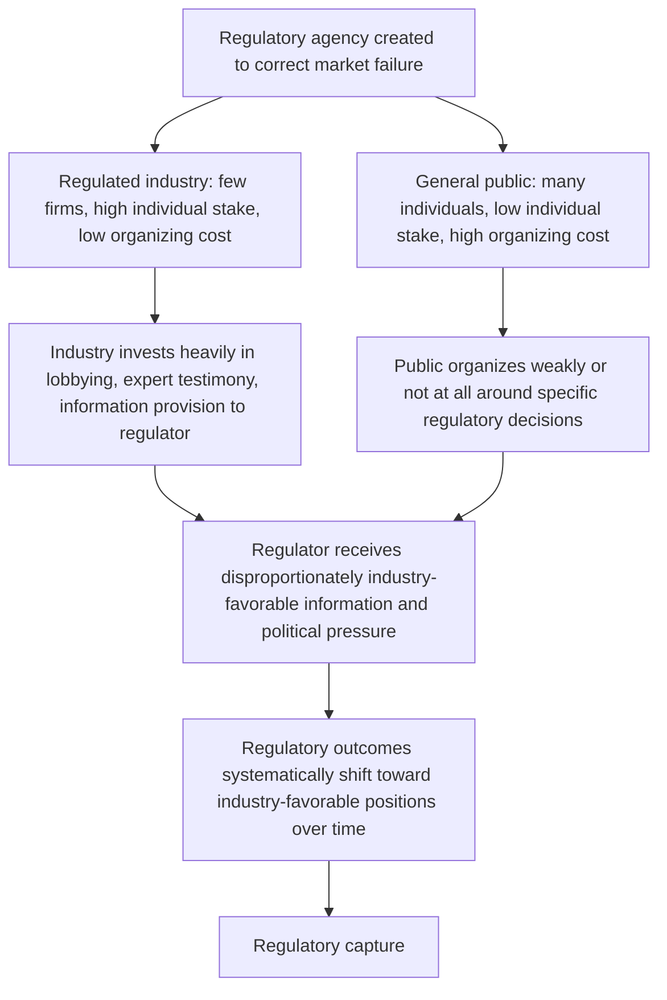

## Regulatory Capture Theory

### Definition and Conceptual Foundation

Regulatory capture theory examines the phenomenon by which regulatory agencies, created to act in the public interest by constraining the market power of regulated firms (such as the natural monopoly utilities discussed in the prior two topics), come instead to act in ways that serve the interests of the regulated industry itself, at the expense of the diffuse public the regulation was ostensibly designed to protect. Capture theory is not a single unified model but rather a family of related explanations spanning economics, political science, and public choice theory, each identifying different mechanisms by which this divergence between stated regulatory purpose and actual regulatory outcome can arise.

### The Public Interest Theory Baseline

To understand capture theory, it is useful to first state the **public interest theory of regulation** that capture theory directly challenges: under the public interest view, regulation exists because certain markets (natural monopolies, markets with significant externalities or information asymmetries) produce inefficient or inequitable outcomes if left entirely to unregulated market forces, and regulators are assumed to act as benevolent, well-informed agents implementing policy to correct these specific market failures — for instance, setting rate-of-return regulation (see prior topic) to prevent a natural monopoly from exploiting its market power through monopoly pricing.

$$\text{Public Interest View: } \text{Regulator's Objective} = \text{Social Welfare (or consumer welfare)}$$

Capture theory challenges the empirical accuracy of this assumption, arguing that regulatory institutions, once established, are systematically vulnerable to having their actual objective function shift toward serving the regulated industry's interests rather than the broader public's.

### Stigler's Economic Theory of Regulation

The most influential and rigorously formalized capture theory is George Stigler's 1971 "economic theory of regulation," which reframes regulation itself as a good that is **demanded** by interest groups (including but not limited to regulated firms) and **supplied** by politicians and regulatory agencies in exchange for political support, campaign contributions, or other benefits — treating the regulatory process through the same supply-and-demand lens ordinarily applied to markets for goods and services.

$$\text{Regulation} = f(\text{Demand by organized interest groups}, \text{Political benefit to legislators/regulators of supplying it})$$

Stigler's key insight is that **concentrated interest groups** (such as an incumbent regulated industry, whose members are relatively few in number and each stand to gain substantially from favorable regulatory treatment) face much lower organizational and collective-action costs than **diffuse interest groups** (such as the general consuming public, where any individual consumer's stake in a specific regulatory decision is typically small, and the costs of organizing widespread but individually modest interests are correspondingly higher).

#### The Collective Action Asymmetry

This asymmetry, drawing directly on Mancur Olson's foundational work on collective action problems, predicts that regulated industries will systematically out-organize and out-lobby the general public in influencing regulatory outcomes, even when the aggregate public interest in a given regulatory decision (e.g., lower utility rates) substantially exceeds the aggregate industry interest in the opposite outcome (e.g., higher allowed rates) — because the industry's concentrated stake makes organizing to advocate for its position far cheaper per dollar of stake than organizing the public's more diffuse, individually smaller interest.

### Diagram: The Capture Mechanism

### Information Asymmetry and the Revolving Door

Beyond the Stiglerian public-choice mechanism, capture theory identifies additional, complementary channels through which industry influence can dominate regulatory decision-making:

- **Information asymmetry**: Regulated firms typically possess far more detailed and accurate information about their own costs, technology, and market conditions than the regulator does — precisely the information asymmetry problem underlying the Averch-Johnson and price-cap X-factor calibration challenges discussed in the prior two topics. Because regulators depend substantially on industry-supplied data and expert testimony to make technically informed decisions, this dependence creates an inherent channel for industry influence over the regulatory process, independent of any explicit lobbying or political exchange.
- **The "revolving door"**: The common career pattern in which individuals move between employment at regulated firms (or their law/consulting firms) and positions at the regulatory agency overseeing those same firms, in both directions over a career. This can create incentives for current regulators to make decisions favorable to industry in anticipation of future employment opportunities, and can also mean regulators are drawn from a professional community that shares industry perspectives and priorities as a matter of shared professional socialization, independent of any explicit corrupt exchange.
- **Agency resource dependence**: Some regulatory agencies rely, directly or indirectly, on fees or assessments levied on the regulated industry itself for a portion of their operating budget, creating a potential financial dependence that can subtly shape agency incentives over time.

[Inference] These mechanisms (information asymmetry, revolving door, resource dependence) are generally treated in the literature as operating alongside, and reinforcing, the core Stiglerian collective-action asymmetry, rather than as entirely separate competing theories — most contemporary treatments of capture theory synthesize multiple mechanisms rather than relying on a single explanatory channel, since real-world regulatory capture likely reflects the combined operation of several of these forces simultaneously rather than any single isolated cause.

### Distinguishing Capture from Related Concepts

| Concept | Core Mechanism | Distinguishing Feature |
| --- | --- | --- |
| Regulatory capture | Regulated industry's interests systematically dominate regulatory decision-making over time | Focuses on the agency's actual behavior diverging from its stated public-interest mandate |
| Agency theory / principal-agent problems | Information asymmetry between a principal (legislature/public) and agent (regulator) creates monitoring and incentive-alignment challenges | Broader framework; capture is one possible (adverse) outcome of an unresolved principal-agent problem, not synonymous with it |
| Public choice theory (broader) | Political actors, including regulators, are modeled as self-interested rational actors rather than benevolent public servants | Capture theory is a specific application of the broader public choice framework to the regulatory context |
| Rent-seeking | Resources expended by interest groups to obtain or influence the distribution of regulatory-created rents | A closely related concept — rent-seeking behavior by industry is often the mechanism through which capture is achieved, but rent-seeking can occur even in a non-captured regulatory environment (e.g., unsuccessful lobbying attempts) |

### Empirical Identification Challenges

A persistent methodological challenge in capture theory research is **distinguishing genuine capture from legitimate industry-favorable outcomes that reflect accurate technical expertise or genuinely aligned interests** — a regulatory decision favorable to industry is not, by itself, proof of capture, since it is entirely possible for well-functioning, non-captured regulation to sometimes produce outcomes that happen to align with industry preferences (for instance, a rate increase that is genuinely justified by legitimately increased costs). [Inference] Because researchers generally cannot directly observe a regulator's true underlying objective function, empirical capture studies typically rely on indirect evidence — patterns of regulatory decisions correlating with industry campaign contributions or revolving-door career transitions, systematic asymmetries in how similar cases are decided depending on which interests are affected, or comparative analysis across jurisdictions with differing institutional safeguards — rather than being able to definitively establish capture in any single case with the same rigor as, for instance, detecting an explicit price-fixing agreement; this inherent identification difficulty is a genuine and often-acknowledged limitation of the empirical capture literature, not merely an oversight correctable with additional data.

### Institutional Responses and Anti-Capture Design

Awareness of capture risk has motivated a range of institutional design responses, though none is considered to fully eliminate the underlying vulnerability:

- **Sunshine laws and transparency requirements**: Mandating public disclosure of regulatory proceedings, ex parte communications, and the evidentiary basis for regulatory decisions, intended to reduce the information advantage industry can exploit through private channels.
- **Cooling-off periods**: Restrictions on the timing of employment transitions between regulatory agencies and regulated firms, intended to reduce revolving-door incentive distortions.
- **Independent consumer advocate offices**: Publicly funded entities specifically tasked with representing the diffuse consumer interest in regulatory proceedings, intended to partially offset the collective-action disadvantage the general public otherwise faces relative to organized industry interests.
- **Structural separation of rate-setting and licensing functions**: Distributing regulatory authority across multiple bodies or requiring multi-member commission structures (rather than a single regulator) to reduce the risk that capture of any single decision-maker fully determines regulatory outcomes.
- **Sunset provisions and periodic legislative review**: Requiring regulatory agencies or specific regulatory programs to be periodically reauthorized, intended to create recurring opportunities for broader political scrutiny of whether the agency continues to serve its original public-interest mandate.

[Speculation] The relative effectiveness of these various institutional safeguards in actually reducing capture — as opposed to merely changing its visible form or shifting influence to less formally regulated channels — is a genuinely open and actively debated question in the regulatory design literature, without clear scholarly consensus on which combination of safeguards most effectively addresses the underlying collective-action and information asymmetries that capture theory identifies as the root cause.

### Application to Natural Monopoly Regulation

Capture theory has particular salience for the rate-of-return and price cap regulatory mechanisms discussed in the prior two topics, since both mechanisms require the regulator to make technically complex judgments (the allowed rate of return $s$, the productivity offset $X$-factor) using information substantially supplied or influenced by the regulated firm itself. If capture dynamics cause a regulator to consistently set $s$ above the firm's true cost of capital $r$ (enabling the Averch-Johnson over-capitalization distortion) or to set an unduly generous (low) $X$-factor under price cap regulation (allowing the firm to retain excess profit beyond what genuine productivity improvement would justify), the resulting inefficiency is not merely an unintended consequence of an imperfect regulatory mechanism in the abstract, but potentially a direct outcome of the political-economic capture dynamics this topic describes — illustrating how the technical regulatory design questions covered in the prior two topics cannot be fully separated from the political economy of how those regulatory parameters actually get set in practice.

### Connection to Course Framework

Regulatory capture theory provides an important critical counterpoint to the technical regulatory mechanism design discussed in the rate-of-return and price cap topics: those topics analyze how a given regulatory formula shapes firm behavior *assuming the regulator sets parameters in good faith based on best available technical judgment* — capture theory instead asks whether the parameter-setting process itself can be systematically compromised by the same underlying economic logic (concentrated versus diffuse interests, information asymmetry) that motivates natural monopoly regulation in the first place, suggesting that evaluating any specific regulatory mechanism's real-world performance requires considering not only its formal incentive properties but also the political-economic conditions under which its key parameters are actually determined.

**Related Topics**

- Rate-of-return regulation and the Averch-Johnson effect
- Price cap and incentive regulation schemes
- Stigler's economic theory of regulation
- Public choice theory and rent-seeking behavior
- Principal-agent problems in regulatory design
- Collective action problems (Olson) and interest group formation
- Historical origins and goals of antitrust policy