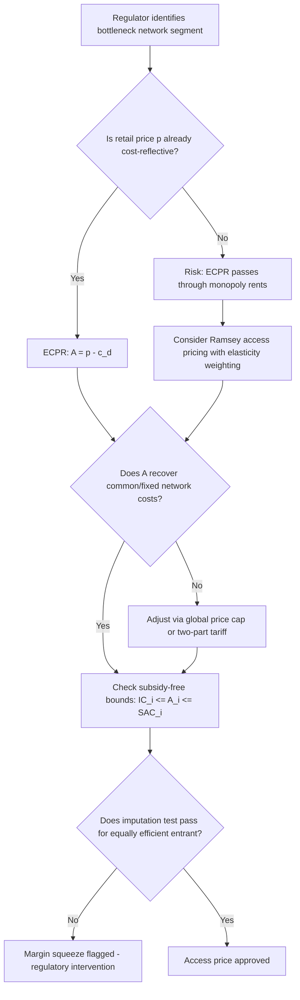

## Access Pricing in Network Industries

### Definition and Regulatory Context

Access pricing refers to the price a vertically integrated incumbent firm charges rival firms for the use of an essential input, typically a network infrastructure it owns, so that rivals can compete in complementary or downstream markets. This arises in industries characterized by natural monopoly in one segment (the network) combined with potentially competitive segments (retail, services, generation) — telecommunications (local loop access), electricity (transmission/distribution wires), rail (track access), natural gas (pipeline access), and postal services are canonical examples.

The regulatory problem exists because the network segment exhibits the cost characteristics of natural monopoly (large sunk costs, economies of scale and scope, subadditive cost functions), making duplication economically wasteful, while the downstream segments could otherwise support competition. Access pricing is the mechanism that unbundles the monopoly bottleneck from the competitive segments, allowing entrants to "climb the ladder of investment" without replicating the entire network.

### The Vertical Structure Problem

Consider an incumbent firm that owns an essential facility (the network) and also competes in a downstream retail market. If the incumbent is required to grant access to competitors, it faces two conflicting incentives:

- As a regulated network monopolist, it should charge access prices that reflect efficient cost recovery.
- As a competitor in the downstream market, it has an incentive to set access prices high enough (or degrade access quality) to disadvantage rivals — a practice known as a **price squeeze** or **margin squeeze**.

This creates a fundamental tension addressed by three interlocking questions in access pricing theory:

1. What is the *efficient* level of the access price?
2. How should access prices interact with retail price regulation to prevent anticompetitive foreclosure?
3. How should common/joint costs of the network be recovered given inevitable cross-subsidization concerns?

### The Efficient Component Pricing Rule (ECPR)

The most influential result in access pricing theory is the **Efficient Component Pricing Rule** (also called the Baumol-Willig rule), developed by Willig (1979) and Baumol (1983).

**Statement of the rule:**

$$A = c_a + (p - c_d - c_a)$$

Where:

- $A$ = access price
- $c_a$ = marginal cost of providing access (the incremental cost of the network component)
- $p$ = the retail (final) price of the downstream product
- $c_d$ = the incumbent's marginal cost of the downstream (retail) activity
- $(p - c_d - c_a)$ = the opportunity cost to the incumbent of losing a unit of retail sales to a rival, i.e., the forgone contribution margin

This simplifies to:

$$A = p - c_d$$

The access price equals the final retail price minus the incumbent's downstream marginal cost. Equivalently, ECPR states that the access price should equal the incumbent's **marginal cost of providing access plus the opportunity cost of the sales displaced** in the downstream market.

**Key Points**

- ECPR is efficient in the narrow sense that it induces entry only when the entrant is more efficient than the incumbent at the downstream stage — it preserves competitive neutrality between the incumbent's own downstream operations and entrants' operations, conditional on the retail price $p$.
- ECPR is **not** independent of the retail price. If the retail price $p$ already contains monopoly rents or cross-subsidies (i.e., $p$ is not itself cost-reflective), then ECPR will pass those distortions through into the access price, potentially foreclosing efficient entry. This is the rule's central weakness and the source of most academic controversy.
- ECPR assumes the entrant provides a homogeneous, perfectly substitutable service to the incumbent's downstream output. It performs poorly when products are differentiated or if the entrant intends to innovate the retail offering, since it embeds the incumbent's existing retail margin as a floor for access charges.
- [Inference] Critics (notably Armstrong, Doyle, and Vickers, 1996) argue that ECPR is best understood as a special case of optimal (Ramsey-type) access pricing under specific assumptions (fixed retail price, no demand-side substitution effects, no economies of scope), rather than a general efficiency rule.

### Ramsey Pricing for Access

When the network owner must recover a fixed/common cost that marginal-cost pricing alone cannot cover (a standard natural monopoly problem, given subadditivity of the cost function), Ramsey pricing principles extend to access charges. The regulator's problem is to set the access price $A$ and retail price $p$ to maximize welfare subject to a zero-profit (or budget-balance) constraint for the regulated firm.

The Ramsey solution requires that price-cost markups be inversely proportional to the price elasticity of demand (the inverse elasticity rule), applied jointly across the access and retail markets:

$$\frac{A - c_a}{A} = \frac{k}{\varepsilon_a}, \qquad \frac{p - c_d - c_a}{p} = \frac{k}{\varepsilon_r}$$

Where $\varepsilon_a$ and $\varepsilon_r$ are the relevant elasticities of demand for access and retail services, and $k$ is a Lagrange multiplier (shadow cost of the budget constraint) common across both.

**Key Points**

- Ramsey access pricing generalizes ECPR by explicitly incorporating elasticities and the shadow cost of the incumbent's revenue requirement rather than treating the retail price as exogenously fixed.
- The Laffont-Tirole (1994, 2000) global price cap approach operationalizes Ramsey principles in access regulation by placing a single weighted cap over both the incumbent's retail prices and the access charges paid by rivals, allowing the firm flexibility to set relative prices subject to an aggregate constraint — this internalizes the Ramsey structure without requiring the regulator to know demand elasticities precisely.
- [Inference] In practice, informational asymmetries about costs and demand make literal Ramsey pricing infeasible; most real-world regimes use it as a normative benchmark rather than a literal pricing formula.

### Cost-Based Access Pricing Standards

Regulatory agencies typically implement access pricing using one of several cost standards, each with distinct incentive properties:

**Marginal Cost / Long-Run Incremental Cost (LRIC)**

Access priced at the forward-looking incremental cost of providing the access service, excluding costs that would be incurred regardless of whether access is granted (common costs). This is the standard embodied in **TELRIC** (Total Element Long-Run Incremental Cost) as historically used in U.S. telecommunications unbundling under the Telecommunications Act of 1996.

- Advantage: sends efficient entry signals, since the price reflects the true cost the entrant imposes on the network.
- Disadvantage: leaves a revenue gap (the network's common/fixed costs) that must be recovered elsewhere, and TELRIC's use of a *hypothetical* efficient forward-looking network (rather than the incumbent's actual embedded costs) has been criticized for underestimating actual replacement cost, discouraging incumbent investment.

**Fully Distributed Cost (FDC) / Fully Allocated Cost (FAC)**

Common costs are allocated across services using an accounting convention (e.g., relative usage, relative revenues, or relative stand-alone costs).

- Advantage: administratively simple, ensures full cost recovery.
- Disadvantage: allocation rules are arbitrary and can be manipulated, potentially embedding cross-subsidies or creating distorted signals unrelated to genuine economic cost causation. Widely regarded in the economics literature as inferior to incremental-cost-based approaches for efficiency purposes.

**Stand-Alone Cost / Incremental Cost Bounds**

The Faulhaber (1975) subsidy-free pricing concept establishes that a price is *subsidy-free* if it lies between the incremental cost of serving that service and the stand-alone cost of serving it alone. This provides a **feasible band** for access prices consistent with sustainability against bypass or cream-skimming entry, rather than a single point estimate.

$$IC_i \leq A_i \leq SAC_i$$

Where $IC_i$ is the incremental cost attributable to access service $i$ and $SAC_i$ is the stand-alone cost of providing that service independently.

### The Price Squeeze / Margin Squeeze Problem

A **margin squeeze** occurs when the incumbent sets the access price and retail price such that an equally efficient entrant cannot earn a normal profit in the downstream market, even though the entrant is as efficient as the incumbent. Formally, a margin squeeze exists when:

$$p - A < c_d$$

That is, the margin available to a downstream rival (retail price minus access charge) is less than the incumbent's own downstream marginal cost — meaning even a rival with the incumbent's own cost structure cannot profitably operate.

**Key Points**

- The **imputation test** (also called the equally efficient competitor test) is the standard regulatory tool: it requires the incumbent's retail price to be high enough, or access price low enough, that a hypothetical entrant with the incumbent's own downstream costs could break even.
- Margin squeeze can be effectuated either by raising the access price or by lowering the retail price (or both), making it distinct from, but related to, predatory pricing analysis in antitrust economics.
- [Unverified — jurisdiction-dependent] Whether margin squeeze constitutes a standalone antitrust violation independent of a duty to deal varies by jurisdiction; U.S. antitrust law post-*Trinko* (2004) and *linkLine* (2009) has been more restrictive in recognizing standalone margin squeeze claims absent an independent duty to deal, whereas EU competition law (e.g., *Deutsche Telekom*, *TeliaSonera*) has recognized margin squeeze as an independent abuse under Article 102 TFEU.

### Two-Part Tariffs and Non-Linear Access Pricing

Where feasible, efficient access pricing often takes a **two-part tariff** form to separate the efficiency signal (marginal cost) from the cost-recovery function (fixed fee):

$$T(q) = F + a \cdot q$$

Where $F$ is a fixed access/connection charge recovering common costs and $a$ is a usage charge set close to marginal cost $c_a$. This structure allows the usage-sensitive component to guide efficient entry and traffic decisions while the fixed component addresses the natural monopoly's cost-recovery constraint — mirroring the broader two-part tariff literature used throughout public utility ratemaking (see Coase, 1946; Oi, 1971).

**Key Points**

- Non-linear or multi-part access pricing raises implementation challenges when entrants have heterogeneous volumes, since a uniform fixed fee $F$ imposes a disproportionate burden on small-scale entrants, potentially creating a barrier to entry disguised as cost recovery.
- Global price caps (Laffont-Tirole) can be interpreted as a generalized non-linear approach applied at the portfolio level, giving the regulated firm discretion over the *structure* of access and retail prices subject to an aggregate revenue constraint.

### Bottleneck Facilities and the Essential Facilities Doctrine

Access pricing frameworks presuppose that the underlying input is an **essential facility** — one that cannot be feasibly duplicated and is indispensable for downstream competition. This connects access pricing regulation to the essential facilities doctrine in competition law, under which a dominant firm controlling a bottleneck input may, in some jurisdictions, be compelled to grant access on reasonable terms.

**Key Points**

- Not every input controlled by a monopolist is an "essential facility" in the legal or economic sense; the doctrine (and analogous ex ante access regulation) is generally reserved for inputs that are genuinely non-replicable given realistic technology and demand (e.g., local telecom loops historically, electricity transmission wires, rail track).
- [Inference] The distinction between *ex ante* regulatory access pricing (sector-specific regulators set rules before disputes arise) and *ex post* competition-law remedies (courts/authorities intervene after an abuse is alleged) reflects a broader institutional design choice: ex ante regulation offers certainty and reduces litigation costs but risks regulatory error and capture; ex post enforcement preserves flexibility but creates uncertainty and higher transaction costs for entrants.

### Sector Applications

**Telecommunications:** Unbundled network element (UNE) pricing for the local loop, interconnection charges between fixed and mobile networks, and termination rates for calls between networks. TELRIC-based pricing in the U.S. and Long-Run Incremental Cost + (LRIC+) approaches in the EU are the dominant frameworks.

**Electricity:** Transmission and distribution wire access charges allow independent generators and retailers to reach customers over the incumbent's grid. Access pricing here typically separates into **connection charges** (fixed cost of physically joining the grid) and **use-of-system charges** (variable charges for transporting energy), often set via RPI-X price caps on the network operator's allowed revenue.

**Railways:** Track access charges paid by train operating companies to the infrastructure manager (e.g., Network Rail in the UK, or vertically separated European rail systems under EU Directive 2012/34/EU). Track access pricing usually blends a Ramsey-style markup structure (higher charges on routes/services with lower demand elasticity) with marginal wear-and-tear cost components.

**Natural Gas:** Pipeline capacity access for gas shippers, often allocated through capacity auctions or regulated tariffs reflecting the pipeline's cost of service, subject to open-access requirements analogous to those in electricity transmission.

### Worked Numerical Example

Suppose an incumbent telecom firm has:

- Retail price for broadband service: $p = \$50$ per month
- Incumbent's downstream (retail) marginal cost: $c_d = \$10$ per month
- Marginal cost of network access: $c_a = \$15$ per month

**ECPR access price:**

$$A = p - c_d = 50 - 10 = \$40 \text{ per month}$$

An entrant using this access must charge a retail price of at least $A + c_e$ (where $c_e$ is the entrant's own downstream cost) to break even. If the entrant is exactly as efficient as the incumbent ($c_e = c_d = \$10$), it needs to charge at least $40 + 10 = \$50$ — matching the incumbent's price exactly, consistent with ECPR's competitive-neutrality property.

**Margin squeeze test:** If the regulator instead observes an access price of $A = \$45$ with the same retail price $p = \$50$, the available margin for the entrant is $p - A = \$5$, which is less than the incumbent's own downstream cost $c_d = \$10$. This fails the imputation test — a hypothetical equally efficient entrant cannot cover its downstream costs, indicating a margin squeeze.

### Illustration: Vertical Structure and Access Price Flow

<svg xmlns="http://www.w3.org/2000/svg" viewBox="0 0 720 420" font-family="Helvetica, Arial, sans-serif">
<text x="360" y="28" text-anchor="middle" font-size="16" font-weight="bold" fill="#1a1a1a">Access Pricing in a Vertically Integrated Network Industry (svg_diagram)</text>

<rect x="60" y="60" width="600" height="80" rx="8" fill="#dbeafe" stroke="#1e40af" stroke-width="2" />
<text x="360" y="90" text-anchor="middle" font-size="14" font-weight="bold" fill="#1e3a8a">Upstream Network (Natural Monopoly Bottleneck)</text>
<text x="360" y="112" text-anchor="middle" font-size="12" fill="#1e3a8a">Owned by Incumbent — e.g., local loop, transmission grid, rail track</text>
<text x="360" y="130" text-anchor="middle" font-size="12" fill="#1e3a8a">Cost: $c_a$ (marginal cost of access)</text>

<line x1="220" y1="140" x2="220" y2="200" stroke="#1a1a1a" stroke-width="2" marker-end="url(#arrow)" />
<line x1="500" y1="140" x2="500" y2="200" stroke="#1a1a1a" stroke-width="2" marker-end="url(#arrow)" />

<text x="220" y="175" text-anchor="middle" font-size="12" fill="`#1a1a1a`">Internal transfer</text>

<text x="500" y="175" text-anchor="middle" font-size="12" fill="`#b91c1c`" font-weight="bold">Access price $A$</text>

<rect x="90" y="200" width="260" height="90" rx="8" fill="#dcfce7" stroke="#166534" stroke-width="2" />
<text x="220" y="228" text-anchor="middle" font-size="13" font-weight="bold" fill="#14532d">Incumbent Downstream Unit</text>
<text x="220" y="248" text-anchor="middle" font-size="12" fill="#14532d">Retail cost: $c_d$</text>
<text x="220" y="266" text-anchor="middle" font-size="12" fill="#14532d">Retail price: $p$</text>

<rect x="370" y="200" width="260" height="90" rx="8" fill="#fef3c7" stroke="#92400e" stroke-width="2" />
<text x="500" y="228" text-anchor="middle" font-size="13" font-weight="bold" fill="#78350f">Rival / Entrant Downstream Unit</text>
<text x="500" y="248" text-anchor="middle" font-size="12" fill="#78350f">Retail cost: $c_e$</text>
<text x="500" y="266" text-anchor="middle" font-size="12" fill="#78350f">Retail price: competitive</text>

<line x1="220" y1="290" x2="220" y2="340" stroke="#1a1a1a" stroke-width="2" marker-end="url(#arrow)" />
<line x1="500" y1="290" x2="500" y2="340" stroke="#1a1a1a" stroke-width="2" marker-end="url(#arrow)" />
<rect x="90" y="340" width="260" height="50" rx="8" fill="#f3f4f6" stroke="#4b5563" stroke-width="1.5" />
<text x="220" y="370" text-anchor="middle" font-size="12" fill="#1f2937">End Consumers</text>
<rect x="370" y="340" width="260" height="50" rx="8" fill="#f3f4f6" stroke="#4b5563" stroke-width="1.5" />
<text x="500" y="370" text-anchor="middle" font-size="12" fill="#1f2937">End Consumers</text>
</svg>

### Illustration: Access Pricing Rule Decision Logic

### Common Pitfalls and Misconceptions

- **Misconception:** ECPR guarantees efficient outcomes in all circumstances. In reality, ECPR is efficient only relative to a given (possibly distorted) retail price, and can entrench inefficiently high retail prices by allowing the incumbent to pass through monopoly rents into the access charge.
- **Misconception:** Lower access prices are always pro-competitive. Prices set below incremental cost can encourage inefficient bypass entry or discourage the incumbent from investing in and maintaining the network (the **investment/access price trade-off**, central to debates over TELRIC-style regulation).
- **Misconception:** Fully distributed cost (FDC) methods are cost-based in an economically meaningful sense. FDC is *accounting*-based; the allocation of common costs across services is a convention, not a market-derived signal of scarcity or opportunity cost.

**Related Topics**

- Ramsey-Boiteux pricing for public utilities
- Price cap regulation (RPI-X) versus rate-of-return regulation
- Vertical separation and unbundling remedies (ownership unbundling vs. functional separation)
- Regulatory asset base (RAB) valuation methods
- Interconnection and termination rate regulation in telecommunications
- Predatory pricing and margin squeeze under antitrust law
- Two-sided markets and platform access pricing
- Universal service obligations and cross-subsidy in network industries