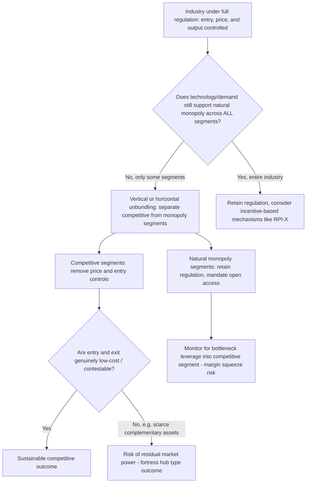

## Deregulation Case Studies in Telecoms, Airlines, and Utilities

### Overview: Deregulation as an Economic Policy Instrument

Deregulation refers to the reduction or removal of government-imposed constraints on entry, exit, pricing, and output decisions in industries previously subject to direct economic regulation. The theoretical motivation stems from the recognition that not all segments of a traditionally regulated industry exhibit natural monopoly characteristics — technological change, demand growth, and evolving cost structures can erode the subadditivity of costs that once justified regulation, making competitive markets a superior mechanism for achieving allocative and productive efficiency.

The standard economic case for deregulation rests on several propositions:

- Regulation imposes **X-inefficiency** costs (Leibenstein, 1966) — regulated monopolies lack competitive pressure to minimize costs.
- Rate-of-return regulation induces the **Averch-Johnson effect**, distorting capital-labor ratios toward excessive capital intensity.
- Regulatory capture (Stigler, 1971; Peltzman, 1976) can cause regulation to serve incumbent producer interests rather than consumer welfare.
- Where contestability (Baumol, Panzar, Willig, 1982) is achievable — low sunk costs, absence of genuine natural monopoly conditions — competitive entry threats alone can discipline pricing without direct regulation.

Deregulation is analytically distinct from **liberalization** (opening previously closed markets to competition while retaining some regulatory oversight) and from **privatization** (transferring ownership from public to private hands), though in practice these reforms are frequently bundled together, as seen in the case studies below.

### Case Study I: U.S. Airline Deregulation (1978)

**Background:** Prior to 1978, the U.S. airline industry was regulated by the Civil Aeronautics Board (CAB), which controlled route entry, exit, and fares under the Federal Aviation Act of 1938. The CAB's regulatory framework prevented price competition and restricted new entry, leading to service competition (quality, frequency, amenities) as the primary competitive margin, which economists argued dissipated potential efficiency gains.

**Reform:** The Airline Deregulation Act of 1978 phased out the CAB's authority over domestic routes and fares, eliminating the agency entirely by 1985 (with residual functions transferred to the Department of Transportation for safety and international matters, which remain regulated). Alfred Kahn, CAB chairman during this period, is widely credited as the intellectual architect of the transition, drawing directly on contestable markets theory.

**Outcomes:**

- **Hub-and-spoke network restructuring:** Airlines reorganized route networks around hub airports to exploit economies of traffic density (a firm-specific scale economy distinct from classical natural monopoly), consolidating traffic to fill larger aircraft and improve connection frequency.
- **Fare reductions:** Average fares fell substantially in real terms over subsequent decades, though the reduction was highly uneven across route types.
- **Hub concentration and market power:** A well-documented consequence was the emergence of **fortress hubs** — airports where a single carrier achieved dominant market share, generating persistent fare premiums on routes to/from that hub, a phenomenon extensively studied in industrial organization literature (Borenstein, 1989).
- **Entry and exit volatility:** Deregulation enabled numerous new entrants (e.g., low-cost carriers), but also produced a wave of bankruptcies and consolidation, as legacy carriers struggled with legacy cost structures (unionized labor contracts, pension obligations) incompatible with a competitive fare environment.
- **Service quality trade-offs:** Reduced service to smaller, thinner-demand markets occurred in some cases, partially offset by the Essential Air Service program subsidizing service to remote communities.

**Key Points**

- Airline deregulation is frequently cited as a canonical test of contestable markets theory; the persistence of fortress hub premiums is regarded as evidence that contestability requires genuinely costless entry/exit (including access to gates, slots, and frequent-flyer network effects), conditions that did not fully hold in practice.
- [Inference] The hub concentration outcome illustrates a broader lesson relevant to network industries generally: removing price regulation does not guarantee competitive outcomes if non-price barriers to entry (scarce complementary assets like airport gates) remain.

### Case Study II: U.S. Telecommunications Deregulation — AT&T Breakup and the 1996 Act

**Background:** AT&T operated as a regulated, vertically integrated monopoly (the "Bell System") under the theory that local telephone service constituted a natural monopoly, with long-distance service cross-subsidizing local rates.

**Reform Phase 1 — The 1984 Divestiture:** Following the U.S. v. AT&T antitrust consent decree (1982, effective 1984), AT&T was broken into a long-distance company (AT&T) and seven regional Bell operating companies (RBOCs, the "Baby Bells") providing local exchange service. This vertical separation was designed to expose the potentially competitive long-distance segment to competition while retaining regulation over the local loop, which remained the natural monopoly bottleneck.

**Reform Phase 2 — The Telecommunications Act of 1996:** This legislation aimed to introduce competition into local exchange markets (previously monopolized by the RBOCs) through three entry pathway mechanisms:

1. **Facilities-based entry** — competitors build their own networks.
2. **Unbundled Network Element (UNE) leasing** — competitors lease incumbent network components at regulated (TELRIC-based) prices.
3. **Resale** — competitors purchase incumbent retail services at wholesale discount for resale.

**Outcomes:**

- Long-distance prices fell substantially following the 1984 divestiture, consistent with the theory that this segment was workably competitive rather than a natural monopoly.
- Local exchange competition under the 1996 Act's UNE framework generated significant early entry by Competitive Local Exchange Carriers (CLECs), but many entrants failed following disputes over TELRIC pricing methodology and subsequent judicial and regulatory reversals (notably the FCC's UNE-P rules being vacated by courts in the early 2000s).
- [Inference] The eventual dominant competitive dynamic in local telecommunications came less from the 1996 Act's unbundling framework and more from **intermodal competition** — cable companies offering telephony over upgraded cable infrastructure, and the rise of wireless substitution — an outcome not fully anticipated by the Act's architecture.
- The RBOCs subsequently re-consolidated (e.g., SBC's acquisition of AT&T's brand and assets, Verizon's formation from Bell Atlantic and GTE), illustrating that vertical separation without durable structural barriers to re-integration can be reversed over time.

**Key Points**

- The AT&T case demonstrates successful application of the core natural monopoly regulatory logic: separate the genuine bottleneck (local loop) from potentially competitive segments (long distance, equipment manufacturing, which was also divested) and regulate only the former.
- The 1996 Act's comparative underperformance relative to the 1984 divestiture is often attributed to the difficulty of using *mandated wholesale access* to create competition in a segment (local loop) that retained strong natural monopoly characteristics, versus the 1984 approach of allowing genuine competitive entry in the already-competitive long-distance segment.

### Case Study III: UK Electricity Privatization and Deregulation

**Background:** The UK electricity sector was a vertically integrated, state-owned monopoly (Central Electricity Generating Board) prior to reform in the late 1980s.

**Reform:** The Electricity Act 1989 restructured the industry through:

- **Vertical separation** into generation, transmission (National Grid), distribution, and supply segments.
- **Privatization** of generation and supply companies.
- **Introduction of wholesale competition** among generators through the England and Wales Electricity Pool (a mandatory wholesale trading mechanism, later replaced by bilateral trading arrangements under the New Electricity Trading Arrangements, NETA, in 2001).
- **Retail supply competition** phased in gradually, with full competition for all consumer classes achieved by 1999.
- **Continued regulation of the natural monopoly network segments** (transmission and distribution) via RPI-X price cap regulation administered by the regulator (initially OFFER, later merged into Ofgem).

**Outcomes:**

- Generation became genuinely competitive, with new entrant Combined Cycle Gas Turbine (CCGT) plants precipitating the "dash for gas" in the 1990s, driven partly by competitive entry incentives and partly by exogenous gas price and environmental factors.
- Distribution and transmission network charges remained regulated via price caps, with reported efficiency gains attributed to the RPI-X mechanism's high-powered incentive properties relative to prior cost-of-service regulation.
- Retail competition produced consumer switching but also raised persistent concerns about switching costs, price discrimination against inattentive consumers, and the adequacy of competition in delivering retail price benefits — issues that led to subsequent re-regulation (e.g., the 2019 UK domestic energy price cap reintroduced direct retail price regulation after evidence that retail competition alone was not fully protecting disengaged consumers).

**Key Points**

- The UK electricity model is frequently cited as the template for the now-standard international approach to network industry reform: **vertical unbundling** (separate the natural monopoly network from potentially competitive generation/supply), competition in the competitive segments, and continued incentive regulation (price caps) of the network monopoly.
- [Inference] The re-regulation of UK retail energy prices in 2019 illustrates that deregulation is not necessarily a one-directional or permanent policy state; behavioral economics evidence on consumer switching frictions has prompted a partial reversal even in a market structurally designed for competition.

### Case Study IV: U.S. Natural Gas Deregulation

**Background:** Wellhead natural gas prices were subject to federal price controls under the Natural Gas Act of 1938 and subsequent amendments, while interstate pipelines operated as regulated common carriers bundling gas commodity sales with transportation.

**Reform:** The Natural Gas Policy Act of 1978 began phasing out wellhead price controls. FERC Order 436 (1985) and especially **FERC Order 636 (1992)** required interstate pipelines to "unbundle" their transportation services from gas sales, transforming pipelines into open-access transporters while allowing gas commodity prices to be set by competitive markets.

**Outcomes:**

- Wellhead gas prices became market-determined, improving allocative efficiency relative to the shortages associated with price ceilings under the prior regime (a textbook illustration of price ceiling-induced excess demand).
- Pipeline transportation remained regulated (cost-of-service based, with FERC oversight), consistent with the pipeline segment's persistent natural monopoly characteristics, while the gas commodity market became competitive.
- Order 636's unbundling created a template later echoed in electricity and telecommunications restructuring: separate genuinely competitive commodity/service markets from the natural monopoly transportation/network function.

**Key Points**

- This case is a clean illustration of the **unbundling principle**: natural monopoly characteristics attach to specific vertical segments (pipeline capacity), not to the industry as a whole (gas commodity supply is not naturally monopolistic), and regulatory reform should be segment-specific rather than industry-wide.

### Comparative Synthesis Across Case Studies

| Dimension | Airlines | Telecom (US) | Electricity (UK) | Natural Gas (US) |
| --- | --- | --- | --- | --- |
| Natural monopoly segment | None (route-level scale economies, not classical NM) | Local loop | Transmission/distribution wires | Pipeline transportation |
| Reform mechanism | Full deregulation | Vertical separation + mandated wholesale access | Vertical unbundling + privatization | Unbundling of commodity from transport |
| Continued regulation | Safety only (FAA) | Local loop initially, largely superseded by intermodal competition | Network segments via RPI-X | Pipeline transport via cost-of-service |
| Primary competitive outcome | Fare reduction, hub concentration | Long-distance price decline; local competition uneven | Generation/wholesale competition | Commodity price liberalization |
| Notable complication | Fortress hub market power | UNE pricing disputes, re-consolidation | Retail switching frictions, partial re-regulation | N/A — comparatively successful |

### Illustration: Deregulation Reform Pathway

### Common Pitfalls and Misconceptions

- **Misconception:** Deregulation and privatization are the same policy. Privatization concerns ownership transfer; deregulation concerns removal of price/entry controls. The UK electricity case combined both, but they are conceptually and empirically separable — an industry can be privatized while remaining regulated (as generation initially was under some residual pooling rules), or regulated while state-owned.
- **Misconception:** Deregulation always produces sustained price declines. Airline and telecom experience shows highly uneven distributional outcomes (fortress hub premiums, thin-route service reductions) even where average price effects were positive.
- **Misconception:** Once deregulated, an industry stays deregulated. The UK retail energy price cap (2019) demonstrates that persistent market failures identified after liberalization (e.g., consumer inertia) can prompt partial re-regulation.
- **Misconception:** Vertical separation alone guarantees durable competition. The re-consolidation of RBOCs post-1996 Act illustrates that structural separation can be undone via subsequent mergers absent structural or ownership barriers preventing reintegration.

**Related Topics**

- Contestable markets theory (Baumol, Panzar, Willig)
- Regulatory capture theory (Stigler, Peltzman)
- Price cap regulation (RPI-X) versus rate-of-return regulation
- Access pricing in network industries
- Vertical unbundling: ownership unbundling vs. functional/legal separation
- Averch-Johnson effect and rate-of-return regulation distortions
- Behavioral economics of consumer switching in liberalized retail markets
- International comparative regulatory reform (EU Third Energy Package, EU telecom liberalization directives)