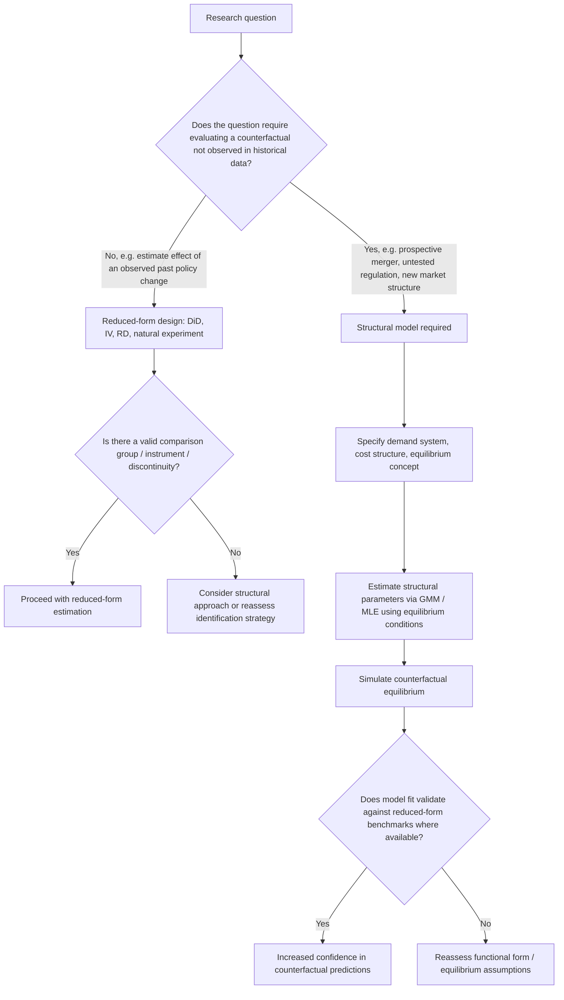

## Structural versus Reduced-Form Estimation Approaches

### Conceptual Distinction

Empirical industrial organization employs two broad methodological paradigms for drawing inference from data: **structural estimation** and **reduced-form estimation**. The distinction concerns the relationship between the estimated statistical model and the underlying economic theory generating the data.

**Reduced-form estimation** estimates statistical relationships between observed variables (outcomes and treatments/instruments) with minimal explicit parameterization of the underlying economic model — firm behavior, demand systems, or strategic interaction are not fully specified. The estimated coefficients capture correlations or causal effects under identifying assumptions (e.g., exogeneity, parallel trends, instrument validity) without requiring the researcher to specify a complete behavioral model of agents' optimization problems.

**Structural estimation** specifies an explicit economic model — a data-generating process derived from agents' optimizing behavior (e.g., profit-maximizing firms, utility-maximizing consumers, a specific game-theoretic equilibrium concept) — and estimates the deep parameters of that model (cost function parameters, demand elasticities, conduct parameters) using the observed data. The estimated model can then be used to simulate counterfactual scenarios not observed in the data.

**Key Points**

- The terms are not mutually exclusive categories with a bright line; many modern empirical IO papers combine reduced-form evidence (to establish credibility of a causal relationship or a "reduced-form fact") with a structural model (to conduct counterfactual policy analysis).
- The choice between approaches is fundamentally about the trade-off between **credibility of identification** and **richness of counterfactual analysis** — this framing follows the influential methodological debate articulated by Angrist and Pischke (2010) versus Nevo and Whinston (2010) in the *Journal of Economic Perspectives*.

### The Case for Reduced-Form Methods

Reduced-form (or "design-based") empirical work emphasizes research designs that isolate plausibly exogenous variation, minimizing reliance on functional-form or behavioral assumptions that are not directly tested by the data. Canonical tools include:

- **Difference-in-differences (DiD):** exploits variation in treatment timing across units to estimate causal effects, under the parallel trends assumption.
- **Instrumental variables (IV):** exploits variation in an instrument correlated with the endogenous regressor but uncorrelated with the error term, satisfying the exclusion restriction.
- **Regression discontinuity (RD):** exploits a discontinuous treatment assignment rule around a threshold.
- **Natural experiments:** exploits exogenous policy changes, regulatory shocks, or other quasi-random variation as if from a randomized experiment.

**Advantages:**

- Identification typically rests on a small number of transparent, often directly testable (or at least falsifiable in part) assumptions.
- Results are less sensitive to misspecification of the full economic model, since the researcher does not need to correctly specify demand systems, cost functions, or equilibrium concepts.
- Easier for other researchers to scrutinize, replicate, and challenge, since the identifying assumption itself is usually a single, clearly stated claim (e.g., "the instrument is uncorrelated with unobserved demand shocks").

**Limitations:**

- Reduced-form estimates typically identify a **local average treatment effect (LATE)** or an average effect of the specific policy variation studied, which may not generalize to counterfactual policies or market structures not represented in the observed variation (a version of the Lucas critique).
- Reduced-form methods generally cannot answer "what if" questions about policies or market structures that have never been observed (e.g., "what would prices be if this merger were permitted," where no historical variation of an identical merger exists).
- Provides limited insight into the underlying economic *mechanism* generating the estimated relationship, which can matter for welfare analysis and policy generalization.

### The Case for Structural Methods

Structural estimation specifies the primitives of an economic model — consumer preferences, firm cost functions, and the nature of strategic interaction (e.g., Bertrand-Nash, Cournot-Nash, or a specific bargaining protocol) — and recovers these primitives from data using the model's equilibrium conditions as identifying restrictions.

**Canonical example — differentiated products demand and Bertrand-Nash pricing:**

Under a discrete-choice demand system (e.g., the Berry-Levinsohn-Pakes, "BLP," random-coefficients logit model) combined with an assumption of Bertrand-Nash price competition among multiproduct firms, the first-order conditions for profit maximization imply:

$$p_j - mc_j = -\left[\sum_{k \in \mathcal{F}_f} \frac{\partial s_k}{\partial p_j}\right]^{-1} s_j$$

for products $j$ owned by firm $f$, where $s_j$ is the market share of product $j$ and $mc_j$ is marginal cost. Given estimated demand parameters (own- and cross-price elasticities from the discrete choice model), this first-order condition allows the researcher to **back out implied marginal costs** without directly observing firm cost data — a hallmark structural technique.

**Advantages:**

- Once the deep parameters (demand elasticities, marginal costs, conduct parameters) are estimated, the model can simulate **counterfactual equilibria**: predicted prices and welfare under a hypothetical merger, a tax change, a new product introduction, or an alternative regulatory regime — none of which need to have been observed in the historical data.
- Explicitly incorporates economic theory (e.g., strategic interaction, equilibrium conditions), allowing decomposition of observed outcomes into economically meaningful components (e.g., market power markup versus marginal cost).
- Enables **out-of-sample policy evaluation**, which is central to applications like merger simulation (used extensively by antitrust authorities, e.g., FTC and DOJ merger review) and regulatory counterfactual analysis.

**Limitations:**

- Requires strong, often untestable assumptions about the model's structure: the specific game-theoretic equilibrium concept assumed (e.g., static Bertrand-Nash may not describe actual dynamic or collusive conduct), the functional form of demand, and the distribution of unobserved heterogeneity.
- Results can be highly sensitive to these functional-form and equilibrium assumptions — misspecification can generate misleading counterfactuals despite an apparently good in-sample fit (an "identification through functional form" critique).
- Computationally intensive, particularly for models with rich heterogeneity, dynamics, or high-dimensional state spaces (e.g., dynamic games of market entry with multiple firms).
- [Inference] Because structural models are estimated using nonlinear GMM or maximum likelihood procedures involving numerically solved equilibria, replication and independent verification by third parties is often more difficult than for reduced-form regressions, raising practical transparency concerns even when the underlying theory is sound.

### Identification Distinctions

**Key Points**

- Reduced-form identification typically relies on an **exclusion restriction** or **conditional independence assumption** involving observed instruments or quasi-experimental variation.
- Structural identification relies on the model's **equilibrium/optimality conditions** (first-order conditions, Bellman equations, market-clearing conditions) as the source of moment restrictions used in estimation, typically via Generalized Method of Moments (GMM) or Maximum Likelihood Estimation (MLE).
- A common hybrid strategy uses reduced-form, quasi-experimental variation to identify specific structural parameters within an otherwise fully specified model — this approach, associated with the "sufficient statistics" and "new IO" literatures, attempts to combine credibility of identification with the counterfactual-generating capacity of structural models.

### Illustrative Comparison: Merger Analysis

Consider evaluating the price effects of a proposed horizontal merger between two firms in a differentiated product market.

**Reduced-form approach:** If a comparable merger occurred previously in a similar market (or a comparable market did not undergo a merger, serving as a control), a difference-in-differences design comparing price changes in the "treated" market (merger occurred) versus "control" market (no merger) could estimate the causal price effect — but only for that specific historical merger's characteristics, and only if a valid comparison group exists.

**Structural approach:** Estimate a discrete-choice demand system (e.g., BLP) and recover marginal costs via the Bertrand-Nash first-order conditions using pre-merger data. Then simulate counterfactual post-merger equilibrium prices under the assumption that the merged entity now jointly maximizes profits across its combined product portfolio, comparing simulated post-merger prices to actual pre-merger prices — **without requiring any historical instance of this specific merger** to have occurred.

**Key Points**

- Merger simulation is a paradigmatic use case illustrating why structural methods are indispensable for certain policy questions: regulatory review of a *prospective* merger inherently requires evaluating a counterfactual that has not yet occurred and for which no historical treatment/control variation can exist.
- [Inference] In practice, antitrust economists frequently triangulate: using reduced-form evidence from comparable past mergers (if available) as an external validity check against the structural model's predictions, reflecting the growing methodological consensus favoring complementary rather than competing use of both approaches.

### The Lucas Critique as a Unifying Concern

The **Lucas critique** (Lucas, 1976) — originally articulated in macroeconomics but directly applicable to empirical IO — argues that reduced-form relationships estimated under one policy regime may not remain stable under a different policy regime, because economic agents' behavior (and hence the reduced-form parameters themselves) depend on the policy environment. Structural models, by explicitly modeling the deep behavioral parameters assumed to be policy-invariant (e.g., utility function parameters, cost function parameters), are designed to be robust to this critique — provided the assumed deep parameters are indeed structural (policy-invariant) and not themselves reduced-form artifacts of the estimation sample's specific policy environment.

**Key Points**

- [Inference] The Lucas critique provides the clearest theoretical justification for why counterfactual policy simulation generally requires structural (or at least partially structural) methods rather than purely reduced-form extrapolation, though this justification depends entirely on the structural model's assumed primitives being genuinely policy-invariant, which is itself an assumption rather than a guaranteed property of any specific structural specification.

### Illustration: Methodological Decision Framework

### Common Pitfalls and Misconceptions

- **Misconception:** Reduced-form methods are "assumption-free." Reduced-form estimation still relies on identifying assumptions (exogeneity, parallel trends, exclusion restrictions) — these are simply different, often more transparent and more directly assumption-light assumptions than a full behavioral model, not the complete absence of assumptions.
- **Misconception:** Structural models are inherently less credible than reduced-form designs. Credibility depends on whether the specific assumptions of either approach are appropriate to the empirical context; a poorly identified IV strategy is not more credible than a well-validated structural model, and vice versa.
- **Misconception:** The two approaches are substitutes. Contemporary empirical IO practice increasingly treats them as complements — reduced-form evidence often serves as a validation check ("does the structural model's predicted response match a directly estimated reduced-form elasticity in an overlapping context?") for structural counterfactual analysis.
- **Misconception:** Structural estimation always requires assuming a static equilibrium. Dynamic structural models (e.g., dynamic games of entry/exit, following Ericson and Pakes, 1995) incorporate intertemporal optimization and can be estimated using techniques such as those of Bajari, Benkard, and Levin (2007) or Pakes, Ostrovsky, and Berry (2007), extending structural methods well beyond static conduct models.

**Related Topics**

- Berry-Levinsohn-Pakes (BLP) random coefficients demand estimation
- Merger simulation methodology in antitrust economics
- Dynamic games of market entry and exit (Ericson-Pakes framework)
- Instrumental variables and the exclusion restriction in IO applications
- Conduct parameter estimation and the identification of market power
- Generalized Method of Moments (GMM) estimation in structural IO models
- Lucas critique and policy invariance of structural parameters
- Difference-in-differences designs in regulatory and antitrust natural experiments