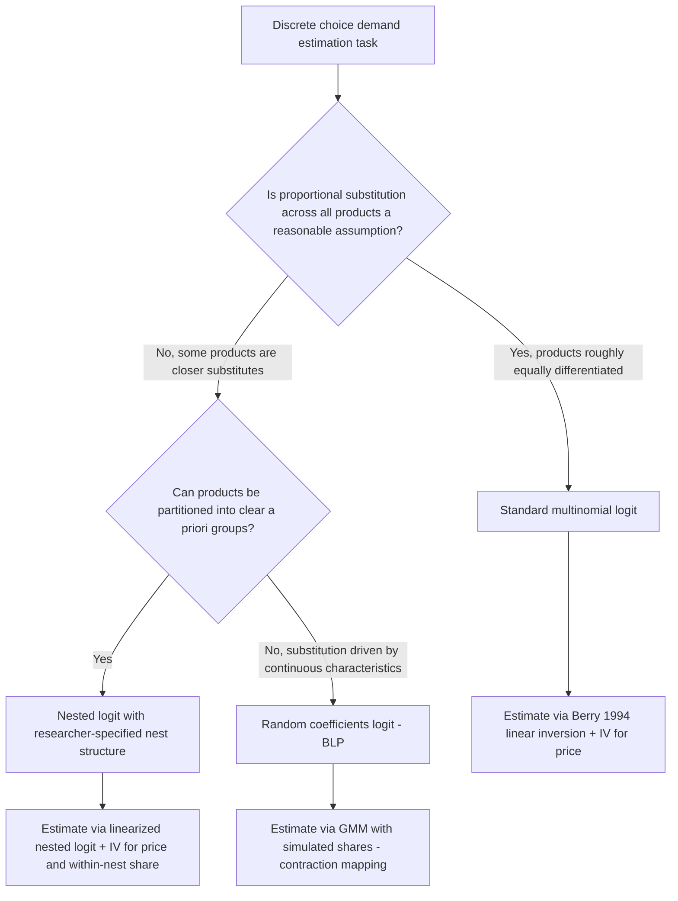

## Logit and Nested Logit Demand Estimation

### Foundations: Discrete Choice and Random Utility Models

Logit demand estimation belongs to the class of **discrete choice models** grounded in **random utility maximization (RUM)** theory (McFadden, 1974). Consumers choose among a finite set of differentiated products (or an outside option of not purchasing) to maximize utility, where utility contains both an observable, deterministic component and an unobservable random component.

For consumer $i$ choosing among products $j = 0, 1, \ldots, J$ (where $j=0$ denotes the outside good/no purchase), indirect utility is specified as:

$$u_{ij} = x_j \beta - \alpha p_j + \xi_j + \varepsilon_{ij}$$

Where:

- $x_j$ = observed product characteristics
- $p_j$ = price
- $\xi_j$ = unobserved (to the econometrician) product characteristic — the "structural error term"
- $\varepsilon_{ij}$ = idiosyncratic consumer-specific taste shock
- $\beta, \alpha$ = parameters to be estimated (with $\alpha$ the marginal utility of income/price sensitivity)

The consumer chooses the product yielding the highest utility. The distributional assumption placed on $\varepsilon_{ij}$ determines the specific discrete choice model and its resulting market share (choice probability) formula.

### The Standard (Multinomial) Logit Model

**Distributional assumption:** $\varepsilon_{ij}$ is assumed i.i.d. across products and consumers, following a **Type I Extreme Value (Gumbel) distribution**. This assumption yields the closed-form multinomial logit choice probability:

$$s_j = \frac{\exp(x_j \beta - \alpha p_j + \xi_j)}{1 + \sum_{k=1}^{J} \exp(x_k \beta - \alpha p_k + \xi_k)}$$

Where the "1" in the denominator normalizes the outside good's utility to zero ($u_{i0} = \varepsilon_{i0}$), a standard identifying normalization since utility levels are only identified up to a location and scale normalization.

**Estimation via the Berry (1994) inversion:** Because $\xi_j$ is correlated with price $p_j$ (firms set prices partly in response to unobserved quality — the classic price endogeneity problem in demand estimation), OLS estimation of the logit share equation is inconsistent. Berry (1994) showed that the logit model's share equation can be inverted analytically to isolate $\xi_j$:

$$\ln(s_j) - \ln(s_0) = x_j \beta - \alpha p_j + \xi_j$$

This is the **linearized logit demand equation**: taking logs of relative market shares (relative to the outside good's share $s_0$) yields a linear equation in the unobserved product characteristic $\xi_j$, which can then be estimated via **two-stage least squares (2SLS) or GMM using instruments for price** — commonly **BLP instruments** (functions of rival products' characteristics, reflecting markup variation from differentiation) or **Hausman instruments** (prices of the same product in other geographically separated markets, exploiting common cost shocks).

**Key Points**

- This log-linearization is the crucial technical contribution that made logit demand estimation tractable with standard linear IV methods before the development of more computationally intensive random-coefficients approaches.
- The elasticity implied by the standard logit model has a restrictive closed form: $\frac{\partial s_j}{\partial p_k} = -\alpha s_j (1 - s_j)$ for own-price effects and $\frac{\partial s_j}{\partial p_k} = \alpha s_j s_k$ for cross-price effects (for $j \neq k$).

### The Independence of Irrelevant Alternatives (IIA) Problem

The i.i.d. extreme value assumption on $\varepsilon_{ij}$ generates the **Independence of Irrelevant Alternatives (IIA)** property: the ratio of choice probabilities between any two products $j$ and $k$ is independent of the characteristics or even the existence of any other product in the choice set:

$$\frac{s_j}{s_k} = \frac{\exp(x_j \beta - \alpha p_j + \xi_j)}{\exp(x_k \beta - \alpha p_k + \xi_k)}$$

**The red bus/blue bus problem** is the canonical illustration: suppose consumers initially choose between a car and a red bus, each with 50% market share. If an identical blue bus (differing from the red bus only in color, a characteristic assumed irrelevant to utility) is introduced, IIA predicts each of the three alternatives receives exactly 33.3% share — implying the two buses jointly draw 66.7% share from the car. This is economically implausible, since the red and blue bus are close substitutes for each other and should draw share disproportionately from one another rather than proportionally from the car.

**Key Points**

- IIA implies proportionally substitution patterns across all products regardless of their actual similarity in characteristics space — a substantively restrictive and often empirically false assumption for differentiated product markets where some products are much closer substitutes than others (e.g., two compact sedans are closer substitutes to each other than either is to a pickup truck).
- This substitution pattern restriction directly distorts merger simulation and welfare analysis, since predicted diversion ratios (the share of lost sales from one product that flow to a specific rival) under standard logit are mechanically proportional to market shares rather than to genuine product similarity.

### The Nested Logit Model

**Motivation:** The nested logit model (McFadden, 1978) relaxes IIA by partitioning the full set of products into **nests** (groups) of similar products, allowing correlation in the unobserved utility component *within* a nest while retaining the independence assumption *across* nests.

**Model structure:** Products are partitioned into nests $g = 1, \ldots, G$ (plus the outside good, typically its own singleton nest). The market share of product $j$ belonging to nest $g$ is:

$$s_j = \frac{\exp\left(\frac{\delta_j}{1-\sigma}\right)}{D_g^{\sigma}} \cdot \frac{D_g^{1}}{\sum_h D_h^{1}}$$

which is more commonly estimated in its linearized form:

$$\ln(s_j) - \ln(s_0) = x_j \beta - \alpha p_j + \sigma \ln(s_{j|g}) + \xi_j$$

Where:

- $\delta_j = x_j\beta - \alpha p_j + \xi_j$ is the "mean utility" of product $j$
- $s_{j|g}$ = the **within-nest share** of product $j$ (product $j$'s share among only the products in its own nest $g$)
- $\sigma \in [0, 1)$ = the **nesting parameter**, measuring the degree of correlation in unobserved utility within the nest

**Interpretation of $\sigma$:**

- $\sigma \to 0$: the model collapses to the standard logit (no within-nest correlation, IIA holds globally).
- $\sigma \to 1$: consumers view products within the same nest as near-perfect substitutes for each other relative to products in other nests (utility correlation within the nest approaches its maximum).
- A statistically significant, positive $\sigma$ strictly between 0 and 1 indicates that nesting meaningfully improves on the standard logit's substitution pattern restrictions.

**Estimation:** As with standard logit, $\ln(s_{j|g})$ is correlated with the structural error $\xi_j$ (since within-nest share depends on other products' prices, which are set partly in response to $\xi_j$-correlated cost/demand shocks), requiring instruments for both price $p_j$ **and** the within-nest share term $\ln(s_{j|g})$. Common instruments for the nesting term include the number of products in the nest and measures of within-nest product density/characteristics (following Berry, 1994).

**Key Points**

- Nested logit relaxes IIA **within a nest structure imposed by the researcher** — substitution patterns are still restricted to be proportional *within* each nest and *across* nests, but no longer proportional globally across all products regardless of nest membership. This is a partial, not complete, solution to the IIA problem.
- The nest structure itself (which products belong to which nest) is typically specified by the researcher based on institutional knowledge or product classification (e.g., nesting by vehicle segment, by brand, or by a two-level structure such as "purchase vs. no purchase" then "vehicle type") rather than estimated from the data, introducing a degree of researcher discretion that can affect results.
- Multi-level (three or more tier) nested logit structures are feasible, allowing successively finer within-group correlation structures (e.g., first nest by broad category, then by sub-brand within category).

### Comparison of Substitution Patterns

| Feature | Standard Logit | Nested Logit | Random Coefficients Logit (BLP) |
| --- | --- | --- | --- |
| Cross-price substitution pattern | Proportional to market share (IIA) | Proportional within nest; proportional across nests | Governed by proximity in characteristics space |
| Nest structure required | No | Yes (researcher-specified) | No |
| Closed-form share equation | Yes | Yes | No (requires numerical simulation/integration) |
| Computational burden | Low | Low-moderate | High |
| Realism of substitution patterns | Low | Moderate (depends on nest specification) | High (if characteristics space well-specified) |

**Key Points**

- The random coefficients logit (BLP) model can be viewed as the natural generalization addressing nested logit's remaining limitation: rather than imposing a discrete, researcher-specified nest structure, it allows continuous heterogeneity in consumer tastes for characteristics, generating substitution patterns driven by proximity in characteristics space without requiring an a priori nesting assumption.
- [Inference] Nested logit remains widely used in applied work despite the availability of BLP-style random coefficients models because of its computational tractability, transparency (closed-form shares, straightforward IV estimation), and adequacy when the researcher has strong institutional knowledge of the relevant nest structure (e.g., clear product category boundaries).

### Worked Numerical Illustration

Suppose a two-nest structure: **Sedans** (Products A, B) and **SUVs** (Products C, D), plus the outside good. Suppose market shares are $s_A = 0.10$, $s_B = 0.15$, $s_C = 0.20$, $s_D = 0.25$, $s_0 = 0.30$.

**Within-nest shares:**

$$s_{A|Sedan} = \frac{0.10}{0.10+0.15} = 0.40, \quad s_{B|Sedan} = 0.60$$

$$s_{C|SUV} = \frac{0.20}{0.20+0.25} = 0.444, \quad s_{D|SUV} = 0.556$$

If a nested logit estimation yields $\hat\sigma = 0.6$, this indicates substantial within-nest correlation in unobserved utility — consumers substitute much more readily between Sedan A and Sedan B (or between SUV C and SUV D) than between a sedan and an SUV, in contrast to standard logit's prediction that a price increase in Product A would divert share to B, C, and D in exact proportion to their respective market shares.

### Illustration: Nested Logit Tree Structure

<svg xmlns="http://www.w3.org/2000/svg" viewBox="0 0 700 320" font-family="Helvetica, Arial, sans-serif">
<text x="350" y="26" text-anchor="middle" font-size="16" font-weight="bold" fill="#1a1a1a">Nested Logit Decision Tree (svg_diagram)</text>

<circle cx="350" cy="60" r="28" fill="#e0e7ff" stroke="#3730a3" stroke-width="2" />
<text x="350" y="65" text-anchor="middle" font-size="11" fill="#3730a3">Market</text>

<line x1="350" y1="88" x2="180" y2="150" stroke="#1a1a1a" stroke-width="1.5" />
<line x1="350" y1="88" x2="520" y2="150" stroke="#1a1a1a" stroke-width="1.5" />
<line x1="350" y1="88" x2="350" y2="150" stroke="#1a1a1a" stroke-width="1.5" />

<rect x="110" y="150" width="140" height="46" rx="6" fill="#dcfce7" stroke="#166534" stroke-width="2" />
<text x="180" y="178" text-anchor="middle" font-size="12" font-weight="bold" fill="#14532d">Nest: Sedans (sigma)</text>

<rect x="450" y="150" width="140" height="46" rx="6" fill="#fef3c7" stroke="#92400e" stroke-width="2" />
<text x="520" y="178" text-anchor="middle" font-size="12" font-weight="bold" fill="#78350f">Nest: SUVs (sigma)</text>

<rect x="290" y="150" width="120" height="46" rx="6" fill="#f3f4f6" stroke="#4b5563" stroke-width="2" />
<text x="350" y="178" text-anchor="middle" font-size="12" fill="#1f2937">Outside Good (j=0)</text>

<line x1="180" y1="196" x2="140" y2="250" stroke="#1a1a1a" stroke-width="1.5" />
<line x1="180" y1="196" x2="220" y2="250" stroke="#1a1a1a" stroke-width="1.5" />
<rect x="100" y="250" width="80" height="40" rx="5" fill="#bbf7d0" stroke="#166534" stroke-width="1.5" />
<text x="140" y="274" text-anchor="middle" font-size="11" fill="#14532d">Product A</text>
<rect x="190" y="250" width="80" height="40" rx="5" fill="#bbf7d0" stroke="#166534" stroke-width="1.5" />
<text x="230" y="274" text-anchor="middle" font-size="11" fill="#14532d">Product B</text>

<line x1="520" y1="196" x2="480" y2="250" stroke="#1a1a1a" stroke-width="1.5" />
<line x1="520" y1="196" x2="560" y2="250" stroke="#1a1a1a" stroke-width="1.5" />
<rect x="440" y="250" width="80" height="40" rx="5" fill="#fde68a" stroke="#92400e" stroke-width="1.5" />
<text x="480" y="274" text-anchor="middle" font-size="11" fill="#78350f">Product C</text>
<rect x="530" y="250" width="80" height="40" rx="5" fill="#fde68a" stroke="#92400e" stroke-width="1.5" />
<text x="570" y="274" text-anchor="middle" font-size="11" fill="#78350f">Product D</text>
</svg>

### Illustration: Model Selection Logic

### Common Pitfalls and Misconceptions

- **Misconception:** IIA is a minor technical assumption. IIA fundamentally determines predicted substitution patterns, directly affecting merger simulation, diversion ratio calculations, and welfare estimates — the red bus/blue bus problem demonstrates its behavior can be qualitatively implausible.
- **Misconception:** Nested logit fully solves the IIA problem. It only relaxes IIA at the level of nest structure; substitution patterns remain proportional within a nest and proportional across nests, still a restrictive parametric assumption relative to fully flexible substitution patterns.
- **Misconception:** OLS estimation of the logit share equation is valid. Price is endogenous (correlated with the unobserved quality term $\xi_j$) because firms observe $\xi_j$ when setting prices even though the econometrician does not; instrumental variables are required for consistent estimation, standard practice since Berry (1994).
- **Misconception:** The nesting parameter $\sigma$ can be freely estimated without theoretical restriction. Consistency with utility maximization (a proper random utility model with the Generalized Extreme Value structure) requires $\sigma \in [0,1)$; estimates outside this range indicate model misspecification or an inappropriate nest structure.

**Related Topics**

- Berry-Levinsohn-Pakes (BLP) random coefficients logit model
- Price endogeneity and instrument construction in demand estimation (BLP instruments, Hausman instruments)
- Merger simulation and diversion ratio calculation
- Generalized Extreme Value (GEV) model family
- Mixed logit and continuous heterogeneity in discrete choice models
- Market definition and the SSNIP test in antitrust economics
- Structural versus reduced-form estimation approaches
- Welfare measurement in discrete choice demand systems (compensating variation)