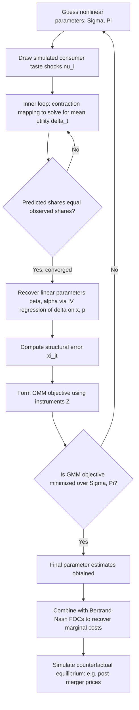

## The Berry-Levinsohn-Pakes Random Coefficients Approach

### Motivation and Historical Context

The Berry-Levinsohn-Pakes (BLP) model, introduced in Berry, Levinsohn, and Pakes (1995, "Automobile Prices in Market Equilibrium," *Econometrica*), was developed to address two central shortcomings of standard multinomial and nested logit demand models: the restrictive **Independence of Irrelevant Alternatives (IIA)** substitution pattern, and the inability of simple logit models to generate realistic own- and cross-price elasticities without extensive ad hoc nest specification. BLP achieves this by allowing consumer taste parameters to vary continuously across the population — **random coefficients** on product characteristics — generating substitution patterns driven by proximity in characteristics space rather than by market shares (as in logit) or researcher-imposed nest structures (as in nested logit).

The model has become the workhorse framework for empirical demand estimation in modern industrial organization, extensively used in merger simulation, tax incidence analysis, new product valuation, and regulatory counterfactual analysis.

### Model Specification

Consumer $i$'s indirect utility from product $j$ in market $t$ is specified as:

$$u_{ijt} = x_{jt}\beta_i - \alpha_i p_{jt} + \xi_{jt} + \varepsilon_{ijt}$$

Where the key innovation relative to standard logit is that the taste parameters $\beta_i$ and $\alpha_i$ vary across consumers according to:

$$\beta_i = \beta + \Sigma \nu_i, \qquad \nu_i \sim F(\nu)$$

Where:

- $\beta$ = the mean taste parameter (population average marginal utility for each characteristic)
- $\Sigma$ = a matrix of parameters governing the variance/covariance of taste heterogeneity across consumers
- $\nu_i$ = a vector of consumer-specific random shocks, typically assumed to follow a multivariate normal distribution (or interacted with observed demographic variables $D_i$ for demographic heterogeneity)
- $\varepsilon_{ijt}$ = i.i.d. Type I extreme value idiosyncratic taste shock (as in standard logit)

A common extended specification incorporates demographic interactions directly:

$$\beta_i = \beta + \Pi D_i + \Sigma \nu_i$$

Where $D_i$ represents observed consumer demographics (e.g., income) drawn from survey data (e.g., the U.S. Current Population Survey, matched to market-level data), and $\Pi$ captures how tastes for characteristics systematically vary with demographics.

**Market share as an integral:** Because the idiosyncratic shock $\varepsilon_{ijt}$ retains the extreme value distribution, the *conditional* (on $\nu_i$) choice probability retains the logit form. But the *unconditional* market share requires integrating over the entire distribution of consumer heterogeneity $\nu_i$:

$$s_{jt} = \int \frac{\exp\left(x_{jt}(\beta + \Sigma\nu) - \alpha_i p_{jt} + \xi_{jt}\right)}{1 + \sum_{k=1}^{J_t} \exp\left(x_{kt}(\beta + \Sigma\nu) - \alpha_i p_{kt} + \xi_{kt}\right)} \, dF(\nu)$$

This integral generally has **no closed-form solution**, in contrast to standard and nested logit — this is the fundamental source of BLP's greater computational burden and the reason the estimation procedure requires numerical simulation.

**Key Points**

- The random coefficients structure is what generates realistic substitution patterns: two products with similar characteristics $x_j \approx x_k$ will have correlated utility across consumers (a consumer who strongly values a characteristic present in both products values both highly), producing higher cross-price elasticities between similar products — exactly the pattern IIA rules out and that nested logit only partially captures via a discrete, researcher-imposed nest structure.
- Random coefficients on price ($\alpha_i$) are particularly important: allowing price sensitivity to vary across consumers permits realistic patterns where lower-income (typically more price-sensitive) consumers substitute differently than higher-income consumers, a pattern relevant for tax incidence and welfare analysis.

### Estimation Algorithm

BLP estimation is a nested computational procedure combining a **contraction mapping** (inner loop) with **GMM estimation** (outer loop).

**Step 1 — Inner loop (share inversion via contraction mapping):** For a given guess of the nonlinear parameters $(\Sigma, \Pi)$, the algorithm must find the vector of mean utilities $\delta_t = (\delta_{1t}, \ldots, \delta_{J_tt})$ (where $\delta_{jt} = x_{jt}\beta - \alpha p_{jt} + \xi_{jt}$) that equates the model's predicted market shares to the observed market shares in the data. Berry, Levinsohn, and Pakes (1995) show this can be solved via the following contraction mapping, iterated to convergence:

$$\delta_t^{(h+1)} = \delta_t^{(h)} + \ln(s_t^{obs}) - \ln(s_t^{(h)}(\delta_t^{(h)}, \Sigma, \Pi))$$

Where $s_t^{(h)}$ is the vector of predicted market shares (computed via simulation — drawing a large number of $\nu_i$ draws and averaging the resulting logit choice probabilities) given the current guess $\delta_t^{(h)}$. This mapping is a contraction (guaranteed to converge to a unique fixed point) under standard regularity conditions, a key theoretical result justifying the algorithm's numerical reliability.

**Step 2 — Recovering the structural error:** Once converged, $\delta_{jt}$ is linear in the mean-parameter $\beta$ and the structural error:

$$\delta_{jt} = x_{jt}\beta - \alpha p_{jt} + \xi_{jt} \quad \Rightarrow \quad \xi_{jt} = \delta_{jt} - x_{jt}\beta + \alpha p_{jt}$$

**Step 3 — Outer loop (GMM over nonlinear parameters):** Since $\xi_{jt}$ is expected to be correlated with price (endogeneity) and used as a function of $(\Sigma, \Pi)$ through the inner loop, GMM estimation searches over $(\Sigma, \Pi)$ (and implicitly $\beta, \alpha$ via the linear IV step) to minimize a quadratic form in the sample moments:

$$\min_{\Sigma, \Pi} \; \hat\xi(\Sigma,\Pi)' Z W Z' \hat\xi(\Sigma,\Pi)$$

Where $Z$ is a matrix of instruments (excluded from the demand equation but correlated with price) and $W$ is a GMM weighting matrix (typically the efficient two-step GMM weighting matrix, $W = (Z'Z)^{-1}$ in the first step, updated using the estimated moment covariance in the second step).

**Key Points**

- The nested structure — an inner-loop contraction mapping embedded within an outer-loop nonlinear GMM search — is the defining computational signature of BLP-style estimation, distinguishing it sharply from the simple linear IV estimation sufficient for standard and nested logit.
- [Inference] Subsequent methodological work (notably Dubé, Fox, and Su, 2012) proposed an alternative "MPEC" (Mathematical Programming with Equilibrium Constraints) formulation that solves the inner and outer loops simultaneously as a single constrained optimization problem, which can improve numerical stability and convergence speed relative to the original nested fixed-point algorithm, though the original nested approach remains widely used and taught as the canonical exposition of the method.

### Instrument Construction: The Endogeneity Problem

As in logit and nested logit, price $p_{jt}$ is correlated with the unobserved product characteristic $\xi_{jt}$, since firms observe $\xi_{jt}$ (e.g., unmeasured quality) when setting prices even though the econometrician does not. Valid instruments must be correlated with price but uncorrelated with $\xi_{jt}$.

**BLP instruments ("BLP instruments" proper):** Functions of the characteristics of *other* products in the market — specifically, sums of rival products' characteristics (both those produced by rival firms and other products of the same firm). The logic: a firm's optimal markup on product $j$ depends on the degree of differentiation from competing products, which is a function of rivals' characteristics; rivals' characteristics are plausibly uncorrelated with $j$'s own unobserved quality shock $\xi_{jt}$ (under the assumption that $\xi_{jt}$ is not systematically related to competitors' product design choices).

**Hausman instruments:** Prices of the *same* product in *other, geographically separated* markets, exploiting the logic that common marginal cost shocks (e.g., a national input cost shock) are correlated across markets while market-specific demand shocks $\xi_{jt}$ are not — valid under the assumption of no common demand shocks across the chosen markets.

**Cost-shifter instruments:** Direct measures of exogenous marginal cost variation (input prices, exchange rates for imported inputs, factor costs) when available, which are generally considered the theoretically cleanest instruments where obtainable, though data limitations often necessitate reliance on BLP or Hausman-style instruments instead.

**Key Points**

- [Inference] The validity of BLP-style instruments (rivals' characteristics) has been subject to methodological critique — since these instruments derive their exogeneity from an assumption about the product characteristic space itself (rather than from a genuinely exogenous cost or demand shock), some researchers view them as weaker in credibility relative to a genuine natural-experiment-style instrument, motivating the ongoing methodological interest in supplementing structural demand estimation with reduced-form validation where possible.
- The choice and strength of instruments materially affects estimated own- and cross-price elasticities, and weak instrument diagnostics (e.g., first-stage F-statistics) are an important robustness check in applied BLP estimation, analogous to standard linear IV practice.

### From Estimated Demand to Marginal Costs and Counterfactuals

A central practical payoff of the BLP framework is that, once demand parameters are estimated, they can be combined with an assumed model of firm conduct (typically static Bertrand-Nash pricing among multiproduct firms) to **recover implied marginal costs** using the pricing first-order conditions, without directly observing firm cost data:

$$p_{jt} - mc_{jt} = -\left[\sum_{k \in \mathcal{F}_f} \frac{\partial s_{kt}}{\partial p_{jt}}\right]^{-1} s_{jt}$$

where the price derivatives $\partial s_{kt}/\partial p_{jt}$ are computed directly from the estimated random coefficients demand system (via simulation, averaging derivatives across the simulated consumer population). Having recovered $mc_{jt}$, the researcher can then simulate **counterfactual equilibria** — e.g., re-solving the Bertrand-Nash pricing game under a hypothetical merged ownership structure, holding $mc_{jt}$ fixed, to predict post-merger prices.

**Key Points**

- This two-step logic (recover cost via observed pricing behavior under an assumed conduct model, then re-solve equilibrium under a counterfactual market structure) is the standard workflow underlying merger simulation exercises reviewed by antitrust authorities.
- The validity of counterfactual predictions depends critically on the assumed conduct model (e.g., static Bertrand-Nash) accurately describing actual firm behavior — misspecification of conduct (e.g., actual tacit collusion when Bertrand-Nash is assumed) directly biases the recovered marginal costs and any subsequent counterfactual simulation.

### Comparative Positioning Relative to Logit and Nested Logit

| Feature | Standard Logit | Nested Logit | BLP Random Coefficients |
| --- | --- | --- | --- |
| Substitution pattern flexibility | None (IIA globally) | Partial (within/across nest) | Full (driven by characteristics proximity) |
| Requires researcher-specified groups | No | Yes | No |
| Closed-form market share | Yes | Yes | No — requires simulation |
| Estimation method | Linear IV (Berry 1994 inversion) | Linear IV with within-nest share term | Nested fixed-point GMM (or MPEC) |
| Demographic heterogeneity | Not naturally incorporated | Not naturally incorporated | Directly incorporated via $D_i$ interactions |
| Computational burden | Low | Low | High |
| Typical use case | Simple markets, preliminary analysis | Moderate complexity, clear category structure | Merger simulation, welfare analysis, rich substitution patterns |

### Illustration: BLP Nested Estimation Algorithm

### Common Pitfalls and Misconceptions

- **Misconception:** BLP is simply "logit with more parameters." The defining feature is not merely additional parameters but the fundamental shift from a closed-form share equation to one requiring numerical integration/simulation, which changes both the estimation algorithm (nested fixed point or MPEC) and the economic content (individual-level heterogeneity generating realistic substitution) relative to logit or nested logit.
- **Misconception:** More simulation draws always improve results without cost. While more draws reduce simulation error in approximating the market share integral, they proportionally increase computational time; practitioners often use variance-reduction techniques (e.g., quasi-random Halton sequences or Gauss-Hermite quadrature in low dimensions) rather than simply increasing raw Monte Carlo draws, balancing accuracy against computational tractability.
- **Misconception:** BLP eliminates the need for valid instruments. Price endogeneity remains exactly as severe a concern as in standard logit; BLP's added complexity is about the *functional form* of demand and substitution patterns, not the *identification strategy* for price endogeneity, which still requires valid excluded instruments.
- **Misconception:** The contraction mapping in the inner loop is a purely computational detail unrelated to identification. The existence and uniqueness of the fixed point (guaranteed by the contraction mapping property under standard conditions) is what allows $\delta_{jt}$ to be treated as a well-defined function of the data and parameters, which is a prerequisite for the entire GMM identification strategy in the outer loop.

**Related Topics**

- Logit and nested logit demand estimation
- Merger simulation methodology in antitrust economics
- Instrument construction for price endogeneity (BLP, Hausman, and cost-shifter instruments)
- Structural versus reduced-form estimation approaches
- MPEC estimation methods (Dubé, Fox, and Su, 2012)
- Conduct parameter estimation and testing for market power
- Welfare analysis using discrete choice demand systems
- Dynamic extensions: demand estimation with consumer switching costs and state dependence