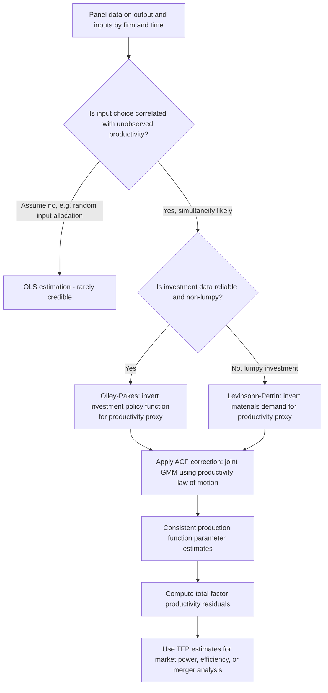

## Estimating Production and Cost Functions

### Overview and Purpose in Empirical IO

Estimation of production and cost functions provides the supply-side counterpart to demand estimation in empirical industrial organization, recovering the technological relationship between firm inputs and output (production function) or between output/input prices and total cost (cost function). These estimates underpin productivity analysis, market power measurement, merger cost-efficiency assessment, and regulatory rate-setting, and connect directly to natural monopoly analysis via the identification of scale economies and cost subadditivity.

Two broad estimation traditions exist: **production function estimation** (recovering technology parameters directly from output and input quantity data) and **cost function estimation** (recovering the dual cost relationship from expenditure and output/price data). Each faces distinct econometric challenges, chief among them the **simultaneity problem**.

### The Production Function and the Simultaneity Problem

A generic production function specifies output $Y_{it}$ for firm $i$ at time $t$ as a function of inputs (capital $K_{it}$, labor $L_{it}$, materials $M_{it}$) and unobserved productivity $\omega_{it}$:

$$y_{it} = \beta_k k_{it} + \beta_l l_{it} + \beta_m m_{it} + \omega_{it} + \eta_{it}$$

(in logarithms, following the standard Cobb-Douglas convention, where $\eta_{it}$ is a classical i.i.d. measurement/optimization error uncorrelated with input choices).

**The core econometric problem — simultaneity (Marschak and Andrews, 1944):** Firms observe their own productivity shock $\omega_{it}$ (or at least a component of it) *before* choosing input levels. A firm experiencing a positive productivity shock rationally responds by employing more inputs (particularly variable inputs like labor and materials). This induces a positive correlation between input choices and the unobserved productivity term $\omega_{it}$, causing **OLS estimation to yield upward-biased input coefficients** — the classic **simultaneity bias** in production function estimation.

**Key Points**

- Simultaneity bias is distinct from, but analogous in spirit to, the price endogeneity problem in demand estimation (BLP-style models): in both cases, an economic agent's choice variable (input quantities here, price there) is correlated with an unobserved shock that the econometrician cannot directly observe but that the agent partially observes and optimally responds to.
- The bias is generally more severe for variable inputs (labor, materials) that firms can adjust quickly in response to productivity shocks, and less severe for capital, which typically involves adjustment costs and is chosen with a lag relative to the realization of current productivity.

### Instrumental Variables Approaches

**Traditional fixes:** Early approaches used firm and time fixed effects (to absorb time-invariant firm-level productivity components) or lagged input levels as instruments (exploiting the assumption that lagged inputs are uncorrelated with the current productivity innovation). These approaches face well-documented limitations: fixed effects only address time-invariant unobserved heterogeneity, not the time-varying component of $\omega_{it}$ that firms respond to contemporaneously, and lagged-input instruments can be weak when input adjustment is persistent.

### Semi-Parametric Structural Approaches: Olley-Pakes and Levinsohn-Petrin

**The Olley-Pakes (1996) approach** addresses simultaneity by using a firm's **investment decision** as a proxy for unobserved productivity. The key insight: under standard assumptions (monotonicity of the optimal investment policy function in productivity, given capital), a firm's observed investment $i_{it}$ can be inverted to recover unobserved productivity:

$$\omega_{it} = h_t(i_{it}, k_{it})$$

Substituting this inverted function into the production function equation eliminates the simultaneity bias in a first-stage semi-parametric regression, with the labor coefficient identified directly in this stage (since labor is assumed to be a fully flexible input chosen after observing $\omega_{it}$, while capital's coefficient requires a second stage exploiting the law of motion for productivity). Olley-Pakes further addresses **selection bias** arising from non-random firm exit (less productive firms are more likely to exit the sample, which, if unaddressed, biases estimated capital coefficients) by explicitly modeling the exit decision as a function of a productivity survival threshold.

**The Levinsohn-Petrin (2003) approach** modifies this proxy variable strategy by using **intermediate input demand (materials)** rather than investment as the proxy for unobserved productivity, addressing a practical limitation of Olley-Pakes: investment data frequently contains substantial "lumpiness" (zero or near-zero investment in many firm-years), which creates problems for the required monotonicity/invertibility condition. Materials demand, by contrast, tends to be smoothly and continuously adjusted, making the required inversion more empirically robust in typical firm-level panel datasets.

**Key Points**

- Both approaches belong to the broader class of **control function / proxy variable methods**: rather than instrumenting for the endogenous input directly, they use an observed firm decision (investment or materials demand) that is itself a function of the unobserved productivity shock to construct a control that absorbs the endogeneity when included in the estimating equation.
- [Inference] The choice between Olley-Pakes and Levinsohn-Petrin in applied work is generally driven by data characteristics (presence/absence of investment lumpiness) rather than a general theoretical preference for one over the other, and many applied papers report both as robustness checks.

### The Ackerlund-Kim-Petrin (ACF) Critique

Ackerberg, Caves, and Frazer (2015, "ACF") identified a subtle but important identification problem in the original Olley-Pakes/Levinsohn-Petrin two-stage procedures: if labor demand is chosen as a function of the *same* information set used to determine the proxy variable (investment or materials), the labor coefficient may not be separately identified in the first stage as originally claimed, because labor demand and the proxy variable can be collinear functions of the same underlying state variables (capital and productivity).

**The ACF solution:** Rather than identifying the labor coefficient in a first-stage regression, ACF proposed identifying *all* coefficients (labor, capital, and any other flexible inputs) jointly in a **second-stage GMM procedure** that exploits the timing assumption regarding when different inputs are chosen relative to the realization of productivity shocks, using lagged input values as instruments for the assumed law of motion of productivity: $\omega_{it} = g(\omega_{it-1}) + \xi_{it}$, where $\xi_{it}$ is an innovation orthogonal to information available at $t-1$.

**Key Points**

- The ACF correction is now standard practice in applied production function estimation; papers using the original two-stage Olley-Pakes/Levinsohn-Petrin procedure without the ACF correction are generally understood in the current literature to be potentially subject to this identification critique.
- [Inference] The practical magnitude of the bias from using the uncorrected two-stage procedure versus the ACF correction varies across applications and datasets; the theoretical critique is well-established, but its empirical importance for a given dataset is not universal and should be assessed rather than assumed.

### Cost Function Estimation

An alternative to directly estimating the production function is to estimate its **dual cost function**, expressing minimized total cost as a function of output and input prices:

$$C(y, w) = \min_{k,l,m} \; w_k k + w_l l + w_m m \quad \text{s.t.} \quad f(k,l,m) \geq y$$

**Translog cost function:** The most widely used flexible functional form is the **translog** (transcendental logarithmic) specification, which provides a second-order approximation to an arbitrary cost function without imposing restrictive separability or homotheticity assumptions a priori:

$$\ln C = \alpha_0 + \alpha_y \ln y + \frac{1}{2}\beta_{yy}(\ln y)^2 + \sum_i \alpha_i \ln w_i + \frac{1}{2}\sum_i\sum_j \beta_{ij} \ln w_i \ln w_j + \sum_i \gamma_{iy} \ln w_i \ln y$$

subject to standard **linear homogeneity in input prices** restrictions (a cost function must be homogeneous of degree one in input prices, a property directly testable and imposable via parameter restrictions on the $\alpha_i$ and $\beta_{ij}$ terms).

**Estimation via Shephard's Lemma and cost share equations:** Applying Shephard's lemma to the translog cost function yields cost share equations for each input:

$$S_i = \frac{w_i x_i}{C} = \alpha_i + \sum_j \beta_{ij}\ln w_j + \gamma_{iy}\ln y$$

Because these share equations sum to one by construction (they are cost shares), one equation must be dropped to avoid singularity of the error covariance matrix, and the system is typically estimated jointly with the cost equation using **Seemingly Unrelated Regression (SUR)** or **Iterated SUR**, exploiting cross-equation parameter restrictions (the same $\beta_{ij}$ parameters appear in both the cost function and multiple share equations) to improve estimation efficiency.

**Key Points**

- The translog cost function's central econometric advantage is that estimating the derived cost-share equations alongside the cost function itself provides substantially more identifying variation (and degrees of freedom) than estimating the cost function equation alone, since the same underlying technology parameters appear in multiple equations.
- Economies of scale can be directly recovered from the estimated translog parameters via the **cost elasticity with respect to output**, $\partial \ln C/\partial \ln y = \alpha_y + \beta_{yy}\ln y + \sum_i \gamma_{iy}\ln w_i$; a value less than one at the relevant output level indicates increasing returns to scale (declining average cost), directly informing natural monopoly analysis.

### Application to Natural Monopoly and Scale Economy Testing

Cost function estimation is the standard empirical tool for testing natural monopoly hypotheses in regulated industries (electricity, telecommunications, water, rail). Given an estimated multi-product cost function $C(y_1, \ldots, y_n, w)$, the researcher can test for:

- **Economies of scale:** whether average cost declines as output of all products is scaled up proportionally.
- **Economies of scope:** whether $C(y_1, y_2) < C(y_1, 0) + C(0, y_2)$ — joint production is cheaper than separate production — using the estimated multi-product translog cost function's cross-output parameters.
- **Subadditivity:** the formal condition for natural monopoly (Baumol, Panzar, Willig, 1982), generally requiring evaluation of the estimated cost function across the entire relevant output range rather than a single point elasticity, since subadditivity is a global rather than local property.

**Key Points**

- [Inference] Estimated economies of scale/scope from translog cost functions are local approximations valid in the neighborhood of the data used for estimation; formal subadditivity testing (which requires comparing costs across combinations of output levels, some of which may lie outside the observed data range) requires additional structure or out-of-sample extrapolation assumptions, a recognized limitation of applying flexible functional form estimates to global natural monopoly determinations.

### Comparative Summary of Methods

| Method | Addresses Simultaneity | Addresses Selection | Key Identifying Assumption |
| --- | --- | --- | --- |
| OLS | No | No | None (biased baseline) |
| Fixed effects | Time-invariant only | No | Time-invariant unobserved heterogeneity |
| Olley-Pakes | Yes (via investment proxy) | Yes (exit modeling) | Monotonic investment policy function |
| Levinsohn-Petrin | Yes (via materials proxy) | Optional extension | Monotonic materials demand function |
| ACF correction | Yes (joint GMM, corrects OP/LP critique) | Compatible with OP-style exit modeling | Productivity law of motion, input timing assumptions |
| Translog cost function (SUR) | N/A (dual approach, different identification logic) | N/A | Cost minimization, functional form flexibility |

### Illustration: Structural Estimation Workflow for Production Functions

### Common Pitfalls and Misconceptions

- **Misconception:** Fixed-effects panel estimation fully resolves simultaneity bias in production functions. Fixed effects address only time-invariant unobserved firm heterogeneity; the time-varying productivity shocks that firms observe and respond to when choosing variable inputs remain a source of bias even after including firm and time fixed effects.
- **Misconception:** The original two-stage Olley-Pakes and Levinsohn-Petrin procedures are fully rigorous as originally specified. The Ackerberg-Caves-Frazer (2015) critique identified an identification problem in the first-stage labor coefficient recovery under standard timing assumptions, motivating the now-standard joint GMM correction.
- **Misconception:** A single point estimate of scale elasticity settles the natural monopoly question for an entire industry. Subadditivity (the formal natural monopoly criterion) is a global property across the relevant range of outputs, not a local elasticity evaluated at a single output level or the sample mean.
- **Misconception:** Cost function and production function estimation are simply two equivalent ways of estimating "the same thing" with no practical difference. While dual under standard regularity conditions (strict cost minimization, well-behaved technology), the cost function approach requires reliable input price data and the cost-minimization assumption, while the production function approach requires reliable output and physical input quantity data and addresses simultaneity directly — data availability often dictates which approach is empirically feasible in a given application.

**Related Topics**

- Total factor productivity (TFP) measurement and decomposition
- Economies of scale and scope in multi-product natural monopoly
- Subadditivity testing and the formal definition of natural monopoly (Baumol, Panzar, Willig)
- Structural versus reduced-form estimation approaches
- Conduct parameter estimation and testing for market power (New Empirical Industrial Organization)
- Regulatory rate-of-return analysis and cost-of-service ratemaking
- Translog functional forms and flexible functional form theory
- Firm entry, exit, and selection bias in panel production data