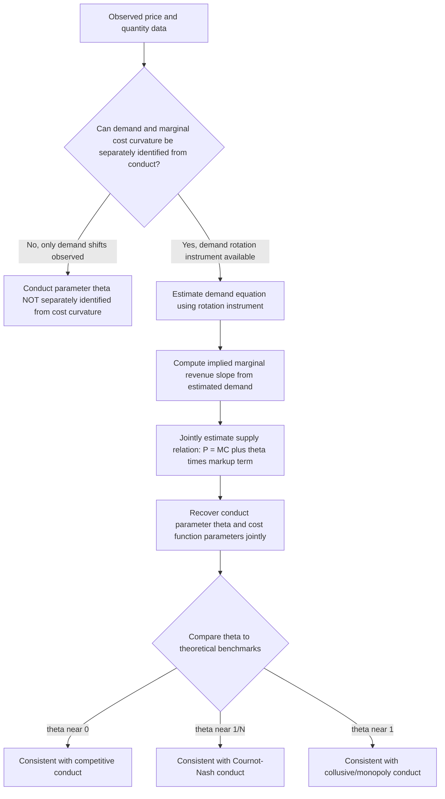

## Structural Estimation of Conduct and Market Power

### The New Empirical Industrial Organization (NEIO) Research Program

Structural estimation of conduct and market power belongs to the research tradition known as the **New Empirical Industrial Organization (NEIO)**, developed from the late 1970s onward (Bresnahan, 1982, 1989; Lau, 1982; Porter, 1983) as an alternative to the earlier structure-conduct-performance (SCP) paradigm. Where SCP relied on cross-industry regressions of performance measures (e.g., price-cost margins) on structural variables (e.g., concentration ratios), NEIO estimates a fully specified structural model of firm behavior within a single industry, recovering an explicit **conduct parameter** that measures the degree of market power exercised, without requiring direct observation of marginal costs.

The central econometric problem NEIO addresses is that market power (the wedge between price and marginal cost) is not directly observable, since marginal cost data are rarely available at the required level of disaggregation. NEIO methods infer market power indirectly by exploiting the theoretical restrictions that different assumed modes of competitive conduct impose on the relationship between prices, quantities, and demand elasticities.

### The Conduct Parameter Framework

Consider a homogeneous product industry with $N$ firms. The generalized "conduct parameter" (or "conjectural variation parameter") approach nests multiple competitive scenarios within a single reduced-form pricing equation. The industry-level markup equation is written as:

$$P - MC = -\theta \cdot P \cdot \frac{1}{\varepsilon}$$

or equivalently, in terms of the Lerner index:

$$\frac{P - MC}{P} = \frac{\theta}{\varepsilon}$$

Where:

- $P$ = market price
- $MC$ = marginal cost
- $\varepsilon$ = the market elasticity of demand (in absolute value)
- $\theta$ = the **conduct parameter**, capturing the degree of market power

**Interpretation of $\theta$ under different conduct regimes:**

- $\theta = 0$: perfect competition (price equals marginal cost)
- $\theta = 1/N$: Cournot-Nash oligopoly with $N$ symmetric firms
- $\theta = 1$: perfect (joint-profit-maximizing) collusion / monopoly
- $0 < \theta < 1/N$ or $1/N < \theta < 1$: intermediate degrees of competitiveness, sometimes interpreted (with caution) as partial collusion or varying degrees of competitive intensity

**Key Points**

- The conduct parameter $\theta$ is often labeled a "conjectural variation" parameter in the older literature, reflecting an interpretation in which $\theta$ represents each firm's conjecture about how rivals will respond to its own output change; this conjectural variation interpretation has been extensively criticized (Corts, 1999) as lacking a coherent dynamic game-theoretic microfoundation, since conjectures about rivals' responses are treated as static and fixed rather than derived from an explicit repeated or dynamic game.
- Despite this interpretive critique, the conduct parameter approach remains useful as a **statistical nesting device**: rather than requiring the researcher to test a discrete set of specific models (Bertrand vs. Cournot vs. collusion) against each other, $\theta$ can be estimated as a continuous parameter and its estimated value compared to the theoretical benchmarks associated with specific conduct modes.

### Identification: The Rotation of Demand

The fundamental identification challenge in conduct parameter estimation is that, from a single cross-section of price-quantity data under a single demand and cost environment, it is generally **not possible to separately identify the conduct parameter $\theta$ from the curvature of marginal cost** — multiple combinations of conduct and cost curvature can generate the same observed price-quantity relationship (a classic simultaneous equations identification problem).

**Bresnahan's (1982) rotation identification result:** Identification is achieved by exploiting variation in demand that **rotates** the demand curve around a fixed point (changing the *slope* of demand while holding the *quantity-intercept relationship* fixed at the observed equilibrium point) rather than variation that merely *shifts* demand in a parallel fashion. Intuitively: under different assumed conduct regimes (competitive vs. monopoly/collusive), the same demand *shift* produces observationally similar price-quantity responses along a given supply relation, but different conduct regimes produce distinguishable responses to **rotations** in demand elasticity, because the perceived marginal revenue curve (which depends on $\theta$ and demand curvature) responds differently to elasticity changes under each conduct hypothesis.

**Practical implementation:** Rotation instruments are typically constructed as interaction terms between demand shifters and other variables that plausibly affect only the *slope* (not merely the level) of demand — for instance, an interaction between an income variable and a demand-shifting variable, under the assumption that this interaction changes demand elasticity at the observed price without directly shifting the observed quantity demanded at that price.

**Key Points**

- The Lau (1982) identification theorem formalizes the necessary and sufficient condition for conduct parameter identification: the demand function must not be representable in a "separable" form with respect to the rotation-inducing variable, a condition that must be verified for any specific empirical demand specification used.
- [Inference] In practice, constructing genuinely valid rotation instruments — variables that plausibly alter demand elasticity without directly shifting marginal cost or demand level — is often challenging, and the credibility of conduct parameter estimates in applied work depends heavily on the plausibility of the specific rotation instrument used, a point of ongoing methodological scrutiny in the literature.

### Estimation Procedure

The conduct parameter model is typically estimated as a system of two simultaneous equations:

**Demand equation:**

$$Q_t = D(P_t, Y_t, Z_t^d; \beta) + \epsilon_t^d$$

**Supply relation (generalized markup equation):**

$$P_t = MC(Q_t, W_t; \gamma) + \theta \cdot \frac{\partial P_t}{\partial Q_t}\bigg|_{demand} \cdot Q_t$$

Where $Y_t$ is income or another demand shifter, $Z_t^d$ includes the rotation instrument, $W_t$ represents cost shifters (input prices), and $\beta, \gamma, \theta$ are jointly estimated, typically via **nonlinear two-stage least squares, three-stage least squares (3SLS), or GMM**, since both equations contain endogenous variables ($P_t$ and $Q_t$ appear in both, and the interaction term involving the estimated demand slope is itself a generated/nonlinear regressor).

**Key Points**

- Because the supply relation contains $\partial P_t/\partial Q_t$ evaluated from the estimated demand curve, the two equations must be estimated **jointly** (not sequentially) to obtain consistent standard errors and to properly account for the fact that the demand-side parameters directly enter the supply-side estimating equation.
- Cost shifters $W_t$ (e.g., input prices) serve as instruments for quantity in the demand equation (since input costs shift the supply relation without directly shifting demand), while the rotation instrument in $Z_t^d$ serves to identify $\theta$ separately from marginal cost curvature in the supply relation.

### Classic Applications

**Porter (1983) — Railroad cartel behavior:** Estimated a conduct parameter model for a 19th-century U.S. railroad cartel (Joint Executive Committee) using a regime-switching approach, distinguishing periods of cartel cooperation from periods of price wars, providing an early empirical demonstration that estimated conduct could shift discretely between cooperative and competitive regimes over time — directly relevant to theories of collusion sustainability (e.g., Green and Porter, 1984, on collusion with imperfect price monitoring).

**Bresnahan (1987) — U.S. automobile industry:** Applied conduct parameter estimation to test between alternative oligopoly models (Cournot, Bertrand-Nash with differentiated products, collusive pricing) in the U.S. auto industry, illustrating how the framework can be used to statistically discriminate among competing theoretical models of firm conduct rather than simply estimating a generic "market power" parameter.

**Genesove and Mullin (1998) — Sugar refining:** Applied conduct parameter methods using a rich historical dataset with directly observed marginal cost data (an unusually favorable data environment), allowing a direct test of the conduct parameter methodology's accuracy against the "true" cost-based markup — providing an important empirical validation exercise for the broader conduct-parameter research program.

**Key Points**

- [Inference] The Genesove and Mullin validation exercise is frequently cited as an important, though not universally generalizable, piece of evidence that conduct parameter methods can produce estimates reasonably close to true market power when identification conditions are well satisfied; the extent to which this validation generalizes to settings with weaker instruments or less favorable data remains a live empirical question rather than a settled conclusion.

### Critiques and Limitations

**Corts (1999) critique:** Argued that the conjectural variations interpretation of $\theta$ is internally inconsistent as a model of dynamic strategic interaction, and that even where the conduct parameter approach correctly identifies *some* measure of aggregate market power, it may not correctly identify the specific underlying game-theoretic conduct mode (e.g., static Cournot vs. dynamic collusion sustained by trigger strategies) generating that market power level — different underlying games can generate observationally similar reduced-form conduct parameters.

**The relationship to structural discrete-choice demand models:** Modern applications increasingly embed conduct parameter estimation within a full BLP-style differentiated products demand system rather than a homogeneous product framework, since differentiated products create firm-specific and product-specific markups (via the multiproduct Bertrand-Nash first-order conditions) rather than a single industry-wide markup, providing richer identification of firm-level (rather than merely industry-level) market power and enabling direct comparison of estimated versus assumed conduct via **testing procedures comparing recovered marginal costs across alternative conduct assumptions** for internal consistency (e.g., checking whether marginal costs recovered under an assumed Bertrand-Nash conduct model are economically sensible — non-negative, correlated with expected cost drivers — relative to costs recovered under alternative conduct assumptions).

**Key Points**

- [Inference] The evolution from homogeneous-product conduct parameter models toward differentiated-products structural conduct testing (embedding conduct assumptions within a full BLP-style demand and supply system) reflects the broader methodological convergence of the NEIO and BLP research traditions, since both ultimately rely on the same underlying logic of inverting observed pricing behavior through an assumed first-order condition to recover unobserved cost and conduct parameters.

### Illustration: Conduct Parameter Identification Logic

### Worked Numerical Illustration

Suppose estimation yields a market elasticity of demand $\varepsilon = 2.0$ and an estimated conduct parameter $\hat\theta = 0.25$ in a homogeneous product industry. The implied Lerner index (price-cost margin as a fraction of price) is:

$$\frac{P - MC}{P} = \frac{\theta}{\varepsilon} = \frac{0.25}{2.0} = 0.125$$

If the industry has $N = 4$ symmetric firms, the Cournot-Nash benchmark would predict $\theta = 1/N = 0.25$ — in this example, the estimated conduct parameter matches the Cournot-Nash prediction closely, supporting an interpretation of the industry as behaving consistently with (though not definitively proven to be) standard Cournot oligopoly conduct, as opposed to either fully competitive ($\theta$ near 0) or fully collusive ($\theta$ near 1) behavior.

### Common Pitfalls and Misconceptions

- **Misconception:** The conduct parameter $\theta$ can always be estimated from any dataset containing price and quantity variation. Identification specifically requires demand *rotation* variation (per Bresnahan, 1982, and Lau, 1982), not merely demand *shift* variation; datasets lacking a valid rotation instrument cannot separately identify conduct from cost curvature, regardless of sample size.
- **Misconception:** A conduct parameter estimate definitively identifies the specific game-theoretic mechanism generating market power. Per the Corts (1999) critique, an estimated $\theta$ reflects an aggregate measure of the price-cost wedge consistent with *some* conduct, but does not uniquely pin down the specific underlying dynamic game (e.g., a particular collusive equilibrium supported by specific trigger strategies) responsible for that wedge.
- **Misconception:** Homogeneous product conduct parameter models and differentiated product BLP-style conduct testing are mutually exclusive alternative methods. They represent different points on a continuum of increasing model richness; differentiated-product structural models can be seen as a generalization allowing firm- and product-specific markups rather than a single industry-wide conduct parameter.
- **Misconception:** A high estimated conduct parameter automatically implies illegal collusion in an antitrust sense. Structural conduct estimates measure the *economic degree of market power* consistent with observed pricing; they do not, by themselves, establish the legal elements of an antitrust violation (e.g., evidence of an actual agreement), which typically require additional evidence beyond a structural conduct estimate.

**Related Topics**

- Structural versus reduced-form estimation approaches
- The Berry-Levinsohn-Pakes random coefficients approach
- Cournot and Bertrand oligopoly models
- Collusion sustainability and the Green-Porter (1984) trigger strategy model
- Estimating production and cost functions
- Merger simulation methodology in antitrust economics
- Structure-Conduct-Performance (SCP) paradigm and its critiques
- Market definition and the SSNIP test in antitrust economics