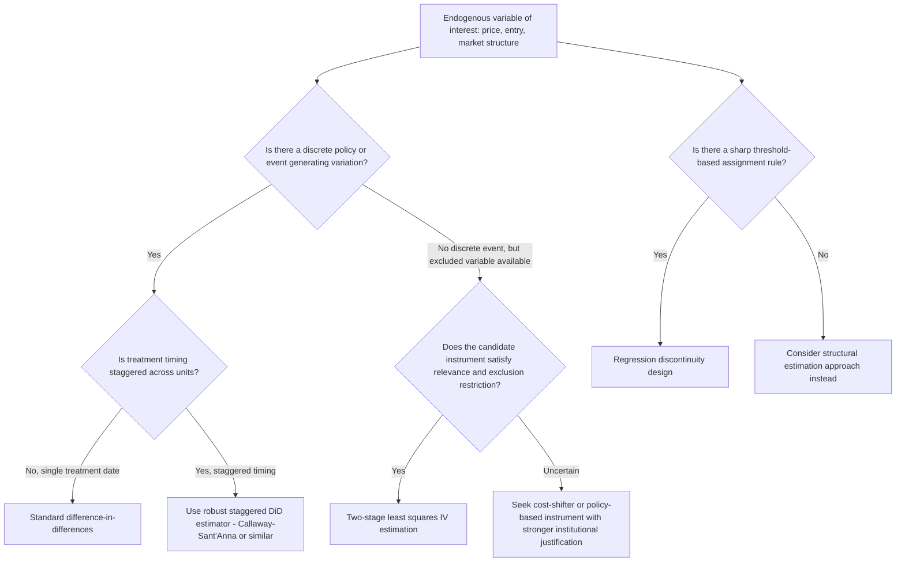

## Natural Experiments and Instrumental Variables in Industry Studies

### The Identification Problem in Industry Studies

Empirical industrial organization frequently confronts settings where the variables of theoretical interest — prices, market structure, firm conduct, regulatory status — are simultaneously determined with the outcomes being studied, generating endogeneity that biases naive correlational estimates. Natural experiments and instrumental variables (IV) methods provide research designs that isolate plausibly exogenous variation, allowing causal inference about the effects of prices, entry, mergers, and regulation on market outcomes without requiring the researcher to fully specify a structural model of firm and consumer behavior.

**Key Points**

- The identification problems addressed by natural experiments in industry studies are conceptually the same endogeneity problems addressed by instruments in demand estimation (BLP) and conduct parameter estimation (Bresnahan-Lau rotation instruments) — the distinguishing feature of "natural experiment" designs is that the source of exogenous variation is typically a discrete, identifiable real-world event (a policy change, a regulatory shock, a natural disaster) rather than a continuous instrument embedded within a fully specified structural system.

### Natural Experiments: Definition and Logic

A **natural experiment** exploits an exogenous, non-researcher-controlled event that generates variation in a treatment of interest (a policy change, market structure shift, or price change) as if it had been randomly assigned, allowing comparison of outcomes between "treated" and "untreated" (or differentially treated) units. The credibility of a natural experiment design rests on the plausibility that the triggering event is unrelated to the unobserved determinants of the outcome variable other than through its effect on the treatment of interest.

**Common natural experiment sources in industry studies:**

- **Regulatory or policy changes:** deregulation events (e.g., airline, telecom, trucking deregulation), tax changes, minimum wage changes, price control removals.
- **Geographic or jurisdictional discontinuities:** state or national border discontinuities in regulation, licensing requirements, or tax rates, allowing comparison of otherwise similar markets subject to different rules.
- **Idiosyncratic supply or demand shocks:** weather events, natural disasters, input price shocks (e.g., exchange rate movements affecting imported input costs), plant closures due to non-economic reasons (e.g., fires, accidents).
- **Merger and entry events:** a merger or new entrant's arrival in some geographic markets but not others, exploited via difference-in-differences comparing affected and unaffected markets.

### Difference-in-Differences (DiD) in Industry Applications

The workhorse natural experiment design in industry studies is **difference-in-differences**, comparing the change in outcomes over time between a treatment group (affected by the policy/event) and a control group (unaffected), under the identifying **parallel trends assumption**: absent treatment, the treatment and control groups would have followed similar outcome trajectories.

**Canonical estimating equation:**

$$Y_{it} = \alpha_i + \lambda_t + \delta \cdot (Treat_i \times Post_t) + \epsilon_{it}$$

Where $\alpha_i$ are unit fixed effects, $\lambda_t$ are time fixed effects, $Treat_i$ indicates treatment group membership, $Post_t$ indicates the post-treatment period, and $\delta$ is the causal effect of interest.

**Application example — merger price effects:** If a merger occurs between firms operating in some geographic markets but the merging firms do not operate (or operate only one of the merged brands) in other comparable markets, a DiD design comparing price changes in "merger-affected" markets versus "unaffected" markets can estimate the merger's causal price effect — provided the parallel trends assumption holds and market selection into the "affected" category is not itself driven by anticipated post-merger price trends.

**Key Points**

- The parallel trends assumption is fundamentally **untestable in the post-treatment period** (since the counterfactual "what would have happened without treatment" is never observed), but is commonly supported via **pre-trend analysis**: verifying that treatment and control groups exhibited similar outcome trajectories in the *pre-treatment* period, under the (separate, also untestable) assumption that similar pre-trends imply similar counterfactual post-trends.
- Recent econometric literature (Goodman-Bacon, 2021; Callaway and Sant'Anna, 2021; de Chaisemartin and D'Haultfœuille, 2020) has substantially revised standard DiD practice for settings with **staggered treatment timing** (different units treated at different dates), demonstrating that the standard two-way fixed effects DiD estimator can be severely biased in such settings due to problematic comparisons between already-treated and later-treated units acting as implicit "controls" — a methodological development directly relevant to industry studies where deregulation, mergers, or policy rollouts frequently occur at staggered dates across different markets or states.

### Instrumental Variables: Core Logic and Requirements

An instrumental variable $Z$ for an endogenous regressor $X$ (e.g., price) in an outcome equation must satisfy two conditions:

1. **Relevance:** $Z$ is correlated with $X$ (testable via the first-stage regression and F-statistic).
2. **Exclusion restriction:** $Z$ affects the outcome $Y$ *only* through its effect on $X$, and is uncorrelated with the error term in the outcome equation (fundamentally untestable directly, though partially assessable via overidentification tests when multiple instruments are available).

**The two-stage least squares (2SLS) estimator:**

*First stage:* $X_{it} = \pi_0 + \pi_1 Z_{it} + v_{it}$

*Second stage:* $Y_{it} = \beta_0 + \beta_1 \hat X_{it} + u_{it}$

Where $\hat X_{it}$ is the fitted value from the first stage, and $\beta_1$ is the causal effect of $X$ on $Y$, identified using only the variation in $X$ attributable to the instrument $Z$.

### Common Instrument Classes in Industry Studies

**Hausman instruments:** Prices of the same product in geographically separated markets, exploiting common cost shocks across markets while assuming market-specific demand shocks are uncorrelated across the chosen markets — widely used in demand estimation (see BLP) but methodologically scrutinized because common national pricing or marketing strategies can violate the required independence of demand shocks across markets.

**Cost-shifter instruments:** Input price variation (e.g., raw material costs, wages, exchange rates for imported inputs, weather affecting agricultural input supply) that plausibly shifts marginal cost and hence price without directly shifting demand — generally regarded as the most theoretically clean instrument class where reliable cost data exist, since the exclusion restriction (cost shocks don't directly affect demand) is often more economically plausible than for many alternative instrument classes.

**Regulatory/policy-based instruments:** Variation in regulatory status, tax rates, or licensing requirements across jurisdictions or time, used both directly as natural experiment treatments and as instruments for endogenous market structure variables (e.g., using variation in entry regulation stringency as an instrument for the number of firms in a market, following the logic of Bresnahan and Reiss, 1991, discussed further under entry models).

**Judicial/administrative decision instruments:** Exploiting quasi-random assignment of cases to judges or administrative panels with varying propensities toward certain rulings, used in some regulatory and antitrust contexts to instrument for the probability or stringency of an intervention.

**Key Points**

- The exclusion restriction is inherently a matter of economic argumentation and institutional knowledge rather than a statistical test; overidentification tests (e.g., the Hansen J-test, Sargan test) can detect *some* forms of exclusion restriction violation when multiple, potentially heterogeneous instruments are available, but cannot validate the exclusion restriction for a single, just-identified instrument, nor can they detect violations common to all instruments in an overidentified system.
- Weak instruments (low first-stage F-statistic, conventionally below the rule-of-thumb threshold of 10, per Staiger and Stock, 1997) produce IV estimates with poor finite-sample properties (biased toward the OLS estimate, and with unreliable standard inference), making first-stage strength diagnostics a standard and essential component of applied IV work in industry studies.

### Regression Discontinuity Designs in Industry Contexts

**Regression discontinuity (RD)** designs exploit a discontinuous assignment rule — units just above versus just below a threshold receive different treatment — comparing outcomes in the immediate neighborhood of the threshold, under the identifying assumption that all other determinants of the outcome vary smoothly through the threshold.

**Applications in industry studies:**

- **Regulatory thresholds:** firm size or employee-count thresholds triggering different regulatory obligations (e.g., minimum wage exemptions, environmental regulation stringency, disclosure requirements), comparing firms just above and just below the threshold.
- **Merger review thresholds:** transaction value or market share thresholds triggering mandatory antitrust review, used to study the effects of regulatory scrutiny on merger characteristics or outcomes.
- **Licensing and entry thresholds:** population or geographic thresholds determining eligibility for licenses (e.g., taxi medallions, liquor licenses, pharmacy licensing), used to study the effects of entry restriction on prices and quality.

**Key Points**

- RD designs require careful validation that the threshold assignment rule is not itself manipulated by the units being studied (a "manipulation" or "sorting" test, typically implemented via the McCrary (2008) density test, checking for a discontinuity in the density of the running variable at the threshold itself, which would suggest strategic sorting around the cutoff).
- RD estimates are inherently **local** (identifying the treatment effect only in the neighborhood of the threshold, the "local average treatment effect" at the discontinuity), which can limit generalizability to firms or markets far from the threshold — an important caveat when using RD estimates to inform broader industry-wide policy conclusions.

### Illustrative Application: Estimating Entry Effects on Prices

Suppose a researcher wants to estimate the causal effect of a new competitor's entry on incumbent prices in local retail markets, but entry itself is endogenous (firms strategically choose to enter markets with favorable, unobserved demand conditions that would independently affect prices).

**Natural experiment approach:** If entry is driven partly by an exogenous event — for example, a change in a chain retailer's national expansion strategy unrelated to local market conditions, or a zoning law change permitting new store formats in specific areas — a DiD design comparing price changes in markets that received entry versus otherwise-similar markets that did not (matched on pre-period observables) can estimate the causal price effect of entry, provided the entry-triggering event is plausibly uncorrelated with local unobserved demand shocks.

**Key Points**

- This design directly parallels a widely used empirical strategy in the entry-and-market-structure literature (related to, but methodologically distinct from, the structural entry threshold models of Bresnahan and Reiss, discussed separately) — using exogenous variation in entry timing/location as a natural experiment rather than fully modeling the firm's discrete entry decision as an equilibrium outcome.

### Comparative Summary of Design Types

| Design | Source of Identifying Variation | Key Assumption | Typical IO Application |
| --- | --- | --- | --- |
| Difference-in-differences | Policy/event timing across treated vs. control units | Parallel trends | Deregulation, merger price effects |
| Instrumental variables (2SLS) | Excluded instrument correlated with endogenous regressor | Relevance + exclusion restriction | Price endogeneity in demand estimation |
| Regression discontinuity | Threshold-based assignment rule | No manipulation of running variable; smoothness of other determinants | Regulatory thresholds, licensing effects |
| Event study | Time path of outcomes around a discrete event | No confounding events at the same time | Merger announcements, regulatory shocks |

### Illustration: Selecting a Natural Experiment / IV Design

### Common Pitfalls and Misconceptions

- **Misconception:** A "natural experiment" requires no assumptions because the variation is not researcher-manipulated. Natural experiments still rely on the identifying assumption that the triggering event is uncorrelated with unobserved determinants of the outcome (parallel trends for DiD, smoothness/no-manipulation for RD, exclusion restriction for IV) — these are substantive economic assumptions requiring justification, not automatic guarantees from the absence of researcher control.
- **Misconception:** Standard two-way fixed effects DiD estimation is always valid with panel data and multiple time periods. With staggered treatment timing, standard TWFE DiD can produce severely biased estimates (potentially even the wrong sign) due to problematic already-treated-as-control comparisons, per the Goodman-Bacon (2021) decomposition; robust staggered-adoption estimators should be used in such settings.
- **Misconception:** A strong first-stage F-statistic validates instrument exogeneity. First-stage strength (relevance) is necessary but entirely separate from the exclusion restriction (validity); a highly relevant instrument can still be invalid if it affects the outcome through channels other than the endogenous regressor.
- **Misconception:** RD estimates generalize straightforwardly to units far from the threshold. RD identifies a local average treatment effect at the discontinuity; extrapolating this estimate to units with substantially different characteristics than those near the threshold requires additional, often untested, assumptions about effect homogeneity.

**Related Topics**

- Structural versus reduced-form estimation approaches
- The Berry-Levinsohn-Pakes random coefficients approach
- Structural estimation of conduct and market power
- Merger simulation methodology in antitrust economics
- Bresnahan-Reiss entry threshold models
- Staggered difference-in-differences estimators (Callaway-Sant'Anna, Goodman-Bacon)
- Deregulation case studies in telecoms, airlines, and utilities
- Regression discontinuity design validity testing (McCrary density test)