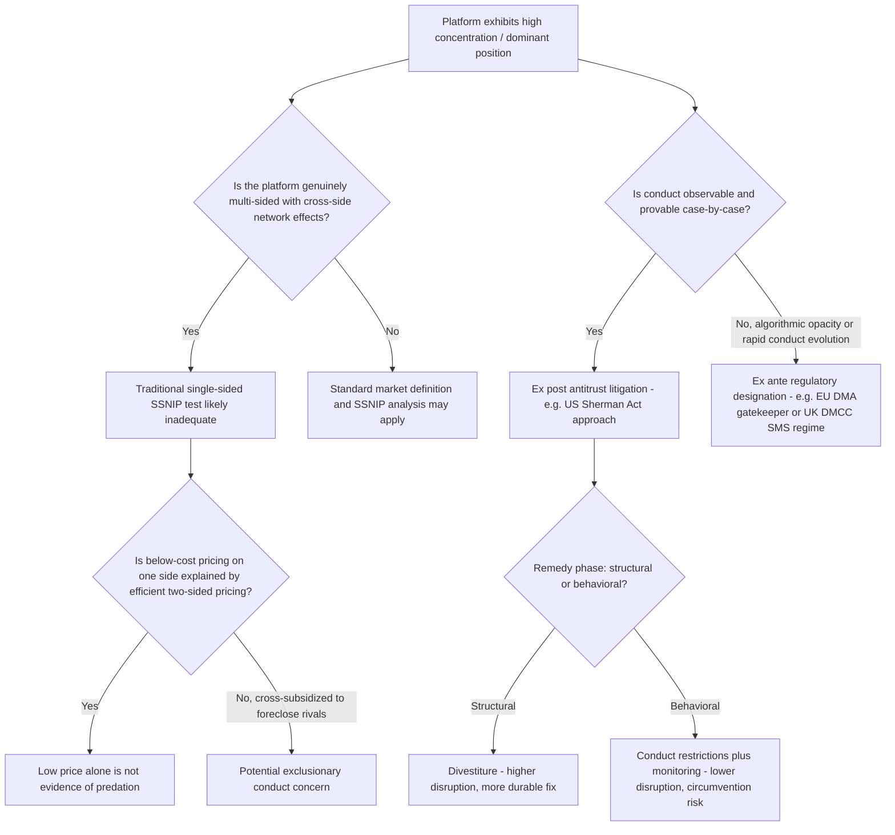

## Market Power Debates Around Dominant Digital Platforms

### Why Digital Platforms Challenge Traditional Market Power Analysis

Traditional antitrust market power analysis was developed around single-sided markets with observable prices, where market share, price-cost margins, and the SSNIP (Small but Significant Non-transitory Increase in Price) test provide tractable measures of dominance. Dominant digital platforms — search engines, social networks, app stores, e-commerce marketplaces, operating systems — challenge each pillar of this framework because they are typically **multi-sided platforms** with zero or near-zero prices on at least one side, monetized through advertising, commissions, or data extraction on the other side(s).

**Key Points**

- Data, characterized by high fixed and near-zero marginal costs, scalability, and spillovers, has emerged as a core competitive asset, enabling precision matching and rapid product iteration, and in some cases new levers of market power. [Springer](https://link.springer.com/chapter/10.1007/978-981-95-5037-1_2)
- Traditional antitrust anchored in price-centric market definition, static indicators of dominance, and ex-post casework faces material limits when applied to zero-price services, cross-market leverage, and black-box algorithms. [Springer](https://link.springer.com/chapter/10.1007/978-981-95-5037-1_2)
- Conventional antitrust law treats market share as a key indicator of market power, yet the rise of data and algorithms as critical competitive assets means factors such as network effects and user stickiness increasingly challenge traditional criteria for identifying dominance. [Springer](https://link.springer.com/chapter/10.1007/978-981-95-5037-1_2)

### Two-Sided Markets and the Market Definition Problem

The theory of two-sided markets (Rochet and Tirole, 2003; Armstrong, 2006) shows that platforms internalize cross-group externalities by setting different, sometimes below-cost, prices on each side to maximize participation and the resulting network effects. This creates a fundamental market-definition challenge: a price below marginal cost on one side (e.g., free search, free social media access) is not, by itself, evidence of predatory pricing or absence of market power, since it may be the efficient two-sided pricing structure balancing both sides of the platform.

**Key Points**

- Antitrust markets are normally defined to include reasonable substitutes, but parties on the two sides of a platform purchase complementary products from the platform rather than substitutes for one another, complicating the use of circumstantial evidence to establish a unitary two-sided platform market and market power. [Yale Law Journal](https://yalelawjournal.org/forum/dominant-digital-platforms)
- [Inference] This structural feature means courts and agencies must choose between analyzing each side of the platform as a separate relevant market (risking mischaracterization of genuinely joint, interdependent pricing decisions) or as a single two-sided market (requiring more complex economic modeling of cross-side network effects that traditional single-sided SSNIP-style tests do not accommodate).

### Sources of Market Power: Network Effects, Data, and Switching Costs

**Direct and indirect network effects:** A platform's value to a given user increases with the number of other users on the same side (direct network effects, e.g., social networks) or on the opposite side (indirect network effects, e.g., more app developers make a mobile operating system more valuable to consumers, and vice versa). These effects can generate self-reinforcing dominance and "tipping" toward a single provider, a dynamic central to concerns about durable market power in digital markets.

**Data-driven economies of scale and scope:** Accumulated user data can improve product quality (better search results, more relevant ad targeting, better recommendation algorithms), creating a feedback loop where incumbency itself generates a durable quality advantage difficult for entrants to replicate without a comparable user base.

**Switching costs and multi-homing frictions:** Even where multi-homing (using multiple competing platforms simultaneously) is technically possible, behavioral and structural frictions — data portability limitations, default settings, ecosystem lock-in — can suppress effective switching, sustaining dominance despite nominal consumer choice.

**Key Points**

- One prominent analysis of Google's conduct concluded that Google appears to have abused the apparent monopoly power of its search engine as a springboard to obtain unprecedented control and ownership at multiple points in the digital advertising ecosystem, illustrating how dominance in one segment can be leveraged into adjacent markets. [Yale School of Management](https://som.yale.edu/centers/thurman-arnold-project-at-yale/digital-platforms-and-antitrust)
- [Inference] The interaction of network effects, data advantages, and switching costs is frequently characterized in the literature as generating a "winner-take-most" or "winner-take-all" market structure in digital platform markets, though the degree to which this dynamic is a permanent structural feature versus a transient state subject to disruption remains empirically and theoretically contested, as illustrated by the case evidence discussed below.

### Case Study: United States v. Google (Search)

Judge Amit Mehta's 2024 liability ruling found Google liable for illegal monopoly maintenance in general search and search text advertising, primarily through exclusive default-placement agreements with device manufacturers and browser developers.

**The remedies phase** illustrates the core debate between structural and behavioral interventions:

- The court rejected the plaintiffs' proposals for an immediate divestiture of Google's Chrome web browser and a contingent divestiture of the Android operating system, but ruled that Google will be subject to several behavioral remedies, including a prohibition of exclusive contracts relating to the distribution of Google Search, Chrome, and certain AI products. [Congress.gov](https://www.congress.gov/crs_external_products/LSB/HTML/LSB11362.html)
- The final remedies judgment, entered December 5, 2025, did not order Google to sell Chrome, break up Android, or stop all payments to Apple and other distribution partners; instead, it limits certain exclusivity and tying arrangements and requires Google to create data-sharing and search-syndication programs for qualified competitors. [Itechguides](https://www.itechguides.com/us-v-google-search-antitrust-trial-august-2026-updates/)
- As of August 2026, contractual restrictions took effect in February 2026, but the data and syndication systems were still being built, and Google's appeal along with the government's cross-appeal remain pending in the D.C. Circuit. [Itechguides](https://www.itechguides.com/us-v-google-search-antitrust-trial-august-2026-updates/)
- Market reaction characterized the remedies as broadly favorable for Google, with one analyst noting the ruling removed lingering risks associated with the worst-case outcome for the company, even as the pending DOJ cross-appeal could still change this calculus. [Tech Insider](https://tech-insider.org/google-antitrust-appeal-doj-search-monopoly-2026/)

**Key Points**

- [Inference] The court's preference for behavioral over structural remedies in this case reflects a broader, ongoing debate in digital-market antitrust enforcement: structural remedies (breakups, divestitures) more directly address the durability of network-effect-driven dominance but carry greater implementation risk and disruption costs, while behavioral remedies (data sharing, non-exclusivity mandates) are less disruptive but require ongoing monitoring and are more vulnerable to circumvention.

### Case Study: Google Ad Tech Litigation

A separate, parallel line of litigation targeted Google's dominance across the ad-tech stack (publisher ad servers, ad exchanges, and advertiser tools).

- In April 2025, the U.S. District Court for the Eastern District of Virginia issued a mixed decision, ruling that neither Google's advertiser tools nor its DoubleClick and AdMeld acquisitions were anticompetitive, but that Google's publisher ad server tools unfairly excluded rivals. [sec](https://www.sec.gov/Archives/edgar/data/0001652044/000165204426000048/goog-20260331.htm)
- In the subsequent remedies phase, Judge Leonie Brinkema rejected the DOJ's proposed divestiture of Google's ad exchange (AdX), rejected open-sourcing the final auction logic of its publisher ad server, and rejected a contingent divestiture of the remaining publisher tools, instead ordering both parties to jointly propose a final judgment. [CCIA](https://ccianet.org/news/2026/09/ccias-response-to-court-ruling-on-google-ad-tech-remedies-in-doj-antitrust-case)
- A related suit in the Southern District of New York applied broad preclusive effect and adopted the DOJ's findings that Google monopolized worldwide markets for publisher ad servers and ad exchanges and unlawfully tied its products together. [jdsupra](https://www.jdsupra.com/topics/google/antitrust-violations/advertising)

**Key Points**

- This case exemplifies the "cross-market leverage" concern in digital-market power debates: dominance established in one vertically adjacent segment (publisher ad serving) allegedly foreclosed competition in adjacent segments (ad exchanges), a pattern of self-reinforcing, multi-point control that traditional single-market SSNIP analysis is not well-suited to capture in a single test.

### Case Study: FTC v. Meta and the Limits of Retrospective Merger Challenges

The FTC's long-running challenge to Meta's historical acquisitions of Instagram and WhatsApp tested whether antitrust enforcement can retrospectively unwind mergers cleared years earlier once market conditions have shifted.

- The November 2025 trial ruling found that Meta does not hold monopoly power in personal social networking once TikTok and YouTube are counted as competitors, and the FTC filed a notice of appeal to the D.C. Circuit in January 2026. [Goodwin](https://www.goodwinlaw.com/en/insights/publications/2026/07/insights-technology-antc-antitrust-competition-technology-1h-2026)
- The court found that Meta had come to compete closely with TikTok and YouTube as users sought less "connected" social content from friends and more "unconnected" content algorithmically recommended by the platform operator, and — relying on the FTC Act's limitation to prospective rather than remedial relief — held that the FTC needed to show Meta held monopoly power at the time of trial, which it failed to do. [Lexology](https://www.lexology.com/library/detail.aspx?g=3df63c41-c141-4ce0-951f-6c9093806679)
- Although the legal basis of this holding is limited to the FTC Act, the reasoning may extend to other plaintiffs seeking prospective relief, and the factual records developed in both the Google and Meta cases illustrate how rapidly serious threats and disruptors to even the most stable-seeming market positions can develop. [Lexology](https://www.lexology.com/library/detail.aspx?g=3df63c41-c141-4ce0-951f-6c9093806679)

**Key Points**

- [Inference] The Meta outcome is frequently read as evidence for the "dynamic competition" perspective in the market power debate: that digital markets, despite appearing durably concentrated at any given moment, are subject to rapid disruption from adjacent or unanticipated competitors (here, short-form video platforms), which can undermine market definitions and monopoly-power findings based on data from years prior to trial — a live tension between static concentration measures and the pace of technological change in digital markets.
- This case also illustrates the market-definition debate directly: whether "personal social networking" should be defined narrowly (excluding algorithmically-recommended-content platforms like TikTok/YouTube) or broadly (including them as substitutes for user attention), with the market definition chosen being outcome-determinative for the monopoly power finding.

### Comparative Regulatory Approaches: Ex Post Antitrust versus Ex Ante Regulation

A central structural debate concerns whether traditional case-by-case antitrust enforcement (ex post, requiring proof of specific anticompetitive conduct and effects) is adequate for digital platform markets, or whether ex ante regulatory designation regimes are needed.

**European Union — Digital Markets Act (DMA):** Designates "gatekeeper" platforms meeting quantitative thresholds (user numbers, market capitalization, entrenched position) and imposes a fixed list of ex ante conduct obligations and prohibitions (e.g., anti-self-preferencing, interoperability requirements, restrictions on data combination) without requiring case-by-case proof of anticompetitive effect for each obligation.

- The European Commission published the first statutory review of the DMA and a sweeping draft overhaul of its merger guidelines — the first in two decades — and took the rare step of imposing interim measures against Meta in its first DMA abuse proceeding. [Goodwin](https://www.goodwinlaw.com/en/insights/publications/2026/07/insights-technology-antc-antitrust-competition-technology-1h-2026)

**United Kingdom — Digital Markets, Competition and Consumers Act (DMCC):** Adopts a firm-specific "Strategic Market Status" (SMS) designation model rather than the EU's threshold-based gatekeeper list, allowing tailored conduct requirements per designated firm.

- Under the DMCC, the UK's Competition and Markets Authority may designate large tech platforms as having Strategic Market Status and impose tailored conduct requirements; in October 2025, the CMA confirmed Google's SMS designation in general search and search advertising services, and shortly afterward designated Apple and Google with SMS for their mobile platforms covering operating systems, app distribution, browsers, and browser engines. [Lexology](https://www.lexology.com/library/detail.aspx?g=3df63c41-c141-4ce0-951f-6c9093806679)
- Following designation, the CMA is considering the nature and extent of conduct requirements to impose on Apple and Google, and is expected to announce these requirements and initiate a third SMS investigation in early 2026. [Lexology](https://www.lexology.com/library/detail.aspx?g=3df63c41-c141-4ce0-951f-6c9093806679)

**United States:** Has relied primarily on traditional ex post Sherman Act monopolization litigation (the Google and Meta cases above) rather than ex ante designation legislation, though proposals for such legislation have been considered.

**Key Points**

- A comparative assessment of EU and US enforcement approaches concludes that behavioral remedies and monetary penalties are often insufficient where platform architecture embeds conflicts of interest or external foreclosure, and that price-centric models risk enabling dominant companies to consolidate their advantages, especially during the AI transition — advocating a recalibrated toolkit including a presumption of structural remedies where business models create systemic conflicts of interest. [Stanford Law School](https://law.stanford.edu/publications/no-146-market-power-in-digital-platforms-and-the-limits-of-antitrust-law-in-the-age-of-ai-a-comparative-study-of-eu-and-us-enforcement/)
- [Inference] The EU/UK ex ante model trades off the deliberative rigor (and corresponding delay) of case-by-case antitrust litigation for speed and predictability, at the cost of requiring the underlying legislative or regulatory apparatus to correctly anticipate which categories of conduct warrant blanket prohibition — an institutional design trade-off directly analogous to the ex ante regulation versus ex post competition-law enforcement debate long discussed in the context of natural monopoly network industries.

### Novel Theories of Harm Specific to Digital Platforms

**Self-preferencing:** A platform that also competes in a downstream market (e.g., a search engine that also offers its own comparison-shopping or maps service) may favor its own downstream offering in rankings, defaults, or interoperability — a digital-era analogue of the vertical foreclosure and margin-squeeze concerns raised in traditional network-access regulation, but harder to detect given algorithmic opacity. This concern was central to the European Commission's 2025 decision fining Google €2.95 billion for self-preferencing in ad technology. [jdsupra](https://www.jdsupra.com/topics/google/antitrust-violations/advertising)

**Algorithmic collusion:** Concerns that pricing algorithms, even without explicit human agreement, may learn to sustain supra-competitive prices through repeated interaction — algorithmically facilitated coordination is catalogued alongside exclusivity arrangements, self-preferencing, data blocking, personalized pricing, tying, and strategic exploitation of network effects as salient unfair practices observed in platform markets, behaviors that are frequently opaque and adaptive, complicating detection, proof, and timely remedies. [Springer](https://link.springer.com/chapter/10.1007/978-981-95-5037-1_2)

**Data-based exclusionary conduct:** Denial of data access, or exploitation of accumulated data advantages, as a distinct exclusionary mechanism not well captured by price-based foreclosure tests.

**Key Points**

- [Inference] These novel theories of harm generally share the common feature that the underlying conduct or mechanism (algorithmic ranking decisions, pricing algorithm behavior, data flows) is not directly observable to outside parties or regulators in the way that prices and output quantities are in traditional markets, creating an evidentiary and institutional challenge — sometimes termed the "black box" problem — that is distinct from, and in some respects more severe than, the identification challenges discussed in traditional empirical IO methods.

### Illustration: Digital Platform Market Power Analysis Framework

### Common Pitfalls and Misconceptions

- **Misconception:** A finding of "zero price" on one side of a platform automatically signals the absence of market power or competitive harm. Two-sided market theory shows that below-cost or zero pricing on one side can be an efficient response to cross-side network externalities rather than evidence of predation or dominance — the appropriate test requires analyzing both sides jointly.
- **Misconception:** High market share alone establishes durable market power in digital markets. The FTC v. Meta outcome illustrates that adjacent, rapidly emerging competitors (e.g., short-form video platforms competing for user attention) can undermine both market definition and monopoly-power findings, even where a firm's share within a narrowly defined market appears high.
- **Misconception:** Ex ante regulatory designation regimes (EU DMA, UK DMCC) and ex post antitrust litigation are mutually exclusive policy choices for a given jurisdiction. The EU and UK both maintain traditional competition law enforcement alongside their ex ante digital regulatory regimes; the two operate as complementary rather than substitute tools.
- **Misconception:** Structural remedies (breakups) are generally preferred by courts in major digital platform cases. Both the U.S. Google search and ad-tech remedies decisions rejected the most aggressive structural relief (Chrome/Android divestiture, AdX divestiture) in favor of behavioral remedies, reflecting judicial caution about the disruption costs and implementation risk of structural intervention.

**Related Topics**

- Two-sided markets and platform pricing theory (Rochet-Tirole, Armstrong)
- Market definition and the SSNIP test in antitrust economics
- The Berry-Levinsohn-Pakes random coefficients approach (adapted to platform/attention markets)
- Structural estimation of conduct and market power
- Algorithmic collusion and tacit coordination
- Essential facilities doctrine and mandated data/interoperability access
- Vertical foreclosure, self-preferencing, and margin squeeze in digital ecosystems
- Merger simulation methodology in antitrust economics (retrospective merger analysis)