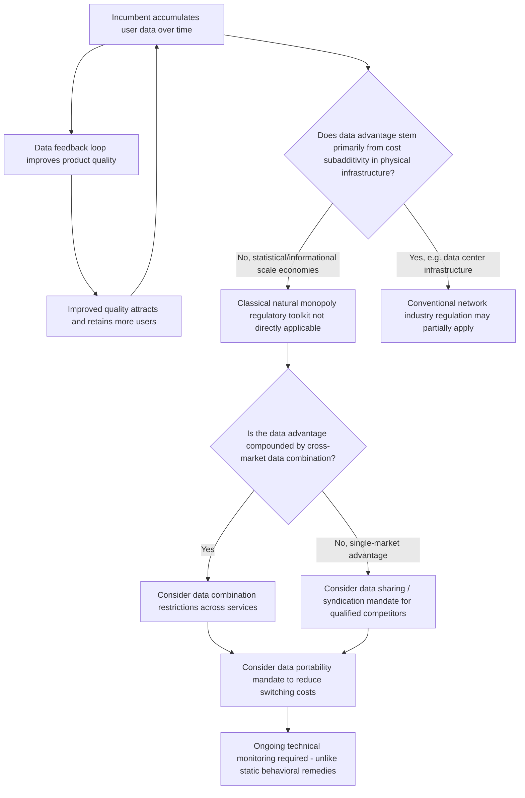

## Data as a Competitive Asset and Barrier to Entry

### Data as a Distinctive Economic Input

Data functions as an economic asset with several properties that distinguish it sharply from traditional productive inputs (capital, labor, physical materials) analyzed in classical industrial organization. Recognizing these properties is a prerequisite for understanding why data-driven market power raises distinct competition policy questions relative to conventional scale-economy-based natural monopoly or oligopoly analysis.

**Key economic properties of data:**

- **Non-rivalrous in use:** Unlike a physical input, one firm's use of a given dataset does not diminish another firm's ability to use a copy of the same data (though the *original collection* of data from a given source, such as a specific user interaction, may be rivalrous in a limited sense).
- **Near-zero marginal cost of storage and replication:** Once collected, additional units of data can typically be stored, processed, and reused at very low incremental cost, in sharp contrast to traditional capital-intensive natural monopoly inputs (network infrastructure, generation capacity).
- **Increasing returns from aggregation:** The analytical or predictive value of a dataset frequently increases non-linearly with volume, variety, and velocity (the "3 Vs" framework common in the data science literature), because larger and richer datasets improve statistical inference, machine learning model accuracy, and personalization precision — this generates a form of economies of scale in data specifically, distinct from and additive to conventional production-side scale economies.
- **Externalities and spillovers:** Data generated through one product or service (e.g., search queries) can improve the quality of a different, related product or service (e.g., advertising targeting, voice assistants, mapping), generating scope economies across a firm's product portfolio that are difficult for narrower or newer entrants to replicate.

**Key Points**

- Data is characterized by high fixed and near-zero marginal costs, scalability, and spillovers, having emerged as a core competitive asset enabling precision matching, rapid product iteration, and, in some cases, new levers of market power.
- Due to inherent features such as economies of scale and network effects, data-rich digital platforms are prone to establishing dominant market positions, often reshaping competitive landscapes into oligopolistic structures and triggering winner-take-all dynamics.

### The Data Feedback Loop and Self-Reinforcing Dominance

A central mechanism in data-based competitive advantage is the **data feedback loop** (sometimes termed the "data-network effect" or "learning-by-doing" loop in digital markets): more users generate more data, more data improves product quality (better search relevance, more accurate recommendations, better-trained models), improved quality attracts more users, and the cycle repeats. This is structurally distinct from a classical direct network effect (where user value depends directly on other users' presence, as in a social network or telephone system) because the mechanism operates through an intermediate step — data-driven quality improvement — rather than direct user-to-user interaction value.

**Key Points**

- [Inference] The data feedback loop is frequently cited as a primary explanation for the durability of incumbent advantages in search, recommendation, and machine-learning-intensive digital markets, since a new entrant lacking an established user base cannot generate comparable training data volume even if its underlying algorithm or technology is equally or more sophisticated — this is a data-specific barrier to entry distinct from conventional capital-cost or licensing barriers.
- This mechanism connects directly to the broader "market power in digital platforms" debate: a dominant search engine's alleged use of accumulated data and market position as a springboard to obtain control at multiple points in an adjacent market (e.g., digital advertising) illustrates how data advantages in one segment can be leveraged into cross-market dominance, a pattern that traditional single-market analysis is not well-suited to capture.

### Data as a Barrier to Entry: Mechanisms

**Direct data-scale barriers:** New entrants require sufficient data volume to train competitive machine learning models or algorithms; if data quality/quantity requirements scale with market complexity (e.g., natural language processing quality improving with corpus size), a new entrant faces a chicken-and-egg problem symmetric to, but analytically distinct from, the classical network-effect entry barrier.

**Data access asymmetries and exclusive data arrangements:** Incumbents may secure exclusive access to data sources (exclusive partnership agreements, default-setting arrangements that route data flows preferentially) that raise entrants' costs of acquiring comparable data, a digital-era analogue of the essential facilities and exclusive dealing concerns raised in traditional vertical foreclosure analysis.

**Data portability and interoperability frictions:** Even where a user in principle could switch to a rival service, the practical difficulty (or outright impossibility, absent regulatory mandate) of transferring one's accumulated data, history, and personalization profile to a competing platform functions as a switching cost that entrenches incumbent data advantages — a friction distinct from, but functionally similar to, classical technology-based switching costs in industries such as enterprise software.

**Combining data across markets:** A firm operating across multiple product lines may combine datasets from each to build a richer composite user profile than any single-market competitor could construct, extending data-based advantages horizontally across otherwise distinct markets — a central concern in several regulatory interventions restricting cross-service data combination.

**Key Points**

- Salient unfair practices catalogued in the platform-markets literature include exclusivity arrangements, self-preferencing, data blocking, personalized (discriminatory) pricing, tying/bundling, strategic exploitation of network effects, and algorithmically facilitated coordination — several of which operate specifically through control over data access or combination rather than through conventional price-based exclusionary conduct.
- These behaviors are frequently opaque and adaptive, complicating detection, proof, and timely remedies relative to price-based exclusionary conduct analyzed under traditional antitrust frameworks.

### Distinguishing Data-Driven Scale Economies from Classical Natural Monopoly

**Key Points**

- Classical natural monopoly (as analyzed in regulated network industries) arises from cost subadditivity driven by large sunk physical infrastructure investment (transmission lines, pipelines, track) — duplication is technically feasible but economically wasteful.
- Data-driven scale advantages arise from a different mechanism: the marginal cost of *storing and processing* additional data is near zero, but the *value* generated from data exhibits increasing returns to scale in a statistical/informational sense (larger training sets improve predictive accuracy at a diminishing but persistently positive rate over very large ranges), and the *collection* of comparable data by a new entrant faces a genuine chicken-and-egg cold-start problem absent an existing user base.
- [Inference] This distinction matters for regulatory design: because data-driven advantages do not stem from cost subadditivity in physical infrastructure, the classical natural monopoly regulatory toolkit (rate-of-return regulation, price caps on network access) is not a direct analogue for addressing data-driven dominance; instead, ex ante regulatory tools have increasingly focused on mandated data-sharing, interoperability, and data-portability obligations, treating accumulated data itself as an analogue to an essential facility requiring mandated access rather than as a natural-monopoly-priced network asset.

### Data Access Remedies as a Regulatory Response

Reflecting the recognition of data as a distinct barrier to entry, several major regulatory interventions have specifically targeted data access and combination rather than conventional price or structural remedies:

- Regulatory frameworks in leading digital-market jurisdictions have imposed obligations requiring dominant platforms to create data-sharing or data-syndication programs enabling qualified competitors to access comparable data resources, directly targeting the cold-start data barrier facing new entrants in search and related markets.
- Restrictions on combining user data collected from one service with data collected from another service operated by the same firm have been imposed as a means of limiting cross-market data-driven advantage accumulation, addressing the scope-economy dimension of data as a competitive asset.
- Data portability mandates (requiring firms to enable users to export their data to competing services in a usable format) directly target the switching-cost dimension of data-based lock-in.

**Key Points**

- [Inference] A recalibrated competition-policy toolkit for the AI era has been argued to require mandating verifiable, real-time technical access where data sharing is ordered, on the reasoning that data-based advantages compound quickly and behavioral remedies focused only on pricing or contractual exclusivity are insufficient where the underlying architecture embeds a structural data advantage — reflecting an emerging view that data access remedies require more active, ongoing technical enforcement than traditional behavioral antitrust remedies (which typically only prohibit specified contractual conduct).

### Data as a Barrier to Entry in the Generative AI Context

The rise of large-scale machine learning models has intensified data-as-barrier-to-entry concerns because model quality in many AI applications scales with training data volume, variety, and proprietary access to high-quality data sources (e.g., licensed content, proprietary user interaction logs), potentially creating a new and compounding source of data-driven concentration layered on top of existing digital-platform data advantages.

**Key Points**

- Analysis of market power in the AI transition has argued that price-centric models risk enabling dominant companies to consolidate advantages during this transition, and has specifically recommended emphasizing remedies that target core infrastructure and the data feedback loop as part of a recalibrated competition-policy toolkit.
- [Speculation] Because training-data quality and volume requirements for competitive large language models and related AI systems are still evolving rapidly, the precise long-run relationship between accumulated proprietary data advantages and sustainable AI-market dominance remains an open empirical question rather than an established finding, distinguishing this from the more extensively documented data-feedback-loop dynamics in mature markets like search and social networking.

### Worked Illustration: The Cold-Start Problem

Consider a new entrant attempting to compete with an incumbent search engine that has accumulated ten years of query and click-through data across a large user base. Suppose search relevance quality $Q$ is modeled as an increasing, concave function of accumulated training data volume $D$:

$$Q = Q_{\max} \left(1 - e^{-\lambda D}\right)$$

Where $\lambda$ governs the rate at which additional data improves quality. At low data volumes (the entrant's initial condition), the marginal quality improvement from each additional unit of data, $\frac{\partial Q}{\partial D} = \lambda Q_{\max} e^{-\lambda D}$, is close to its maximum, meaning early data accumulation matters disproportionately — but the entrant cannot generate this early data without first attracting users, and cannot attract users without first offering competitive quality, illustrating the self-reinforcing chicken-and-egg entry barrier structurally analogous to, but mechanistically distinct from, classical network-effect-driven entry barriers.

### Illustration: Data Feedback Loop and Barrier to Entry Structure

<svg xmlns="http://www.w3.org/2000/svg" viewBox="0 0 700 380" font-family="Helvetica, Arial, sans-serif">
<text x="350" y="26" text-anchor="middle" font-size="16" font-weight="bold" fill="#1a1a1a">The Data Feedback Loop (svg_diagram)</text>
<circle cx="350" cy="190" r="150" fill="none" stroke="#d1d5db" stroke-width="1" stroke-dasharray="4,4" />

<rect x="280" y="50" width="140" height="55" rx="8" fill="#dbeafe" stroke="#1e40af" stroke-width="2" />
<text x="350" y="73" text-anchor="middle" font-size="12" font-weight="bold" fill="#1e3a8a">More Users /</text>
<text x="350" y="90" text-anchor="middle" font-size="12" font-weight="bold" fill="#1e3a8a">Interactions</text>

<rect x="480" y="160" width="140" height="55" rx="8" fill="#dcfce7" stroke="#166534" stroke-width="2" />
<text x="550" y="183" text-anchor="middle" font-size="12" font-weight="bold" fill="#14532d">More Training</text>
<text x="550" y="200" text-anchor="middle" font-size="12" font-weight="bold" fill="#14532d">Data Volume</text>

<rect x="280" y="270" width="140" height="55" rx="8" fill="#fef3c7" stroke="#92400e" stroke-width="2" />
<text x="350" y="293" text-anchor="middle" font-size="12" font-weight="bold" fill="#78350f">Improved Product</text>
<text x="350" y="310" text-anchor="middle" font-size="12" font-weight="bold" fill="#78350f">Quality / Relevance</text>

<rect x="80" y="160" width="140" height="55" rx="8" fill="#fce7f3" stroke="#9d174d" stroke-width="2" />
<text x="150" y="183" text-anchor="middle" font-size="12" font-weight="bold" fill="#831843">Higher User</text>
<text x="150" y="200" text-anchor="middle" font-size="12" font-weight="bold" fill="#831843">Attraction/Retention</text>

<path d="M 420 90 Q 480 120 500 160" fill="none" stroke="#1a1a1a" stroke-width="2" marker-end="url(#arrow2)" />
<path d="M 545 215 Q 500 260 420 285" fill="none" stroke="#1a1a1a" stroke-width="2" marker-end="url(#arrow2)" />
<path d="M 280 290 Q 200 260 165 215" fill="none" stroke="#1a1a1a" stroke-width="2" marker-end="url(#arrow2)" />
<path d="M 155 160 Q 200 120 280 90" fill="none" stroke="#1a1a1a" stroke-width="2" marker-end="url(#arrow2)" />

<text x="350" y="345" text-anchor="middle" font-size="11" fill="`#4b5563`">New entrant lacks initial user base -&gt; cannot enter this loop -&gt; cold-start barrier to entry</text>

</svg>

### Illustration: Data as Barrier to Entry — Analytical and Regulatory Pathway

### Common Pitfalls and Misconceptions

- **Misconception:** Data-based competitive advantage is economically equivalent to classical scale economies from physical capital. Data-driven advantage stems from near-zero marginal replication/storage cost combined with increasing statistical returns to data volume and a cold-start collection barrier, a distinct mechanism from cost subadditivity in physical network infrastructure — the two require different regulatory toolkits even though both can generate durable dominance.
- **Misconception:** Because data is non-rivalrous, data-driven market power cannot really constitute a meaningful "barrier to entry" in the traditional economic sense. Non-rivalry in use does not eliminate the practical entry barrier created by the *initial collection* problem — an entrant cannot simply copy an incumbent's proprietary dataset, and generating a comparable dataset independently requires attracting a comparable user base first, reproducing the same chicker-and-egg dynamic associated with classical network effects.
- **Misconception:** Data portability mandates alone fully resolve data-based lock-in. Portability addresses the switching-cost dimension but does not directly address the underlying data-scale advantage from accumulated data used to train models or algorithms, nor does it resolve exclusive data access arrangements or cross-market data combination advantages — comprehensive remedies typically require combining portability, access, and combination-restriction measures.
- **Misconception:** Data-driven market power concerns are fully resolved once a regulator imposes a one-time behavioral prohibition (e.g., banning a specific data-sharing contract). Because data advantages compound continuously through the ongoing feedback loop, effective remedies generally require ongoing, verifiable technical access mechanisms rather than a single static conduct prohibition, a distinguishing feature relative to more conventional one-time-conduct antitrust remedies.

**Related Topics**

- Market power debates around dominant digital platforms
- Two-sided markets and platform pricing theory
- Essential facilities doctrine and mandated access remedies
- Access pricing in network industries (contrast with data access remedies)
- Algorithmic collusion and tacit coordination
- Network effects and tipping in digital markets
- Data portability and interoperability regulation (EU DMA, UK DMCC)
- Economies of scale and scope in multi-product cost functions