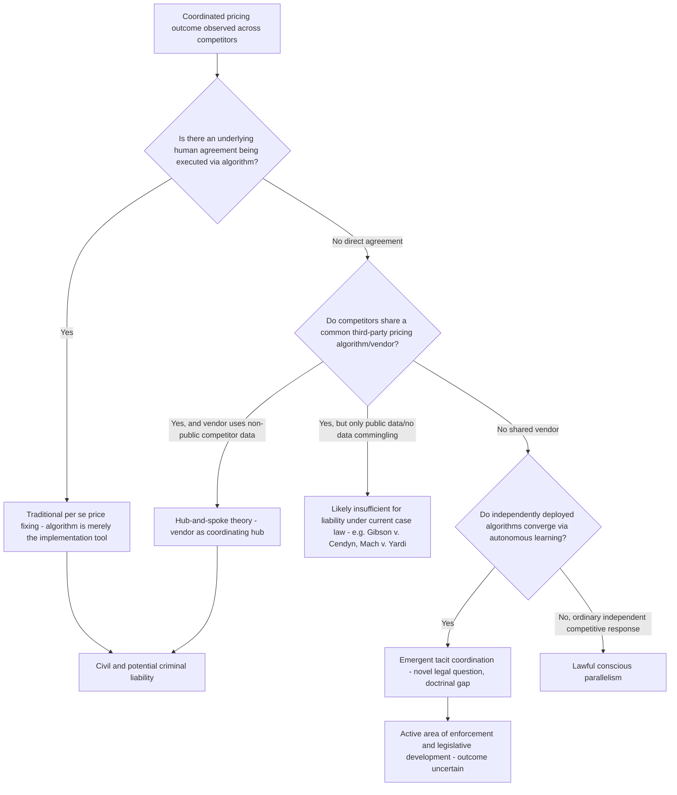

## Algorithmic Pricing and the Risk of Tacit Collusion

### Defining the Problem: Explicit Agreement versus Algorithmic Coordination

Traditional antitrust law under the Sherman Act (Section 1) and analogous statutes elsewhere requires proof of an **agreement** — a meeting of minds among competitors — to establish unlawful price fixing. Algorithmic pricing complicates this framework because pricing decisions increasingly result from automated systems that may generate coordinated-looking outcomes without any traditional human communication or explicit agreement, raising the question of whether and how existing legal categories (explicit collusion, tacit collusion, conscious parallelism) map onto algorithm-mediated market outcomes.

**Key Points**

- Algorithms may facilitate anticompetitive coordination through at least three distinct mechanisms: facilitating traditional explicit pricing agreements (the algorithm as a mere tool executing an underlying human agreement); enabling **hub-and-spoke collusion**, in which a common third-party algorithm provider serves as the "hub" connecting competing "spokes," leading to alignment of pricing or information flows across nominally independent competitors; and fostering **tacit coordination through autonomous learning**, where separate algorithms deployed by competitors independently learn to align on pricing without any direct communication between the competing firms themselves.
- The core legal principle now being articulated by enforcers is that a firm cannot use an algorithm to do indirectly what direct communication would render illegal — that is, when competitors use shared pricing systems to replace independent decision-making with coordinated outputs, the use of software as the coordination mechanism does not shield the underlying conduct from liability.

### Theoretical Mechanisms of Algorithmic Tacit Collusion

**Repeated-game reinforcement learning:** Economic theory and computational experiments have raised concern that reinforcement-learning pricing algorithms, each independently trained to maximize their own firm's profit through repeated market interaction, can converge on supra-competitive pricing equilibria resembling a collusive outcome — analogous to a trigger-strategy equilibrium in a repeated game (see Green and Porter, 1984, for the classical human-agent analogue) — without any explicit communication, coded collusive instruction, or shared intent among the firms deploying the algorithms.

**Shared algorithm / hub-and-spoke facilitation:** Where multiple competitors license pricing software from the same third-party vendor, and that vendor aggregates non-public competitor data (historical prices, occupancy, booking data) to generate pricing recommendations, the vendor can function as a coordinating hub even absent direct horizontal communication between the competing licensees, structurally resembling classical hub-and-spoke conspiracy theories previously applied to a common distributor or supplier facilitating horizontal coordination among retailers.

**Price transparency and monitoring acceleration:** Algorithmic pricing systems dramatically increase the speed and precision with which firms can observe rivals' prices and adjust their own, potentially shortening the "detection lag" that sustains competitive (rather than collusive) outcomes in classical oligopoly theory — where slower human-mediated price adjustment historically limited the sustainability of tacit coordination, near-instantaneous algorithmic repricing can, in principle, make tacit coordination easier to sustain.

**Key Points**

- [Inference] A recurring theoretical distinction in this literature is between algorithms that facilitate a *traditional* agreement (clearly unlawful, since an underlying human agreement exists and the algorithm merely executes it) and algorithms that generate *emergent* tacit coordination through independent learning with no underlying agreement at all — the second category poses the more novel legal and economic question, since classical antitrust doctrine in most jurisdictions does not treat pure tacit collusion (conscious parallelism without an agreement) as independently unlawful, creating a potential gap between economically harmful algorithmic coordination and existing legal categories.
- The legislative history behind recent state-level reforms makes clear that these algorithmic collusion provisions are intended to apply whether the underlying data used by the algorithm is public or private, reflecting the understanding that even publicly available data can enable collusion when processed similarly across competitors.

### U.S. Enforcement Developments: Civil Actions and the RealPage Case

**RealPage litigation:** A prominent recent enforcement action involved RealPage, a software vendor supplying algorithmic pricing recommendations to apartment landlords using aggregated, non-public competitor data (rents, occupancy, lease terms), together with Greystar, a large property manager and RealPage customer.

- The federal government reached proposed resolutions of its claims against RealPage and Greystar in 2025, with the settlements requiring RealPage to use only historical data at least 12 months old, limiting its reporting to statewide aggregations, and imposing a court-appointed monitor.
- Acting Deputy Assistant Attorney General Daniel Glad anchored a May 2026 speech in the November 2025 RealPage consent judgment, using it as the DOJ's clearest articulation to date of how the Antitrust Division will approach criminal enforcement against algorithmic and AI-enabled pricing conduct.

**Judicial treatment of hub-and-spoke theories — Gibson v. Cendyn Group:** In the first appellate decision to address algorithmic pricing software, a unanimous Ninth Circuit panel held that competing Las Vegas hotels did not violate antitrust laws merely by licensing pricing software from the same third-party vendor, after the plaintiffs dropped their original horizontal-conspiracy theory on appeal and challenged only each hotel's individual licensing arrangement with the vendor.

**Mach v. Yardi Systems:** A California state court granted summary judgment to defendants in a separate apartment-pricing software case, concluding that the software's functionality did not breach state antitrust and unfair competition laws because it did not commingle non-public competitor data to generate suggested prices — a result frequently contrasted with the RealPage matter, where non-public data commingling was central to the government's theory.

**Key Points**

- Algorithmic pricing decisions through 2025 broadly favored defendants at the pleading stage, but the law continues to evolve rapidly, with a number of private suits still in the discovery stage as of the 2026 review period.
- [Inference] The distinguishing factual element across these cases appears to be whether the algorithm specifically commingles or utilizes *non-public* competitor data to generate coordinated pricing recommendations, rather than the mere fact of shared software licensing among competitors — mere common vendor usage without non-public data-sharing has thus far not been sufficient to establish liability under either the horizontal-conspiracy or hub-and-spoke theories tested in these early cases.

### Criminal Enforcement Signals

A significant recent development is the DOJ's explicit statement that algorithmic pricing coordination can trigger **criminal**, not merely civil, antitrust liability where it substitutes for what would otherwise be an unlawful direct agreement.

- In May 2026 remarks titled "Old Crime, New Code," delivered at the Antitrust West Coast Conference, Glad stated that a firm cannot do with the knowing use of an algorithm what it could not do with a simple agreement achieving the same outcome, and that criminal charges remain on the table where competitors use shared pricing systems to replace independent decision-making with coordinated outputs.
- The DOJ's Procurement Collusion Strike Force, an existing investigative infrastructure originally built for traditional bid-rigging enforcement, has trained more than 47,000 federal agents and compliance professionals and secured more than 85 convictions, and is being positioned to extend its data-analytics capabilities to algorithmic and AI-driven bidding platforms as procurement increasingly migrates to e-platforms.
- The DOJ's whistleblower program has begun paying rewards in adjacent algorithmic/bid-rigging contexts, including a first-ever one-million-dollar whistleblower reward announced in January 2026 for information leading to bid-rigging charges in online auctions — a mechanism expected to be particularly relevant in sectors like energy trading, where personnel routinely have access to algorithmic pricing strategies and competitor data.

**Key Points**

- [Inference] The shift toward explicit criminal enforcement rhetoric represents a notable escalation relative to the primarily civil and regulatory posture that characterized algorithmic pricing enforcement in the immediately preceding years, though as of mid-2026 no completed criminal prosecution squarely targeting autonomous algorithmic tacit coordination (as opposed to algorithm-facilitated traditional agreements) had been reported, meaning the practical boundaries of this expanded criminal theory remain to be tested in litigation.

### Legislative Responses: Federal and State

**Federal legislative proposals:** The Preventing Algorithmic Collusion Act, introduced in the U.S. Senate in January 2024, proposed prohibiting the use of pricing algorithms that facilitate collusion through the use of non-public competitor data, creating an antitrust law enforcement audit tool, increasing transparency requirements, and enforcing violations through the Sherman Act and Federal Trade Commission Act — though this proposal specifically targets algorithms trained on non-public competitor data, a scope some commentators view as comparatively limited relative to the full range of algorithmic coordination mechanisms discussed above.

**California's Cartwright Act amendment:** Effective January 1, 2026, California law prohibits using a shared pricing algorithm as part of an agreement to limit competition, and separately creates liability for "coercing" another business to adhere to an algorithm's recommended prices, though the statute does not define "coercion," leaving courts to determine its scope. The amendment applies regardless of whether the underlying data used is public or private, and also clarifies pleading requirements for Cartwright Act claims involving algorithmic pricing.

**Key Points**

- [Inference] Some observers view the California amendment as substantially restating conduct the underlying Cartwright Act already prohibited (an agreement to fix prices remains unlawful regardless of the mechanism used to implement it), while the practical significance of the amendment is expected to depend heavily on how courts interpret the new, undefined "coercion" standard for algorithmic pricing arrangements — creating genuine legal uncertainty regarding the amendment's ultimate scope.
- The combination of active federal criminal enforcement signaling, pending federal legislative proposals, and new state-level statutes (with more state and local laws continuing to emerge) creates a currently fragmented and rapidly evolving compliance landscape, with judicial guidance in this area expected to lag behind enforcement activity for the foreseeable future.

### International Developments

- In Europe, algorithmic pricing investigations remain comparatively rare and, as of the most recent reporting, have not yet resulted in final infringement decisions, though a senior European Commission official confirmed in July 2025 that the Commission was examining multiple algorithmic pricing antitrust matters.
- National competition authorities have also begun independent inquiries: the president of Poland's antitrust authority (UOKiK) confirmed in September 2025 that the authority was investigating potential collusion facilitated by algorithmic pricing tools in the banking and pharmaceutical sectors.

**Key Points**

- [Inference] The comparative infancy of European enforcement relative to the more developed U.S. civil litigation record (RealPage, Gibson v. Cendyn, Mach v. Yardi) suggests that European competition law doctrine specific to algorithmic tacit coordination is likely to develop with a lag relative to U.S. case law, though EU Article 101 TFEU's broader "concerted practice" concept (which has historically captured some forms of coordination falling short of an explicit formal agreement) may provide a different doctrinal starting point than the stricter U.S. Sherman Act agreement requirement.

### Illustration: Algorithmic Coordination Mechanism Taxonomy

### Illustration: Repeated-Game Logic of Algorithmic Tacit Coordination

<svg xmlns="http://www.w3.org/2000/svg" viewBox="0 0 700 320" font-family="Helvetica, Arial, sans-serif">
<text x="350" y="26" text-anchor="middle" font-size="16" font-weight="bold" fill="#1a1a1a">Algorithmic Repricing and Coordination Speed (svg_diagram)</text>
<line x1="80" y1="270" x2="640" y2="270" stroke="#1a1a1a" stroke-width="1.5" />
<line x1="80" y1="270" x2="80" y2="50" stroke="#1a1a1a" stroke-width="1.5" />
<text x="360" y="300" text-anchor="middle" font-size="12" fill="#1a1a1a">Time (repricing cycles)</text>
<text x="35" y="160" text-anchor="middle" font-size="12" fill="#1a1a1a" transform="rotate(-90 35 160)">Price Level</text>

<polyline points="80,220 160,215 240,205 320,195 400,190 480,188 560,187 640,186" fill="none" stroke="#1e40af" stroke-width="2.5" />
<text x="560" y="170" font-size="11" fill="#1e40af" font-weight="bold">Human-mediated pricing</text>
<text x="560" y="184" font-size="10" fill="#1e40af">(slow convergence, long detection lag)</text>

<polyline points="80,220 130,190 180,150 230,120 280,100 330,90 400,85 480,83 560,82 640,82" fill="none" stroke="#b91c1c" stroke-width="2.5" />
<text x="360" y="70" font-size="11" fill="#b91c1c" font-weight="bold">Algorithmic repricing</text>
<text x="360" y="55" font-size="10" fill="#b91c1c">(fast convergence, short detection lag)</text>

<line x1="80" y1="230" x2="640" y2="230" stroke="#166534" stroke-width="2" stroke-dasharray="6,3" />
<text x="560" y="245" font-size="11" fill="#166534">Competitive price benchmark</text>
</svg>

### Common Pitfalls and Misconceptions

- **Misconception:** Any algorithmic price alignment among competitors is automatically unlawful. Current U.S. case law (Gibson v. Cendyn, Mach v. Yardi) indicates that mere use of a shared algorithm vendor, without commingling of non-public competitor data or an underlying agreement, has not been sufficient to establish liability at the pleading or summary judgment stage — the legal analysis remains fact-specific and turns heavily on data-sharing mechanics.
- **Misconception:** Pure tacit collusion generated by independently deployed, non-communicating algorithms is clearly and settledly illegal under existing antitrust frameworks. This remains a genuinely unresolved doctrinal question in most jurisdictions, since classical antitrust law generally does not treat conscious parallelism (absent an agreement) as independently unlawful, and no definitive precedent squarely resolving purely emergent, agreement-free algorithmic tacit coordination had been established as of mid-2026.
- **Misconception:** Using only publicly available data insulates an algorithmic pricing tool from antitrust risk. Recent legislative history (e.g., California's amended Cartwright Act) explicitly rejects this distinction, reflecting the understanding that even public data processed similarly across competitors by a shared algorithm can facilitate anticompetitive coordination.
- **Misconception:** Algorithmic pricing enforcement is purely a civil/regulatory matter with no criminal exposure. DOJ leadership has explicitly stated that algorithmic conduct is not beyond the reach of criminal antitrust enforcement where it substitutes for an agreement that would otherwise be criminally prosecutable, marking a meaningful escalation in enforcement posture as of 2026.

**Related Topics**

- Structural estimation of conduct and market power
- Collusion sustainability and the Green-Porter (1984) trigger strategy model
- Market power debates around dominant digital platforms
- Data as a competitive asset and barrier to entry
- Hub-and-spoke conspiracy theory in antitrust law
- Conscious parallelism and the legal treatment of tacit collusion
- Reinforcement learning and multi-agent pricing dynamics
- Natural experiments and instrumental variables in industry studies (applied to algorithmic pricing detection)